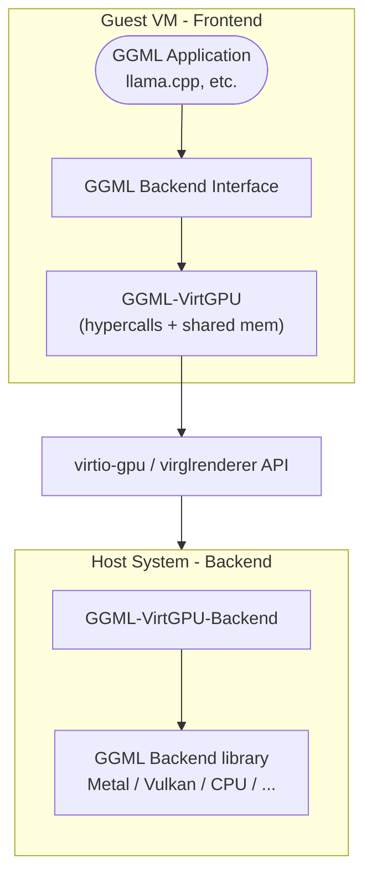

# llama.cpp vmaster — Documentación técnica oficial

> **Espejo Offline de Documentación Técnica**
> Licencia: MIT | Documentos incluidos: 51 | Versión: master
> Descargado/sincronizado: 2026-09-15
> Documentación oficial en línea: https://github.com/ggml-org/llama.cpp
> Mantenedor del espejo: Raúl Caro Pastorino (@raupulus) · https://raupulus.dev

---

## Índice de contenidos


### Backend

- [will install to /usr/local/ by default.](#will-install-to-usr-local-by-default)
- [llama.cpp for CANN](#llama-cpp-for-cann)
- [Setting Up CUDA on Fedora](#setting-up-cuda-on-fedora)
- [llama.cpp for ET](#llama-cpp-for-et)
- [llama.cpp for OpenCL](#llama-cpp-for-opencl)
- [OpenVINO Backend for llama.cpp](#openvino-backend-for-llama-cpp)
- [llama.cpp for SYCL](#llama-cpp-for-sycl)
- [GGML-VirtGPU Backend Configuration](#ggml-virtgpu-backend-configuration)
- [Development and Testing](#development-and-testing)
- [GGML-VirtGPU Backend](#ggml-virtgpu-backend)
- [llama.cpp for AMD ZenDNN](#llama-cpp-for-amd-zendnn)
- [Snapdragon-based devices](#snapdragon-based-devices)
- [Hexagon backend developer details](#hexagon-backend-developer-details)
- [Snapdragon-based Linux devices](#snapdragon-based-linux-devices)
- [Snapdragon-based Windows devices](#snapdragon-based-windows-devices)
- [llama.cpp for IBM zDNN Accelerator](#llama-cpp-for-ibm-zdnn-accelerator)

### Development

- [Add a new model architecture to llama.cpp](#add-a-new-model-architecture-to-llama-cpp)
- [Debugging Tests Tips](#debugging-tests-tips)
- [Parsing Model Output](#parsing-model-output)
- [Token generation performance troubleshooting](#token-generation-performance-troubleshooting)

### Multimodal

- [MobileVLM](#mobilevlm)
- [Gemma 3 vision](#gemma-3-vision)
- [GLMV-EDGE](#glmv-edge)
- [Granite Vision](#granite-vision)
- [LLaVA](#llava)
- [quantize int4 version](#quantize-int4-version)
- [quantize int4 version](#quantize-int4-version)
- [quantize int4 version](#quantize-int4-version)
- [quantize int4 version](#quantize-int4-version)
- [quantize int4 version](#quantize-int4-version)
- [quantize int4 version](#quantize-int4-version)
- [language model](#language-model)

### Llama.Cpp

- [Android](#android)
- [Auto-Parser Architecture](#auto-parser-architecture)
- [Build profiling](#build-profiling)
- [Build riscv64 spacemit](#build-riscv64-spacemit)
- [Build llama.cpp locally (for s390x)](#build-llama-cpp-locally-for-s390x)
- [Build llama.cpp locally](#build-llama-cpp-locally)
- [Completions](#completions)
- [Docker](#docker)
- [Function Calling](#function-calling)
- [Install pre-built version of llama.cpp](#install-pre-built-version-of-llama-cpp)
- [LLGuidance Support in llama.cpp](#llguidance-support-in-llama-cpp)
- [Obtaining and quantizing models](#obtaining-and-quantizing-models)
- [Using multiple GPUs with llama.cpp](#using-multiple-gpus-with-llama-cpp)
- [Multimodal](#multimodal)
- [GGML Operations](#ggml-operations)
- [llama.cpp INI Presets](#llama-cpp-ini-presets)
- [Release process](#release-process)
- [Speculative Decoding](#speculative-decoding)
- [XCFramework](#xcframework)

---


---

# will install to /usr/local/ by default.

*Sección: Backend*

BLIS Installation Manual
------------------------

BLIS is a portable software framework for high-performance BLAS-like dense linear algebra libraries. It has received awards and recognition, including the 2023 James H. Wilkinson Prize for Numerical Software and the 2020 SIAM Activity Group on Supercomputing Best Paper Prize. BLIS provides a new BLAS-like API and a compatibility layer for traditional BLAS routine calls. It offers features such as object-based API, typed API, BLAS and CBLAS compatibility layers.

Project URL: https://github.com/flame/blis

### Prepare:

Compile BLIS:

```bash
git clone https://github.com/flame/blis
cd blis
./configure --enable-cblas -t openmp,pthreads auto
# will install to /usr/local/ by default.
make -j
```

Install BLIS:

```bash
sudo make install
```

We recommend using openmp since it's easier to modify the cores being used.

### llama.cpp compilation

CMake:

```bash
mkdir build
cd build
cmake -DGGML_BLAS=ON -DGGML_BLAS_VENDOR=FLAME ..
make -j
```

### llama.cpp execution

According to the BLIS documentation, we could set the following
environment variables to modify the behavior of openmp:

```bash
export GOMP_CPU_AFFINITY="0-19"
export BLIS_NUM_THREADS=14
```

And then run the binaries as normal.


### Intel specific issue

Some might get the error message saying that `libimf.so` cannot be found.
Please follow this [stackoverflow page](https://stackoverflow.com/questions/70687930/intel-oneapi-2022-libimf-so-no-such-file-or-directory-during-openmpi-compila).

### Reference:

1. https://github.com/flame/blis#getting-started
2. https://github.com/flame/blis/blob/master/docs/Multithreading.md


---

# llama.cpp for CANN

*Sección: Backend*

- [Background](#background)
 - [News](#news)
 - [OS](#os)
 - [Hardware](#hardware)
 - [Model Supports](#model-supports)
 - [DataType Supports](#datatype-supports)
 - [Docker](#docker)
 - [Linux](#linux)
 - [Environment variable setup](#environment-variable-setup)
 - [TODO](#todo)


## Background

**Ascend NPU** is a range of AI processors using Neural Processing Unit. It will efficiently handle matrix-matrix multiplication, dot-product and scalars.

**CANN** (Compute Architecture for Neural Networks) is a heterogeneous computing architecture for AI scenarios, providing support for multiple AI frameworks on the top and serving AI processors and programming at the bottom. It plays a crucial role in bridging the gap between upper and lower layers, and is a key platform for improving the computing efficiency of Ascend AI processors. Meanwhile, it offers a highly efficient and easy-to-use programming interface for diverse application scenarios, allowing users to rapidly build AI applications and services based on the Ascend platform.

**Llama.cpp + CANN**

The llama.cpp CANN backend is designed to support Ascend NPU. It utilize the ability of AscendC and ACLNN which are integrated to CANN Toolkit and kernels to using Ascend NPU directly.

## News

- 2024.11
  - Support F16 and F32 data type model for Ascend 310P NPU.
- 2024.8
  - Support `Q4_0` and `Q8_0` data type for Ascend NPU.
- 2024.7
  - Create CANN backend for Ascend NPU.

## OS

| OS      | Status  | Verified                                       |
|:-------:|:-------:|:----------------------------------------------:|
| Linux   | Support | Ubuntu 22.04, OpenEuler22.03                   |


## Hardware

### Ascend NPU

You can retrieve your Ascend device IDs using the following command:

```sh
lspci -n | grep -Eo '19e5:d[0-9a-f]{3}' | cut -d: -f2
```

**Devices**

| Device Id | Product Series | Product Models | Chip Model | Verified Status |
|:---------:|----------------|----------------|:----------:|:---------------:|
|    d803   | Atlas A3 Train |                |    910C    |                 |
|    d803   | Atlas A3 Infer |                |    910C    |                 |
|    d802   | Atlas A2 Train |                |    910B    |                 |
|    d802   | Atlas A2 Infer | Atlas 300I A2  |    910B    |     Support     |
|    d801   | Atlas Train    |                |     910    |                 |
|    d500   | Atlas Infer    | Atlas 300I Duo |    310P    |     Support     |

*Notes:*

- If you have trouble with Ascend NPU device, please create a issue with **[CANN]** prefix/tag.
- If you run successfully with your Ascend NPU device, please help update the upper table.


## Model Supports

<details>
<summary>Text-only</summary>

| Model Name                  | FP16  | Q4_0 | Q8_0 |
|:----------------------------|:-----:|:----:|:----:|
| Llama-2                     |   √   |   √  |   √  |
| Llama-3                     |   √   |   √  |   √  |
| Mistral-7B                  |   √   |   √  |   √  |
| Mistral MOE                 |   √   |   √  |   √  |
| DBRX                        |   -   |   -  |   -  |
| Falcon                      |   √   |   √  |   √  |
| Chinese LLaMA/Alpaca        |   √   |   √  |   √  |
| Vigogne(French)             |   √   |   √  |   √  |
| BERT                        |   x   |   x  |   x  |
| Koala                       |   √   |   √  |   √  |
| Baichuan                    |   √   |   √  |   √  |
| Aquila 1 & 2                |   √   |   √  |   √  |
| Starcoder models            |   √   |   √  |   √  |
| Refact                      |   √   |   √  |   √  |
| MPT                         |   √   |   √  |   √  |
| Bloom                       |   √   |   √  |   √  |
| Yi models                   |   √   |   √  |   √  |
| stablelm models             |   √   |   √  |   √  |
| DeepSeek models             |   x   |   x  |   x  |
| Qwen models                 |   √   |   √  |   √  |
| PLaMo-13B                   |   √   |   √  |   √  |
| Phi models                  |   √   |   √  |   √  |
| PhiMoE                      |   √   |   √  |   √  |
| GPT-2                       |   √   |   √  |   √  |
| Orion                       |   √   |   √  |   √  |
| InternlLM2                  |   √   |   √  |   √  |
| CodeShell                   |   √   |   √  |   √  |
| Gemma                       |   √   |   √  |   √  |
| Mamba                       |   √   |   √  |   √  |
| Xverse                      |   √   |   √  |   √  |
| command-r models            |   √   |   √  |   √  |
| Grok-1                      |   -   |   -  |   -  |
| SEA-LION                    |   √   |   √  |   √  |
| GritLM-7B                   |   √   |   √  |   √  |
| OLMo                        |   √   |   √  |   √  |
| OLMo 2                      |   √   |   √  |   √  |
| OLMoE                       |   √   |   √  |   √  |
| Granite models              |   √   |   √  |   √  |
| GPT-NeoX                    |   √   |   √  |   √  |
| Pythia                      |   √   |   √  |   √  |
| Snowflake-Arctic MoE        |   -   |   -  |   -  |
| Smaug                       |   √   |   √  |   √  |
| Poro 34B                    |   √   |   √  |   √  |
| Bitnet b1.58 models         |   √   |   x  |   x  |
| Flan-T5                     |   √   |   √  |   √  |
| Open Elm models             |   x   |   √  |   √  |
| chatGLM3-6B + ChatGLM4-9b +  GLMEdge-1.5b + GLMEdge-4b    |   √   |   √  |   √  |
| GLM-4-0414                  |   √   |   √  |   √  |
| SmolLM                      |   √   |   √  |   √  |
| EXAONE-3.0-7.8B-Instruct    |   √   |   √  |   √  |
| FalconMamba Models          |   √   |   √  |   √  |
| Jais Models                 |   -   |   x  |   x  |
| Bielik-11B-v2.3             |   √   |   √  |   √  |
| RWKV-6                      |   -   |   √  |   √  |
| QRWKV-6                     |   √   |   √  |   √  |
| GigaChat-20B-A3B            |   x   |   x  |   x  |
| Trillion-7B-preview         |   √   |   √  |   √  |
| Ling models                 |   √   |   √  |   √  |

</details>

<details>
<summary>Multimodal</summary>

| Model Name                  | FP16  | Q4_0 | Q8_0 |
|:----------------------------|:-----:|:----:|:----:|
| LLaVA 1.5 models, LLaVA 1.6 models      |   x   |   x  |   x  |
|  BakLLaVA                   |   √   |   √  |   √  |
|  Obsidian                   |   √   |   -  |   -  |
|  ShareGPT4V                 |   x   |   -  |   -  |
|  MobileVLM 1.7B/3B models   |   -   |   -  |   -  |
|  Yi-VL                      |   -   |   -  |   -  |
|  Mini CPM                   |   √   |   √  |   √  |
|  Moondream                  |   √   |   √  |   √  |
|  Bunny                      |   √   |   -  |   -  |
|  GLM-EDGE                   |   √   |   √  |   √  |
|  Qwen2-VL                   |   √   |   √  |   √  |

</details>


## DataType Supports

| DataType               | 910B    | 310P    |
|:----------------------:|:-------:|:-------:|
| FP16                   | Support | Support |
| Q8_0                   | Support | Partial |
| Q4_0                   | Support | Partial |
| BF16                   | Support |         |

> **310P note**
> - `Q8_0`: data transform / buffer path is implemented, and `GET_ROWS` is supported, but quantized `MUL_MAT` / `MUL_MAT_ID` are not supported.
> - `Q4_0`: data transform / buffer path is implemented, but quantized `MUL_MAT` / `MUL_MAT_ID` are not supported.

## Docker

### Build Images
You can get a image with llama.cpp in one command.
```sh
docker build -t llama-cpp-cann -f .devops/llama-cli-cann.Dockerfile .
```

### Run container

```sh
# Find all cards.
npu-smi info

# Select the cards that you want to use, make sure these cards are not used by someone.
# Following using cards of device0.
docker run --name llamacpp \
  --device /dev/davinci0 \
  --device /dev/davinci_manager \
  --device /dev/devmm_svm \
  --device /dev/hisi_hdc \
  -v /usr/local/dcmi:/usr/local/dcmi \
  -v /usr/local/bin/npu-smi:/usr/local/bin/npu-smi \
  -v /usr/local/Ascend/driver/lib64/:/usr/local/Ascend/driver/lib64/ \
  -v /usr/local/Ascend/driver/version.info:/usr/local/Ascend/driver/version.info \
  -v /PATH_TO_YOUR_MODELS/:/app/models \
  -it llama-cpp-cann \
  -m /app/models/MODEL_PATH \
  -ngl 32 \
  -p "Building a website can be done in 10 simple steps:"
```

*Notes:*

- You may need to install Ascend Driver and firmware on the **host** machine *(Please refer to the [Linux configuration](#linux) for details)*.

## Linux

### I. Setup Environment

1. **Configure Ascend user and group**

    ```sh
    sudo groupadd HwHiAiUser
    sudo useradd -g HwHiAiUser -d /home/HwHiAiUser -m HwHiAiUser -s /bin/bash
    sudo usermod -aG HwHiAiUser $USER
    ```

2. **Install dependencies**

    **Ubuntu/Debian:**
    ```sh
    sudo apt-get update
    sudo apt-get install -y gcc python3 python3-pip linux-headers-$(uname -r)
    ```

    **RHEL/CentOS:**
    ```sh
    sudo yum makecache
    sudo yum install -y gcc python3 python3-pip kernel-headers-$(uname -r) kernel-devel-$(uname -r)
    ```

3. **Install CANN (driver + toolkit)**

    > The `Ascend-cann` package includes both the driver and toolkit.
    > `$ARCH` can be `x86_64` or `aarch64`, `$CHIP` can be `910b` or `310p`.

    ```sh
    wget https://ascend-repo.obs.cn-east-2.myhuaweicloud.com/CANN/CANN%208.5.T63/Ascend-cann_8.5.0_linux-$ARCH.run
    sudo bash ./Ascend-cann_8.5.0_linux-$ARCH.run --install

    wget https://ascend-repo.obs.cn-east-2.myhuaweicloud.com/CANN/CANN%208.5.T63/Ascend-cann-$CHIP-ops_8.5.0_linux-$ARCH.run
    sudo bash ./Ascend-cann-$CHIP-ops_8.5.0_linux-$ARCH.run --install
    ```

4. **Verify installation**

    ```sh
    npu-smi info
    ```

    If device information is displayed correctly, the driver is functioning properly.

    ```sh
    # Set environment variables (adjust path if needed)
    source /usr/local/Ascend/cann/set_env.sh

    python3 -c "import acl; print(acl.get_soc_name())"
    ```

    If the command outputs the chip model, the installation was successful.

### II. Build llama.cpp

```sh
cmake -B build -DGGML_CANN=on -DCMAKE_BUILD_TYPE=release
cmake --build build --config release
```

### III. Run the inference

1. **Retrieve and prepare model**

    You can refer to the general [*Obtaining and quantizing models*](snapdragon/readme.md#obtaining-and-quantizing-models) guide for model prepration.

    **Notes**:

      - CANN backend only supports FP16/Q4_0/Q8_0 models currently.

2. **Launch inference**

    There are two device selection modes:

    - Single device: Use one device target specified by the user.
    - Multiple devices: Automatically choose the devices with the same backend.

    | Device selection | Parameter                              |
    |:----------------:|:--------------------------------------:|
    | Single device    | --split-mode none --main-gpu DEVICE_ID |
    | Multiple devices | --split-mode layer (default)           |

    Examples:

    - Use device 0:

    ```sh
    ./build/bin/llama-cli -m path_to_model -p "Building a website can be done in 10 simple steps:" -n 400 -e -ngl 33 -sm none -mg 0
    ```

    - Use multiple devices:

    ```sh
    ./build/bin/llama-cli -m path_to_model -p "Building a website can be done in 10 simple steps:" -n 400 -e -ngl 33 -sm layer
    ```

### **GitHub contribution**:
Please add the **[CANN]** prefix/tag in issues/PRs titles to help the CANN-team check/address them without delay.

## Updates
### Basic Flash Attention Support
The basic FA kernel with aclnnops has been added in aclnn_ops.cpp.
Currently, the FA only supports the cases with FP16 KV tensors and NO logit softcap.
Since the aclnn interface for flash attention cannot support the logit softcap, we will only update the quantized version in the future.

Authors from Peking University: Bizhao Shi (bshi@pku.edu.cn), Yuxin Yang (yxyang@pku.edu.cn), Ruiyang Ma (ruiyang@stu.pku.edu.cn), and Guojie Luo (gluo@pku.edu.cn).

We would like to thank Tuo Dai, Shanni Li, and all of the project maintainers from Huawei Technologies Co., Ltd for their help during the code development and pull request.

## Environment variable setup

### GGML_CANN_MEM_POOL

Specifies the memory pool management strategy, Default is vmm.

- vmm: Utilizes a virtual memory manager pool. If hardware support for VMM is unavailable, falls back to the legacy (leg) memory pool.

- prio: Employs a priority queue-based memory pool management.

- leg: Uses a fixed-size buffer pool.

### GGML_CANN_DISABLE_BUF_POOL_CLEAN

Controls automatic cleanup of the memory pool. This option is only effective when using the prio or leg memory pool strategies.

### GGML_CANN_WEIGHT_NZ

Converting the matmul weight format from ND to NZ to improve performance. Enabled by default.

### GGML_CANN_ACL_GRAPH

Operators are executed using ACL graph execution, rather than in op-by-op (eager) mode. Enabled by default. This option is only effective if `USE_ACL_GRAPH` was enabled at compilation time. To enable it, recompile using:

```sh
cmake -B build -DGGML_CANN=on -DCMAKE_BUILD_TYPE=release -DUSE_ACL_GRAPH=ON
cmake --build build --config release
```

### GGML_CANN_GRAPH_CACHE_CAPACITY

Maximum number of compiled CANN graphs kept in the LRU cache, default is 12. When the number of cached graphs exceeds this capacity, the least recently used graph will be evicted.

### GGML_CANN_PREFILL_USE_GRAPH

Enable ACL graph execution during the prefill stage, default is false. This option is only effective when FA is enabled.

### GGML_CANN_OPERATOR_FUSION

Enable operator fusion during computation, default is false. This option fuses compatible operators (e.g., ADD + RMS_NORM) to reduce overhead and improve performance.


---

# Setting Up CUDA on Fedora

*Sección: Backend*

In this guide we setup [Nvidia CUDA](https://docs.nvidia.com/cuda/) in a toolbox container. This guide is applicable for:

- [Fedora Workstation](https://fedoraproject.org/workstation/)
- [Atomic Desktops for Fedora](https://fedoraproject.org/atomic-desktops/)
- [Fedora Spins](https://fedoraproject.org/spins)
- [Other Distributions](https://containertoolbx.org/distros/), including `Red Hat Enterprise Linux >= 8.5`, `Arch Linux`, and `Ubuntu`.

## Table of Contents

- [Prerequisites](#prerequisites)
- [Using the Fedora 41 CUDA Repository](#using-the-fedora-41-cuda-repository)
- [Creating a Fedora Toolbox Environment](#creating-a-fedora-toolbox-environment)
- [Installing Essential Development Tools](#installing-essential-development-tools)
- [Adding the CUDA Repository](#adding-the-cuda-repository)
- [Installing Nvidia Driver Libraries](#installing-nvidia-driver-libraries)
- [Installing the CUDA Meta-Package](#installing-the-cuda-meta-package)
- [Configuring the Environment](#configuring-the-environment)
- [Verifying the Installation](#verifying-the-installation)
- [Conclusion](#conclusion)
- [Troubleshooting](#troubleshooting)
- [Additional Notes](#additional-notes)
- [References](#references)

## Prerequisites

- **Toolbox Installed on the Host System** `Fedora Silverblue` and `Fedora Workstation` both have toolbox by default, other distributions may need to install the [toolbox package](https://containertoolbx.org/install/).
- **NVIDIA Drivers and Graphics Card installed on Host System (recommended)** To run CUDA program, such as `llama.cpp`, the host should be setup to access your NVIDIA hardware. Fedora Hosts can use the [RPM Fusion Repository](https://rpmfusion.org/Howto/NVIDIA).
- **Internet connectivity** to download packages.

### Using the Fedora 41 CUDA Repository

The latest release is 41.

- [Fedora 41 CUDA Repository](https://developer.download.nvidia.com/compute/cuda/repos/fedora41/x86_64/)

**Note:** We recommend using a toolbox environment to prevent system conflicts.

## Creating a Fedora Toolbox Environment

This guide focuses on Fedora hosts, but with small adjustments, it can work for other hosts. Using the Fedora Toolbox allows us to install the necessary packages without affecting the host system.

**Note:** Toolbox is available for other systems, and even without Toolbox, it is possible to use Podman or Docker.

1. **Create a Fedora 41 Toolbox:**

   ```bash
   toolbox create --image registry.fedoraproject.org/fedora-toolbox:41 --container fedora-toolbox-41-cuda
   ```

2. **Enter the Toolbox:**

   ```bash
   toolbox enter --container fedora-toolbox-41-cuda
   ```

   Inside the toolbox, you have root privileges and can install packages without affecting the host system.

## Installing Essential Development Tools

1. **Synchronize the DNF Package Manager:**

   ```bash
   sudo dnf distro-sync
   ```

2. **Install **Vim** the default text editor (Optional):**

   ```bash
   sudo dnf install vim-default-editor --allowerasing
   ```

   The `--allowerasing` flag will allow the removal of the conflicting `nano-default-editor` package.

3. **Install Development Tools and Libraries:**

   ```bash
   sudo dnf install @c-development @development-tools cmake
   ```

   This installs essential packages for compiling software, including `gcc`, `make`, and other development headers.

## Adding the CUDA Repository

Add the NVIDIA CUDA repository to your DNF configuration:

```bash
sudo dnf config-manager addrepo --from-repofile=https://developer.download.nvidia.com/compute/cuda/repos/fedora41/x86_64/cuda-fedora41.repo
```

After adding the repository, synchronize the package manager again:

```bash
sudo dnf distro-sync
```

## Installing Nvidia Driver Libraries

First, we need to detect if the host is supplying the [NVIDIA driver libraries into the toolbox](https://github.com/containers/toolbox/blob/main/src/pkg/nvidia/nvidia.go):

```bash
ls -la /usr/lib64/libcuda.so.1
```

### If *`libcuda.so.1`* is missing:

```
ls: cannot access '/usr/lib64/libcuda.so.1': No such file or directory
```

**Explanation:**
The host dose not supply the CUDA drivers, **install them now:**

#### Install the Nvidia Driver Libraries on Guest:

```bash
sudo dnf install nvidia-driver-cuda nvidia-driver-libs nvidia-driver-cuda-libs nvidia-persistenced
```

### If *`libcuda.so.1`* exists:
```
lrwxrwxrwx. 1 root root 21 Mar 24 11:26 /usr/lib64/libcuda.so.1 -> libcuda.so.570.133.07
```

**Explanation:**
The host is supply the CUDA drivers, **we need to update the guest RPM Database accordingly:**

#### Update the Toolbox RPM Database to include the Host-Supplied Libraries:

Note: we do not actually install the libraries, we just update the DB so that the guest system knows they are supplied by the host.

##### 1. Download `nvidia-` parts that are supplied by the host RPM's (with dependencies)

```bash
sudo dnf download --destdir=/tmp/nvidia-driver-libs --resolve --arch x86_64 nvidia-driver-cuda nvidia-driver-libs nvidia-driver-cuda-libs nvidia-persistenced
```

##### 2. Update the RPM database to assume the installation of these packages.

```bash
sudo rpm --install --verbose --hash --justdb /tmp/nvidia-driver-libs/*
```

**Note:**

- The `--justdb` option only updates the RPM database, without touching the filesystem elsewhere.

##### Check that the RPM Database has been correctly updated:

**Note:** This is the same command as in the *"Install the Nvidia Driver Libraries on Guest"* for if *`libcuda.so.1`* was missing.


```bash
sudo dnf install nvidia-driver-cuda nvidia-driver-libs nvidia-driver-cuda-libs nvidia-persistenced
```

*(this time it will not install anything, as the database things that these packages are already installed)*

```
Updating and loading repositories:
Repositories loaded.
Package "nvidia-driver-cuda-3:570.124.06-1.fc41.x86_64" is already installed.
Package "nvidia-driver-libs-3:570.124.06-1.fc41.x86_64" is already installed.
Package "nvidia-driver-cuda-libs-3:570.124.06-1.fc41.x86_64" is already installed.
Package "nvidia-persistenced-3:570.124.06-1.fc41.x86_64" is already installed.

Nothing to do.
```

## Installing the CUDA Meta-Package

Now that the driver libraries are installed, proceed to install CUDA:

```bash
sudo dnf install cuda
```

This installs the CUDA toolkit and associated packages.

## Configuring the Environment

To use CUDA, add its binary directory to your system's `PATH`.

1. **Create a Profile Script:**

   ```bash
   sudo sh -c 'echo "export PATH=\$PATH:/usr/local/cuda/bin" >> /etc/profile.d/cuda.sh'
   ```

   **Explanation:**

   - We add to `/etc/profile.d/` as the `/etc/` folder is unique to this particular container, and is not shared with other containers or the host system.
   - The backslash `\` before `$PATH` ensures the variable is correctly written into the script.

2. **Make the Script Executable:**

   ```bash
   sudo chmod +x /etc/profile.d/cuda.sh
   ```

3. **Source the Script to Update Your Environment:**

   ```bash
   source /etc/profile.d/cuda.sh
   ```

   **Note:** This command updates your current shell session with the new `PATH`. The `/etc/profile.d/cuda.sh` script ensures that the CUDA binaries are available in your `PATH` for all future sessions.

## Verifying the Installation

To confirm that CUDA is correctly installed and configured, check the version of the NVIDIA CUDA Compiler (`nvcc`):

```bash
nvcc --version
```

You should see output similar to:

```
nvcc: NVIDIA (R) Cuda compiler driver
Copyright (c) 2005-2025 NVIDIA Corporation
Built on Fri_Feb_21_20:23:50_PST_2025
Cuda compilation tools, release 12.8, V12.8.93
Build cuda_12.8.r12.8/compiler.35583870_0
```

This output confirms that the CUDA compiler is accessible and indicates the installed version.

## Conclusion

You have successfully set up CUDA on Fedora within a toolbox environment using the Fedora 41 CUDA repository. By manually updating the RPM db and configuring the environment, you can develop CUDA applications without affecting your host system.

## Troubleshooting

- **Installation Failures:**

  - If you encounter errors during installation, carefully read the error messages. They often indicate conflicting files or missing dependencies.
  - You may use the `--excludepath` option with `rpm` to exclude conflicting files during manual RPM installations.

- **Rebooting the Container:**

  - Sometimes there may be a bug in the NVIDIA driver host passthrough (such as missing a shared library). Rebooting the container may solve this issue:

  ```bash
  # on the host system
  podman container restart --all
  ```

- **Environment Variables Not Set:**
  - If `nvcc` is not found after installation, ensure that `/usr/local/cuda/bin` is in your `PATH`.
  - Run `echo $PATH` to check if the path is included.
  - Re-source the profile script or open a new terminal session.

## Additional Notes

- **Updating CUDA in the Future:**

  - Keep an eye on the official NVIDIA repositories for updates to your Fedora version.
  - When an updated repository becomes available, adjust your `dnf` configuration accordingly.

- **Building `llama.cpp`:**

  - With CUDA installed, you can follow these [build instructions for `llama.cpp`](https://github.com/ggml-org/llama.cpp/blob/master/docs/build.md) to compile it with CUDA support.
  - Ensure that any CUDA-specific build flags or paths are correctly set in your build configuration.

- **Using the Toolbox Environment:**
  - The toolbox environment is isolated from your host system, which helps prevent conflicts.
  - Remember that system files and configurations inside the toolbox are separate from the host. By default the home directory of the user is shared between the host and the toolbox.

---

**Disclaimer:** Manually installing and modifying system packages can lead to instability of the container. The above steps are provided as a guideline and may need adjustments based on your specific system configuration. Always back up important data before making significant system changes, especially as your home folder is writable and shared with the toolbox.

**Acknowledgments:** Special thanks to the Fedora community and NVIDIA documentation for providing resources that assisted in creating this guide.

## References

- [Fedora Toolbox Documentation](https://docs.fedoraproject.org/en-US/fedora-silverblue/toolbox/)
- [NVIDIA CUDA Installation Guide](https://docs.nvidia.com/cuda/cuda-installation-guide-linux/index.html)
- [Podman Documentation](https://podman.io/get-started)

---


---

# llama.cpp for ET

*Sección: Backend*

- [Background](#background)
- [Limitations](#limitations)
- [Build](#build)
- [Develop](#develop)
- [Roadmap](#roadmap)


## Background

**ET** is a llama.cpp backend targeting the fully open source manycore
RISC-V accelerator platform [ET-SOC](https://github.com/aifoundry-org/et-man).


## Limitations

The ET backend runs several of the major OSS models with some limitations:

- Only limited set of operations is supported (check [../ops.md](../ops.md)
  and [../ops/ET.csv](../ops/ET.csv)).
- Only `q8_0`, `q4_0` (and partially `fp16`, `q4_K`) quantization is supported.
- Only one llama.cpp instance can use device at the same time (current firmware
  limitation).
- Limited (but working) MoE model support

As a result of the above, only select models can run fully on ET-SOC
(you can actually run any model llama.cpp supports, but some/most operations
will likely fallback to CPU backend).

Fully supported models:
- Qwen3 models (without MoE), e.g.
  [ggml-org/Qwen3-0.6B-GGUF:q8_0](https://huggingface.co/ggml-org/Qwen3-0.6B-GGUF/blob/main/Qwen3-0.6B-Q8_0.gguf) or
  [ggml-org/Qwen3-14B-GGUF:q8_0](https://huggingface.co/ggml-org/Qwen3-14B-GGUF/blob/main/Qwen3-14B-Q8_0.gguf).
- Llama3.2 (1B/3B), e.g.
  [lmstudio-community/Llama-3.2-1B-Instruct-GGUF:q8_0](https://huggingface.co/lmstudio-community/Llama-3.2-1B-Instruct-GGUF/blob/main/Llama-3.2-1B-Instruct-Q8_0.gguf).
- SmolLM2, e.g.
  [unsloth/SmolLM2-135M-Instruct-GGUF:q8_0](https://huggingface.co/unsloth/SmolLM2-135M-Instruct-GGUF/blob/main/SmolLM2-135M-Instruct-Q8_0.gguf)
- Llama 3.1 model family.
- RWKV v7 model family.
- TinyLLaMA


## Build

### I. Prerequisites

1. **Install custom RISC-V toolchain** - Follow instructions at:
   [https://github.com/aifoundry-org/riscv-gnu-toolchain/tree/et/aifoundry](https://github.com/aifoundry-org/riscv-gnu-toolchain/tree/et/aifoundry)

2. **Install ET platform** - Follow instructions at:
   [https://github.com/aifoundry-org/et-platform](https://github.com/aifoundry-org/et-platform)

Both should be installed to `/opt/et` (or set `ET_TOOLCHAIN` and `ET_PLATFORM`
environment variables accordingly).

```sh
# Set toolchain and ET platform path (/opt/et is default)
export ET_TOOLCHAIN=/opt/et
export ET_PLATFORM=/opt/et
```

### II. Build llama.cpp

Check out llama.cpp with ET backend (this should checkout `et` branch):

```sh
git clone https://github.com/aifoundry-org/llama.cpp
cd llama.cpp
```

Build:

```sh
cmake -B build -DGGML_ET=ON
cmake --build build --config Release
# Optionally:
# cmake --install build
```

Build targeting sysemu backend instead of physical hardware:
```sh
cmake -B build -DGGML_ET=ON -DGGML_ET_SYSEMU=ON
cmake --build build --config Release
```

### III. Run

Run llama.cpp binaries as usual. (Of course, please make sure you have the
ET-SOC device installed and kernel driver loaded).

```sh
llama-cli -m mymodel.gguf
# or
llama-server -hf ggml-org/Qwen3-8B-GGUF:q8_0
```

If you want to run llama.cpp binaries (e.g. `llama-cli`) inside docker
container, you should let it access device files:

```sh
docker run \
    --device=/dev/et0_mgmt:/dev/et0_mgmt \
    --device=/dev/et0_ops:/dev/et0_ops \
    ...
```

## Develop

Compute kernels are developed within `ggml/src/ggml-et/et-kernels` folder.
Build is performed using custom RISC-V GNU toolchain and is managed by cmake.
At the moment kernels are build as baremetal elf files, without
standard lib or any other dependencies. All the yummy parts are written
in inline assembler.

Most kernels are very naive with lots of low hanging fruits left:

> [!IMPORTANT]
> Several assembly instructions emitted by the compiler are not implemented
> in hardware and software emulation in firmware is not ready yet.
> Eventually firmware will transparently trap unimplemented instructions
> and will emulate them inside exception handler. Until then, kernel
> build process includes step that checks compiled kernels and fails if any unimplemented
> instructions are found. Problematic ones follow:
> `FDIV.PI`, `FDIVU.PI`, `FREMU.PI`, `FREM.PI`, `FDIV.S`, `FDIV.PS`, `FSQRT.S`, `FSQRT.PS`, `FRSQ.PS`, `FSIN.PS`
>  and (long cast) `FCVT.S.L`, `FCVT.S.LU`, `FCVT.L.S`, `FCVT.LU.S`
> What this means, is that for now you should avoid doing any division involving floats,
> any trigonometry or casting longs into floats.
> Some workarounds are implemented in `math_fp.h` (`et_fdiv`, `et_powf` etc) and
> long casting (presuming longs are small enough to fit into 32bits) can be
> done via `int` like `a = (float)(int)(b)`.

> [!TIP]
> There are some slightly higher level helpers (abstracting more
> complex instructions like tensor extension or synchronization primitives)
> inside `et_platform`, directory `et-common-libs/include/etsoc/isa/`. It was
> originally developed for firmware needs and is not included into compute
> kernel build process. Feel free to take ideas/code from there or try linking
> it in.

Before committing any changes to operations and/or kernels, don't forget
to update supported ops reports (instructions at `docs/ops.md`).

When logging is enabled (e.g. by setting `--log-file` cli param),
each compute kernel run outputs a line with
pipe-delimited key-value pairs containing kernel level performance information.
Line is prefixed with `ET_PERF`:

```
ET_PERF|op=MUL_MAT|kernel=mul_mat_f32_Q8_0xf32|duration_us=3112|tensor=Qcur-0|shape=[4096,2,1,1]|start_us=48437862009|end_us=48437865121|flops=67100672
ET_PERF|op=ROPE|kernel=rope_f32|duration_us=9266|tensor=Qcur-0|shape=[128,32,2,1]|start_us=48437865128|end_us=48437874394|mode=0x0|n_dims=128|freq_base=500000.00|freq_scale=1.00
```
Keys depend on the operation, but some are always present.
`flops` in this case counts effective floating point operations and not floating
point operations per second.

You can enable ET-SOC runtime level ET-SOC profiling by setting environment
variable `GGML_ET_PROFILE` to a path. Profiling/tracing results will be written
to `GGML_ET_PROFILE/et_runtime_trace.json` and `GGML_ET_PROFILE/kernel_map` on exit.

### Uberkernel

The in-kernel implementation of device dispatch/kernel fusion. The ET SDK has a non-trivial op-to-op gap. `Uberkernel` (name taken from the original Esperanto AI's compiler)
dispatches multiple already existing kernel implementations with device side synchronization. Due to the processor's design, there is no natural memory visibility
horizon between sub-kernel invocations. This makes uberkernel much more difficult to develop and debug. Currently Uberkerel is hidden begind the
`GGML_ET_UBERKERNEL` environment variable and is disabled by default. Setting it to 1 enables it and provides significant performance improvements but is only
validated for the LLaMA 3.2 model family and Qwen 3.5.

## Roadmap

As of writing the documentation the ET backend is capable of running most models and smaller ones at usable speed given the low power profile of the processor. We'd
address the following capabilities in the future:

* Enable Uberkernel for all models
* More oprtator support
* Better TTS model support
* Enable more quantization format support


---

# llama.cpp for OpenCL

*Sección: Backend*

- [llama.cpp for OpenCL](#llamacpp-for-opencl)
  - [Background](#background)
    - [Llama.cpp + OpenCL](#llamacpp--opencl)
  - [OS](#os)
  - [Hardware](#hardware)
    - [Adreno GPU](#adreno-gpu)
  - [DataType Supports](#datatype-supports)
  - [Model Preparation](#model-preparation)
  - [Binary Kernel Library](#binary-kernel-library)
  - [CMake Options](#cmake-options)
  - [Android](#android)
    - [I. Setup Environment](#i-setup-environment)
    - [II. Build llama.cpp](#ii-build-llamacpp)
  - [Windows 11 Arm64](#windows-11-arm64)
    - [I. Setup Environment](#i-setup-environment-1)
    - [II. Build llama.cpp](#ii-build-llamacpp-1)
  - [Linux](#linux)
    - [I. Setup Environment](#i-setup-environment-2)
    - [II. Build llama.cpp](#ii-build-llamacpp-2)
  - [Known Issues](#known-issues)
  - [TODO](#todo)

## Background

OpenCL (Open Computing Language) is an open, royalty-free standard for cross-platform, parallel programming of diverse accelerators found in supercomputers, cloud servers, personal computers, mobile devices and embedded platforms. OpenCL specifies a programming language (based on C99) for programming these devices and application programming interfaces (APIs) to control the platform and execute programs on the compute devices. Similar to CUDA, OpenCL has been widely used to program GPUs and is supported by most GPU vendors.

### Llama.cpp + OpenCL

The llama.cpp OpenCL backend is designed to enable llama.cpp on **Qualcomm Adreno GPU** firstly via OpenCL. Thanks to the portabilty of OpenCL, the OpenCL backend can also run on certain Intel GPUs such as those that do not have [SYCL](sycl.md) support although the performance is not optimal.

## OS

| OS      | Status  | Verified                                       |
|---------|---------|------------------------------------------------|
| Android | Support | Snapdragon 8 Gen 3, Snapdragon 8 Elite         |
| Windows | Support | Windows 11 Arm64 with Snapdragon X Elite       |
| Linux   | Support | Ubuntu 22.04 WSL2 with Intel 12700H            |

## Hardware

### Adreno GPU

**Verified devices**

| Adreno GPU                            | Status  |
|:-------------------------------------:|:-------:|
| Adreno 750 (Snapdragon 8 Gen 3)       | Support |
| Adreno 810 (Snapdragon 7s Gen 3)      | Support |
| Adreno 830 (Snapdragon 8 Elite)       | Support |
| Adreno 840 (Snapdragon 8 Elite Gen 5) | Support |
| Adreno X1-85 (Snapdragon X Elite)     | Support |
| Adreno X2-90 (Snapdragon X2 Elite)    | Support |

> A6x GPUs with a recent driver and compiler are supported; they are usually found in IoT platforms.
However, A6x GPUs in phones are likely not supported due to the outdated driver and compiler.

## DataType Supports

| DataType               | Status                     |
|:----------------------:|:--------------------------:|
| Q1_0                   | Support                    |
| Q4_0                   | Support                    |
| Q4_1                   | Support                    |
| Q5_0                   | Support                    |
| Q5_1                   | Support                    |
| Q8_0                   | Support                    |
| Q4_K                   | Support                    |
| Q5_K                   | Support                    |
| Q6_K                   | Support                    |
| MXFP4                  | Support                    |
| IQ4_NL                 | Support                    |

## Model Preparation

Since common quantizations are supported now, it is recommanded to download GGUF models directly from Huggingface.

## Binary Kernel Library

A prebuilt binary kernel library has been introduced for Adreno GPUs.
It currently targets X2 GPUs (X2-90, X2-85 and X2-45) found in Snapdragon X2 SoC.
The library currently contains kernels for MUL_MAT_ID with Q4_0, Q4_1, Q4_K, MXFP4.
The library must be manually downloaded from https://softwarecenter.qualcomm.com/catalog/item/Adreno_Kernel_Library_GGML.

To allow using the kernel library, add `-DGGML_OPENCL_USE_ADRENO_BIN_KERNELS=ON` when configuring with CMake.
Then, extract `adreno-opencl-kernels.dll` from the zip file downloaded from the above URL and put it alongside the executables.
If kernels compatible with the current GPU are found in the library, they will be loaded and used.


## CMake Options

The OpenCL backend has the following CMake options that control the behavior of the backend.

| CMake options                        | Default value  | Description                               |
|:------------------------------------:|:--------------:|:------------------------------------------|
| `GGML_OPENCL_EMBED_KERNELS`          | `ON`           | Embed OpenCL kernels into the executable. |
| `GGML_OPENCL_USE_ADRENO_KERNELS`     | `ON`           | Use kernels optimized for Adreno.         |
| `GGML_OPENCL_USE_ADRENO_BIN_KERNELS` | `OFF`          | Allow using binary kernel lib for Adreno. |

## Program Binary Cache

Compiled `cl_program` binaries are cached on disk, so subsequent runs skip the expensive
compile-from-source step when nothing relevant has changed (kernel source, compile options,
device, driver, or platform version).

The cache is controlled with the `GGML_OPENCL_KERNEL_CACHE_DIR` environment variable:

| Value                                  | Behavior                                       |
|:---------------------------------------|:-----------------------------------------------|
| unset / empty / `1` / `default`        | Enabled in the platform default cache directory: `%LOCALAPPDATA%\llama.cpp\cl-cache` (Windows), `~/Library/Caches/llama.cpp/cl-cache` (macOS), `<temp dir>/llama.cpp/cl-cache` elsewhere. |
| `0` / `off` / `none` / `disable(d)`    | Disabled.                                      |
| any other value                        | Used verbatim as the cache directory path.     |

If the chosen directory cannot be created or used, the cache disables itself for the process
and kernels are compiled from source as usual. Set `GGML_OPENCL_KERNEL_CACHE_DEBUG=1` to
print a HIT/MISS/SAVE trace to stderr.

## Android

Ubuntu 22.04 is used for targeting Android. Make sure the following tools are accessible from command line,

* Git
* CMake 3.29
* Ninja
* Python3

### I. Setup Environment

1. **Install NDK**

```sh
cd ~
wget https://dl.google.com/android/repository/commandlinetools-linux-8512546_latest.zip && \
unzip commandlinetools-linux-8512546_latest.zip && \
mkdir -p ~/android-sdk/cmdline-tools && \
mv cmdline-tools latest && \
mv latest ~/android-sdk/cmdline-tools/ && \
rm -rf commandlinetools-linux-8512546_latest.zip

yes | ~/android-sdk/cmdline-tools/latest/bin/sdkmanager "ndk;26.3.11579264"
```

2. **Install OpenCL Headers and Library**

```sh
mkdir -p ~/dev/llm
cd ~/dev/llm

git clone https://github.com/KhronosGroup/OpenCL-Headers && \
cd OpenCL-Headers && \
cp -r CL ~/android-sdk/ndk/26.3.11579264/toolchains/llvm/prebuilt/linux-x86_64/sysroot/usr/include

cd ~/dev/llm

git clone https://github.com/KhronosGroup/OpenCL-ICD-Loader && \
cd OpenCL-ICD-Loader && \
mkdir build_ndk26 && cd build_ndk26 && \
cmake .. -G Ninja -DCMAKE_BUILD_TYPE=Release \
  -DCMAKE_TOOLCHAIN_FILE=$HOME/android-sdk/ndk/26.3.11579264/build/cmake/android.toolchain.cmake \
  -DOPENCL_ICD_LOADER_HEADERS_DIR=$HOME/android-sdk/ndk/26.3.11579264/toolchains/llvm/prebuilt/linux-x86_64/sysroot/usr/include \
  -DANDROID_ABI=arm64-v8a \
  -DANDROID_PLATFORM=24 \
  -DANDROID_STL=c++_shared && \
ninja && \
cp libOpenCL.so ~/android-sdk/ndk/26.3.11579264/toolchains/llvm/prebuilt/linux-x86_64/sysroot/usr/lib/aarch64-linux-android
```

### II. Build llama.cpp

```sh
cd ~/dev/llm

git clone https://github.com/ggml-org/llama.cpp && \
cd llama.cpp && \
mkdir build-android && cd build-android

cmake .. -G Ninja \
  -DCMAKE_TOOLCHAIN_FILE=$HOME/android-sdk/ndk/26.3.11579264/build/cmake/android.toolchain.cmake \
  -DANDROID_ABI=arm64-v8a \
  -DANDROID_PLATFORM=android-28 \
  -DBUILD_SHARED_LIBS=OFF \
  -DGGML_OPENCL=ON

ninja
```

## Windows 11 Arm64

A Snapdragon X Elite device with Windows 11 Arm64 is used. Make sure the following tools are accessible from command line,

* Git
* CMake 3.29
* Clang 19
* Ninja
* Visual Studio 2022
* Powershell 7
* Python

Visual Studio provides necessary headers and libraries although it is not directly used for building.
Alternatively, Visual Studio Build Tools can be installed instead of the full Visual Studio.

> Note that building using Visual Studio's cl compiler is not supported. Clang must be used. Clang depends on libraries provided by Visual Studio to work. Therefore, Visual Studio must be installed. Alternatively, Visual Studio Build Tools can be installed instead of the full Visual Studio.

Powershell 7 is used for the following commands.
If an older version of Powershell is used, these commands may not work as they are.

### I. Setup Environment

1. **Install OpenCL Headers and Library**

```powershell
mkdir -p ~/dev/llm

cd ~/dev/llm
git clone https://github.com/KhronosGroup/OpenCL-Headers && cd OpenCL-Headers
mkdir build && cd build
cmake .. -G Ninja `
  -DBUILD_TESTING=OFF `
  -DOPENCL_HEADERS_BUILD_TESTING=OFF `
  -DOPENCL_HEADERS_BUILD_CXX_TESTS=OFF `
  -DCMAKE_INSTALL_PREFIX="$HOME/dev/llm/opencl"
cmake --build . --target install

cd ~/dev/llm
git clone https://github.com/KhronosGroup/OpenCL-ICD-Loader && cd OpenCL-ICD-Loader
mkdir build && cd build
cmake .. -G Ninja `
  -DCMAKE_BUILD_TYPE=Release `
  -DCMAKE_PREFIX_PATH="$HOME/dev/llm/opencl" `
  -DCMAKE_INSTALL_PREFIX="$HOME/dev/llm/opencl"
cmake --build . --target install
```

### II. Build llama.cpp

```powershell

mkdir -p ~/dev/llm
cd ~/dev/llm

git clone https://github.com/ggml-org/llama.cpp && cd llama.cpp
mkdir build && cd build

cmake .. -G Ninja `
  -DCMAKE_TOOLCHAIN_FILE="$HOME/dev/llm/llama.cpp/cmake/arm64-windows-llvm.cmake" `
  -DCMAKE_BUILD_TYPE=Release `
  -DCMAKE_PREFIX_PATH="$HOME/dev/llm/opencl" `
  -DBUILD_SHARED_LIBS=OFF `
  -DGGML_OPENCL=ON
ninja
```

## Linux

The two steps just above also apply to Linux. When building for linux, the commands are mostly the same as those for PowerShell on Windows, but in the second step they do not have the `-DCMAKE_TOOLCHAIN_FILE` parameter, and then in both steps the backticks are replaced with back slashes.

If not installed already, install Git, CMake, Clang, Ninja and Python, then run in the terminal the following:

### I. Setup Environment

1. **Install OpenCL Headers and Library**

```bash
mkdir -p ~/dev/llm

cd ~/dev/llm
git clone https://github.com/KhronosGroup/OpenCL-Headers && cd OpenCL-Headers
mkdir build && cd build
cmake .. -G Ninja \
  -DBUILD_TESTING=OFF \
  -DOPENCL_HEADERS_BUILD_TESTING=OFF \
  -DOPENCL_HEADERS_BUILD_CXX_TESTS=OFF \
  -DCMAKE_INSTALL_PREFIX="$HOME/dev/llm/opencl"
cmake --build . --target install

cd ~/dev/llm
git clone https://github.com/KhronosGroup/OpenCL-ICD-Loader && cd OpenCL-ICD-Loader
mkdir build && cd build
cmake .. -G Ninja \
  -DCMAKE_BUILD_TYPE=Release \
  -DCMAKE_PREFIX_PATH="$HOME/dev/llm/opencl" \
  -DCMAKE_INSTALL_PREFIX="$HOME/dev/llm/opencl"
cmake --build . --target install
```

### II. Build llama.cpp

```bash
mkdir -p ~/dev/llm
cd ~/dev/llm

git clone https://github.com/ggml-org/llama.cpp && cd llama.cpp
mkdir build && cd build

cmake .. -G Ninja \
  -DCMAKE_BUILD_TYPE=Release \
  -DCMAKE_PREFIX_PATH="$HOME/dev/llm/opencl" \
  -DBUILD_SHARED_LIBS=OFF \
  -DGGML_OPENCL=ON
ninja
```

## Known Issues

- Flash attention does not always improve performance.
- Currently OpenCL backend works on A6xx GPUs with recent drivers and compilers (usually found in IoT platforms).
  However, it does not work on A6xx GPUs found in phones with old drivers and compilers.

## TODO

- Improve flash attention
- Improve OpenCL C kernels performance


---

# OpenVINO Backend for llama.cpp

*Sección: Backend*

> [!NOTE]
> Performance and memory optimizations, accuracy validation, broader quantization coverage, broader operator and model support are work in progress.

[OpenVINO](https://docs.openvino.ai/) is an open-source toolkit for optimizing and deploying high-performance AI inference, specifically designed for Intel hardware, including CPUs, GPUs, and NPUs, in the cloud, on-premises, and on the edge. [OpenVINO backend for llama.cpp](../../ggml/src/ggml-openvino) enables hardware-accelerated inference on **Intel® CPUs, GPUs, and NPUs** while remaining compatible with the existing **GGUF model ecosystem**. The backend translates GGML compute graphs into OpenVINO graphs and leverages graph compilation, kernel fusion, and device-specific optimizations to improve inference performance on supported Intel hardware.

The OpenVINO backend is implemented in `ggml/src/ggml-openvino` and provides a translation layer for core GGML operations. The OpenVINO backend replaces the standard GGML graph execution path with Intel's OpenVINO inference engine. This approach allows the same GGUF model file to run on Intel CPUs, Intel GPUs (integrated and discrete), and Intel NPUs without changes to the model or the rest of the llama.cpp stack. When a `ggml_cgraph` is dispatched to OpenVINO backend, it:

- Walks the GGML graph and identifies inputs, outputs, weights, and KV cache tensors.
- Translates the GGML operations into an `ov::Model` using OpenVINO's frontend API.
- Compiles and caches the model for the target device.
- Binds GGML tensor memory to OpenVINO inference tensors and runs inference.

## Contents

- [Supported Devices](#supported-devices)
- [Supported Model Precisions](#supported-model-precisions)
- [Supported Llama.cpp Tools](#supported-llamacpp-tools)
- [Validated Models](#validated-models)
- [Build Instructions](#build-instructions)
  - [0. Prerequisites](#0-prerequisites)
  - [1. Install OpenVINO Runtime](#1-install-openvino-runtime)
  - [2. Build llama.cpp with OpenVINO Backend](#2-build-llamacpp-with-openvino-backend)
    - [Ubuntu Build Script](#ubuntu-build-script)
    - [Windows Build Script](#windows-build-script)
  - [3. Download Sample Model](#3-download-sample-model)
  - [4. Run Inference with OpenVINO Backend](#4-run-inference-with-openvino-backend)
  - [5. Docker Build](#5-docker-build)
- [GGML OpenVINO Backend Runtime Configurations](#ggml-openvino-backend-runtime-configurations)
- [Known Limitations](#known-limitations)
- [Work in Progress](#work-in-progress)

## Supported Devices

OpenVINO backend supports the following hardware:

- Intel CPUs
- Intel GPUs (integrated and discrete)
- Intel NPUs

Although OpenVINO supports a wide range of [Intel hardware](https://docs.openvino.ai/2026/about-openvino/release-notes-openvino/system-requirements.html), the llama.cpp OpenVINO backend has been validated specifically on AI PCs such as the Intel® Core™ Ultra Series 1 and Series 2.

## Supported Model Precisions

- `FP16`
- `BF16` (on Intel Xeon)
- `Q8_0`
- `Q4_0`
- `Q4_1`
- `Q4_K`
- `Q4_K_M`
- `Q5_K` (converted to `Q8_0_C` at runtime)
- `Q6_K` (converted to `Q8_0_C` at runtime)

> [!NOTE]
> Accuracy validation and performance optimizations for quantized models are a work in progress.

**CPU and GPU Quantization Details:**
- `Q5_K` and `Q6_K` tensors are converted to `Q8_0_C`

**NPU Quantization Details:**
- Primary supported quantization scheme is `Q4_0`
- `Q6_K` tensors are requantized to `Q4_0_128` in general. For embedding weights, `Q6_K` tensors are requantized to `Q8_0_C` except for the token embedding matrix which is dequantized to fp16

**Additional Notes:**
- Both `Q4_0` and `Q4_1` models use `Q6_K` for the token embedding tensor and the final matmul weight tensor (often the same tensor)
- `Q4_0` models may produce some `Q4_1` tensors if an imatrix is provided during quantization using `llama-quantize`
- `Q4_K_M` models may include both `Q6_K` and `Q5_K` tensors (observed in Phi-3)
- `Q5_1` tensors are dequantized natively (weights, scales, and zero-points extracted directly)

## Supported Llama.cpp Tools

The OpenVINO backend integrates with the standard llama.cpp tools listed below.
However, all the tools coverage across all devices is not uniform and exhaustive validation is work in progress.

- llama-bench
- llama-cli
- llama-completion
- llama-embedding
- llama-perplexity
- llama-run
- llama-server
- llama-simple

## Validated Models

Although, the validated models below were tested with `llama-cli` using the `Q4_K_M` quantization format on Intel® Core™ Ultra Series 2 (Lunar Lake), the OpenVINO backend is expected to work across a broader range of [Intel hardware](https://docs.openvino.ai/2026/about-openvino/release-notes-openvino/system-requirements.html), [supported model precisions](#supported-model-precisions), [supported llama.cpp tools](#supported-llamacpp-tools) and additional model architectures.

> [!NOTE]
> Extensive accuracy validation, performance optimizations, and broader architecture coverage are work in progress.

**Legend & Test Configuration:**
- **Status:** ✓ = Passed | ✗ = Failed or Unsupported
- **Execution Modes:**
  - **SL** = Stateless (`GGML_OPENVINO_STATEFUL_EXECUTION=0`)
  - **SF** = Stateful (`GGML_OPENVINO_STATEFUL_EXECUTION=1`)
  - Note: The NPU operates in stateless mode only.
- **Validation system:** Intel® Core™ Ultra 5 238V (Lunar Lake) | 32 GB RAM | Ubuntu 24.04 | Intel OpenCL GPU Driver 26.31.39395.13-0 | Intel NPU Driver 1.35.0.
- See [Known Limitations](#known-limitations) for context on observed failures.

| Model | CPU (SL / SF) | GPU (SL / SF) | NPU (SL) |
| :--- | :---: | :---: | :---: |
| [bartowski/Llama-3.2-1B-Instruct-Q4_K_M](https://huggingface.co/bartowski/Llama-3.2-1B-Instruct-GGUF) | ✓ / ✓ | ✓ / ✓ | ✓ |
| [bartowski/Llama-3.2-3B-Instruct-Q4_K_M](https://huggingface.co/bartowski/Llama-3.2-3B-Instruct-GGUF) | ✓ / ✓ | ✓ / ✓ | ✓ |
| [bartowski/Meta-Llama-3.1-8B-Instruct-Q4_K_M](https://huggingface.co/bartowski/Meta-Llama-3.1-8B-Instruct-GGUF) | ✓ / ✓ | ✓ / ✓ | ✓ |
|  |  |  |  |
| [Qwen/qwen2.5-1.5b-instruct-q4_k_m](https://huggingface.co/Qwen/Qwen2.5-1.5B-Instruct-GGUF) | ✓ / ✓ | ✓ / ✓ | ✓ |
| [Qwen/qwen2.5-coder-7b-instruct-q4_k_m](https://huggingface.co/Qwen/Qwen2.5-Coder-7B-Instruct-GGUF) | ✓ / ✓ | ✓ / ✓ | ✓ |
| [bartowski/Qwen_Qwen3-0.6B-Q4_K_M](https://huggingface.co/bartowski/Qwen_Qwen3-0.6B-GGUF) | ✓ / ✓ | ✓ / ✓ | ✓ |
| [bartowski/Qwen_Qwen3-1.7B-Q4_K_M](https://huggingface.co/bartowski/Qwen_Qwen3-1.7B-GGUF) | ✓ / ✓ | ✓ / ✓ | ✓ |
| [Qwen/Qwen3-4B-Q4_K_M](https://huggingface.co/Qwen/Qwen3-4B-GGUF) | ✓ / ✓ | ✓ / ✓ | ✓ |
| [lm-kit/Qwen3-8B-Q4_K_M](https://huggingface.co/lm-kit/qwen-3-8b-instruct-gguf) | ✓ / ✓ | ✓ / ✓ | ✓ |
| [bartowski/Qwen_Qwen3.5-0.8B-Q4_K_M](https://huggingface.co/bartowski/Qwen_Qwen3.5-0.8B-GGUF) | ✓ / ✗ | ✓ / ✗ | ✗ |
| [bartowski/Qwen_Qwen3.5-2B-Q4_K_M](https://huggingface.co/bartowski/Qwen_Qwen3.5-2B-GGUF) | ✓ / ✗ | ✓ / ✗ | ✗ |
| [bartowski/Qwen_Qwen3.5-4B-Q4_K_M](https://huggingface.co/bartowski/Qwen_Qwen3.5-4B-GGUF) | ✓ / ✗ | ✓ / ✗ | ✗ |
| [lmstudio-community/Qwen3.5-9B-Q4_K_M](https://huggingface.co/lmstudio-community/Qwen3.5-9B-GGUF) | ✓ / ✗ | ✓ / ✗ | ✗ |
|  |  |  |  |
| [unsloth/gemma-3-4b-it-Q4_K_M](https://huggingface.co/unsloth/gemma-3-4b-it-GGUF) | ✓ / ✓ | ✓ / ✓ | ✓ |
| [bartowski/google_gemma-4-E2B-it-Q4_K_M](https://huggingface.co/bartowski/google_gemma-4-E2B-it-GGUF) | ✓ / ✗ | ✓ / ✗ | ✗ |
| [bartowski/google_gemma-4-E4B-it-Q4_K_M](https://huggingface.co/bartowski/google_gemma-4-E4B-it-GGUF) | ✓ / ✗ | ✓ / ✗ | ✓ |
| [bartowski/gemma-4-12B-it-Q4_K_M](https://huggingface.co/bartowski/gemma-4-12B-it-GGUF) | ✓ / ✗ | ✓ / ✗ | ✓ |
|  |  |  |  |
| [bartowski/Phi-3-mini-4k-instruct-Q4_K_M](https://huggingface.co/bartowski/Phi-3-mini-4k-instruct-GGUF) | ✓ / ✓ | ✓ / ✓ | ✓ |
| [bartowski/Phi-3.5-mini-instruct-Q4_K_M](https://huggingface.co/bartowski/Phi-3.5-mini-instruct-GGUF) | ✓ / ✓ | ✓ / ✓ | ✓ |
| [bartowski/microsoft_Phi-4-mini-instruct-Q4_K_M](https://huggingface.co/bartowski/microsoft_Phi-4-mini-instruct-GGUF) | ✓ / ✓ | ✓ / ✓ | ✓ |
|  |  |  |  |
| [bartowski/Mistral-7B-Instruct-v0.3-Q4_K_M](https://huggingface.co/bartowski/Mistral-7B-Instruct-v0.3-GGUF) | ✓ / ✓ | ✓ / ✓ | ✓ |
| [QuantFactory/Ministral-3b-instruct.Q4_K_M](https://huggingface.co/QuantFactory/Ministral-3b-instruct-GGUF) | ✓ / ✓ | ✓ / ✓ | ✓ |
| [bartowski/Ministral-8B-Instruct-2410-Q4_K_M](https://huggingface.co/bartowski/Ministral-8B-Instruct-2410-GGUF) | ✓ / ✓ | ✓ / ✓ | ✓ |
|  |  |  |  |
| [bartowski/DeepSeek-R1-Distill-Llama-8B-Q4_K_M](https://huggingface.co/bartowski/DeepSeek-R1-Distill-Llama-8B-GGUF) | ✓ / ✓ | ✓ / ✓ | ✓ |
| [bartowski/DeepSeek-R1-Distill-Qwen-7B-Q4_K_M](https://huggingface.co/bartowski/DeepSeek-R1-Distill-Qwen-7B-GGUF) | ✓ / ✓ | ✓ / ✓ | ✓ |
|  |  |  |  |
| [ibm-granite/granite-4.0-350m-Q4_K_M](https://huggingface.co/ibm-granite/granite-4.0-350m-GGUF) | ✓ / ✓ | ✗ / ✗ | ✓ |
| [ibm-granite/granite-4.0-micro-Q4_K_M](https://huggingface.co/ibm-granite/granite-4.0-micro-GGUF) | ✓ / ✓ | ✓ / ✓ | ✓ |
| [ibm-granite/granite-4.0-1b-Q4_K_M](https://huggingface.co/ibm-granite/granite-4.0-1b-GGUF) | ✓ / ✓ | ✗ / ✗ | ✗ |
| [ibm-research/granite-3.2-8b-instruct-Q4_K_M](https://huggingface.co/ibm-research/granite-3.2-8b-instruct-GGUF) | ✓ / ✓ | ✓ / ✓ | ✓ |
|  |  |  |  |
| [HuggingFaceTB/smollm2-1.7b-instruct-q4_k_m](https://huggingface.co/HuggingFaceTB/SmolLM2-1.7B-Instruct-GGUF) | ✓ / ✓ | ✓ / ✓ | ✓ |
| [openbmb/MiniCPM-V-2_6-Q4_K_M](https://huggingface.co/openbmb/MiniCPM-V-2_6-gguf) | ✓ / ✓ | ✓ / ✓ | ✓ |
| [bartowski/tencent_Hunyuan-7B-Instruct-Q4_K_M](https://huggingface.co/bartowski/tencent_Hunyuan-7B-Instruct-GGUF) | ✓ / ✓ | ✓ / ✓ | ✓ |
| [LGAI-EXAONE/EXAONE-3.5-7.8B-Instruct-Q4_K_M](https://huggingface.co/LGAI-EXAONE/EXAONE-3.5-7.8B-Instruct-GGUF) | ✓ / ✓ | ✓ / ✓ | ✓ |
| [bartowski/prism-ml_Bonsai-8B-unpacked-Q4_K_M](https://huggingface.co/bartowski/prism-ml_Bonsai-8B-unpacked-GGUF) | ✓ / ✓ | ✓ / ✓ | ✓ |
|  |  |  |  |
| [gpustack/bge-m3-Q4_K_M.gguf](https://huggingface.co/gpustack/bge-m3-GGUF) | ✓ | ✗ | ✗ |

## Build Instructions

### 0. Prerequisites

- Linux or Windows system with Intel hardware (CPU, GPU, or NPU)
- **For Intel GPU or NPU Usage**: Install the appropriate hardware drivers for your Intel GPU or NPU. For detailed instructions, see: [Additional Configurations for Hardware Acceleration](https://docs.openvino.ai/2026/get-started/install-openvino/configurations.html).

- **Linux:**
    - Git, CMake, and Ninja software tools are needed for building.
    ```bash
      sudo apt-get update
      sudo apt-get install -y build-essential libcurl4-openssl-dev libtbb12 cmake ninja-build python3-pip curl wget tar
    ```
    - OpenCL
    ```bash
      sudo apt install ocl-icd-opencl-dev opencl-headers opencl-clhpp-headers intel-opencl-icd
    ```

- **Windows:**
  - Download and install [Microsoft Visual Studio 2022 Build Tools](https://aka.ms/vs/17/release/vs_BuildTools.exe). During installation, select the **"Desktop development with C++"** workload.

  - Install required tools:
    ```powershell
    # Windows PowerShell
    winget install Git.Git
    winget install GNU.Wget
    winget install Ninja-build.Ninja
    ```

  - Install **OpenCL** using **vcpkg**:
    ```powershell
    # Windows PowerShell
    cd C:\
    git clone https://github.com/microsoft/vcpkg
    cd vcpkg
    .\bootstrap-vcpkg.bat
    .\vcpkg install opencl
    # Optional but recommended: Integrate vcpkg with Visual Studio / CMake:
    .\vcpkg integrate install
    ```

### 1. Install OpenVINO Runtime

- Follow the guide to install OpenVINO Runtime from an archive file: [Linux](https://docs.openvino.ai/2026/get-started/install-openvino/install-openvino-archive-linux.html) | [Windows](https://docs.openvino.ai/2026/get-started/install-openvino/install-openvino-archive-windows.html)

- Verify OpenVINO is initialized properly:
  ```bash
  echo $OpenVINO_DIR
  ```

### 2. Build llama.cpp with OpenVINO Backend

Clone llama.cpp repo and build :

```bash
git clone https://github.com/ggml-org/llama.cpp
cd llama.cpp
```

- **Linux:**
```bash
source /opt/intel/openvino/setupvars.sh
cmake -B build/ReleaseOV -G Ninja -DCMAKE_BUILD_TYPE=Release -DGGML_OPENVINO=ON
cmake --build build/ReleaseOV --parallel
```

- **Windows:** Open **x64 Native Tools Command Prompt for VS** (so the MSVC toolchain is on `PATH`), then run:

```cmd
C:\Intel\openvino\setupvars.bat
cmake -B build\ReleaseOV -G Ninja -DCMAKE_BUILD_TYPE=Release -DGGML_OPENVINO=ON -DCMAKE_TOOLCHAIN_FILE=C:\vcpkg\scripts\buildsystems\vcpkg.cmake
cmake --build build\ReleaseOV --parallel
```

> [!NOTE]
> The Windows install path is `C:\Intel\openvino` (no spaces) to avoid quoting problems some CMake/Ninja toolchains have with `C:\Program Files (x86)\...`. Adjust to wherever you installed OpenVINO Runtime. From `cmd`, run `C:\Intel\openvino\setupvars.bat`; from PowerShell, run `& "C:\Intel\openvino\setupvars.ps1"` instead. Once the build is finished you can launch the binaries from any `cmd` or `PowerShell` window after sourcing the matching `setupvars` script for that shell.

#### Ubuntu Build Script

For Ubuntu24 users, the following shell script automates the prerequisite installs (build tools, OpenCL ICD), the OpenVINO Runtime download/extract/setup, and the Ninja-based llama.cpp build.
Save the following as `build-llamacpp-ov.sh` next to where you want the `llama.cpp` folder to land, then run it:

```bash
chmod +x build-llamacpp-ov.sh
./build-llamacpp-ov.sh
```

<details>
<summary>Click to expand <code>build-llamacpp-ov.sh</code></summary>

```bash
#!/usr/bin/env bash
# ============================================
# llama.cpp OpenVINO Build Script (Ninja)
# ============================================
set -euo pipefail

OPENVINO_VERSION_MAJOR="2026.3.1"
OPENVINO_VERSION_FULL="2026.3.1.22476.56d9685302d"

SCRIPT_DIR="$(cd "$(dirname "${BASH_SOURCE[0]}")" && pwd)"
OPENVINO_INSTALL_DIR="/opt/intel/openvino_${OPENVINO_VERSION_MAJOR}"
OPENVINO_LINK_DIR="/opt/intel/openvino"
OPENVINO_TGZ="${SCRIPT_DIR}/openvino.tgz"
OPENVINO_URL="https://storage.openvinotoolkit.org/repositories/openvino/packages/${OPENVINO_VERSION_MAJOR}/linux/openvino_toolkit_ubuntu24_${OPENVINO_VERSION_FULL}_x86_64.tgz"

echo "============================================"
echo "Installing prerequisites (apt)..."
echo "============================================"
sudo apt-get update
sudo apt-get install -y \
    build-essential libcurl4-openssl-dev libtbb12 \
    cmake ninja-build python3-pip \
    curl wget tar git

echo "============================================"
echo "Installing OpenCL runtime + headers..."
echo "============================================"
sudo apt-get install -y \
    ocl-icd-opencl-dev opencl-headers opencl-clhpp-headers intel-opencl-icd

cd "${SCRIPT_DIR}"

# ============================================
# Clone llama.cpp if missing
# ============================================
if [[ ! -f "llama.cpp/CMakeLists.txt" ]]; then
    echo "Cloning llama.cpp..."
    git clone https://github.com/ggml-org/llama.cpp
fi

# ============================================
# Setup OpenVINO: download & extract to /opt/intel/openvino_${OPENVINO_VERSION_MAJOR},
# then point /opt/intel/openvino at it via symlink so the active version is swappable.
# ============================================
if [[ -f "${OPENVINO_INSTALL_DIR}/setupvars.sh" ]]; then
    echo "OpenVINO ${OPENVINO_VERSION_MAJOR} already installed at ${OPENVINO_INSTALL_DIR}. Skipping download."
else
    echo "OpenVINO not found at ${OPENVINO_INSTALL_DIR}. Starting download..."
    curl -L -o "${OPENVINO_TGZ}" "${OPENVINO_URL}"

    echo "Extracting OpenVINO to ${OPENVINO_INSTALL_DIR}..."
    sudo mkdir -p "${OPENVINO_INSTALL_DIR}"
    sudo tar -xzf "${OPENVINO_TGZ}" -C "${OPENVINO_INSTALL_DIR}" --strip-components=1
    rm -f "${OPENVINO_TGZ}"
fi

# Refresh symlink: /opt/intel/openvino -> /opt/intel/openvino_${OPENVINO_VERSION_MAJOR}
sudo ln -sfn "${OPENVINO_INSTALL_DIR}" "${OPENVINO_LINK_DIR}"

OPENVINO_ROOT="${OPENVINO_LINK_DIR}"
echo "OpenVINO Ready: ${OPENVINO_ROOT} -> ${OPENVINO_INSTALL_DIR}"

# Install OpenVINO's own runtime dependencies (one-time per system).
if [[ -x "${OPENVINO_ROOT}/install_dependencies/install_openvino_dependencies.sh" ]]; then
    echo "============================================"
    echo "Installing OpenVINO runtime dependencies..."
    echo "============================================"
    echo "Y" | sudo -E "${OPENVINO_ROOT}/install_dependencies/install_openvino_dependencies.sh"
fi

# ============================================
# Clean old build cache
# ============================================
cd "${SCRIPT_DIR}/llama.cpp"
if [[ -d "build/ReleaseOV" ]]; then
    echo "Removing old build directory..."
    rm -rf "build/ReleaseOV"
fi

echo "============================================"
echo "Configuring with CMake..."
echo "============================================"
set +u
source "${OPENVINO_ROOT}/setupvars.sh"
set -u

cmake -B build/ReleaseOV -G Ninja \
    -DCMAKE_BUILD_TYPE=Release \
    -DGGML_OPENVINO=ON

cmake --build build/ReleaseOV --parallel

echo "============================================"
echo "Build completed successfully!"
echo "============================================"
echo "Binaries: $(pwd)/build/ReleaseOV/bin"
echo
echo "NOTE: To run, source setupvars.sh and pick a device:"
echo "  source /opt/intel/openvino/setupvars.sh"
echo "  export GGML_OPENVINO_DEVICE=CPU   # or GPU / NPU"
echo "  ./build/ReleaseOV/bin/llama-cli -m model.gguf"
```

> [!NOTE]
> The script pins OpenVINO `2026.3.1` via the `OPENVINO_VERSION_MAJOR` / `OPENVINO_VERSION_FULL` variables at the top — edit them to track a different release.

</details>

#### Windows Build Script

For Windows users, the following `.bat` script automates the prerequisite installs (Git, Ninja, CMake, Visual Studio 2022 Build Tools, vcpkg + OpenCL), the OpenVINO Runtime download/extract, and the Ninja-based llama.cpp build.
Save the following as `build-llamacpp-ov.bat` next to where you want the `llama.cpp` to land, then run it from either **Command Prompt** or **PowerShell**:

```cmd
:: Command Prompt
build-llamacpp-ov.bat
```

```powershell
# PowerShell
.\build-llamacpp-ov.bat
```

<details>
<summary>Click to expand <code>build-llamacpp-ov.bat</code></summary>

```bat
@echo off
setlocal enabledelayedexpansion

REM ============================================
REM llama.cpp OpenVINO Build Script (Ninja)
REM ============================================

set "OPENVINO_VERSION_MAJOR=2026.3.1"
set "OPENVINO_VERSION_FULL=2026.3.1.22476.56d9685302d"

set "SCRIPT_DIR=%~dp0"
set "VCPKG_DIR=C:\vcpkg"
set "OPENVINO_INSTALL_DIR=C:\Intel\openvino_%OPENVINO_VERSION_MAJOR%"
set "OPENVINO_LINK_DIR=C:\Intel\openvino"
set "OPENVINO_ZIP=%SCRIPT_DIR%openvino.zip"
set "OPENVINO_EXTRACT_TMP=%SCRIPT_DIR%openvino_extract_tmp"
set "OPENVINO_URL=https://storage.openvinotoolkit.org/repositories/openvino/packages/%OPENVINO_VERSION_MAJOR%/windows/openvino_toolkit_windows_%OPENVINO_VERSION_FULL%_x86_64.zip"

echo ============================================
echo Installing prerequisites...
echo ============================================
winget install --id Git.Git -e --accept-source-agreements --accept-package-agreements 2>nul
winget install --id Ninja-build.Ninja -e --accept-source-agreements --accept-package-agreements 2>nul
winget install --id Kitware.CMake -e --accept-source-agreements --accept-package-agreements 2>nul

REM Ensure Visual Studio Build Tools are installed.
echo Checking for Visual Studio Build Tools...
set "VSWHERE=%ProgramFiles(x86)%\Microsoft Visual Studio\Installer\vswhere.exe"
set "VS_INSTALLED="
if exist "%VSWHERE%" (
    for /f "usebackq tokens=*" %%i in (`"%VSWHERE%" -latest -products * -requires Microsoft.VisualStudio.Component.VC.Tools.x86.x64 -property installationPath 2^>nul`) do (
        set "VS_INSTALLED=%%i"
    )
)
if defined VS_INSTALLED (
    echo Visual Studio with VC++ x86/x64 tools already present at "!VS_INSTALLED!". Skipping winget install.
) else (
    winget install --id Microsoft.VisualStudio.2022.BuildTools -e --override "--wait --passive --add Microsoft.VisualStudio.Workload.VCTools --includeRecommended" --accept-source-agreements --accept-package-agreements
    if errorlevel 1 (
        echo WARNING: winget could not install Visual Studio Build Tools automatically.
        echo Install manually from https://aka.ms/vs/17/release/vs_BuildTools.exe ^(select the "Desktop development with C++" workload^)
        echo and re-run this script from a "Developer Command Prompt for VS 2022".
    )
)

echo ============================================
echo Installing OpenCL via vcpkg...
echo ============================================
if not exist "%VCPKG_DIR%" (
    git clone https://github.com/microsoft/vcpkg "%VCPKG_DIR%"
    cd /d "%VCPKG_DIR%"
    call bootstrap-vcpkg.bat
    call vcpkg integrate install
)
cd /d "%VCPKG_DIR%"
call vcpkg install opencl

cd /d "%SCRIPT_DIR%"

REM ============================================
REM Clone llama.cpp if missing
REM ============================================
if not exist "llama.cpp\CMakeLists.txt" (
    echo Cloning llama.cpp...
    git clone https://github.com/ggml-org/llama.cpp
)

cd /d "llama.cpp"
set "SCRIPT_DIR=%CD%"

REM ============================================
REM Setup OpenVINO: download & extract to C:\Intel\openvino_%OPENVINO_VERSION_MAJOR%,
REM then point C:\Intel\openvino at it via a directory junction (mklink /J).
REM ============================================

if exist "%OPENVINO_INSTALL_DIR%\setupvars.bat" (
    echo OpenVINO %OPENVINO_VERSION_MAJOR% already installed at "%OPENVINO_INSTALL_DIR%". Skipping download.
) else (
    echo OpenVINO not found at "%OPENVINO_INSTALL_DIR%". Starting download...

    curl -L -o "%OPENVINO_ZIP%" "%OPENVINO_URL%"
    if errorlevel 1 (
        echo ERROR: Download failed.
        exit /b 1
    )

    echo Extracting OpenVINO...
    if exist "%OPENVINO_EXTRACT_TMP%" rmdir /s /q "%OPENVINO_EXTRACT_TMP%"
    mkdir "%OPENVINO_EXTRACT_TMP%"
    tar -xf "%OPENVINO_ZIP%" -C "%OPENVINO_EXTRACT_TMP%"
    if errorlevel 1 (
        echo ERROR: Extraction failed.
        exit /b 1
    )

    REM Move the single top-level folder contents into the versioned install dir.
    set "OPENVINO_EXTRACTED="
    for /d %%i in ("%OPENVINO_EXTRACT_TMP%\*") do set "OPENVINO_EXTRACTED=%%i"
    if not defined OPENVINO_EXTRACTED (
        echo ERROR: Could not locate extracted OpenVINO folder under "%OPENVINO_EXTRACT_TMP%".
        exit /b 1
    )
    if not exist "%OPENVINO_INSTALL_DIR%" mkdir "%OPENVINO_INSTALL_DIR%"
    xcopy /e /i /y /q "!OPENVINO_EXTRACTED!\*" "%OPENVINO_INSTALL_DIR%\" >nul
    if errorlevel 1 (
        echo ERROR: Failed to copy OpenVINO from "!OPENVINO_EXTRACTED!" to "%OPENVINO_INSTALL_DIR%".
        echo Re-run this script from an elevated Command Prompt ^(Run as administrator^) if access is denied.
        exit /b 1
    )

    rmdir /s /q "%OPENVINO_EXTRACT_TMP%"
    del "%OPENVINO_ZIP%"
)

REM Refresh junction: C:\Intel\openvino -> C:\Intel\openvino_<version>.
REM `mklink /J` creates a directory junction (no admin / Developer Mode required).
if exist "%OPENVINO_LINK_DIR%" rmdir "%OPENVINO_LINK_DIR%"
mklink /J "%OPENVINO_LINK_DIR%" "%OPENVINO_INSTALL_DIR%" >nul
if errorlevel 1 (
    echo ERROR: Failed to create junction "%OPENVINO_LINK_DIR%" -^> "%OPENVINO_INSTALL_DIR%".
    echo If "%OPENVINO_LINK_DIR%" already exists as a regular non-empty folder, remove it manually and re-run.
    exit /b 1
)

set "OPENVINO_ROOT=%OPENVINO_LINK_DIR%"
echo OpenVINO Ready: %OPENVINO_ROOT% -^> %OPENVINO_INSTALL_DIR%


echo ============================================
echo Setting up compiler environment...
echo ============================================
REM Locate Visual Studio Build Tools vcvars64.bat
set "VSWHERE=%ProgramFiles(x86)%\Microsoft Visual Studio\Installer\vswhere.exe"
if exist "%VSWHERE%" (
    for /f "usebackq tokens=*" %%i in (`"%VSWHERE%" -latest -products Microsoft.VisualStudio.Product.BuildTools -property installationPath`) do (
        set "VS_PATH=%%i"
    )
)
if defined VS_PATH (
    call "%VS_PATH%\VC\Auxiliary\Build\vcvars64.bat" >nul
) else (
    echo WARNING: Visual Studio Build Tools not found. Compiler may be missing.
)

REM ============================================
REM Clean old build cache
REM ============================================
if exist "build\ReleaseOV" (
    echo Removing old build directory ...
    rmdir /s /q "build\ReleaseOV"
)

echo ============================================
echo Configuring with CMake...
echo ============================================
call "%OPENVINO_ROOT%\setupvars.bat" >nul 2>nul

cmake -B build\ReleaseOV -G Ninja ^
    -DCMAKE_BUILD_TYPE=Release ^
    -DGGML_OPENVINO=ON ^
    -DCMAKE_TOOLCHAIN_FILE="%VCPKG_DIR%\scripts\buildsystems\vcpkg.cmake"

if errorlevel 1 (
    echo If you continue to face CMAKE errors, make sure to install:
    echo   winget install Microsoft.VisualStudio.2022.BuildTools
    echo   Then run the "Developer Command Prompt for VS 2022" and launch this script from there.
    exit /b 1
)

cmake --build build\ReleaseOV --config Release
if errorlevel 1 exit /b 1

echo ============================================
echo Build completed successfully!
echo ============================================
echo Binaries: %CD%\build\ReleaseOV\bin
echo.
echo NOTE: To run, source setupvars.bat and pick a device:
echo   call "C:\Intel\openvino\setupvars.bat"
echo   set GGML_OPENVINO_DEVICE=CPU   ^&^& REM or GPU / NPU
echo   build\ReleaseOV\bin\llama-cli.exe -m model.gguf
echo.

endlocal
```

> [!NOTE]
> The script pins OpenVINO `2026.3.1` via the `OPENVINO_VERSION_MAJOR` / `OPENVINO_VERSION_FULL` variables at the top — edit them to track a different release. From any new shell, source the matching `setupvars` script via the junction — `call "C:\Intel\openvino\setupvars.bat"` from `cmd`, or `& "C:\Intel\openvino\setupvars.ps1"` from PowerShell. If `winget` cannot register Visual Studio Build Tools on first run, install them once manually and re-run the script from an elevated **Developer Command Prompt for VS 2022**.

</details>


### 3. Download Sample Model

Download sample model for testing.

```bash
# Linux
mkdir -p ~/models/
wget https://huggingface.co/bartowski/Llama-3.2-1B-Instruct-GGUF/resolve/main/Llama-3.2-1B-Instruct-Q4_K_M.gguf \
     -O ~/models/Llama-3.2-1B-Instruct-Q4_K_M.gguf

# Windows PowerShell
mkdir C:\models
Invoke-WebRequest -Uri https://huggingface.co/bartowski/Llama-3.2-1B-Instruct-GGUF/resolve/main/Llama-3.2-1B-Instruct-Q4_K_M.gguf -OutFile C:\models\Llama-3.2-1B-Instruct-Q4_K_M.gguf

# Windows Command Line
mkdir C:\models
curl -L https://huggingface.co/bartowski/Llama-3.2-1B-Instruct-GGUF/resolve/main/Llama-3.2-1B-Instruct-Q4_K_M.gguf -o C:\models\Llama-3.2-1B-Instruct-Q4_K_M.gguf
```

### 4. Run Inference with OpenVINO Backend

When using the OpenVINO backend, the first inference token may have slightly higher latency due to on-the-fly conversion to the OpenVINO graph. Subsequent tokens and runs will be faster.

> [!NOTE]
> Default context size is set to the model training context, which may be very large. For example, 131072 for Llama 3.2 1B, which may result in lower performance, especially on edge/laptop devices. Use `-c` to limit context size in supported llama.cpp tools for better performance. For example, `-c 512`.

```bash
# If device is unset or unavailable, defaults to CPU.
# If the system has multiple GPUs, use GPU.0 or GPU.1 to explicitly target a specific GPU.

# Linux
export GGML_OPENVINO_DEVICE=GPU
# Optional: enable stateful execution for improved GPU performance (recommended).
export GGML_OPENVINO_STATEFUL_EXECUTION=1
# To run llama-simple:
./build/ReleaseOV/bin/llama-simple -m ~/models/Llama-3.2-1B-Instruct-Q4_K_M.gguf -n 50 "The story of AI is "
# To run in chat mode:
./build/ReleaseOV/bin/llama-cli -m ~/models/Llama-3.2-1B-Instruct-Q4_K_M.gguf -c 1024
# To run llama-bench, -fa 1 is needed
GGML_OPENVINO_STATEFUL_EXECUTION=1 GGML_OPENVINO_DEVICE=GPU ./build/ReleaseOV/bin/llama-bench -m ~/models/Llama-3.2-1B-Instruct-Q4_K_M.gguf -fa 1

# NPU: keep context small to avoid failures from very large model context windows.
export GGML_OPENVINO_DEVICE=NPU
./build/ReleaseOV/bin/llama-cli -m ~/models/Llama-3.2-1B-Instruct-Q4_K_M.gguf -c 512

# Windows Command Line
set GGML_OPENVINO_DEVICE=GPU
# Optional: enable stateful execution for improved GPU performance (recommended).
set GGML_OPENVINO_STATEFUL_EXECUTION=1
# Windows PowerShell
$env:GGML_OPENVINO_DEVICE = "GPU"
$env:GGML_OPENVINO_STATEFUL_EXECUTION = "1"

# To run llama-simple
build\ReleaseOV\bin\llama-simple.exe -m "C:\models\Llama-3.2-1B-Instruct-Q4_K_M.gguf" -n 50 "The story of AI is "
# To run in chat mode:
build\ReleaseOV\bin\llama-cli.exe -m "C:\models\Llama-3.2-1B-Instruct-Q4_K_M.gguf" -c 1024
# To run llama-bench, -fa 1 is needed
build\ReleaseOV\bin\llama-bench.exe -m "C:\models\Llama-3.2-1B-Instruct-Q4_K_M.gguf" -fa 1

# NPU: keep context small to avoid failures from very large model context windows.
# Windows Command Line
set GGML_OPENVINO_DEVICE=NPU
# Windows PowerShell
$env:GGML_OPENVINO_DEVICE = "NPU"
build\ReleaseOV\bin\llama-cli.exe -m "C:\models\Llama-3.2-1B-Instruct-Q4_K_M.gguf" -c 512
```
> [!NOTE]
> On systems with multiple GPUs, use `GPU.0` or `GPU.1` to explicitly target specific GPU. See [OpenVINO GPU Device](https://docs.openvino.ai/2026/openvino-workflow/running-inference/inference-devices-and-modes/gpu-device.html) for more details.

### 5. Docker Build

You can build and run llama.cpp with OpenVINO backend using Docker.

```bash
# Build the base runtime image with compiled shared libraries and minimal dependencies.
docker build -t llama-openvino:base -f .devops/openvino.Dockerfile .

# Build the complete image with all binaries, Python tools, gguf-py library, and model conversion utilities.
docker build --target=full -t llama-openvino:full -f .devops/openvino.Dockerfile .

# Build a minimal CLI-only image containing just the llama-cli executable.
docker build --target=light -t llama-openvino:light -f .devops/openvino.Dockerfile .

# Builds a server-only image with llama-server executable, health check endpoint, and REST API support.
docker build --target=server -t llama-openvino:server -f .devops/openvino.Dockerfile .

# If you are behind a proxy:
docker build --build-arg http_proxy=$http_proxy --build-arg https_proxy=$https_proxy --target=server -t llama-openvino:server -f .devops/openvino.Dockerfile .
```

Run llama.cpp with OpenVINO backend Docker container.
Save sample models in `~/models` as [shown above](#3-download-sample-model). It will be mounted to the container in the examples below.


```bash
#  Run Docker container
docker run --rm -it -v ~/models:/models llama-openvino:light --no-warmup -c 1024 -m /models/Llama-3.2-1B-Instruct-Q4_K_M.gguf

# With Intel GPU access (iGPU or dGPU)
docker run --rm -it -v ~/models:/models \
--device=/dev/dri --group-add=$(stat -c "%g" /dev/dri/render* | head -n 1) -u $(id -u):$(id -g) \
--env=GGML_OPENVINO_DEVICE=GPU --env=GGML_OPENVINO_STATEFUL_EXECUTION=1 \
llama-openvino:light --no-warmup -c 1024 -m /models/Llama-3.2-1B-Instruct-Q4_K_M.gguf

# With Intel NPU access
docker run --rm -it -v ~/models:/models \
--device=/dev/accel --group-add=$(stat -c "%g" /dev/dri/render* | head -n 1) -u $(id -u):$(id -g) \
--env=GGML_OPENVINO_DEVICE=NPU \
llama-openvino:light --no-warmup -c 1024 -m /models/Llama-3.2-1B-Instruct-Q4_K_M.gguf
```

Run Llama.cpp Server with OpenVINO Backend.
> [!NOTE]
> `llama-server` with OpenVINO backend supports only one chat session/thread, when `GGML_OPENVINO_STATEFUL_EXECUTION=1` is enabled.

```bash
# Run the llama-openvino:server Docker container (CPU)
docker run --rm -it -p 8080:8080 -v ~/models:/models llama-openvino:server --no-warmup -m /models/Llama-3.2-1B-Instruct-Q4_K_M.gguf -c 1024 --host 0.0.0.0

# Run the llama-openvino:server Docker container with Intel GPU access (iGPU or dGPU)
docker run --rm -it -v ~/models:/models \
--device=/dev/dri --group-add=$(stat -c "%g" /dev/dri/render* | head -n 1) -u $(id -u):$(id -g) \
-p 8080:8080 --env=GGML_OPENVINO_DEVICE=GPU  \
llama-openvino:server --no-warmup -c 1024 -m /models/Llama-3.2-1B-Instruct-Q4_K_M.gguf --host 0.0.0.0

# Run the llama-openvino:server Docker container with Intel NPU access
docker run --rm -it -v ~/models:/models \
--device=/dev/accel --group-add=$(stat -c "%g" /dev/dri/render* | head -n 1) -u $(id -u):$(id -g) \
-p 8080:8080 --env=GGML_OPENVINO_DEVICE=NPU \
llama-openvino:server --no-warmup -c 1024 -m /models/Llama-3.2-1B-Instruct-Q4_K_M.gguf --host 0.0.0.0

# Or Using llama-server executable
./build/ReleaseOV/bin/llama-server -m ~/models/Llama-3.2-1B-Instruct-Q4_K_M.gguf --port 8080 -c 1024

# Option 1: Open your browser to http://localhost:8080 to access the web UI for the llama.cpp server.
# Option 2: In a NEW terminal, test the server with curl

# If you are behind a proxy, make sure to set NO_PROXY to avoid proxy for localhost
export NO_PROXY=localhost,127.0.0.1

# Test health endpoint
curl -f http://localhost:8080/health

# Test with a simple prompt
curl -X POST "http://localhost:8080/v1/chat/completions" -H "Content-Type: application/json" \
 -d '{"messages":[{"role":"user","content":"Write a poem about OpenVINO"}],"max_tokens":100}' | jq .
```

## GGML OpenVINO Backend Runtime Configurations

The OpenVINO backend can be configured using the following environment variables at runtime to control device selection, caching, debugging, and profiling behavior.
Boolean flags follow a uniform convention: set to a **positive integer** (e.g. `1`) to enable; unset, empty, `0`, negative, or non-numeric values are treated as disabled.

| Variable                          | Type      | Default    | Description                                                                                                 |
|-----------------------------------|-----------|------------|-------------------------------------------------------------------------------------------------------------|
| `GGML_OPENVINO_DEVICE`            | String    | `CPU`      | Specify the target device (CPU, GPU, NPU). On systems with multiple GPUs, use `GPU.0` or `GPU.1` to explicitly target specific GPU. See [OpenVINO GPU Device](https://docs.openvino.ai/2026/openvino-workflow/running-inference/inference-devices-and-modes/gpu-device.html). When set to **NPU**, static compilation mode is enabled for optimal performance. |
| `GGML_OPENVINO_CACHE_DIR`         | String    | `not set`  | Directory for OpenVINO model caching (recommended: `/tmp/ov_cache`). Enables model caching when set. **Not supported on NPU devices.** |
| `GGML_OPENVINO_COMPILED_MODEL_CACHE_DIR` | String | `not set` | Directory for the frontend compiled-model cache. When set, OpenVINO compiled models are exported as blobs and imported on later runs to skip weight requantization, graph conversion, and compilation for matching single-graph models. |
| `GGML_OPENVINO_PREFILL_CHUNK_SIZE`| Integer   | `256`      | Token chunk size for **NPU** prefill (NPU-only; ignored on CPU/GPU). Must be a positive integer; otherwise the default is used. |
| `GGML_OPENVINO_NPU_COMPILE_CONFIG` | String | `not set` | NPU-only compiler mode parameters forwarded to OpenVINO as `NPU_COMPILATION_MODE_PARAMS`, for example `optimization-level=3`. |
| `GGML_OPENVINO_STATEFUL_EXECUTION`| Boolean   | `0`        | Enable stateful KV cache for better performance. Recommended on CPU, GPU.                                   |
| `GGML_OPENVINO_DISABLE_CACHE`     | Boolean   | `0`        | Disable the in-process compiled-model / decoder cache (cache is on by default). Set to `1` to disable.      |
| `GGML_OPENVINO_DISABLE_KV_SLICE`  | Boolean   | `0`        | Disable the KV-cache input-tensor slicing optimization (slicing is on by default on CPU/GPU). Set to `1` to disable. |
| `GGML_OPENVINO_MANUAL_GQA_ATTN`   | Boolean   | device-based | Tri-state. When **unset**, manual GQA attention is enabled by default on `GPU` and disabled on other devices. Set to a positive integer to force-enable, or `0` to force-disable. |
| `GGML_OPENVINO_MEMORY_OPTIMIZE`   | Boolean   | `0`        | Umbrella switch for compile-time memory reductions. Enables `GGML_OPENVINO_REDUCE_COMPILE_MEM` and, on GPU, `GGML_OPENVINO_RELEASE_WEIGHTS` unless those fine-grained variables are explicitly set. |
| `GGML_OPENVINO_REDUCE_COMPILE_MEM`| Boolean   | inherits from `GGML_OPENVINO_MEMORY_OPTIMIZE` | Reduce compile-time host memory use by streaming weight requantization and avoiding extra weight-node materialization where possible. Set explicitly to override the umbrella switch. |
| `GGML_OPENVINO_RELEASE_WEIGHTS`   | Boolean   | inherits from `GGML_OPENVINO_MEMORY_OPTIMIZE` on GPU | GPU-only. Release host weight buffers after the compiled model cache can reuse the device/plugin copy. Requires stable graph shapes; dynamic workloads that need recompilation should leave this disabled. |
| `GGML_OPENVINO_PROFILING`         | Boolean   | `0`        | Enable execution-time profiling.                                                                            |
| `GGML_OPENVINO_DUMP_CGRAPH`       | Boolean   | `0`        | Dump the GGML compute graph to `cgraph_ov.txt`.                                                             |
| `GGML_OPENVINO_DUMP_IR`           | Boolean   | `0`        | Serialize OpenVINO IR files with timestamps.                                                                |
| `GGML_OPENVINO_DEBUG_INPUT`       | Boolean   | `0`        | Enable input debugging and print input tensor info.                                                         |
| `GGML_OPENVINO_DEBUG_OUTPUT`      | Boolean   | `0`        | Enable output debugging and print output tensor info.                                                       |
| `GGML_OPENVINO_PRINT_CGRAPH_TENSOR_ADDRESS` | Boolean | `0` | Print tensor address map once.                                                                           |
| `GGML_OPENVINO_LOG_UNSUPPORTED_OPS`| Boolean   | `0`        | Log warning messages with tensor details and rejection reasons for any ops not supported by the OpenVINO backend. Emits at `WARN` level (requires `--log-verbosity >= 2`, enabled by default). |

> [!NOTE]
> - `GGML_OPENVINO_STATEFUL_EXECUTION` is an **Experimental** feature to allow stateful execution for managing the KV cache internally inside the OpenVINO model, improving performance on CPUs and GPUs. Stateful execution is not effective on NPUs, and not all models currently support this feature. This feature is experimental and has been validated only with the llama-simple, llama-cli, llama-bench, and llama-run applications and is recommended to enable for the best performance. Other applications, such as llama-server and llama-perplexity, are not yet supported.
> - `GGML_OPENVINO_LOG_UNSUPPORTED_OPS` emits logs at `WARN` level (`GGML_LOG_WARN`), which requires application log verbosity `--log-verbosity >= 2` (or `-lv 2`).

### Example Usage

#### GPU Inference with Profiling

```bash
# If the system has multiple GPUs, use GPU.0 or GPU.1 to explicitly target a specific GPU.

# Linux
export GGML_OPENVINO_CACHE_DIR=/tmp/ov_cache
export GGML_OPENVINO_PROFILING=1
export GGML_OPENVINO_DEVICE=GPU
export GGML_OPENVINO_STATEFUL_EXECUTION=1

./build/ReleaseOV/bin/llama-simple -m ~/models/Llama-3.2-1B-Instruct-Q4_K_M.gguf -n 50 "The story of AI is "

# Windows Command Line
set GGML_OPENVINO_CACHE_DIR=C:\tmp\ov_cache
set GGML_OPENVINO_PROFILING=1
set GGML_OPENVINO_DEVICE=GPU
set GGML_OPENVINO_STATEFUL_EXECUTION=1

# Windows PowerShell
$env:GGML_OPENVINO_CACHE_DIR = "C:\tmp\ov_cache"
$env:GGML_OPENVINO_PROFILING = "1"
$env:GGML_OPENVINO_DEVICE = "GPU"
$env:GGML_OPENVINO_STATEFUL_EXECUTION = "1"

build\ReleaseOV\bin\llama-simple.exe -m "C:\models\Llama-3.2-1B-Instruct-Q4_K_M.gguf" -n 50 "The story of AI is "

```

## Known Limitations

**General (all devices)**

- Llama.cpp OpenVINO backend currently supports a subset of GGML ops and text-only models. Unsupported ops or unsupported op shapes/cases fail during OpenVINO translation.
- Multimodal features (audio/image/video) are a work in progress.
- Limited Embedding and Reranking model support.
- Llama.cpp tool coverage across CPU/GPU/NPU is not uniform.

**Tool-specific**

- `llama-bench`: requires `-fa 1` (flash-attention).
- `llama-cli --context-shift`: stateless only (`GGML_OPENVINO_STATEFUL_EXECUTION=0`). In stateful mode the KV cache is owned by the OpenVINO model and cannot be shifted externally.
- `llama-server`: only one chat session/thread when `GGML_OPENVINO_STATEFUL_EXECUTION=1`.

**GPU-specific**

- `llama-server -np > 1`: concurrent requests are batched together, which may slightly reduce per-request throughput.

**NPU-specific**

- Default context resolves to the model's training context (e.g. 131072 for Llama 3.2 1B), which can OOM or fail or degrade performance on NPU. Inspect the resolved value with `-lv 3`.
  - **Workaround:** Pass an explicit `-c <N>`, e.g. `-c 1024`.
- NPU device uses a static graph with a fixed prefill chunk size (defaults to 256), configurable with `GGML_OPENVINO_PREFILL_CHUNK_SIZE`. Large prefill/batch settings may need tuning.
- `llama-server -np > 1` (multiple parallel sequences) is not supported.
- `llama-perplexity`: requires `-b 512` or smaller.

> [!NOTE]
> The OpenVINO backend is actively under development. Fixes and improvements are underway, and this document will continue to be updated.

## Work in Progress

- Performance and memory optimizations
- Accuracy validation
- Broader quantization coverage
- Support for additional model architectures


---

# llama.cpp for SYCL

*Sección: Backend*

- [Background](#background)
- [Recommended Release](#recommended-release)
- [News](#news)
- [OS](#os)
- [Hardware](#hardware)
- [Performance Reference](#performance-reference)
- [Docker](#docker)
- [Linux](#linux)
- [Windows](#windows-1)
- [Environment Variable](#environment-variable)
- [Design Rule](#design-rule)
- [Known Issue](#known-issues)
- [Q&A](#qa)
- [TODO](#todo)

## Background

**SYCL** is a high-level parallel programming model designed to improve developers productivity writing code across various hardware accelerators such as CPUs, GPUs, and FPGAs. It is a single-source language designed for heterogeneous computing and based on standard C++17.

**oneAPI** is an open ecosystem and a standard-based specification, supporting multiple architectures including but not limited to Intel CPUs, GPUs and FPGAs. The key components of the oneAPI ecosystem include:

- **DPCPP** *(Data Parallel C++)*: The primary oneAPI SYCL implementation, which includes the icpx/icx Compilers.
- **oneAPI Libraries**: A set of highly optimized libraries targeting multiple domains *(e.g. Intel oneMKL, oneMath and oneDNN)*.
- **oneAPI LevelZero**: A high performance low level interface for fine-grained control over Intel iGPUs and dGPUs.

### Llama.cpp + SYCL

The llama.cpp SYCL backend is primarily designed for **Intel GPUs**.
SYCL cross-platform capabilities enable support for other vendor GPUs as well.

## Recommended Release

### Windows

The following releases are verified and recommended:

|Commit ID|Tag|Release|Verified  Platform| Update date|
|-|-|-|-|-|
|24e86cae7219b0f3ede1d5abdf5bf3ad515cccb8|b5377 |[llama-b5377-bin-win-sycl-x64.zip](https://github.com/ggml-org/llama.cpp/releases/download/b5377/llama-b5377-bin-win-sycl-x64.zip) |Arc B580/Linux/oneAPI 2025.1<br>LNL Arc GPU/Windows 11/oneAPI 2025.1.1|2025-05-15|
|3bcd40b3c593d14261fb2abfabad3c0fb5b9e318|b4040 |[llama-b4040-bin-win-sycl-x64.zip](https://github.com/ggml-org/llama.cpp/releases/download/b4040/llama-b4040-bin-win-sycl-x64.zip) |Arc A770/Linux/oneAPI 2024.1<br>MTL Arc GPU/Windows 11/oneAPI 2024.1| 2024-11-19|
|fb76ec31a9914b7761c1727303ab30380fd4f05c|b3038 |[llama-b3038-bin-win-sycl-x64.zip](https://github.com/ggml-org/llama.cpp/releases/download/b3038/llama-b3038-bin-win-sycl-x64.zip) |Arc A770/Linux/oneAPI 2024.1<br>MTL Arc GPU/Windows 11/oneAPI 2024.1||

### Ubuntu 24.04

The release packages for Ubuntu 24.04 x64 (FP32/FP16) only include the binary files of the llama.cpp SYCL backend. They require the target machine to have pre-installed Intel GPU drivers and oneAPI packages that are the same version as the build package. To get the version and installation info, refer to [.github/workflows/release.yml#L713](../../.github/workflows/release.yml#L713): ubuntu-24-sycl -> Download & Install oneAPI.

It is recommended to use them with [Intel Docker](https://hub.docker.com/r/intel/deep-learning-essentials).

The packages for FP32 and FP16 would have different accuracy and performance on LLMs. Please choose it according to the test result.

## News

- 2026.04-05
  - Optimize mul_mat by reorder feature for data type: Q4_K, Q5_K, Q6_K, Q8_0.
  - Fused MoE.
  - Upgrate CI and built package for oneAPI 2025.3.3, support Ubuntu 24.04 built package.

- 2026.03
  - Support Flash-Attention: less memory usage, performance impact depends on LLM.

- 2026.02
  - Remove support for Nvidia & AMD GPU, because the oneAPI plugin for Nvidia & AMD GPU is unavailable: download/installation channels are out of work. User can't build up the software for Nvidia & AMD GPU.

- 2025.11
  - Support malloc memory on device more than 4GB.

- 2025.2
  - Optimize MUL_MAT Q4_0 on Intel GPU for all dGPUs and built-in GPUs since MTL. Increase the performance of LLM (llama-2-7b.Q4_0.gguf) 21%-87% on Intel GPUs (MTL, ARL-H, Arc, Flex, PVC).
    |GPU|Base tokens/s|Increased tokens/s|Percent|
    |-|-|-|-|
    |PVC 1550|39|73|+87%|
    |Flex 170|39|50|+28%|
    |Arc A770|42|55|+30%|
    |MTL|13|16|+23%|
    |ARL-H|14|17|+21%|

- 2024.11
  - Use syclcompat to improve the performance on some platforms. This requires to use oneAPI 2025.0 or newer.

- 2024.8
  - Use oneDNN as the default GEMM library, improve the compatibility for new Intel GPUs.

- 2024.5
  - Performance is increased: 34 -> 37 tokens/s of llama-2-7b.Q4_0 on Arc A770.
  - Arch Linux is verified successfully.

- 2024.4
  - Support data types: GGML_TYPE_IQ4_NL, GGML_TYPE_IQ4_XS, GGML_TYPE_IQ3_XXS, GGML_TYPE_IQ3_S, GGML_TYPE_IQ2_XXS, GGML_TYPE_IQ2_XS, GGML_TYPE_IQ2_S, GGML_TYPE_IQ1_S, GGML_TYPE_IQ1_M.

- 2024.3
  - Release binary files of Windows.
  - A blog is published: **Run LLM on all Intel GPUs Using llama.cpp**: [intel.com](https://www.intel.com/content/www/us/en/developer/articles/technical/run-llm-on-all-gpus-using-llama-cpp-artical.html) or [medium.com](https://medium.com/@jianyu_neo/run-llm-on-all-intel-gpus-using-llama-cpp-fd2e2dcbd9bd).
  - New base line is ready: [tag b2437](https://github.com/ggml-org/llama.cpp/tree/b2437).
  - Support multiple cards: **--split-mode**: [none|layer]; not support [row], it's on developing.
  - Support to assign main GPU by **--main-gpu**, replace $GGML_SYCL_DEVICE.
  - Support detecting all GPUs with level-zero and same top **Max compute units**.
  - Support OPs
    - hardsigmoid
    - hardswish
    - pool2d

- 2024.1
  - Create SYCL backend for Intel GPU.
  - Support Windows build

## OS

| OS      | Status  | Verified                                       |
|---------|---------|------------------------------------------------|
| Linux   | Support | Ubuntu 22.04, Fedora Silverblue 39, Arch Linux |
| Windows | Support | Windows 11                                     |


## Hardware

### Intel GPU

SYCL backend supports Intel GPU Family:

- Intel Data Center Max Series
- Intel Flex Series, Arc Series
- Intel Built-in Arc GPU
- Intel iGPU in Core CPU (11th Generation Core CPU and newer, refer to [oneAPI supported GPU](https://www.intel.com/content/www/us/en/developer/articles/system-requirements/intel-oneapi-base-toolkit-system-requirements.html#inpage-nav-1-1)).

On older Intel GPUs, you may try [OpenCL](opencl.md) although the performance is not optimal, and some GPUs may not support OpenCL nor have any GPGPU capabilities.

#### Verified devices

| Intel GPU                     | Status  | Verified Model                        |
|-------------------------------|---------|---------------------------------------|
| Intel Data Center Max Series  | Support | Max 1550, 1100                        |
| Intel Data Center Flex Series | Support | Flex 170                              |
| Intel Arc A-Series            | Support | Arc A770, Arc A730M, Arc A750         |
| Intel Arc B-Series            | Support | Arc B580                              |
| Intel built-in Arc GPU        | Support | built-in Arc GPU in Meteor Lake, Arrow Lake, Lunar Lake |
| Intel iGPU                    | Support | iGPU in 13700k, 13400, i5-1250P, i7-1260P, i7-1165G7  |

*Notes:*

- **Memory**
  - The device memory is a limitation when running a large model. The loaded model size, *`llm_load_tensors: buffer_size`*, is displayed in the log when running `./bin/llama-completion`.
  - Please make sure the GPU shared memory from the host is large enough to account for the model's size. For e.g. the *llama-2-7b.Q4_0* requires at least 8.0GB for integrated GPU and 4.0GB for discrete GPU.

- **Execution Unit (EU)**
  - If the iGPU has less than 80 EUs, the inference speed will likely be too slow for practical use.

### Other Vendor GPU

NA

## Performance Reference


To get the supported LLMs, GPUs, and performance reference, please check [Performance of llama.cpp on Intel GPU with SYCL backend](https://github.com/ggml-org/llama.cpp/discussions/23313).

You could update your test result in it directly.

## Docker

Please refer to [Docker with SYCL](../docker.md#docker-with-sycl) for details.

## Quick Development WOW

This chapter is for quick development & try with SYCL backend on Intel GPU.

You need to install following sofeware before development:
   - Intel GPU driver
   - oneAPI package
   - other development tools.

Please refer to [Linux](#linux) or [Windows](#windows-1) for above installation and resolve the trouble in usage. There are the detailed guide.

- Linux

```
## build from source code
./examples/sycl/build.sh

## run CONV_2D_DW unit test cases
./build/bin/test-backend-ops -b SYCL0 -o CONV_2D_DW

## run all unit test cases
./build/bin/test-backend-ops -b SYCL0

## run with LLM on the first GPU
./examples/sycl/test.sh -mg 0 -m xxxx.gguf

## run service with LLM on the first GPU
export ONEAPI_DEVICE_SELECTOR="level_zero:0"
./examples/sycl/start-svr.sh -m xxxx.gguf

## update the docs/ops.md for new/update OPs
./examples/sycl/update-ops-doc.sh
```

- Windows

```
## build from source code
examples\sycl\win-build-sycl.bat

## run CONV_2D_DW unit test cases
build\bin\test-backend-ops.exe -b SYCL0 -o CONV_2D_DW

## run all unit test cases
build\bin\test-backend-ops.exe -b SYCL0

## run LLM on the first GPU
examples\sycl\win-test.bat -mg 0 -m xxxx.gguf

## run service with LLM on the first GPU
set ONEAPI_DEVICE_SELECTOR="level_zero:0"
examples\sycl\win-start-svr.bat -m xxxx.gguf

## update the docs/ops.md for new/update OPs
examples\sycl\win-update-ops-doc.bat
```


## Linux

### I. Setup Environment

1. **Install GPU drivers**

  - **Intel GPU**

Intel data center GPUs drivers installation guide and download page can be found here: [Get Intel dGPU Drivers](https://dgpu-docs.intel.com/driver/installation.html#ubuntu-install-steps).

*Note*: for client GPUs *(iGPU & Arc A-Series)*, please refer to the [client iGPU driver installation](https://dgpu-docs.intel.com/driver/client/overview.html).

Once installed, add the user(s) to the `video` and `render` groups.

```sh
sudo usermod -aG render $USER
sudo usermod -aG video $USER
```

*Note*: logout/re-login for the changes to take effect.

Verify installation through `clinfo`:

```sh
sudo apt install clinfo
sudo clinfo -l
```

Sample output:

```sh
Platform #0: Intel(R) OpenCL Graphics
 `-- Device #0: Intel(R) Arc(TM) A770 Graphics

Platform #0: Intel(R) OpenCL HD Graphics
 `-- Device #0: Intel(R) Iris(R) Xe Graphics [0x9a49]
```

2. **Install Intel® oneAPI Base toolkit**

SYCL backend depends on:
  - Intel® oneAPI DPC++/C++ compiler/running-time.
  - Intel® oneAPI DPC++/C++ library (oneDPL).
  - Intel® oneAPI Deep Neural Network Library (oneDNN).
  - Intel® oneAPI Math Kernel Library (oneMKL).

- **For Intel GPU**

All above are included in both **Intel® oneAPI Base toolkit** and **Intel® Deep Learning Essentials** packages.

It's recommended to install **Intel® Deep Learning Essentials** which only provides the necessary libraries with less size.

The **Intel® oneAPI Base toolkit** and **Intel® Deep Learning Essentials** can be obtained from the official [Intel® oneAPI Base Toolkit](https://www.intel.com/content/www/us/en/developer/tools/oneapi/base-toolkit.html) page.

Please follow the instructions for downloading and installing the Toolkit for Linux, and preferably keep the default installation values unchanged, notably the installation path *(`/opt/intel/oneapi` by default)*.

Following guidelines/code snippets assume the default installation values. Otherwise, please make sure the necessary changes are reflected where applicable.

Upon a successful installation, SYCL is enabled for the available Intel devices, along with relevant libraries such as oneAPI oneDNN for Intel GPUs.

|Verified release|
|-|
|2025.3.3 |
|2025.2.1|
|2025.1|
|2024.1|

3. **Verify installation and environment**

In order to check the available SYCL devices on the machine, please use the `sycl-ls` command.
```sh
source /opt/intel/oneapi/setvars.sh
sycl-ls
```

- **Intel GPU**

When targeting an intel GPU, the user should expect one or more devices among the available SYCL devices. Please make sure that at least one GPU is present via `sycl-ls`, for instance `[level_zero:gpu]` in the sample output below:

```
[level_zero:gpu][level_zero:0] Intel(R) oneAPI Unified Runtime over Level-Zero, Intel(R) Arc(TM) A770 Graphics 12.55.8 [1.3.29735+27]
[level_zero:gpu][level_zero:1] Intel(R) oneAPI Unified Runtime over Level-Zero, Intel(R) UHD Graphics 730 12.2.0 [1.3.29735+27]
[opencl:cpu][opencl:0] Intel(R) OpenCL, 13th Gen Intel(R) Core(TM) i5-13400 OpenCL 3.0 (Build 0) [2025.20.8.0.06_160000]
[opencl:gpu][opencl:1] Intel(R) OpenCL Graphics, Intel(R) Arc(TM) A770 Graphics OpenCL 3.0 NEO  [24.39.31294]
[opencl:gpu][opencl:2] Intel(R) OpenCL Graphics, Intel(R) UHD Graphics 730 OpenCL 3.0 NEO  [24.39.31294]
```

### II. Build llama.cpp

#### Intel GPU

```sh
# Uses FP32, consider using FP16 for better performance in most cases
./examples/sycl/build.sh
```

or

```sh
# Export relevant ENV variables
source /opt/intel/oneapi/setvars.sh

# Option 1: Use FP16 (recommended for better performance in most cases)
cmake -B build -DGGML_SYCL=ON -DCMAKE_C_COMPILER=icx -DCMAKE_CXX_COMPILER=icpx -DGGML_SYCL_F16=ON

# Option 2: Use FP32
cmake -B build -DGGML_SYCL=ON -DCMAKE_C_COMPILER=icx -DCMAKE_CXX_COMPILER=icpx

# build all binary
cmake --build build --config Release -j -v
```

It is possible to come across some precision issues when running tests that stem from using faster
instructions, which can be circumvented by setting the environment variable `SYCL_PROGRAM_COMPILE_OPTIONS`
as `-cl-fp32-correctly-rounded-divide-sqrt`

### III. Run the inference

#### Retrieve and prepare model

You can refer to the general [*Obtaining and quantizing models*](snapdragon/readme.md#obtaining-and-quantizing-models) guide for model preparation, or download an already quantized model like [llama-2-7b.Q4_0.gguf](https://huggingface.co/TheBloke/Llama-2-7B-GGUF/resolve/main/llama-2-7b.Q4_0.gguf?download=true) or [Meta-Llama-3-8B-Instruct-Q4_0.gguf](https://huggingface.co/aptha/Meta-Llama-3-8B-Instruct-Q4_0-GGUF/resolve/main/Meta-Llama-3-8B-Instruct-Q4_0.gguf).

##### Check device

1. Enable oneAPI running environment

```sh
source /opt/intel/oneapi/setvars.sh
```

2. List devices information

Similar to the native `sycl-ls`, available SYCL devices can be queried as follow:

```sh
./build/bin/llama-ls-sycl-device
```

This command will only display the selected backend that is supported by SYCL. The default backend is level_zero. For example, in a system with 2 *Intel GPU* it would look like the following:
```
found 2 SYCL devices:

|  |                  |                                             |Compute   |Max compute|Max work|Max sub|               |
|ID|       Device Type|                                         Name|capability|units      |group   |group  |Global mem size|
|--|------------------|---------------------------------------------|----------|-----------|--------|-------|---------------|
| 0|[level_zero:gpu:0]|               Intel(R) Arc(TM) A770 Graphics|       1.3|        512|    1024|     32|    16225243136|
| 1|[level_zero:gpu:1]|                    Intel(R) UHD Graphics 770|       1.3|         32|     512|     32|    53651849216|
```

#### Choose level-zero devices

|Chosen Device ID|Setting|
|-|-|
|0|`export ONEAPI_DEVICE_SELECTOR="level_zero:0"` or no action|
|1|`export ONEAPI_DEVICE_SELECTOR="level_zero:1"`|
|0 & 1|`export ONEAPI_DEVICE_SELECTOR="level_zero:0;level_zero:1"`|

#### Execute

Choose one of following methods to run.

1. Script

- Use device 0:

```sh
./examples/sycl/test.sh -mg 0
```
- Use multiple devices:

```sh
./examples/sycl/test.sh
```

- Run llama-server:

```sh
./examples/sycl/start-svr.sh -m PATH/MODEL_FILE
```

2. Command line
Launch inference

There are two device selection modes:

- Single device: Use one device assigned by user. Default device id is 0.
- Multiple devices: Automatically choose the devices with the same backend.

In two device selection modes, the default SYCL backend is level_zero, you can choose other backend supported by SYCL by setting environment variable ONEAPI_DEVICE_SELECTOR.

| Device selection | Parameter                              |
|------------------|----------------------------------------|
| Single device    | --split-mode none --main-gpu DEVICE_ID |
| Multiple devices | --split-mode layer (default)           |
| Multiple devices | --split-mode tensor (tensor parallelism) |

`--split-mode tensor` (tensor parallelism) shards each layer across the selected
GPUs. It requires flash attention, which is auto-enabled when `--flash-attn` is
left at its default `auto`, so `--split-mode tensor` works out of the box.
Passing `--flash-attn off` together with `--split-mode tensor` is rejected at
context creation. The default `f16` KV cache is recommended. Tensor parallelism
is currently optimized for 2 GPUs; other device counts fall back to a generic
all-reduce.

Examples:

- Use device 0:

```sh
ZES_ENABLE_SYSMAN=1 ./build/bin/llama-completion -no-cnv -m models/llama-2-7b.Q4_0.gguf -p "Building a website can be done in 10 simple steps:" -n 400 -e -ngl 99 -sm none -mg 0 --load-mode auto
```

- Use multiple devices:

```sh
ZES_ENABLE_SYSMAN=1 ./build/bin/llama-completion -no-cnv -m models/llama-2-7b.Q4_0.gguf -p "Building a website can be done in 10 simple steps:" -n 400 -e -ngl 99 -sm layer --load-mode auto
```

*Notes:*

- Upon execution, verify the selected device(s) ID(s) in the output log, which can for instance be displayed as follow:

```sh
detect 1 SYCL GPUs: [0] with top Max compute units:512
```
Or
```sh
use 1 SYCL GPUs: [0] with Max compute units:512
```

User can use the device management in [docs/multi-gpu.md](https://github.com/ggml-org/llama.cpp/blob/master/docs/multi-gpu.md), like parameter `--device SYCL0,SYCL1` to assign one or more devices.

## Windows

### Install GPU driver

Intel GPU drivers instructions guide and download page can be found here: [Get Intel GPU Drivers](https://www.intel.com/content/www/us/en/products/docs/discrete-gpus/arc/software/drivers.html).

### Option 1: download the binary package directly

Download the binary package for Windows from: https://github.com/ggml-org/llama.cpp/releases.

Extract the package to local folder, run the llama tools directly. Refer to [Run the inference](#iii-run-the-inference-1).

Note, the package includes the SYCL running time and all depended dll files, no need to install oneAPI package and activte them.

### Option 2: build locally from the source code.

#### I. Setup environment

1. Install Visual Studio

If you already have a recent version of Microsoft Visual Studio, you can skip this step. Otherwise, please refer to the official download page for [Microsoft Visual Studio](https://visualstudio.microsoft.com/).

2. Install Intel® oneAPI Base toolkit

SYCL backend depends on:
  - Intel® oneAPI DPC++/C++ compiler/running-time.
  - Intel® oneAPI DPC++/C++ library (oneDPL).
  - Intel® oneAPI Deep Neural Network Library (oneDNN).
  - Intel® oneAPI Math Kernel Library (oneMKL).

All above are included in both **Intel® oneAPI Base toolkit** and **Intel® Deep Learning Essentials** packages.

It's recommended to install **Intel® Deep Learning Essentials** which only provides the necessary libraries with less size.

The **Intel® oneAPI Base toolkit** and **Intel® Deep Learning Essentials** can be obtained from the official [Intel® oneAPI Base Toolkit](https://www.intel.com/content/www/us/en/developer/tools/oneapi/base-toolkit.html) page.

Please follow the instructions for downloading and installing the Toolkit for Windows, and preferably keep the default installation values unchanged, notably the installation path *(`C:\Program Files (x86)\Intel\oneAPI` by default)*.

Following guidelines/code snippets assume the default installation values. Otherwise, please make sure the necessary changes are reflected where applicable.

b. Enable oneAPI running environment:

- Type "oneAPI" in the search bar, then open the `Intel oneAPI command prompt for Intel 64 for Visual Studio 2022` App.

- On the command prompt, enable the runtime environment with the following:
```
"C:\Program Files (x86)\Intel\oneAPI\setvars.bat" intel64
```

- if you are using Powershell, enable the runtime environment with the following:

```
cmd.exe "/K" '"C:\Program Files (x86)\Intel\oneAPI\setvars.bat" && powershell'
```

c. Verify installation

In the oneAPI command line, run the following to print the available SYCL devices:

```
sycl-ls.exe
```

There should be one or more *level-zero* GPU devices displayed as **[ext_oneapi_level_zero:gpu]**. Below is example of such output detecting an *Intel Iris Xe* GPU as a Level-zero SYCL device:

Output (example):
```
[opencl:acc:0] Intel(R) FPGA Emulation Platform for OpenCL(TM), Intel(R) FPGA Emulation Device OpenCL 1.2  [2023.16.10.0.17_160000]
[opencl:cpu:1] Intel(R) OpenCL, 11th Gen Intel(R) Core(TM) i7-1185G7 @ 3.00GHz OpenCL 3.0 (Build 0) [2023.16.10.0.17_160000]
[opencl:gpu:2] Intel(R) OpenCL Graphics, Intel(R) Iris(R) Xe Graphics OpenCL 3.0 NEO  [31.0.101.5186]
[ext_oneapi_level_zero:gpu:0] Intel(R) Level-Zero, Intel(R) Iris(R) Xe Graphics 1.3 [1.3.28044]
```

3. Install build tools

a. Download & install cmake for Windows: https://cmake.org/download/ (CMake can also be installed from Visual Studio Installer)
b. The new Visual Studio will install Ninja as default. (If not, please install it manually: https://ninja-build.org/)


#### II. Build llama.cpp

You could download the release package for Windows directly, which including binary files and depended oneAPI dll files.

Choose one of following methods to build from source code.

##### Option 1: Script

```sh
# Uses FP32, consider using FP16 for better performance in most cases
.\examples\sycl\win-build-sycl.bat
```

##### Option 2: CMake

On the oneAPI command line window, step into the llama.cpp main directory and run the following:

```
@call "C:\Program Files (x86)\Intel\oneAPI\setvars.bat" intel64 --force

# Option 1: Use FP16 (recommended for better performance in most cases)
cmake -B build -G "Ninja" -DGGML_SYCL=ON -DCMAKE_C_COMPILER=cl -DCMAKE_CXX_COMPILER=icx -DCMAKE_BUILD_TYPE=Release -DGGML_SYCL_F16=ON

# Option 2: Or FP32
cmake -B build -G "Ninja" -DGGML_SYCL=ON -DCMAKE_C_COMPILER=cl -DCMAKE_CXX_COMPILER=icx -DCMAKE_BUILD_TYPE=Release

cmake --build build --config Release -j
```

Or, use CMake presets to build:

```sh
cmake -DGGML_SYCL_F16=ON --preset x64-windows-sycl-release
cmake --build build-x64-windows-sycl-release -j --target llama-completion

cmake --preset x64-windows-sycl-release
cmake --build build-x64-windows-sycl-release -j --target llama-completion

cmake --preset x64-windows-sycl-debug
cmake --build build-x64-windows-sycl-debug -j --target llama-completion
```

##### Option 3: Visual Studio

You have two options to use Visual Studio to build llama.cpp:
- As CMake Project using CMake presets.
- Creating a Visual Studio solution to handle the project.

**Note**:

All following commands are executed in PowerShell.

###### - Open as a CMake Project

You can use Visual Studio to open the `llama.cpp` folder directly as a CMake project. Before compiling, select one of the SYCL CMake presets:

- `x64-windows-sycl-release`

- `x64-windows-sycl-debug`

*Notes:*
- For a minimal experimental setup, you can build only the inference executable using:

    ```Powershell
    cmake --build build --config Release -j --target llama-completion
    ```

###### - Generating a Visual Studio Solution

You can use Visual Studio solution to build and work on llama.cpp on Windows. You need to convert the CMake Project into a `.sln` file.

If you want to use the Intel C++ Compiler for the entire `llama.cpp` project, run the following command:

```Powershell
cmake -B build -G "Visual Studio 17 2022" -T "Intel C++ Compiler 2025" -A x64 -DGGML_SYCL=ON -DCMAKE_BUILD_TYPE=Release
```

If you prefer to use the Intel C++ Compiler only for `ggml-sycl`, ensure that `ggml` and its backend libraries are built as shared libraries ( i.e. `-DBUILD_SHARED_LIBRARIES=ON`, this is default behaviour):

```Powershell
cmake -B build -G "Visual Studio 17 2022" -A x64 -DGGML_SYCL=ON -DCMAKE_BUILD_TYPE=Release \
      -DSYCL_INCLUDE_DIR="C:\Program Files (x86)\Intel\oneAPI\compiler\latest\include" \
      -DSYCL_LIBRARY_DIR="C:\Program Files (x86)\Intel\oneAPI\compiler\latest\lib"
```

If successful the build files have been written to: *path/to/llama.cpp/build*
Open the project file **build/llama.cpp.sln** with Visual Studio.

Once the Visual Studio solution is created, follow these steps:

1. Open the solution in Visual Studio.

2. Right-click on `ggml-sycl` and select **Properties**.

3. In the left column, expand **C/C++** and select **DPC++**.

4. In the right panel, find **Enable SYCL Offload** and set it to `Yes`.

5. Apply the changes and save.


*Navigation Path:*

```
Properties -> C/C++ -> DPC++ -> Enable SYCL Offload (Yes)
```

Now, you can build `llama.cpp` with the SYCL backend as a Visual Studio project.
To do it from menu: `Build -> Build Solution`.
Once it is completed, final results will be in **build/Release/bin**

*Additional Note*

- You can avoid specifying `SYCL_INCLUDE_DIR` and `SYCL_LIBRARY_DIR` in the CMake command by setting the environment variables:

    - `SYCL_INCLUDE_DIR_HINT`

    - `SYCL_LIBRARY_DIR_HINT`

- Above instruction has been tested with Visual Studio 17 Community edition and oneAPI 2025.0. We expect them to work also with future version if the instructions are adapted accordingly.

### III. Run the inference

#### Retrieve and prepare model

You can refer to the general [*Obtaining and quantizing models*](snapdragon/readme.md#obtaining-and-quantizing-models) guide for model preparation, or download an already quantized model like [llama-2-7b.Q4_0.gguf](https://huggingface.co/TheBloke/Llama-2-7B-GGUF/blob/main/llama-2-7b.Q4_0.gguf) or [Meta-Llama-3-8B-Instruct-Q4_0.gguf](https://huggingface.co/aptha/Meta-Llama-3-8B-Instruct-Q4_0-GGUF/resolve/main/Meta-Llama-3-8B-Instruct-Q4_0.gguf).

##### Check device

1. Enable oneAPI running environment

On the oneAPI command line window, run the following and step into the llama.cpp directory:
```
"C:\Program Files (x86)\Intel\oneAPI\setvars.bat" intel64
```

2. List devices information

Similar to the native `sycl-ls`, available SYCL devices can be queried as follow:

```
build\bin\llama-ls-sycl-device.exe
```

This command will only display the selected backend that is supported by SYCL. The default backend is level_zero. For example, in a system with 2 *Intel GPU* it would look like the following:
```
found 2 SYCL devices:
|  |                  |                                             |Compute   |Max compute|Max work|Max sub|               |
|ID|       Device Type|                                         Name|capability|units      |group   |group  |Global mem size|
|--|------------------|---------------------------------------------|----------|-----------|--------|-------|---------------|
| 0|[level_zero:gpu:0]|               Intel(R) Arc(TM) A770 Graphics|       1.3|        512|    1024|     32|    16225243136|
| 1|[level_zero:gpu:1]|                    Intel(R) UHD Graphics 770|       1.3|         32|     512|     32|    53651849216|

```

##### Choose level-zero devices

|Chosen Device ID|Setting|
|-|-|
|0|Default option. You may also want to `set ONEAPI_DEVICE_SELECTOR="level_zero:0"`|
|1|`set ONEAPI_DEVICE_SELECTOR="level_zero:1"`|
|0 & 1|`set ONEAPI_DEVICE_SELECTOR="level_zero:0;level_zero:1"` or `set ONEAPI_DEVICE_SELECTOR="level_zero:*"`|

##### Execute

Choose one of following methods to run.

1. Script

- Run test:

```
examples\sycl\win-test.bat
```

- Run llama-server:

```
examples\sycl\win-start-svr.bat -m PATH\MODEL_FILE
```

2. Command line

Launch inference

There are two device selection modes:

- Single device: Use one device assigned by user. Default device id is 0.
- Multiple devices: Automatically choose the devices with the same backend.

In two device selection modes, the default SYCL backend is level_zero, you can choose other backend supported by SYCL by setting environment variable ONEAPI_DEVICE_SELECTOR.

| Device selection | Parameter                              |
|------------------|----------------------------------------|
| Single device    | --split-mode none --main-gpu DEVICE_ID |
| Multiple devices | --split-mode layer (default)           |
| Multiple devices | --split-mode tensor (tensor parallelism) |

`--split-mode tensor` (tensor parallelism) shards each layer across the selected
GPUs. It requires flash attention, which is auto-enabled when `--flash-attn` is
left at its default `auto`, so `--split-mode tensor` works out of the box.
Passing `--flash-attn off` together with `--split-mode tensor` is rejected at
context creation. The default `f16` KV cache is recommended. Tensor parallelism
is currently optimized for 2 GPUs; other device counts fall back to a generic
all-reduce.

Examples:

- Use device 0:

```
build\bin\llama-completion.exe -no-cnv -m models\llama-2-7b.Q4_0.gguf -p "Building a website can be done in 10 simple steps:\nStep 1:" -n 400 -e -ngl 99 -sm none -mg 0 --load-mode auto
```

- Use multiple devices:

```
build\bin\llama-completion.exe -no-cnv -m models\llama-2-7b.Q4_0.gguf -p "Building a website can be done in 10 simple steps:\nStep 1:" -n 400 -e -ngl 99 -sm layer --load-mode auto
```


Note:

- Upon execution, verify the selected device(s) ID(s) in the output log, which can for instance be displayed as follow:

```sh
detect 1 SYCL GPUs: [0] with top Max compute units:512
```

Or

```sh
use 1 SYCL GPUs: [0] with Max compute units:512
```

User can use the device management in [docs/multi-gpu.md](https://github.com/ggml-org/llama.cpp/blob/master/docs/multi-gpu.md), like parameter `--device SYCL0,SYCL1` to assign one or more devices.

## Environment Variable

### Build

| Name               | Value                                 | Function                                    |
|--------------------|---------------------------------------|---------------------------------------------|
| GGML_SYCL          | ON (mandatory)                        | Enable build with SYCL code path.           |
| GGML_SYCL_TARGET   | INTEL *(default)*                     | Set the SYCL target device type.            |
| GGML_SYCL_DEVICE_ARCH | Optional                           | Set the SYCL device architecture. Setting the device architecture can improve the performance. See the table [--offload-arch](https://github.com/intel/llvm/blob/sycl/sycl/doc/design/OffloadDesign.md#--offload-arch) for a list of valid architectures. |
| GGML_SYCL_F16      | OFF *(default)* \|ON *(optional)*     | Enable FP16 build with SYCL code path. (1.) |
| GGML_SYCL_GRAPH    | ON *(default)* \|OFF *(Optional)*     | Enable build with [SYCL Graph extension](https://github.com/intel/llvm/blob/sycl/sycl/doc/extensions/experimental/sycl_ext_oneapi_graph.asciidoc). |
| GGML_SYCL_DNN      | ON *(default)* \|OFF *(Optional)*     | Enable build with oneDNN.                   |
| GGML_SYCL_HOST_MEM_FALLBACK | ON *(default)* \|OFF *(Optional)* | Allow host memory fallback when device memory is full during quantized weight reorder. Enables inference to continue at reduced speed (reading over PCIe) instead of failing. Requires Linux kernel 6.8+. |
| GGML_SYCL_SUPPORT_LEVEL_ZERO_API | ON *(default)* \|OFF *(Optional)* | Support to use Level Zero API for device memory allocation. Requires Level Zero headers/library at build time and Intel GPU driver (Level Zero runtime) at run time. Reduces system RAM usage during multi-GPU inference. SYCL backend always runs on Level Zero running time even if it's set as OFF (The SYCL api will be usage for memory allocation).|
| CMAKE_C_COMPILER   | `icx` *(Linux)*, `icx/cl` *(Windows)* | Set `icx` compiler for SYCL code path.      |
| CMAKE_CXX_COMPILER | `icpx` *(Linux)*, `icx` *(Windows)*   | Set `icpx/icx` compiler for SYCL code path. |

1. FP32 or FP16 have different performance impact to LLM. Recommended to test them for better prompt processing performance on your models. You need to rebuild the code after change `GGML_SYCL_F16=OFF/ON`.

### Runtime

| Name              | Value            | Function                                                                                                                  |
|-------------------|------------------|---------------------------------------------------------------------------------------------------------------------------|
| GGML_SYCL_DEBUG   | 0 (default) or 1 | Enable log function: GGML_SYCL_DEBUG() for common debug. |
| GGML_SYCL_DEV_DEBUG   | 0 (default) or 1 | Enable log function: GGML_SYCL_DEV_DEBUG() for developmental purposes by replacing GGML_SYCL_DEBUG() in special codes. Restore to GGML_SYCL_DEBUG() before committing code.|
| GGML_SYCL_DEV2DEV_MEMCPY | 0 (default), 1, 2 | Choose the method of dev2dev memory copy.<br>Value: <br>*  0: SYCL API (default), only support dGPUs.<br>* 1: L0 API -- Better performance, only support dGPUs, found to lead to abnormal crash in some case. <br>* 2: Host Forward -- Most stable method for all cases (including iGPU + dGPU*N), but with lower performance (-2% to -5%).<br>SYCL & L0 API are easy to be impacted by Intel GPU driver issue. When you meet the garbled output or crash issues in multiple GPUs case, try with this debug flag to work around or check the issue.|
| GGML_SYCL_ENABLE_FLASH_ATTN | 1 (default) or 0| Enable Flash-Attention. It can reduce memory usage. The performance impact depends on the LLM.|
| GGML_SYCL_ENABLE_OPT | 0 or 1 (default)| Enable optimize features for Intel GPUs. (Recommended to 0 for Intel devices older than Gen 10) |
| GGML_SYCL_ENABLE_GRAPH | 0 (default) or 1 | Enable running computations through SYCL Graphs feature. Disabled by default because SYCL Graph is still on development, no better performance. |
| GGML_SYCL_ENABLE_HOST_PINNED_MEM | 0 or 1 (default) | Enable host pinned memory to speed up copy data from host to device. When disable it, host memory will common malloc() on CPU. Disable it when use `--load-model mlock`.|
| GGML_SYCL_HOST_PINNED_MEM_2G | 0 (default) or 1 | Limit the max memory allocation to be no more than 2GB when enable host pinned memory. USM allocations above 2 GiB take the relaxed/large-allocation path, which serializes H2D copies with compute and prevents copy/compute overlap. It will impact the startup time. Need more test. Depend on `GGML_SYCL_ENABLE_HOST_PINNED_MEM=1`.|
| GGML_SYCL_GET_MEM_API | 0 (default) or 1  | Set to get memory info (free, total) by Level Zero or SYCL API:<br>0 - Level Zero API: support more GPUs, only run on Level Zero running time. When there is an error, fallback to call SYCL API. Depend on GGML_SYCL_SUPPORT_LEVEL_ZERO_API.<br>1 - SYCL API: legacy, support more running time, it can't get the free size of some GPUs (like Arc770). In such case, return the free size as value of total size.|
| GGML_SYCL_USE_LEVEL_ZERO_API | 1 (default) or 0 | Use Level Zero API for device memory allocation instead of SYCL. Reduces system RAM usage on Intel dGPUs by avoiding DMA-buf/TTM host memory staging. Requires GGML_SYCL_SUPPORT_LEVEL_ZERO_API=ON at build time. SYCL backend always runs on Level Zero running time even if it's set as OFF (The SYCL api will be usage for memory allocation).|
| GGML_SYCL_ENABLE_DNN | 0 or 1 (default)| Enable running computations through oneDNN and always use oneMKL. |
| GGML_SYCL_FA_ONEDNN | 1 (default) or 0 | Enable the oneDNN fused SDPA (flash-attention) path on supported GPUs. Set to 0 to always use the native SYCL flash-attention kernel. |
| GGML_SYCL_FA_ONEDNN_MAX_KV | 0 (default, disabled) or positive integer | By default (0), all sequences are handled by the oneDNN fused SDPA path, regardless of KV length; a positive value caps that length, past which sequences fall back to the native kernel. If GPU driver watchdog resets (DEVICE_LOST) occur during long-context inference, set this near the context depth where they start, e.g. 24576. |
| GGML_SYCL_ENABLE_VMM | 0 or 1 (default) | Enable the virtual-memory device pool. |
| GGML_SYCL_ENABLE_MKL_FA | 1 (default) or 0 | Enable oneMKL GEMM flash attention for XMX-accelerated prompt processing with quantized KV cache. Automatically activates during prefill (prompt processing) when all conditions are met: (1) flash-attn enabled (`-fa` or `--flash-attn on`), (2) KV cache quantized (`--cache-type-k q8_0 --cache-type-v q8_0` or other `*_0/*_1` types), (3) batch size ≥ 1024 (`--batch-size 1024`), (4) prompt length ≥ 1024 tokens. Set to 0 to force the TILE kernel for A/B testing. Example minimum command: `llama-cli -m model.gguf -fa -ngl 99 --cache-type-k q8_0 --cache-type-v q8_0 --batch-size 1024 -p "your prompt"` |
| GGML_SYCL_MKL_FA_DEBUG | 0 (default) or 1 | Enable per-call diagnostic logging for MKL flash attention: GEMM/softmax timings, interleaved-head detection, and buffer memory usage. |
| GGML_SYCL_MEMTRACE | 0 (default), 1, 2 | Enable record and output memory allocation diagnostics. Requires `-lv 4`. <br>0 -  Disable<br>1 - Basic memory info, including current and peak allocations, as well allocations from other sources, around 50 lines per model load.<br>2 - More verbose, logging around 900 specific allocations and deallocations. |
| GGML_SYCL_MEMTRACE_STEP | 64 (default) or positive integer | With GGML_SYCL_MEMTRACE=1, the minimum growth in memory usage to trigger another log record. |
| GGML_SYCL_MKL_FA_DIAG | 0 (default) or 1 | Enable output fingerprinting for MKL flash attention. Dumps the first 64 float output values for the first 6 FA calls with n_kv ≥ 1024, labeled with kernel type (MKL/TILE/VEC) for cross-kernel comparison. |
| GGML_SYCL_ENABLE_FUSION | 0 or 1 (default) | Enable fused-kernel dispatch in graph compute. Unsupported types and layouts fall back to the standalone op kernels. See `ggml_sycl_can_fuse()`. |
| GGML_SYCL_ENABLE_ESIMD | 0 or 1 (default)| Enable ESIMD kernels when available. |
| ZES_ENABLE_SYSMAN | 0 (default) or 1 | Support to get free memory of GPU by sycl::aspect::ext_intel_free_memory.<br>Recommended to use when --split-mode = layer |
| UR_L0_ENABLE_RELAXED_ALLOCATION_LIMITS | 0 (default) or 1 | Allow SYCL/Unified Runtime Level Zero device allocations larger than 4 GiB. llama.cpp's direct Level Zero allocation path requests the relaxed maximum-size limit itself when GGML_SYCL_ENABLE_LEVEL_ZERO=1. |
| GGML_SYCL_USM_SYSTEM | 0 (default) or 1 | Enable experimental support for [USM system allocations](https://github.khronos.org/SYCL_Reference/iface/usm_basic_concept.html#system-allocations) for large GPU buffers. This requires enough host memory for model weights and caches, an Intel Xe2+ GPU such as BMG or newer and supported on Linux only, with CONFIG_DRM_XE_GPUSVM enabled. |

## Compile-time Flags

Pass these via `CXXFLAGS` or add a one-off `#define` to enable a flag on the spot.

| Name            | Function                                                                         |
|-----------------|----------------------------------------------------------------------------------|
| DEBUG_SYCL_POOL | Enable device memory pool logging on teardown. Useful for profiling allocations. |
| DEBUG_SYCL_MALLOC | Enable verbose per-call logging of device pool alloc/free operations. |
| GGML_SYCL_SUPPORT_VMM | Support to building with VMM code. Default is Yes. |

## Design Rule

- Open to all contributors.

- All code change should be useful to user:
    - Fix bug.
    - Add new function.
    - Improve the performance/usage.
    - Make code be easy to maintain.
    - ...

- Don't accept the codes of following cases:
    - Break legacy function.
    - Reduce the performance of legacy case in default.
    - Not completed work/the functionality cannot be demonstrated.

- Encourage to use environment variable to control features to be opened/closed.
    - User can evaluate the feature without rebuild the code.
    - Recommend the best features to user by setting them be opened as default.

- Design the code based on the published official releases of oneAPI packages: compiler, library, driver, OS kernel.

- Developers need to maintain the code they submit.

## Known Issues

- `Split-mode:[row]` is not supported.

- Missed the AOT (Ahead-of-Time) in building.
  - Good: Builds quickly, smaller size of binary file.
  - Bad: The startup is slow (JIT) in first time, but subsequent performance is unaffected.

## Q&A

- Error:  `error while loading shared libraries: libsycl.so: cannot open shared object file: No such file or directory`.

  - Potential cause: Unavailable oneAPI installation or not set ENV variables.
  - Solution: Install *oneAPI base toolkit* and enable its ENV through: `source /opt/intel/oneapi/setvars.sh`.

- General compiler error:

  - Remove **build** folder or try a clean-build.

- I can **not** see `[ext_oneapi_level_zero:gpu]` after installing the GPU driver on Linux.

  Please double-check with `sudo sycl-ls`.

  If it's present in the list, please add video/render group to your user then **logout/login** or restart your system:

  ```
  sudo usermod -aG render $USER
  sudo usermod -aG video $USER
  ```
  Otherwise, please double-check the GPU driver installation steps.

- Can I report Ollama issue on Intel GPU to llama.cpp SYCL backend?

  No. We can't support Ollama issue directly, because we aren't familiar with Ollama.

  Suggest reproducing on llama.cpp and report similar issue to llama.cpp. We will support it.

  It's same for other projects including llama.cpp SYCL backend.

- `Native API failed. Native API returns: 39 (UR_RESULT_ERROR_OUT_OF_DEVICE_MEMORY)`, `ggml_backend_sycl_buffer_type_alloc_buffer: can't allocate 3503030272 Bytes of memory on device`, or `failed to allocate SYCL0 buffer`

  You are running out of Device Memory.

  |Reason|Solution|
  |-|-|
  | The default context is too big. It leads to excessive memory usage.|Set `-c 8192` or a smaller value.|
  | The model is too big and requires more memory than what is available.|Choose a smaller model or change to a smaller quantization, like Q5 -> Q4;<br>Alternatively, use more than one device to load model.|

- `ggml_backend_sycl_buffer_type_alloc_buffer: can't allocate 5000000000 Bytes of memory on device`

  With the default `GGML_SYCL_ENABLE_LEVEL_ZERO=1`, llama.cpp requests Level Zero's relaxed maximum-size allocation limit directly. If Level Zero support is disabled at build time or runtime and the allocation goes through SYCL/Unified Runtime instead, enable support for allocations larger than 4 GiB by:
  ```
    export UR_L0_ENABLE_RELAXED_ALLOCATION_LIMITS=1
    set UR_L0_ENABLE_RELAXED_ALLOCATION_LIMITS=1
  ```

- When I set `SYCL_CACHE_PERSISTENT=1` in running time, I meet crash.

  `SYCL_CACHE_PERSISTENT=1` is not recommended by llama.cpp SYCL backend.
  When cache is enabled, SYCL runtime will try to cache and reuse JIT-compiled binaries.

  We find some AI will tell user this cmd to speed up SYCL backend. It only speeds up the startup to skip the JIT process, instead of running speed.

  It will bring negative impact when the SYCL binary file is changed frequently in your running environment. The new & old codes mix will lead to crash.

  Compare to the benefit, it has brought more failed cases.
  If you are not familiar with the SYCL compiler principle of JIT and AOT, please don't use it.

  To restore, you need to remove the local cache: `~/.cache/libsycl_cache/` and execute `unset SYCL_CACHE_PERSISTENT` in running time.

- How to use iGPU and dGPU in same time?

  1. Detect the devices in your running time.
  ```
  source /opt/intel/oneapi/setvars.sh
  ./build/bin/llama-server --list-devices

  or
  ./build/bin/llama-cli --list-devices
  ./build/bin/llama-bench --list-devices
  ./build/bin/llama-completion --list-devices

  Available devices:
    SYCL0: Intel(R) Arc(TM) A770 Graphics (15473 MiB, 15473 MiB free)
    SYCL1: Intel(R) UHD Graphics 770 (59675 MiB, 44986 MiB free)
  ```

  The dGPU will be in the head of this list and iGPU will be the end.
  If not all GPUs are listed, please check the env var: ONEAPI_DEVICE_SELECTOR and unset it.

  2. Set the iGPU and dGPU

  Set the iGPU and dGPU by `./build/bin/llama-server --device SYCL0,SYCL1,SYCLxxx`.


### **GitHub contribution**:
Please add the `[SYCL]` prefix/tag in issues/PRs titles to help the SYCL contributors to check/address them without delay.

## TODO

- Review ZES_ENABLE_SYSMAN: https://github.com/intel/compute-runtime/blob/master/programmers-guide/SYSMAN.md#support-and-limitations


---

# GGML-VirtGPU Backend Configuration

*Sección: Backend*

This document describes the environment variables used by the ggml-virtgpu backend system, covering both the frontend (guest-side) and backend (host-side) components.

## Environment Variables Overview

The ggml-virtgpu backend uses environment variables for configuration across three main components:
- **Frontend (Guest)**: GGML applications running in VMs
- **Hypervisor**: Virglrenderer/APIR system
- **Backend (Host)**: Host-side GGML backend integration

## Frontend (Guest-side) Configuration

### GGML_REMOTING_USE_APIR_CAPSET
- **Location**: `ggml/src/ggml-virtgpu/virtgpu.cpp`
- **Type**: Boolean flag (presence-based)
- **Purpose**: Controls which virtio-gpu capability set to use for communication
- **Values**:
  - Set (any value): Use the APIR capset (long-term setup)
  - Unset: Use the Venus capset (easier for testing with an unmodified hypervisor)
- **Default**: Unset (Venus capset)
- **Usage**:
  ```bash
  export GGML_REMOTING_USE_APIR_CAPSET=1  # Use APIR capset
  # or leave unset for Venus capset
  ```

## Hypervisor (Virglrenderer/APIR) Configuration

These environment variables are used during the transition phase for
running with an unmodified hypervisor (not supporting the
VirglRenderer APIR component). They will be removed in the future, and
the hypervisor will instead configure VirglRenderer with the APIR
_Configuration Key_.

### VIRGL_APIR_BACKEND_LIBRARY
- **Location**: `virglrenderer/src/apir/apir-context.c`
- **Configuration Key**: `apir.load_library.path`
- **Type**: File path string
- **Purpose**: Path to the APIR backend library that virglrenderer should dynamically load
- **Required**: Yes
- **Example**:
  ```bash
  export VIRGL_APIR_BACKEND_LIBRARY="/path/to/libggml-remotingbackend.so"
  ```

### VIRGL_ROUTE_VENUS_TO_APIR
- **Location**: `virglrenderer/src/apir/apir-renderer.h`
- **Type**: Boolean flag (presence-based)
- **Purpose**: Temporary workaround to route Venus capset calls to APIR during hypervisor transition period
- **Status**: will be removed once hypervisors support APIR natively
- **Warning**: Breaks normal Vulkan/Venus functionality
- **Usage**:
  ```bash
  export VIRGL_ROUTE_VENUS_TO_APIR=1  # For testing with an unmodified hypervisor
  ```

### VIRGL_APIR_LOG_TO_FILE
- **Location**: `virglrenderer/src/apir/apir-renderer.c`
- **Environment Variable**: `VIRGL_APIR_LOG_TO_FILE`
- **Type**: File path string
- **Purpose**: Enable debug logging from the VirglRenderer APIR component to specified file
- **Required**: No (optional debugging)
- **Default**: Logging to `stderr`
- **Usage**:
  ```bash
  export VIRGL_APIR_LOG_TO_FILE="/tmp/apir-debug.log"
  ```

## Backend (Host-side) Configuration

These environment variables are used during the transition phase for
running with an unmodified hypervisor (not supporting the
VirglRenderer APIR component). They will be removed in the future, and
the hypervisor will instead configure VirglRenderer with the APIR
_Configuration Key_.

### APIR_LLAMA_CPP_GGML_LIBRARY_PATH
- **Location**: `ggml/src/ggml-virtgpu/backend/backend.cpp`
- **Environment Variable**: `APIR_LLAMA_CPP_GGML_LIBRARY_PATH`
- **Configuration Key**: `ggml.library.path`
- **Type**: File path string
- **Purpose**: Path to the actual GGML backend library (Metal, CUDA, Vulkan, etc.)
- **Required**: **Yes** - backend initialization fails without this
- **Examples**:
  ```bash
  # macOS with Metal backend
  export APIR_LLAMA_CPP_GGML_LIBRARY_PATH="/opt/llama.cpp/lib/libggml-metal.dylib"

  # Linux with CUDA backend
  export APIR_LLAMA_CPP_GGML_LIBRARY_PATH="/opt/llama.cpp/lib/libggml-cuda.so"

  # macOS or Linux with Vulkan backend
  export APIR_LLAMA_CPP_GGML_LIBRARY_PATH="/opt/llama.cpp/lib/libggml-vulkan.so"
  ```

### APIR_LLAMA_CPP_GGML_LIBRARY_REG
- **Location**: `ggml/src/ggml-virtgpu/backend/backend.cpp`
- **Environment Variable**: `APIR_LLAMA_CPP_GGML_LIBRARY_REG`
- **Configuration Key**: `ggml.library.reg`
- **Type**: Function symbol name string
- **Purpose**: Name of the backend registration function to call after loading the library
- **Required**: No (defaults to `ggml_backend_init`)
- **Default**: `ggml_backend_init`
- **Examples**:
  ```bash
  # Metal backend
  export APIR_LLAMA_CPP_GGML_LIBRARY_REG="ggml_backend_metal_reg"

  # CUDA backend
  export APIR_LLAMA_CPP_GGML_LIBRARY_REG="ggml_backend_cuda_reg"

  # Vulkan backend
  export APIR_LLAMA_CPP_GGML_LIBRARY_REG="ggml_backend_vulkan_reg"

  # Generic fallback (default)
  # export APIR_LLAMA_CPP_GGML_LIBRARY_REG="ggml_backend_init"
  ```

### APIR_LLAMA_CPP_LOG_TO_FILE
- **Location**: `ggml/src/ggml-virtgpu/backend/backend.cpp:62`
- **Environment Variable**: `APIR_LLAMA_CPP_LOG_TO_FILE`
- **Type**: File path string
- **Purpose**: Enable debug logging from the GGML backend to specified file
- **Required**: No (optional debugging)
- **Usage**:
  ```bash
  export APIR_LLAMA_CPP_LOG_TO_FILE="/tmp/ggml-backend-debug.log"
  ```

## Configuration Flow

The configuration system works as follows:

1. **Hypervisor Setup**: Virglrenderer loads the APIR backend library specified by `VIRGL_APIR_BACKEND_LIBRARY`

2. **Context Creation**: When an APIR context is created, it populates a configuration table with environment variables:
   - `apir.load_library.path` ← `VIRGL_APIR_BACKEND_LIBRARY`
   - `ggml.library.path` ← `APIR_LLAMA_CPP_GGML_LIBRARY_PATH`
   - `ggml.library.reg` ← `APIR_LLAMA_CPP_GGML_LIBRARY_REG`
   - this step will eventually be performed by the hypervisor itself, with command-line arguments instead of environment variables.

3. **Backend Initialization**: The backend queries the configuration via callbacks:
   - `virgl_cbs->get_config(ctx_id, "ggml.library.path")` returns the library path
   - `virgl_cbs->get_config(ctx_id, "ggml.library.reg")` returns the registration function

4. **Library Loading**: The backend dynamically loads and initializes the specified GGML library

## Error Messages

Common error scenarios and their messages:

- **Missing library path**: `"cannot open the GGML library: env var 'APIR_LLAMA_CPP_GGML_LIBRARY_PATH' not defined"`
- **Missing registration function**: `"cannot register the GGML library: env var 'APIR_LLAMA_CPP_GGML_LIBRARY_REG' not defined"`

## Example Complete Configuration

Here's an example configuration for a macOS host with Metal backend:

```bash
# Hypervisor environment
export VIRGL_APIR_BACKEND_LIBRARY="/opt/llama.cpp/lib/libggml-virtgpu-backend.dylib"

# Backend configuration
export APIR_LLAMA_CPP_GGML_LIBRARY_PATH="/opt/llama.cpp/lib/libggml-metal.dylib"
export APIR_LLAMA_CPP_GGML_LIBRARY_REG="ggml_backend_metal_reg"

# Optional logging
export VIRGL_APIR_LOG_TO_FILE="/tmp/apir.log"
export APIR_LLAMA_CPP_LOG_TO_FILE="/tmp/ggml.log"

# Guest configuration
export GGML_REMOTING_USE_APIR_CAPSET=1
```


---

# Development and Testing

*Sección: Backend*

## Development

### Code Generation

The backend uses code generation from YAML configuration:

```bash
# Regenerate protocol code
cd ggml-virtgpu/
python regenerate_remoting.py
```

### Adding New Operations

1. Add function definition to `ggmlremoting_functions.yaml`
2. Regenerate code with `regenerate_remoting.py`
3. Implement guest-side forwarding in `virtgpu-forward-*.cpp`
4. Implement host-side handling in `backend-dispatched-*.cpp`

## Testing

This document provides instructions for building and testing the GGML-VirtGPU backend on macOS with containers.

### Prerequisites

The testing setup requires:

- macOS host system
- Container runtime with `libkrun` provider (podman machine)
- Access to development patchset for VirglRenderer

### Required Patchsets

The backend requires patches that are currently under review:

- **Virglrenderer APIR upstream PR**: https://gitlab.freedesktop.org/virgl/virglrenderer/-/merge_requests/1590 (for reference)
- **MacOS Virglrenderer (for krunkit)**: https://gitlab.freedesktop.org/kpouget/virglrenderer/-/tree/main-macos
- **Linux Virglrenderer (for krun)**: https://gitlab.freedesktop.org/kpouget/virglrenderer/-/tree/main-linux

### Build Instructions

#### 1. Build ggml-virtgpu-backend (Host-side, macOS)

```bash
# Build the backend that runs natively on macOS
mkdir llama.cpp
cd llama.cpp
git clone https://github.com/ggml-org/llama.cpp.git src
cd src

LLAMA_MAC_BUILD=$PWD/build/ggml-virtgpu-backend

cmake -S . -B $LLAMA_MAC_BUILD \
      -DGGML_NATIVE=OFF \
      -DLLAMA_CURL=ON \
      -DGGML_VIRTGPU=ON \
      -DGGML_VIRTGPU_BACKEND=ONLY \
      -DGGML_METAL=ON

TARGETS="ggml-metal"
cmake --build $LLAMA_MAC_BUILD --parallel 8 --target $TARGETS

# Build additional tools for native benchmarking
EXTRA_TARGETS="llama-run llama-bench"
cmake --build $LLAMA_MAC_BUILD --parallel 8 --target $EXTRA_TARGETS
```

#### 2. Build virglrenderer (Host-side, macOS)

```bash
# Build virglrenderer with APIR support
mkdir virglrenderer
cd virglrenderer
git clone https://gitlab.freedesktop.org/kpouget/virglrenderer -b main-macos src
cd src

VIRGL_BUILD_DIR=$PWD/build

# -Dvenus=true and VIRGL_ROUTE_VENUS_TO_APIR=1 route the APIR requests via the Venus backend, for easier testing without a patched hypervisor

meson setup $VIRGL_BUILD_DIR \
      -Dvenus=true \
      -Dapir=true

ninja -C $VIRGL_BUILD_DIR
```

#### 3. Build ggml-virtgpu (Guest-side, Linux)

Option A: Build from a script:

```bash
# Inside a Linux container
mkdir llama.cpp
git clone https://github.com/ggml-org/llama.cpp.git src
cd src

LLAMA_LINUX_BUILD=$PWD/build-virtgpu

cmake -S . -B $LLAMA_LINUX_BUILD \
      -DGGML_VIRTGPU=ON

ninja -C $LLAMA_LINUX_BUILD
```

Option B: Build container image with frontend:

```bash
cat << EOF > remoting.containerfile
FROM quay.io/fedora/fedora:43
USER 0

WORKDIR /app/remoting

ARG LLAMA_CPP_REPO="https://github.com/ggml-org/llama.cpp.git"
ARG LLAMA_CPP_VERSION="master"
ARG LLAMA_CPP_CMAKE_FLAGS="-DGGML_VIRTGPU=ON"
ARG LLAMA_CPP_CMAKE_BUILD_FLAGS="--parallel 4"

RUN dnf install -y git cmake gcc gcc-c++ libcurl-devel libdrm-devel

RUN git clone "\${LLAMA_CPP_REPO}" src \\
 && git -C src fetch origin \${LLAMA_CPP_VERSION} \\
 && git -C src reset --hard FETCH_HEAD

RUN mkdir -p build \\
 && cd src \\
 && set -o pipefail \\
 && cmake -S . -B ../build \${LLAMA_CPP_CMAKE_FLAGS} \\
 && cmake --build ../build/ \${LLAMA_CPP_CMAKE_BUILD_FLAGS}

ENTRYPOINT ["/app/remoting/src/build/bin/llama-server"]
EOF

mkdir -p empty_dir
podman build -f remoting.containerfile ./empty_dir -t localhost/llama-cpp.virtgpu
```

### Environment Setup

#### Set krunkit Environment Variables

```bash
# Define the base directories (adapt these paths to your system)
VIRGL_BUILD_DIR=$HOME/remoting/virglrenderer/build
LLAMA_MAC_BUILD=$HOME/remoting/llama.cpp/build-backend

# For krunkit to load the custom virglrenderer library
export DYLD_LIBRARY_PATH=$VIRGL_BUILD_DIR/src

# For Virglrenderer to load the ggml-remotingbackend library
export VIRGL_APIR_BACKEND_LIBRARY="$LLAMA_MAC_BUILD/bin/libggml-virtgpu-backend.dylib"

# For llama.cpp remotingbackend to load the ggml-metal backend
export APIR_LLAMA_CPP_GGML_LIBRARY_PATH="$LLAMA_MAC_BUILD/bin/libggml-metal.dylib"
export APIR_LLAMA_CPP_GGML_LIBRARY_REG=ggml_backend_metal_reg
```

#### Launch Container Environment

```bash
# Set container provider to libkrun
export CONTAINERS_MACHINE_PROVIDER=libkrun
podman machine start
```

#### Verify Environment

Confirm that krunkit is using the correct virglrenderer library:

```bash
lsof -c krunkit | grep virglrenderer
# Expected output:
# krunkit 50574 user  txt  REG  1,14  2273912  10849442 ($VIRGL_BUILD_DIR/src)/libvirglrenderer.1.dylib
```

### Running Tests

#### Launch Test Container

```bash
# Optional model caching
mkdir -p models
PODMAN_CACHE_ARGS="-v models:/models --user root:root --cgroupns host --security-opt label=disable -w /models"

podman run $PODMAN_CACHE_ARGS -it --rm --device /dev/dri localhost/llama-cpp.virtgpu
```

#### Test llama.cpp in Container

```bash

# Run performance benchmark
/app/remoting/build/bin/llama-bench -m ./llama3.2
```

Expected output (performance may vary):
```
| model                          |       size |     params | backend    | ngl |          test |                  t/s |
| ------------------------------ | ---------: | ---------: | ---------- | --: | ------------: | -------------------: |
| llama 3B Q4_K - Medium         |   1.87 GiB |     3.21 B | ggml-virtgpu |  99 |         pp512 |        991.30 ± 0.66 |
| llama 3B Q4_K - Medium         |   1.87 GiB |     3.21 B | ggml-virtgpu |  99 |         tg128 |         85.71 ± 0.11 |
```

### Troubleshooting

#### SSH Environment Variable Issues

⚠️ **Warning**: Setting `DYLD_LIBRARY_PATH` from SSH doesn't work on macOS. Here is a workaround:

**Workaround 1: Replace system library**
```bash
VIRGL_BUILD_DIR=$HOME/remoting/virglrenderer/build  # ⚠️ adapt to your system
BREW_VIRGL_DIR=/opt/homebrew/Cellar/virglrenderer/0.10.4d/lib
VIRGL_LIB=libvirglrenderer.1.dylib

cd $BREW_VIRGL_DIR
mv $VIRGL_LIB ${VIRGL_LIB}.orig
ln -s $VIRGL_BUILD_DIR/src/$VIRGL_LIB
```


---

# GGML-VirtGPU Backend

*Sección: Backend*

The GGML-VirtGPU backend enables GGML applications to run machine
learning computations on host hardware while the application itself
runs inside a virtual machine.  It uses host-guest shared memory to
efficiently share data buffers between the two sides.

This backend relies on the virtio-gpu, and VirglRenderer API Remoting
(APIR) component. The backend is split into two libraries:
- a GGML implementation (the "remoting frontend"), running in the
  guest and interacting with the virtgpu device
- a VirglRenderer APIR compatible library (the "remoting backend"),
  running in the host and interacting with Virglrenderer and an actual
  GGML device backend.

## OS support

| OS       | Status            | Backend     | CI testing  | Notes
| -------- | ----------------- | ----------- | ----------- | -----
| MacOS 14 | Supported         | ggml-metal  | X           | Working when compiled on MacOS 14
| MacOS 15 | Supported         | ggml-metal  | X           | Working when compiled on MacOS 14 or MacOS 15
| MacOS 26 | Not tested        |             |             |
| Linux    | Under development | ggml-vulkan | not working | Working locally, CI running into deadlocks


## Architecture Overview

The GGML-VirtGPU backend consists of three main components:



### Key Components

1. **Guest-side Frontend** (`ggml-virtgpu/`): Implements the GGML backend interface and forwards operations to the host
2. **Host-side Backend** (`ggml-virtgpu/backend/`): Receives forwarded operations and executes them on actual hardware backends
3. **Communication Layer**: Uses virtio-gpu hypercalls and shared memory for efficient data transfer

## Features

- **Dynamic backend loading** on the host side (CPU, CUDA, Metal, etc.)
- **Zero-copy data transfer** via host-guest shared memory pages

## Communication Protocol

### Hypercalls and Shared Memory

The backend uses two primary communication mechanisms:

1. **Hypercalls (`DRM_IOCTL_VIRTGPU_EXECBUFFER`)**: Trigger remote execution from guest to host
2. **Shared Memory Pages**: Zero-copy data transfer for tensors and parameters

#### Shared Memory Layout

Each connection uses two shared memory buffers:

- **Data Buffer** (24 MiB): For command/response data and tensor transfers
- **Reply Buffer** (16 KiB): For command replies and status information
- **Data Buffers**: Dynamically allocated host-guest shared buffers
  served as GGML buffers.

### APIR Protocol

The Virglrender API Remoting protocol defines three command types:

- `HANDSHAKE`: Protocol version negotiation and capability discovery
- `LOADLIBRARY`: Dynamic loading of backend libraries on the host
- `FORWARD`: API function call forwarding

### Binary Serialization

Commands and data are serialized using a custom binary protocol with:

- Fixed-size encoding for basic types
- Variable-length arrays with size prefixes
- Buffer bounds checking
- Error recovery mechanisms

## Supported Operations

### Device Operations
- Device enumeration and capability queries
- Memory information (total/free)
- Backend type detection

### Buffer Operations
- Buffer allocation and deallocation
- Tensor data transfer (host ↔ guest)
- Memory copying and clearing

### Computation Operations
- Graph execution forwarding

## Build Requirements

### Guest-side Dependencies
- `libdrm` for DRM/virtio-gpu communication
- C++20 compatible compiler
- CMake 3.14+

### Host-side Dependencies
- virglrenderer with APIR support (pending upstream review)
- Target backend libraries (libggml-metal, libggml-vulkan, etc.)

## Configuration

### Environment Variables

- `GGML_VIRTGPU_BACKEND_LIBRARY`: Path to the host-side backend library
- `GGML_VIRTGPU_DEBUG`: Enable debug logging

### Build Options

- `GGML_VIRTGPU`: Enable the VirtGPU backend (`ON` or `OFF`, default: `OFF`)
- `GGML_VIRTGPU_BACKEND`: Build the host-side backend component (`ON`, `OFF` or `ONLY`, default: `OFF`)

### System Requirements

- VM with virtio-gpu support
- VirglRenderer with APIR patches
- Compatible backend libraries on host

## Limitations

- **VM-specific**: Only works in virtual machines with virtio-gpu support
- **Host dependency**: Requires properly configured host-side backend
- **Latency**: Small overhead from VM escaping for each operation
- **Shared-memory size**: with the `libkrun` hypervisor, the RAM + VRAM
  addressable memory is limited to 64 GB. So the maximum GPU memory
  will be `64GB - RAM`, regardless of the hardware VRAM size.

* This work is pending upstream changes in the VirglRenderer
  project.
  * The backend can be tested with Virglrenderer compiled from source
  using this PR:
  https://gitlab.freedesktop.org/virgl/virglrenderer/-/merge_requests/1590
* This work is pending changes in the VMM/hypervisor running the
  virtual machine, which need to know how to route the newly
  introduced APIR capset.
  * The environment variable `VIRGL_ROUTE_VENUS_TO_APIR=1` allows
    using the Venus capset, until the relevant hypervisors have been
    patched. However, setting this flag breaks the Vulkan/Venus normal
    behavior.
  * The environment variable `GGML_REMOTING_USE_APIR_CAPSET` tells the
    `ggml-virtgpu` backend to use the APIR capset. This will become
    the default when the relevant hypervisors have been patched.

* This work focused on improving the performance of llama.cpp running
  on MacOS containers, and is mainly tested on this platform. The
  linux support (via `krun`) is in progress.

## See Also

- [Development and Testing](virtgpu/development.md)
- [Backend configuration](virtgpu/configuration.md)


---

# llama.cpp for AMD ZenDNN

*Sección: Backend*

> [!WARNING]
> **Note:** ZenDNN is **not** the same as zDNN.
> - **ZenDNN** (this page): AMD's deep learning library for AMD EPYC CPUs
> - **zDNN**: IBM's Deep Neural Network acceleration library for IBM Z & LinuxONE Mainframes ([see zDNN documentation](zdnn.md))

- [Background](#background)
- [OS](#os)
- [Hardware](#hardware)
- [Supported Operations](#supported-operations)
- [DataType Supports](#datatype-supports)
- [Linux](#linux)
- [Environment Variable](#environment-variable)
- [Performance Optimization](#performance-optimization)
- [Known Issues](#known-issues)
- [TODO](#todo)

## Background

**ZenDNN** (Zen Deep Neural Network Library) is AMD's high-performance deep learning inference library optimized for AMD EPYC™ CPUs. It provides optimized implementations of key deep learning primitives and operations, delivering significant performance improvements for neural network workloads on AMD Zen-based processor architectures.

**Llama.cpp + ZenDNN**

The llama.cpp ZenDNN backend leverages AMD's optimized matrix multiplication primitives to accelerate inference on AMD CPUs. It utilizes ZenDNN's **LowOHA (Low Overhead Hardware Accelerated)** MatMul operator for efficient GEMM operations with minimal execution overhead, built-in weight caching, and direct access to backend libraries (AOCL DLP, LibXSMM, OneDNN).

For more information about ZenDNN, visit: https://www.amd.com/en/developer/zendnn.html

## OS

| OS      | Status  | Verified                                       |
|:-------:|:-------:|:----------------------------------------------:|
| Linux   | Support | Ubuntu 20.04, 22.04, 24.04                     |

For the latest list of supported operating systems, see the [ZenDNN Supported OS](https://github.com/amd/ZenDNN/blob/a18adf8c605fb5f5e52cefd7eda08a7b18febbaf/README.md#15-supported-os).

## Hardware

### AMD CPUs

**Recommended Processors**

ZenDNN is optimized for AMD EPYC™ processors and AMD Ryzen™ processors based on "Zen" microarchitecture and newer.

| CPU Family                    | Status  | Notes                              |
|:-----------------------------:|:-------:|:----------------------------------:|
| AMD EPYC™ 9005 Series (Turin) | Support | 5th Gen - Zen 5 architecture       |
| AMD EPYC™ 9004 Series (Genoa) | Support | 4th Gen - Zen 4 architecture       |
| AMD EPYC™ 7003 Series (Milan) | Support | 3rd Gen - Zen 3 architecture       |
| AMD Ryzen™ AI MAX (Strix Halo)| Support | High-performance mobile processors |

*Notes:*

- Best performance is achieved on AMD EPYC™ processors with high core counts (e.g., EPYC 9005 series).
- ZenDNN leverages AMD's advanced CPU features including AVX2 and AVX-512 instruction sets.
- For optimal performance, ensure your system has sufficient memory bandwidth.

## Supported Operations

The ZenDNN backend accelerates **matrix multiplication (MUL_MAT)** and **expert-based matrix multiplication (MUL_MAT_ID)** operations. Other operations are handled by the standard CPU backend.

| Operation    | Status  | Notes                                          |
|:-------------|:-------:|:----------------------------------------------:|
| MUL_MAT      | Support | Accelerated via ZenDNN LowOHA MatMul           |
| MUL_MAT_ID   | Support | Accelerated via ZenDNN LowOHA MatMul (MoE)     |

*Note:* Since MUL_MAT and MUL_MAT_ID are accelerated, models will benefit most from ZenDNN when matrix multiplications dominate the computational workload (which is typical for transformer-based LLMs and Mixture-of-Experts models).

## DataType Supports

| DataType               | Status  | Notes                                         |
|:----------------------:|:-------:|:---------------------------------------------:|
| FP32                   | Support | Full precision floating point                 |
| BF16                   | Support | BFloat16 (best performance on Zen 4/Zen 5)    |
| Q8_0                   | Support | 8-bit quantized weights via [dynamic quantization](https://github.com/amd/ZenDNN/blob/main/docs/operator/lowoha_matmul_operator.md) |

*Notes:*

- **BF16** provides best performance on Zen 4 and Zen 5 EPYC™ processors (Genoa, Turin).
- **Q8_0** is available for quantized model weights since ZenDNN supports dynamic quantization [LowOHA MatMul operator](https://github.com/amd/ZenDNN/blob/main/docs/operator/lowoha_matmul_operator.md).
- Other quantization formats fall back to the standard CPU backend unless explicitly supported by the ZenDNN backend.

## Linux

### I. Setup Environment

You have two options to set up ZenDNN:

#### Option 1: Automatic Download and Build (Recommended)

CMake will automatically download and build ZenDNN for you:

```sh
# Build llama.cpp - ZenDNN will be automatically downloaded and built
cmake -B build -DGGML_ZENDNN=ON -DCMAKE_BUILD_TYPE=Release
cmake --build build --config Release -j $(nproc)
```

No manual ZenDNN installation required. CMake will handle everything automatically.

#### Option 2: Use Custom ZenDNN Installation

If you want to build ZenDNN yourself or use a specific version:

**Step 1: Build ZenDNN from source**

```sh
# Clone ZenDNN repository
git clone https://github.com/amd/ZenDNN.git
cd ZenDNN

# Build and install (requires CMake >= 3.25)
mkdir build && cd build
cmake ..
cmake --build . --target all
```

Default installation path: `ZenDNN/build/install`

**For detailed build instructions**, refer to the [ZenDNN README](https://github.com/amd/ZenDNN/blob/a18adf8c605fb5f5e52cefd7eda08a7b18febbaf/README.md).

**Step 2: Build llama.cpp with custom ZenDNN path**

```sh
# Using environment variable
export ZENDNN_ROOT=/path/to/ZenDNN/build/install
cmake -B build -DGGML_ZENDNN=ON -DCMAKE_BUILD_TYPE=Release
cmake --build build --config Release -j $(nproc)

# OR specify path directly in CMake
cmake -B build -DGGML_ZENDNN=ON -DZENDNN_ROOT=/path/to/ZenDNN/build/install -DCMAKE_BUILD_TYPE=Release
cmake --build build --config Release -j $(nproc)
```

### II. Run the Server

#### 1. Download Model

Download LLaMA 3.1 8B Instruct BF16 model:

```sh
# Download from Hugging Face
huggingface-cli download meta-llama/Llama-3.1-8B-Instruct-GGUF --local-dir models/
```

You can also use a Q8_0 GGUF model:

```sh
# Download a Q8_0 GGUF model from Hugging Face
huggingface-cli download meta-llama/Llama-3.1-8B-Instruct-GGUF \
    Llama-3.1-8B-Instruct-Q8_0.gguf \
    --local-dir models/
```

#### 2. Start Server

Run llama.cpp server with ZenDNN acceleration:

```sh
# Set optimal configuration
export ZENDNNL_MATMUL_ALGO=1    # Blocked AOCL DLP algo for best performance

# Start server
./build/bin/llama-server \
    -m models/Llama-3.1-8B-Instruct.BF16.gguf \
    --host 0.0.0.0 \
    --port 8080 \
    -t 64
```

Access the server at `http://localhost:8080`.

**Performance tips**:
- Use `ZENDNNL_MATMUL_ALGO=1` for optimal performance
- For NUMA systems: `numactl --cpunodebind=0 --membind=0 ./build/bin/llama-server ...`

## Environment Variable

For environment variables related to ZenDNN, refer to the [ZenDNN Environment Variables Documentation](https://github.com/amd/ZenDNN/blob/a18adf8c605fb5f5e52cefd7eda08a7b18febbaf/docs/runtime_env.md).

### Performance Optimization

ZenDNN's LowOHA MatMul supports multiple backend algorithms. For **best performance**, use the **Blocked AOCL DLP** algorithm:

```sh
export ZENDNNL_MATMUL_ALGO=1    # Blocked AOCL DLP algo (recommended)
```

For more details on available algorithms, see the [ZenDNN MatMul Algorithm Documentation](https://github.com/amd/ZenDNN/blob/a18adf8c605fb5f5e52cefd7eda08a7b18febbaf/docs/runtime_env.md#algorithm-details).

### Q8_0 Performance Notes

Q8_0 support is mainly beneficial for prompt processing / prefill workloads where large matrix multiplications dominate execution. Token generation performance may remain close to the standard CPU backend depending on the model, batch size, number of threads, and CPU topology.

### Profiling and Debugging

For detailed profiling and logging options, refer to the [ZenDNN Logging Documentation](https://github.com/amd/ZenDNN/blob/a18adf8c605fb5f5e52cefd7eda08a7b18febbaf/docs/logging.md).

## Known Issues

- **Limited operation support**: Currently matrix multiplication (MUL_MAT) and expert-based matrix multiplication (MUL_MAT_ID) are accelerated via ZenDNN. Other operations fall back to the standard CPU backend. Future updates may expand supported operations.
- **BF16 support**: BF16 operations require AMD Zen 4 or Zen 5 architecture (EPYC 9004/9005 series). On older CPUs, operations will use FP32.
- **Q8_0 support scope**: Q8_0 acceleration is available for supported matrix multiplication paths. Other quantization formats still fall back to the standard CPU backend.
- **NUMA awareness**: For multi-socket systems, manual NUMA binding may be required for optimal performance.

## Q&A

**Q: How do I verify that ZenDNN backend is being used?**

A: Check the log output when running llama.cpp. You should see messages indicating the ZenDNN backend is initialized. You can also check the backend name in the output.

**Q: What performance improvement can I expect?**

A: Performance gains vary depending on the model size, batch size, and CPU architecture. On AMD EPYC processors, you can typically expect 1.1x-2x speedup compared to standard CPU inference for matrix multiplication operations.

**Q: Can I use ZenDNN on non-AMD processors?**

A: ZenDNN is optimized specifically for AMD processors. While it may work on other x86-64 CPUs, performance benefits are only guaranteed on AMD Zen-based architectures.

**Q: Does ZenDNN support quantized models?**

A: Yes. The ZenDNN backend supports Q8_0 quantized models for supported matrix multiplication operations. FP32 and BF16 are also supported. Other quantization formats may fall back to the standard CPU backend unless explicitly supported by the ZenDNN backend.

**Q: Why is my inference not faster with ZenDNN?**

A: Ensure:
1. You're using an AMD EPYC or Ryzen processor (Zen 2 or newer)
2. `ZENDNNL_MATMUL_ALGO=1` is set for best performance (Blocked AOCL DLP)
3. You're using a sufficiently large model (small models may not benefit as much)
4. Enable profiling to verify ZenDNN MatMul is being called

### **GitHub Contribution**:
Please add the **[ZenDNN]** prefix/tag in issues/PRs titles to help the ZenDNN-team check/address them without delay.

## TODO

- Expand operation support beyond MUL_MAT and MUL_MAT_ID (attention operations, activations, etc.)


---

# Snapdragon-based devices

*Sección: Backend*

## Setup

The cross-compilation toolchain images are provided by the
[Qualcomm Snapdragon Toolchain registry](https://github.com/snapdragon-toolchain).
These Docker images include the Android NDK, OpenCL SDK, Hexagon SDK, CMake, and the necessary cross-compilers:

* **Android toolchain**: `ghcr.io/snapdragon-toolchain/arm64-android:v0.7`
* **Linux toolchain**: `ghcr.io/snapdragon-toolchain/arm64-linux:v0.7`

The unified build utility (`scripts/snapdragon/build.py`) automatically pulls
and orchestrates these containers to perform target compilation.
You only need to ensure that Docker (or Docker Desktop on macOS/Windows) is running on your host machine.
Specific setup, build, and installation details for Linux and Windows on Snapdragon platforms are documented in:
* [Linux on Snapdragon guide](linux.md)
* [Windows on Snapdragon guide](windows.md)

## How to Build

### Using build.py script (Recommended)

The easiest way to build llama.cpp is by using the `scripts/snapdragon/build.py` script. It automatically copies the CMake presets,
launches the correct compilation Docker container, builds the libraries and tools,
installs them, and optionally pushes them to your ADB device.

Build and deploy for Android target (accepts `android` or `adb` alias):
```
$ ./scripts/snapdragon/build.py --target adb --push
```

Build and deploy for Linux target (accepts `linux` or `lnx` alias):
```
$ ./scripts/snapdragon/build.py --target linux:user@host --push
```

### Manual CMake Build

Alternatively, you can build llama.cpp manually by entering the cross-compilation Docker container and running the CMake commands:

```bash
# Start the cross-compilation container manually:
~/src/llama.cpp$ docker run -it --rm -u $(id -u):$(id -g) --volume $(pwd):/workspace --platform linux/amd64 ghcr.io/snapdragon-toolchain/arm64-android:v0.7

# Inside the container, build the project using presets:
[d]/workspace> cp docs/backend/snapdragon/CMakeUserPresets.json .

[d]/workspace> cmake --preset arm64-android-snapdragon-release -B build-snapdragon
Preset CMake variables:
  ANDROID_ABI="arm64-v8a"
  ...
  CMAKE_TOOLCHAIN_FILE="/opt/android-ndk-r28b/build/cmake/android.toolchain.cmake"
  GGML_HEXAGON="ON"
  GGML_OPENCL="ON"
  GGML_OPENMP="OFF"
  HEXAGON_SDK_ROOT="/opt/hexagon/6.6.0.0"
...
-- Including OpenCL backend
-- Including Hexagon backend
...
-- Build files have been written to: /workspace/build-snapdragon

[d]/workspace> cmake --build build-snapdragon
...
[144/356] Performing build step for 'htp-v73'
[1/16] Generating htp_iface_skel.c, htp_iface_stub.c, htp_iface.h
[2/16] Building C object CMakeFiles/ggml-htp-v73.dir/hvx-sigmoid.c.obj
[3/16] Building C object CMakeFiles/ggml-htp-v73.dir/htp-dma.c.obj
[4/16] Building C object CMakeFiles/ggml-htp-v73.dir/worker-pool.c.obj
...
-- Installing: /workspace/build-snapdragon/ggml/src/ggml-hexagon/libggml-htp-v73.so
-- Installing: /workspace/build-snapdragon/ggml/src/ggml-hexagon/libggml-htp-v75.so
...
```

To generate an installable "package" simply use cmake --install:

```
[d]/workspace> cmake --install build-snapdragon --prefix pkg-android/llama.cpp
-- Install configuration: "Release"
-- Installing: /workspace/pkg-android/llama.cpp/lib/libggml-cpu.so
-- Installing: /workspace/pkg-android/llama.cpp/lib/libggml-opencl.so
-- Installing: /workspace/pkg-android/llama.cpp/lib/libggml-hexagon.so
-- Installing: /workspace/pkg-android/llama.cpp/lib/libggml-htp-v73.so
-- Installing: /workspace/pkg-android/llama.cpp/lib/libggml-htp-v75.so
-- Installing: /workspace/pkg-android/llama.cpp/lib/libggml-htp-v79.so
-- Installing: /workspace/pkg-android/llama.cpp/lib/libggml-htp-v81.so
-- Installing: /workspace/pkg-android/llama.cpp/lib/libggml.so
...
-- Installing: /workspace/pkg-android/llama.cpp/bin/llama-bench
-- Installing: /workspace/pkg-android/llama.cpp/bin/llama-cli
...
```

## How to Install

### Android

For this step, your device needs to be configured for on-device development.
Please see https://developer.android.com/studio/debug/dev-options for details.

Once ADB is enabled, use `adb push` to install `pkg-android` on the device.
**Note that the toolchain Docker image doesn't have ADB and doesn't set up the ADB bridge. Please use native ADB on the host.**

```
~/src/llama.cpp$ adb push pkg-android/llama.cpp /data/local/tmp/
pkg-android/llama.cpp/bin/: 67 files pushed, 0 skipped. 190.2 MB/s (919095042 bytes in 4.607s)
pkg-android/llama.cpp/include/: 19 files pushed, 0 skipped. 20.5 MB/s (255173 bytes in 0.012s)
pkg-android/llama.cpp/lib/: 16 files pushed, 0 skipped. 144.4 MB/s (43801382 bytes in 0.289s)
102 files pushed, 0 skipped. 186.9 MB/s (963151597 bytes in 4.914s)
```

At this point, you should also install some models:

```
~/src/llama.cpp$ wget https://huggingface.co/bartowski/Llama-3.2-1B-Instruct-GGUF/resolve/main/Llama-3.2-1B-Instruct-Q4_0.gguf
...
2025-10-11 12:04:52 (10.7 MB/s) - ‘Llama-3.2-1B-Instruct-Q4_0.gguf’ saved [773025920/773025920]

~/src/llama.cpp$ adb push Llama-3.2-1B-Instruct-Q4_0.gguf /data/local/tmp/gguf
Llama-3.2-1B-Instruct-Q4_0.gguf: 1 file pushed, 0 skipped. 38.3 MB/s (773025920 bytes in 19.250s)
```

### Windows

All artifacts are already installed in the `pkg-wos` folder.
To run, you can use the `scripts/snapdragon/run.py` runner script (see details below).

## How to Run

The easiest way to run llama.cpp cli tools is using the provided `scripts/snapdragon/run.py` wrapper script. This script automatically
maps CLI options to environment variables, resolves executable paths, and runs the command locally, via ADB, or remotely via SSH on the
target device.

llama.cpp supports three backends on Snapdragon-based devices: CPU, Adreno GPU (GPUOpenCL), and Hexagon NPU.
You can select which backend(s) to run the model on using the `--device` option of the tool (or `--devices` option in `run.py`).

Hexagon NPU behaves as a "GPU" device when it comes to `-ngl` and other offload-related options.

Here are some examples of running various llama.cpp tools.

Generating a completion with Gemma on Android (relying on default `HTP0:0` device and default thread count `-t 6`):

```
~/src/llama.cpp$ ./scripts/snapdragon/run.py --target adb -- llama-completion -m models/gemma-2-2b-it-Q4_0.gguf -f prompts/sample_prompt_1024.txt --jinja -st
...
ggml-hex: Hexagon backend (experimental) : allocating new registry : ndev 1
ggml-hex: Hexagon Arch version v79
ggml-hex: allocating new session: HTP0:0
...
load_tensors: offloading output layer to GPU
load_tensors: offloaded 27/27 layers to GPU
load_tensors:          CPU model buffer size =   300.00 MiB
load_tensors:      HTP0:0 model buffer size  =  1400.26 MiB
...
llama_perf_context_print: prompt eval time =     320.00 ms /  1024 tokens (    0.31 ms per token,  3200.00 tokens per second)
llama_perf_context_print:        eval time =     2100.00 ms /   100 runs   (   21.00 ms per token,    47.62 tokens per second)
```

Simple question for Llama-3.2-1B:

```
~/src/llama.cpp$ ./scripts/snapdragon/run.py --target android --devices HTP0 -- llama-cli -m Llama-3.2-1B-Instruct-Q4_0.gguf -p "what is the most popular cookie in the world?"
...
ggml-hex: Hexagon backend (experimental) : allocating new registry : ndev 1
ggml-hex: Hexagon Arch version v79
ggml-hex: allocating new session: HTP0
ggml-hex: new session: HTP0 : session-id 0 domain-id 3 uri file:///libggml-htp-v79.so?htp_iface_skel_handle_invoke&_modver=1.0&_dom=cdsp&_session=0 handle 0xb4000072c7955e50
...
load_tensors: offloading output layer to GPU
load_tensors: offloaded 17/17 layers to GPU
load_tensors:          CPU model buffer size =   225.49 MiB
load_tensors:         HTP0 model buffer size =   504.26 MiB
...
I hope this helps you understand the world's most popular cookies! [end of text]
...
llama_perf_sampler_print:    sampling time =      30.08 ms /   487 runs   (    0.06 ms per token, 16191.77 tokens per second)
llama_perf_context_print:        load time =     617.94 ms
llama_perf_context_print: prompt eval time =      80.76 ms /    11 tokens (    7.34 ms per token,   136.21 tokens per second)
llama_perf_context_print:        eval time =    9210.59 ms /   475 runs   (   19.39 ms per token,    51.57 tokens per second)
llama_perf_context_print:       total time =    9454.92 ms /   486 tokens
llama_perf_context_print:    graphs reused =        473
llama_memory_breakdown_print: | memory breakdown [MiB] | total   free    self   model   context   compute    unaccounted |
llama_memory_breakdown_print: |   - HTP0 (Hexagon)     |  2048 = 2048 + (   0 =     0 +       0 +       0) +           0 |
llama_memory_breakdown_print: |   - Host               |                  439 =   225 +     136 +      77                |
```

Op test for MUL_MAT:

```
~/src/llama.cpp$ ./scripts/snapdragon/run.py --target adb --devices HTP0:0 -- test-backend-ops -b HTP0:0 -o MUL_MAT
...
Backend 2/3: HTP0:0
Device description: Hexagon
Device memory: 2048 MB (2048 MB free)
MUL_MAT(type_a=q4_0,type_b=f32,m=16,n=1,k=256,bs=[1,1],nr=[1,1],per=[0,1,2,3],v=0,o=1): OK
MUL_MAT(type_a=q4_0,type_b=f32,m=16,n=2,k=256,bs=[1,1],nr=[1,1],per=[0,1,2,3],v=0,o=1): OK
MUL_MAT(type_a=q4_0,type_b=f32,m=16,n=3,k=256,bs=[1,1],nr=[1,1],per=[0,1,2,3],v=0,o=1): OK
```

Llama benchmark:

```
~/src/llama.cpp$ ./scripts/snapdragon/run.py --target adb --devices HTP0 -- llama-bench -p 128 -n 64 -m Llama-3.2-1B-Instruct-Q4_0.gguf
...
ggml-hex: Hexagon backend (experimental) : allocating new registry : ndev 1
ggml-hex: Hexagon Arch version v79
ggml-hex: allocating new session: HTP0
ggml-hex: new session: HTP0 : session-id 0 domain-id 3 uri file:///libggml-htp-v79.so?htp_iface_skel_handle_invoke&_modver=1.0&_dom=cdsp&_session=0 handle 0xb400007d4b231090
| model          |       size | params | backend    | ngl | threads | n_batch | mmap |  test |           t/s |
| ---------------| ---------: | -----: | ---------- | --: | ------: | ------: | ---: | ----: | ------------: |
| llama 1B Q4_0  | 729.75 MiB | 1.24 B | HTP        |  99 |       4 |     128 |    0 | pp128 | 169.42 ± 1.75 |
| llama 1B Q4_0  | 729.75 MiB | 1.24 B | HTP        |  99 |       4 |     128 |    0 |  tg64 |  51.54 ± 1.13 |
```

## Multi-Device Execution Modes

The Hexagon backend supports multiple execution and partitioning modes to accommodate different model sizes, memory
constraints, and single- or multi-NPU hardware topologies:

### 1. Single-Device Mode with Dynamic Buffer Mapping

Runs the model on a single NPU session (e.g. `HTP0` or `HTP0:0`).

A single NPU session provides ~3.5GB of available virtual address space. For models larger than 3.5GB, the backend
automatically maps and unmaps weight buffers during graph execution. This allows large models to run on a single NPU
without manual configuration:

```bash
./scripts/snapdragon/run.py --target adb --devices HTP0:0 -- \
    llama-cli -m models/Llama-3.2-3B-Instruct-Q4_0.gguf -ngl 99 -p "Hello"
```

### 2. Layer-Split Mode across Virtual Sessions (`HTP0,HTP1,...` or `HTP0:0,HTP0:1,...`)

Partitions model layers at load time across multiple virtual sessions hosted on a single physical NPU.

Each virtual session acts as an independent backend device from llama.cpp's perspective (similar to multiple GPUs).
Because layers are permanently distributed across sessions, each session's allocated weights remain within its private 3.5GB
address space window, eliminating runtime buffer re-mapping overhead.

Here is an example of running the GPT-OSS-20B model on a Snapdragon device using 4 virtual sessions on a single NPU:

```bash
./scripts/snapdragon/run.py --target adb \
    --devices HTP0:0,HTP0:1,HTP0:2,HTP0:3 -- \
    llama-cli --load-mode none -m /data/local/tmp/gguf/gpt-oss-20b-Q4_0.gguf -t 4 \
    --ctx-size 8192 --batch-size 128 -ctk q8_0 -ctv q8_0 -fa on -ngl 99 -no-cnv -f surfing.txt
```

Log output snippet:

```
...
llama_model_loader: - type  f32:  289 tensors
llama_model_loader: - type q4_0:   96 tensors
llama_model_loader: - type q8_0:    2 tensors
llama_model_loader: - type mxfp4:  72 tensors
...
load_tensors: offloaded 25/25 layers to GPU
load_tensors:          CPU model buffer size =  1182.09 MiB
load_tensors:       HTP0:1 model buffer size =  2512.58 MiB
load_tensors:       HTP0:3 model buffer size =  2093.83 MiB
load_tensors:       HTP0:0 model buffer size =  2931.34 MiB
load_tensors:       HTP0:2 model buffer size =  2512.58 MiB
...
llama_perf_context_print: prompt eval time =    3843.67 ms /   197 tokens ( 19.51 ms per token, 51.25 tokens per second)
llama_perf_context_print:        eval time =    1686.13 ms /    31 runs   ( 54.39 ms per token, 18.39 tokens per second)
llama_perf_context_print:       total time =    6266.30 ms /   228 tokens
llama_memory_breakdown_print: | memory breakdown [MiB] | total   free    self   model   context   compute    unaccounted |
llama_memory_breakdown_print: |   - HTP0:0 (Hexagon)   |  2048 = 2048 + (   0 =     0 +       0 +       0) +           0 |
llama_memory_breakdown_print: |   - HTP0:1 (Hexagon)   |  2048 = 2048 + (   0 =     0 +       0 +       0) +           0 |
llama_memory_breakdown_print: |   - HTP0:2 (Hexagon)   |  2048 = 2048 + (   0 =     0 +       0 +       0) +           0 |
llama_memory_breakdown_print: |   - HTP0:3 (Hexagon)   |  2048 = 2048 + (   0 =     0 +       0 +       0) +           0 |
llama_memory_breakdown_print: |   - Host               |                 1476 =  1208 +     105 +     162                |
```

### 3. Tensor-Split Mode across Physical Devices (`HTP0:0,HTP1:0,...`)

Distributes model tensors across distinct physical NPU hardware cores using llama.cpp's tensor parallelism
(`--split-mode tensor`).

Tensors are partitioned across physical NPUs for parallel execution (proportions are distributed equally by default without
needing an explicit `--tensor-split` option):

```bash
./scripts/snapdragon/run.py --target adb \
    --devices HTP0:0,HTP1:0 -- \
    llama-cli -m models/Llama-3.2-3B-Instruct-Q4_0.gguf --split-mode tensor -ngl 99 -p "Hello"
```

### 4. Row-Split Multi-Device Mode via Device Grouping (`HTP0[0-1]`)

Groups multiple physical NPU cores into a single logical device using bracket notation (`HTP0[0-1]` or `HTP0[0,1]`).

Unlike host-level tensor-splitting, row-splitting is executed entirely inside the Hexagon backend:

```bash
./scripts/snapdragon/run.py --target adb \
    --devices 'HTP0[0-1]' -- \
    llama-cli -m models/Llama-3.2-3B-Instruct-Q4_0.gguf -ngl 99 -p "Hello"
```

You can also combine row-splitting with layer-splitting across multiple grouped devices (e.g. `--devices 'HTP0[0-1],HTP1[2-3]'`
on 4 physical NPUs, or `--devices 'HTP0[0-1:0],HTP1[0-1:1]'` on 2 physical NPUs using virtual sessions 0 and 1).

## Environment variables

- `GGML_HEXAGON_DEVICES` (default: not set, defaults to HTP0 session)
  Controls which NPU devices and sessions to allocate. Configurable via `--devices` in `run.py`:
  - `N` (single integer): Allocates `N` virtual sessions named `HTP0`, `HTP1`, ..., `HTP<N-1>` on physical NPU 0.
  - `HTP<phys>:<virt>,...`: Comma-separated list of individual devices specifying physical and virtual index:
    - `HTP0:0,HTP0:1`: Two virtual sessions on physical NPU 0 (layer-split on single NPU).
    - `HTP0:0,HTP1:0`: One session on physical NPU 0 and one on physical NPU 1 (tensor-split across physical cores).
  - `HTP<name>[<phys_spec>]`: Device grouping syntax for row-split multi-device execution:
    - `HTP0[0-1]`: A single logical device `HTP0` that groups physical cores 0 and 1.
    - `HTP0[0-1],HTP1[2-3]`: Two layer-split devices across 4 physical NPUs (cores 0-1 and 2-3).
    - `HTP0[0-1:0],HTP1[0-1:1]`: Two layer-split devices across 2 physical NPUs using virtual sessions 0 and 1.

- `GGML_HEXAGON_NDEV` (deprecated)
  Replaced by `GGML_HEXAGON_DEVICES`. Controls the number of virtual sessions to allocate on physical NPU `0`.
  Allocates sessions named `HTP0`, `HTP1`, etc.

- `GGML_HEXAGON_NHVX=0`
  Controls the number of HVX hardware threads to use. The default is all (actual number varies depending on the hardware version).

- `GGML_HEXAGON_HOSTBUF=1` (default: 0, disabled)
  Enables allocating host buffers for debugging. By default, host buffers are disabled.

- `GGML_HEXAGON_VERBOSE=1`
  Enables verbose logging of Ops from the backend. Example output:

  ```
  ggml-hex: HTP0 graph-compute n_nodes 2
  ggml-hex: HTP0 matmul : blk.27.ffn_up.weight x ffn_norm-27 -> ffn_up-27 : 3072:8192 x 3072:1 -> 8192:1 : q4_0 x f32 -> f32 : HTP0 x HTP0 -> HTP0 : flags 0x1
  ggml-hex: HTP0 matmul : blk.27.ffn_gate.weight x ffn_norm-27 -> ffn_gate-27 : 3072:8192 x 3072:1 -> 8192:1 : q4_0 x f32 -> f32 : HTP0 x HTP0 -> HTP0 : flags 0x3
  ggml-hex: HTP0 graph-compute n_nodes 1
  ggml-hex: HTP0 matmul : blk.27.ffn_down.weight x ffn_gate_par-27 -> ffn_out-27 : 8192:3072 x 8192:1 -> 3072:1 : q4_0 x f32 -> f32 : HTP0 x HTP0 -> HTP0 : flags 0x0
  ggml-hex: HTP0 get-tensor result_output : data 0x7592487000 offset 0 size 513024
  ```

- `GGML_HEXAGON_PROFILE=1`
  Enables Op profiling (configurable via `--hex-profile` in `run.py`):

  - `1`: Basic profile with per-op `usecs` and `cycles` counters
  - `2`: Extended profile with per-op `usecs`, `cycles` and default PMU counter data
  - `0x1,...,0x8`: Extended profile with per-op `usecs`, `cycles` and custom PMU counter data

  The logging output can be saved to a file or piped directly into the post-processing script:

  ```bash
  ./scripts/snapdragon/run.py --target adb --hex-profile 1 -- llama-cli ... |& \
      ./scripts/snapdragon/ggml-hexagon-profile.py -
  ```

- `GGML_HEXAGON_OPFILTER=regex`
  Filters (disables) Ops matching the regex pattern (configurable via `--hex-opfilter` in `run.py`):

  ```bash
  # Disable Flash Attention on Hexagon (falls back to CPU or GPU)
  ./scripts/snapdragon/run.py --target adb --hex-opfilter "FLASH_ATTN_EXT" -- llama-cli ...

  # Disable ADD and SUB on Hexagon (fall back to CPU or GPU)
  ./scripts/snapdragon/run.py --target adb --hex-opfilter "ADD|SUB" -- llama-cli ...
  ```


---

# Hexagon backend developer details

*Sección: Backend*

## Backend libraries

The Hexagon backend consists of two parts:

  - `libggml-hexagon`
    This is the regular CPU-side GGML backend library, either shared or statically linked.

  - `libggml-htp-vNN`
    This is the NPU-side (HTP stands for Hexagon Tensor Processor) shared library that contains the Op dispatcher and kernels.
    The correct library is selected automatically at runtime based on the HW version.

Here is an example of the build artifacts:

```
~/src/llama.cpp$ ls -l pkg-adb/llama.cpp/lib/libggml*
pkg-adb/llama.cpp/lib/libggml-base.so
pkg-adb/llama.cpp/lib/libggml-cpu.so
pkg-adb/llama.cpp/lib/libggml-hexagon.so      <<< CPU library
pkg-adb/llama.cpp/lib/libggml-htp-v73.so      <<< HTP op/kernels for Hexagon v73
pkg-adb/llama.cpp/lib/libggml-htp-v75.so
pkg-adb/llama.cpp/lib/libggml-htp-v79.so
pkg-adb/llama.cpp/lib/libggml-htp-v81.so
```

## Memory buffers

The Hexagon NPU backend takes advantage of Snapdragon unified memory where all DDR buffers are accessible by CPU, GPU, and NPU.
The NPU has dedicated tightly-coupled memory called VTCM (Vector Tightly-Coupled Memory). VTCM is used for intermediate data (such as
dynamically quantized activations) and streaming buffers (chunks of weight and activation tensors fetched via DMA).

## Large model handling

Hexagon NPU sessions have a 32-bit virtual address space window of around 3.5GB.
In llama.cpp/GGML, each Hexagon session is mapped to a single GGML backend device (e.g., `HTP0:0`, `HTP0:1`, etc. when using
`GGML_HEXAGON_DEVICES`, or `HTP0`, `HTP1` in legacy mode).

To support running models larger than 3.5GB on a single device, the Hexagon backend dynamically maps and unmaps buffers:
- Buffers are allocated in shared DDR (RPCMEM) via file descriptors (`fastrpc_mmap` using `FASTRPC_MAP_FD_DELAYED`).
- Pinned buffers (such as KV cache and active compute buffers) remain mapped throughout execution.
- Inactive weight buffers are dynamically mapped into the NPU session via `HAP_mmap()` during batch buffer preparation
  (`prep_op_bufs()` in `htp/main.c`) and unmapped via `htp_iface_munmap()` when no longer needed by the active batch.
- This dynamic sliding window allows a single NPU session to execute models that exceed the 3.5GB window.

Alternatively, users can partition and split the model across multiple virtual sessions or physical NPUs using layer-splitting,
tensor-splitting, or row-splitting modes. For user-facing execution modes and examples, see the
[Snapdragon user guide](readme.md#multi-device-execution-modes).

## Op and Kernel Development Guidelines

Writing high-performance operators for Hexagon requires following specific guidelines.

### DDR -> DMA -> VTCM Execution Pipeline

- Strongly prefer the `DDR -> DMA -> VTCM -> compute (HVX/HMX) -> VTCM -> DMA -> DDR` data flow.
- Direct HVX reads/writes from/to DDR are less efficient and should only be used as a fallback.
- The DMA queue is a strict FIFO where operations must be pushed and popped in strict order.
- Follow the pipelined multi-buffering sequence properly (typically 2x to 16x buffering) so every push has a corresponding pop:

  1. In the prologue, push initial DDR -> VTCM transfers to prime the pipeline.
  2. In the loop body, wait for buffer N via DMA pop, launch HVX/HMX compute on buffer N, push VTCM -> DDR writeback of result N,
     and push DDR -> VTCM prefetch of buffer N+2.
  3. In the epilogue, pop all remaining in-flight transfers to drain the pipeline.

- Because every push must be matched by a pop, `dma_queue_flush()` is not required when the pipeline sequence is followed
  properly. Flushing is only used in rare exceptions where a batch of operations is pushed without individual pops.
- Use the DMA queue interface from [`dma-queue.h`](../../../ggml/src/ggml-hexagon/htp/dma-queue.h)
  (`dma_queue_push_ddr_to_vtcm`, `dma_queue_pop`, `dma_queue_push_vtcm_to_ddr`).
  See [`cumsum-ops.c`](../../../ggml/src/ggml-hexagon/htp/cumsum-ops.c) and
  [`act-ops.c`](../../../ggml/src/ggml-hexagon/htp/act-ops.c) for reference implementations.

### Avoid Scalar Reads and Writes to VTCM

- Access VTCM data using DMA transfers or HVX/HMX vector instructions rather than scalar reads and writes.

### Avoid Scalar Division in Inner Loops

- Hexagon cores do not have hardware division instructions.
- For recurring divisions across iterations or threads, use `fastdiv` from
  [`hex-fastdiv.h`](../../../ggml/src/ggml-hexagon/htp/hex-fastdiv.h) with precomputed divisors (such as
  `octx->ctx->mdev.count_div` or `octx->n_threads_div`).
- Do not call `init_fastdiv_values()` for single-use divisions; use standard compiler division (`/`) instead.

### Host-Side Precomputation via `kernel_params`

- Precompute tensor shapes, strides, scale conversions, tiling layouts, and validation checks on the host CPU during graph
  preparation in [`ggml-hexagon.cpp`](../../../ggml/src/ggml-hexagon/ggml-hexagon.cpp).
- Pack precomputed parameters into the operator's fixed `kernel_params` structure in `htp_op_node` (such as
  `htp_mm_kernel_params`, `htp_unary_kernel_params`, `htp_fa_kernel_params`, `htp_get_rows_kernel_params`).
- The NPU executes directly using `octx->kernel_params` without redundant runtime metadata extraction or validation.
- **Strict Host-Kernel Alignment**:
  - Verify that parameters calculated by the host CPU are strictly honored by the NPU kernel.
  - Ensure the kernel does not ignore host-computed fields (for example, falling back to `octx->n_threads` instead of
    using `kparams->n_threads`, or ignoring precomputed `tasks_per_thread` and chunk counts).
  - Both human developers and coding agents must audit both sides of the interface: ensure fields populated in `kernel_params`
    in [`ggml-hexagon.cpp`](../../../ggml/src/ggml-hexagon/ggml-hexagon.cpp) are actively and consistently utilized by the
    corresponding operator entry point and worker threads in `htp/*-ops.c`.

### Tracing Instrumentation

- All kernels must include trace events for performance profiling and timeline visualization in Perfetto
  ([`hex-profile.h`](../../../ggml/src/ggml-hexagon/htp/hex-profile.h)).
- Surround compute sections with `htp_trace_event_start(tr, HTP_TRACE_EVT_HVX_COMP, (uint16_t) info)` and
  `htp_trace_event_stop(tr, HTP_TRACE_EVT_HVX_COMP, (uint16_t) info)`.
- Use specific event types for major phases:
  - `HTP_TRACE_EVT_HVX_COMP`: Vector compute execution.
  - `HTP_TRACE_EVT_DMA`: DMA transfer wait or poll cycles.
  - `HTP_TRACE_EVT_FENCE`: Multi-device fence barrier synchronization.
  - `HTP_TRACE_EVT_L2FLUSH`: L2 cache cleaning operations.
- Pass meaningful progress metrics (such as row index, chunk index, or token index) in the 16-bit `info` parameter.

### Work Queue and Threading

- Distribute parallel work across NPU worker threads using the thread pool work queue:

  ```c
  work_queue_run(ctx->work_queue, worker_func, &op_ctx, n_threads);
  ```

- Keep worker functions independent and re-entrant. Worker threads should only operate on their designated chunk of rows or elements.

### Avoid Redundant Defensive NULL Checks

- Do not add defensive NULL checks or assertions for internal framework pointers or required graph operands and outputs.
  Internal pointers include `ctx`, `octx`, local context structs like `*ctx`, `kparams`, and worker callback `data`.
- These pointers are architectural invariants during kernel execution and host-side graph preparation.
  Graph compute receives allocated nodes with valid required `node->src[N]` and `node->data` pointers.
- Do not turn an invariant violation into an unsupported operation or missed fusion.
  Checks such as `if (!octx || !octx->ctx)` clutter the code, obscure intent, and hide upstream errors.
- **Distinction**: `octx->src[N]` pointers *can* be NULL by design and must be checked when optional.
  Examples include attention masks, optional bias or weights in fused kernels, and frequency factors.

### Multiline Macro Formatting

- Keep trailing backslashes in multiline `#define` macros cleanly aligned to a consistent column.
- Avoid trailing whitespace after macro backslashes.
- Use [`scripts/snapdragon/ggml-hexagon-align-macros.py`](../../../scripts/snapdragon/ggml-hexagon-align-macros.py) to inspect, diff,
  or automatically align macro definitions across Hexagon kernel sources:

  ```bash
  # Check for misaligned macros
  python3 scripts/snapdragon/ggml-hexagon-align-macros.py ggml/src/ggml-hexagon/htp/

  # Fix misaligned macros in-place
  python3 scripts/snapdragon/ggml-hexagon-align-macros.py --fix ggml/src/ggml-hexagon/htp/
  ```

## Multi-Device Partitioning (mdev)

Multi-device (mdev) mode enables row-level tensor parallel execution across multiple physical NPU cores or virtual NPU
sessions.

### 128-Byte Cache Line Alignment

- Shared tensor buffers reside in DDR (RPCMEM) with a 128-byte cache line granularity
  (`HEX_L2_LINE_SIZE` = 128 bytes, `HTP_TENSOR_MDEV_LINE_SIZE`).
- **Rule**: Multi-device work partitions must align destination write regions to 128-byte cache line boundaries so distinct
  devices never share or overwrite the same cache line.

### Partitioning Helpers in `htp-tensor.h`

Common partitioning logic is factored into reusable inline helpers in
[`htp-tensor.h`](../../../ggml/src/ggml-hexagon/htp/htp-tensor.h):

1. [`htp_tensor_mdev_rows_per_chunk`](../../../ggml/src/ggml-hexagon/htp/htp-tensor.h#L67):
   Determines the minimum number of rows per chunk so that the chunk byte size is a multiple of 128 bytes:

   ```
   rows_per_chunk = 128 / hex_gcd_u32(row_size, 128)
   ```

   If row stride `nb[1]` is already a multiple of 128 bytes, `rows_per_chunk = 1`.
   Returns `false` if the tensor cannot be safely row-partitioned (such as unaligned base pointer, permuted layout,
   or non-128-byte aligned outer strides).

2. [`htp_tensor_mdev_partition`](../../../ggml/src/ggml-hexagon/htp/htp-tensor.h#L94):
   Calculates the per-device work range `struct htp_tensor_mdev_range { uint32_t start; uint32_t count; }` given
   `total_units`, `units_per_chunk`, `mdev_idx`, `mdev_count`, and the precomputed `mdev_count_div`.
   Handles chunk distribution across devices, assigns remainder units to the last device, and automatically triggers
   single-device fallback when partitioning is unsafe.

### Row-Partitioned Operators

For row-wise operators
(such as activations in [`act-ops.c`](../../../ggml/src/ggml-hexagon/htp/act-ops.c),
binary ops in [`binary-ops.c`](../../../ggml/src/ggml-hexagon/htp/binary-ops.c),
unary ops in [`unary-ops.c`](../../../ggml/src/ggml-hexagon/htp/unary-ops.c), and
sameshape copies in [`cpy-ops.c`](../../../ggml/src/ggml-hexagon/htp/cpy-ops.c)):

```c
const uint32_t total_rows   = ne01 * ne02 * ne03;
const size_t   dst_row_size = dst->ne[0] * elem_size;

uint32_t row_start = 0;
uint32_t nrows     = total_rows;

if (octx->ctx->mdev.count > 1) {
    uint32_t rows_per_chunk = 0;
    htp_tensor_mdev_rows_per_chunk(dst, elem_size, (uint32_t) dst_row_size, &rows_per_chunk);
    const struct htp_tensor_mdev_range range = htp_tensor_mdev_partition(
        total_rows, rows_per_chunk, octx->ctx->mdev.idx, octx->ctx->mdev.count, &octx->ctx->mdev.count_div);
    row_start = range.start;
    nrows     = range.count;
}

if (nrows == 0) {
    return HTP_STATUS_OK;
}
```

### Element-Partitioned Operators

For flat element-wise operations (such as reshape copies in
[`cpy-ops.c`](../../../ggml/src/ggml-hexagon/htp/cpy-ops.c)):
- Partition total linear elements N = ne0 * ne1 * ne2 * ne3 in 128-byte cache line chunks (`elems_per_line = (elem_size == 4) ? 32 : 64`).
- Requires strict 1D contiguity:
  [`htp_tensor_is_contiguous(dst, elem_size)`](../../../ggml/src/ggml-hexagon/htp/htp-tensor.h#L28)
  and 128-byte aligned destination pointer
  [`htp_tensor_mdev_data_aligned(dst)`](../../../ggml/src/ggml-hexagon/htp/htp-tensor.h#L47).
- If contiguous and aligned, pass `elems_per_line` to
  [`htp_tensor_mdev_partition`](../../../ggml/src/ggml-hexagon/htp/htp-tensor.h#L94);
  otherwise pass 0 to trigger Device 0 fallback.

### Single-Device Fallback (Device 0)

- Fallback to Device 0 (`mdev.idx == 0`) when partitioning would cause cache line tearing or when work cannot be evenly distributed.
- Triggers:
  1. Destination tensor cannot be safely partitioned (`rows_per_chunk == 0` or non-contiguous/unaligned buffer).
  2. Total aligned chunks < `mdev_count`.
- Device 0 processes the entire tensor `[0, total_units)`.
- Devices 1 ... N-1 receive `count = 0` and return `HTP_STATUS_OK` immediately.

### Flatten Outer Dimensions Globally

- **Never partition solely on `ne01` (dimension 1).**
- Partitioning only on `ne01` repeats the device boundary across every 2D slice (`ne02`, `ne03`). If each 2D slice is small,
  false sharing occurs repeatedly throughout the tensor.
- Always flatten outer dimensions globally: `total_rows = ne01 * ne02 * ne03` and partition once across the combined row space.

### Stateless Starting Coordinates

- Do not use incremental state variables across slices that assume the thread or device starts at index 0.
- Precompute starting multidimensional coordinates at `r = row_start` (or `e = elem_start`) once using `fastdiv`.
- In inner loops, step base pointers directly (`ptr += stride`) or reset/wrap coordinates explicitly (`if (++i01 == ne01) { ... }`).

### Clean Range Encapsulation

- Initialize single-device default ranges at declaration:

  ```c
  uint32_t row_start = 0;
  uint32_t nrows     = total_rows;
  ```

- Encapsulate all multi-device logic inside `if (octx->ctx->mdev.count > 1)`. If the block is omitted or compiled out,
  the operator runs standard single-device execution untouched.
- Do not propagate `mdev_` prefixes to worker functions or context structs. Worker threads are device-agnostic and
  should only receive standard range parameters (`ctx.row_start`, `ctx.nrows`).
- In worker threads, calculate row intervals using standard arithmetic:

  ```c
  const uint32_t ir0 = ctx->row_start + dr * ith;
  const uint32_t ir1 = MIN(ir0 + dr, ctx->row_start + ctx->nrows);
  ```

  In single-device mode (`row_start == 0`), this naturally simplifies to `dr * ith` and `MIN(ir0 + dr, ctx->nrows)` with zero overhead.

## Multi-Device Synchronization

Multi-device execution synchronizes worker sessions across devices using explicit barriers and tensor cache flushing.

### Synchronization Fence Protocol

Multi-device execution synchronizes worker sessions through atomic fence slots and barriers defined in
[`htp-fence.h`](../../../ggml/src/ggml-hexagon/htp/htp-fence.h):

```
[NPU Session 0]                              [NPU Session 1]
       |                                            |
  (Input Prep)                                 (Input Prep)
       |                                            |
  Pre-Op Barrier ----------------------------- Pre-Op Barrier
  (mdev_sync_fence)                            (mdev_sync_fence)
       |                                            |
  Kernel Execution                             Kernel Execution
  (Output Slice 0)                             (Output Slice 1)
       |                                            |
  Tensor Cache Flush                           Tensor Cache Flush
  (htp_tensor_flush_all)                       (htp_tensor_flush_all)
       |                                            |
  Post-Op/Batch Barrier ---------------------- Post-Op/Batch Barrier
  (htp_mdev_group_barrier)                     (htp_mdev_group_barrier)
       |                                            |
  Return Response to Host                      Return Response to Host
```

### Atomic Fence Slots and Cache Invalidation

- Fence synchronization operates on dedicated RPCMEM shared memory mapped across all participating sessions (`ctx->mdev.fence_base`).
- Each device owns a dedicated 128-byte cache-line aligned fence slot:

  ```c
  atomic_uint * my_fence = htp_mdev_fence_slot(fence_base, mdev_idx);
  ```

- **Writing to fence ([`htp_fence_write`](../../../ggml/src/ggml-hexagon/htp/htp-fence.h#L18))**:
  Stores `seq` and `status`, issues a `syncht` thread synchronization barrier, and flushes/invalidates the line
  using `Q6_dccleaninva_A(fence)`.
- **Reading from peer fence ([`htp_fence_read`](../../../ggml/src/ggml-hexagon/htp/htp-fence.h#L26))**:
  Executes `Q6_dccleaninva_A(fence)` and `syncht` before reading atomic values to ensure fresh data from DDR.

### Deterministic Monotonic Sequence Numbers

- Barrier fences use monotonically increasing sequence numbers:

  ```c
  const uint32_t seq = ++ctx->mdev.fence_seq;
  ```

- Comparing sequence numbers with signed arithmetic `(int32_t)(peer_seq - seq) >= 0` prevents race conditions or
  misaligned barrier arrivals across iterations.
- If any peer reports an error status (`peer_status > HTP_STATUS_OK`), the barrier propagates the error and unblocks immediately.

### Tensor Cache Flush and Pipeline Completion

- In the kernel, ensure all pushed DMA operations have been popped in strict FIFO order to drain the queue.
- Use [`htp_tensor_flush_all()`](../../../ggml/src/ggml-hexagon/htp/htp-tensor.h) to flush specific dirty tensors back to DDR:
  - [`htp_tensor_flush_all()`](../../../ggml/src/ggml-hexagon/htp/htp-tensor.h) flushes only modified tensor address ranges,
    ensuring peer devices and the host CPU observe consistent data in DDR.
- Never signal completion before all DMA transfers are drained and dirty tensor flushes have completed.


---

# Snapdragon-based Linux devices

*Sección: Backend*

The cross-compilation is performed using the Snapdragon Linux Docker toolchain image (see
[github.com/snapdragon-toolchain](https://github.com/snapdragon-toolchain)):

* **Linux toolchain**: `ghcr.io/snapdragon-toolchain/arm64-linux:v0.7`

The unified build utility (`scripts/snapdragon/build.py`) automatically pulls
and orchestrates this container to perform target compilation. You only need to
ensure that Docker is running on your host machine.


## How to Build

### Using build.py script (Recommended)

The easiest way to build llama.cpp is by using the `scripts/snapdragon/build.py` script. It automatically copies the CMake presets,
launches the correct compilation Docker container, builds the libraries and tools,
installs them, and optionally pushes them to your target device.

Build and deploy for a Linux target (using SSH deployment alias `lnx` or `linux`):
```
$ ./scripts/snapdragon/build.py --target lnx:user@host --push
```

### Manual CMake Build

Alternatively, you can build llama.cpp manually by entering the cross-compilation Docker container and running the CMake commands:

```bash
# Start the cross-compilation container manually:
~/src/llama.cpp$ docker run -it --rm -u $(id -u):$(id -g) --volume $(pwd):/workspace --platform linux/amd64 ghcr.io/snapdragon-toolchain/arm64-linux:v0.7

# Inside the container, build the project using presets:
[d]/workspace> cp docs/backend/snapdragon/CMakeUserPresets.json .

[d]/workspace> cmake --preset arm64-linux-snapdragon-release -B build-snapdragon

[d]/workspace> cmake --build build-snapdragon -j $(nproc)
```

To generate an installable "package" simply use cmake --install, then zip it:

```
[d]/workspace> cmake --install build-snapdragon --prefix pkg-linux
[d]/workspace> zip -r pkg-linux.zip pkg-linux
```

## How to Install

For this step, you will deploy the built binaries and libraries to the target
Linux device. Transfer `pkg-linux.zip` to the target device, then unzip it
and set up the environment variables:

```
$ unzip pkg-linux.zip
$ cd pkg-linux
$ export LD_LIBRARY_PATH=./lib
$ export ADSP_LIBRARY_PATH=./lib
```

At this point, you should also download some models onto the device:

```
$ wget https://huggingface.co/bartowski/Llama-3.2-3B-Instruct-GGUF/resolve/main/Llama-3.2-3B-Instruct-Q4_0.gguf
```

## How to Run
You can run locally on the Snapdragon Linux device:
```
$ ./scripts/snapdragon/run.py --devices HTP0 -- llama-cli -m Llama-3.2-3B-Instruct-Q4_0.gguf -ngl 99 -p "what is the most popular cookie in the world?"
```

Or run remotely from your host development machine using the SSH target option:
```
$ ./scripts/snapdragon/run.py --target lnx:user@host --devices HTP0 -- llama-cli -m Llama-3.2-3B-Instruct-Q4_0.gguf -ngl 99 -p "what is the most popular cookie in the world?"
```

For multi-NPU systems, you can run a tensor split completion command targeting a remote Linux system:
```
$ ./scripts/snapdragon/run.py --target ubuntu:maxk@192.168.1.87 --device HTP0:0,HTP1:0 -- llama-completion -m models/gemma-2b-it-Q4_0.gguf -f prompts/sample_prompt_1024.txt --jinja -st --split-mode tensor --ctx-size 8192
```

This translates to the following command being executed remotely via SSH:
```
+ ssh maxk@192.168.1.87 "cd ~/llama.cpp && ulimit -c unlimited && LD_LIBRARY_PATH=./lib ADSP_LIBRARY_PATH=./lib GGML_HEXAGON_DEVICES=HTP0:0,HTP1:0 GGML_HEXAGON_OPPOLL=1 ./bin/llama-completion -m models/gemma-2b-it-Q4_0.gguf -f prompts/sample_prompt_1024.txt --jinja -st --split-mode tensor --ctx-size 8192 -v -n 16 --device HTP0:0,HTP1:0 -ngl 99 --ubatch-size 1024 -fa on -t 6"
```

Alternatively, you can run the binary directly on the device:
```
$ ./bin/llama-cli -m Llama-3.2-3B-Instruct-Q4_0.gguf --device HTP0 -ngl 99 -p "what is the most popular cookie in the world?"
```


---

# Snapdragon-based Windows devices

*Sección: Backend*

## Tool Dependencies

Native Windows 11 arm64 builds have the following tool dependencies:
- MS Visual Studio 2026 (Community Edition or Pro)
  - MSVC arm64 standard and runtime libraries
  - UCRT and Driver Kit
- LLVM core libraries and Clang compiler (winget)
- CMake, Git, Python (winget)
- Hexagon SDK Community Edition 6.6 or later (see below)
- OpenCL SDK 2.3 or later (see below)

Note: The rest of the **Windows** build process assumes that you're running natively in Powershell.

## Overview

The document covers procedures for installing the latest GPU and NPU drivers, and OpenCL and Hexagon SDKs.


In order to use Hexagon NPU on Snapdragon Windows devices the underlying HTP Ops libraries (e.g libggml-htp-v73.so)
must be included in the .cat file digitally signed with a trusted certificate.

This document covers details on how to generate personal certificate files (.pfx) and how to configure the system
to allow for test signatures (aka test-signing).

## Install Windows SDKs

The recommended method is `setup-sdk.py`:

```
> python scripts\snapdragon\setup-sdk.py --list-sdk-releases
> python scripts\snapdragon\setup-sdk.py --hexagon --opencl
```

It installs the selected SDKs under `C:\Qualcomm` and sets their corresponding environment variables for the current user. Start a new terminal after it completes; native Windows builds check all SDK paths before CMake runs.

Select the SDKs to install with `--hexagon` and `--opencl`; use both to prepare a dual-backend build. To select a different available version, pass it to the SDK option, for example `--hexagon 6.4.0.2`. SDK versions install side by side, so you can switch versions without deleting an existing installation. Use `--force` to reinstall the selected SDKs. Use a new CMake build directory after each switch because CMake caches the SDK paths.

Either use the trimmed down version (optimized for CI) from

    https://github.com/snapdragon-toolchain/opencl-sdk/releases/download/v2.3.2/adreno-opencl-sdk-v2.3.2-arm64-wos.tar.xz

Or download the complete official version from

    https://softwarecenter.qualcomm.com/catalog/item/Adreno_OpenCL_SDK?version=2.3.2

Unzip/untar the archive into
```
c:\Qualcomm\OpenCL_SDK\2.3.2
```

## Install the latest Hexagon SDK Community Edition

Either use the trimmed down version (optimized for CI) from

    https://github.com/snapdragon-toolchain/hexagon-sdk/releases/download/v6.6.0.0/hexagon-sdk-v6.6.0.0-arm64-wos.tar.xz

Or download the complete official version from

    https://softwarecenter.qualcomm.com/catalog/item/Hexagon_SDK?version=6.6.0.0

Unzip/untar the archive into
```
c:\Qualcomm\Hexagon_SDK\6.6.0.0
```

## Install the latest Adreno GPU driver

Download the driver from

    https://softwarecenter.qualcomm.com/catalog/item/Windows_Graphics_Driver

After the automated installation and reboot please make sure that the GPU device shows up in the `Device Manager` (under 'Display Adapters`)

## Install the latest Qualcomm NPU driver

Download the driver from

    https://softwarecenter.qualcomm.com/catalog/item/Qualcomm_HND

After the automated installation and reboot please make sure that the Hexagon NPU device shows up in the `Device Manager`
(under `Neural Processors`).

If the device is not available you can try installing all components (`qcnspmcdm8380`, `qcnspmcdm8380_ext`) manually.
The components are extracted into
```
c:\QCDrivers\qcnspmcdm...
```

## Enable NPU driver test signatures

Please note that the following steps are required only for the Hexagon NPU.
Adreno GPU backend does not require test signatures.

### Enable testsigning

Use `bcdedit` to enable test-signing
```
> bcdedit /set TESTSIGNING ON
```
(Secure Boot may need to be disabled for this to work)

Make sure test-signing is enabled after reboot
```
> bcdedit /enum
...
testsigning             Yes
...
```
For additional details see Microsoft guide at

   https://learn.microsoft.com/en-us/windows-hardware/drivers/install/the-testsigning-boot-configuration-option

### Create personal certificate

The tools required for this procedure are available as part of Windows SDK and Windows Driver Kit which should be
installed as part of the MS Visual Studio.
They are typically located at
```
c:\Program Files (x86)\Windows Kits\10\bin\10.0.26100.0
```
(replace 10.0.26100.0 with correct version).

To create personal self-signed certificate run the following commands (either from cmd or power-shell):
```
> cd c:\Users\MyUser
> mkdir Certs
> cd Certs
> makecert -r -pe -ss PrivateCertStore -n CN=GGML.HTP.v1 -eku 1.3.6.1.5.5.7.3.3 -sv ggml-htp-v1.pvk ggml-htp-v1.cer
> pvk2pfx.exe -pvk ggml-htp-v1.pvk -spc ggml-htp-v1.cer -pfx ggml-htp-v1.pfx
```
(replace `MyUser` with your username).

Add this certificate to `Trusted Root Certification Authorities` and `Trusted Publishers` stores.
This can be done using `certlm` Certificate Manager tool.
Right click on the certificate store, select `All Tasks -> Import` and follow the prompts to import the certificate from the
PFX file you created above.

For additional details see Microsoft guide at

    https://learn.microsoft.com/en-us/windows-hardware/drivers/install/introduction-to-test-signing

Make sure to save the PFX file, you will need it for the build procedures.
Please note that the same certificate can be used for signing any number of builds.

## Build Hexagon backend with signed HTP ops libraries

The overall Hexagon backend build procedure for Windows on Snapdragon is the same as for other platforms.
However, additional settings are required for generating and signing HTP Ops libraries.
```
> $env:OPENCL_SDK_ROOT="C:\Qualcomm\OpenCL_SDK\2.3.2"
> $env:HEXAGON_SDK_ROOT="C:\Qualcomm\Hexagon_SDK\6.6.0.0"
> $env:HEXAGON_TOOLS_ROOT="C:\Qualcomm\Hexagon_SDK\6.6.0.0\tools\HEXAGON_Tools\19.0.07"
> $env:HEXAGON_HTP_CERT="c:\Users\MyUsers\Certs\ggml-htp-v1.pfx"
> $env:WINDOWS_SDK_BIN="C:\Program Files (x86)\Windows Kits\10\bin\10.0.26100.0"

> cmake --preset arm64-windows-snapdragon-release -B build-wos
...
> cmake --install build-wos --prefix pkg-wos
```

Once the build is complete HTP ops libraries will be installed like this
```
> dir pkg-wos/lib
...
-a----         1/22/2026   6:01 PM         187656 libggml-htp-v73.so
-a----         1/22/2026   6:01 PM         191752 libggml-htp-v75.so
-a----         1/22/2026   6:01 PM         187656 libggml-htp-v79.so
-a----         1/22/2026   6:01 PM         187656 libggml-htp-v81.so
-a----         1/22/2026   6:01 PM           4139 libggml-htp.cat
```

The .cat file, the signature and proper certificate installation can be verified with

```
> signtool.exe verify /v /pa .\pkg-wos\lib\libggml-htp.cat
Verifying: .\pkg-wos\lib\libggml-htp.cat

Signature Index: 0 (Primary Signature)
Hash of file (sha256): 9820C664DA59D5EAE31DBB664127FCDAEF59CDC31502496BC567544EC2F401CF

Signing Certificate Chain:
        Issued to: GGML.HTP.v1
...
Successfully verified: .\pkg-wos\lib\libggml-htp.cat
...
```


---

# llama.cpp for IBM zDNN Accelerator

*Sección: Backend*

> [!WARNING]
> **Note:** zDNN is **not** the same as ZenDNN.
> - **zDNN** (this page): IBM's Deep Neural Network acceleration library for IBM Z & LinuxONE Mainframes
> - **ZenDNN**: AMD's deep learning library for AMD EPYC CPUs ([see ZenDNN documentation](zendnn.md))

## Background

IBM zDNN (Z Deep Neural Network) is a hardware acceleration library designed specifically to leverage the IBM NNPA (Neural Network Processor Assist) accelerator located within IBM Telum I and II processors. It provides significant performance improvements for neural network inference operations.

### Llama.cpp + IBM zDNN

The llama.cpp zDNN backend is designed to enable llama.cpp on IBM z17 and later systems via the IBM zDNN hardware acceleration library.

## Software & Hardware Support

| Hardware Level       | Status        | Verified                   |
| -------------------- | ------------- | -------------------------- |
| IBM z17 / LinuxONE 5 | Supported     | RHEL 9.6, IBM z17, 40 IFLs |
| IBM z16 / LinuxONE 4 | Not Supported |                            |

## Data Types Supported

| Data Type | Status    |
| --------- | --------- |
| F32       | Supported |
| F16       | Supported |
| BF16      | Supported |

## CMake Options

The IBM zDNN backend has the following CMake options that control the behaviour of the backend.

| CMake Option | Default Value | Description                         |
| ------------ | ------------- | ----------------------------------- |
| `GGML_ZDNN`  | `OFF`         | Compile llama.cpp with zDNN support |
| `ZDNN_ROOT`  | `""`          | Override zDNN library lookup        |

## 1. Install zDNN Library

Note: Using the zDNN library provided via `apt` or `yum` may not work correctly as reported in [#15772](https://github.com/ggml-org/llama.cpp/issues/15772). It is preferred that you compile from source.

```sh
git clone --recurse-submodules https://github.com/IBM/zDNN
cd zDNN

autoreconf .
./configure --prefix=/opt/zdnn-libs

make build
sudo make install
```

## 2. Build llama.cpp

```sh
git clone https://github.com/ggml-org/llama.cpp
cd llama.cpp

cmake -S . -G Ninja -B build \
    -DCMAKE_BUILD_TYPE=Release \
    -DGGML_ZDNN=ON \
    -DZDNN_ROOT=/opt/zdnn-libs
cmake --build build --config Release -j$(nproc)
```


---

# Add a new model architecture to llama.cpp

*Sección: Development*

# Add a new model architecture to `llama.cpp`

Adding a model requires few steps:

1. Convert the model to GGUF
2. Define the model architecture in `llama.cpp`
3. Build the GGML graph implementation
4. Optional: Add multimodal encoder implementation

After following these steps, you can open PR.

Also, it is important to check that the examples and main ggml backends (CUDA, METAL, CPU) are working with the new architecture, especially:
- [cli](/tools/cli/)
- [completion](/tools/completion/)
- [imatrix](/tools/imatrix/)
- [quantize](/tools/quantize/)
- [server](/tools/server/)

### 1. Convert the model to GGUF

This step is done in python with a `convert` script using the [gguf](https://pypi.org/project/gguf/) library.
Depending on the model architecture, you can use either [convert_hf_to_gguf.py](/convert_hf_to_gguf.py) or [examples/convert_legacy_llama.py](/examples/convert_legacy_llama.py) (for `llama/llama2` models in `.pth` format).

The convert script reads the model configuration, tokenizer, tensor names+data and converts them to GGUF metadata and tensors.

The required steps to implement for an HF model are:

1. Define the model `ModelBase.register` annotation in a new `TextModel` or `MmprojModel` subclass in the [conversion](/conversion) folder, example:

```python
@ModelBase.register("MyModelForCausalLM")
@ModelBase.example("user/model")
class MyModel(TextModel):
    model_arch = gguf.MODEL_ARCH.MYMODEL
```

or

```python
@ModelBase.register("MyModelForConditionalGeneration")
@ModelBase.example("user/model")
class MyModel(MmprojModel):
    model_arch = gguf.MODEL_ARCH.MYMODEL
```

The `example` should point to a valid Hugging Face model that will be used for testing. You can add multiple models if necessary. Prefer a non-gated model, or tiny random weights if no such model exists.

2. Define the layout of the GGUF tensors in [constants.py](/gguf-py/gguf/constants.py)

Add an enum entry in `MODEL_ARCH`, the model human friendly name in `MODEL_ARCH_NAMES` and the GGUF tensor names in `MODEL_TENSORS`.

NOTE: Pick the GGUF arch string (and the matching `src/models/<name>.cpp` filename, see section 3) carefully up front, following existing naming conventions. Once GGUF files are published under a given arch string, renaming it later breaks the community's existing files, so this is not something to leave for cleanup in a follow-up PR.

Example for `falcon` model:
```python
    MODEL_ARCH.FALCON: [
        MODEL_TENSOR.TOKEN_EMBD,
        MODEL_TENSOR.OUTPUT_NORM,
        MODEL_TENSOR.OUTPUT,
        MODEL_TENSOR.ATTN_NORM,
        MODEL_TENSOR.ATTN_NORM_2,
        MODEL_TENSOR.ATTN_QKV,
        MODEL_TENSOR.ATTN_OUT,
        MODEL_TENSOR.FFN_DOWN,
        MODEL_TENSOR.FFN_UP,
    ]
```

3. Map the original tensor names to the standardize equivalent in GGUF

As a general rule, before adding a new tensor name to GGUF, be sure the equivalent naming does not already exist.

Once you have found the GGUF tensor name equivalent, add it to the [tensor_mapping.py](/gguf-py/gguf/tensor_mapping.py) file.

If the tensor name is part of a repetitive layer/block, the key word `bid` substitutes it.

Example for the normalization tensor in attention layers:

```python
block_mappings_cfg: dict[MODEL_TENSOR, tuple[str, ...]] = {
        # Attention norm
        MODEL_TENSOR.ATTN_NORM: (
            "gpt_neox.layers.{bid}.input_layernorm",                # gptneox
            "transformer.h.{bid}.ln_1",                             # gpt2 gpt-j refact qwen
            "transformer.blocks.{bid}.norm_1",                      # mpt
            ...
        )
}
```

`transformer.blocks.{bid}.norm_1` will be mapped to `blk.{bid}.attn_norm` in GGUF.

Depending on the model configuration, tokenizer, code and tensors layout, you will have to override:
- `TextModel#set_gguf_parameters`
- `MmprojModel#set_gguf_parameters`
- `ModelBase#set_vocab`
- `ModelBase#modify_tensors`

NOTE: Tensor names must end with `.weight` or `.bias` suffixes, that is the convention and several tools like `quantize` expect this to proceed the weights.

### 2. Define the model architecture in `llama.cpp`

The model params and tensors layout must be defined in `llama.cpp` source files:
1. Define a new `llm_arch` enum value in `src/llama-arch.h`.
2. In `src/llama-arch.cpp`:
    - Add the architecture name to the `LLM_ARCH_NAMES` map.
    - You may also need to update `LLM_KV_NAMES`, `LLM_TENSOR_NAMES` and `LLM_TENSOR_INFOS`
3. Add any non-standard metadata loading in the `llama_model_loader` constructor in `src/llama-model-loader.cpp`.
4. If the model has a RoPE operation, add a case for the architecture in `llama_model_rope_type` function in `src/llama-model.cpp`.
5. Check for other places that switch/iterate over every `llm_arch` value, e.g. `src/llama-model-saver.cpp` and any mandatory-hparam lists (such as which archs require MoE metadata). Grep for `LLM_ARCH_` usages to find them. Missing one of these is a common cause of CI test failures (e.g. `test-llama-archs`) after adding a new arch.

NOTE: The dimensions in `ggml` are typically in the reverse order of the `pytorch` dimensions.

### 3. Build the GGML graph implementation

This is the funniest part, you have to provide the inference graph implementation of the new model architecture in `src/llama-model.cpp`:
1. Create a new struct that inherits from `llama_model_base`.
2. Implement the graph-building logic in its `build_arch_graph` method.
3. The `build_arch_graph` method should return a constructed graph (inherited from `llm_graph_context`). Have a look at existing implementations like `llama_model_llama`, `llama_model_dbrx` or `llama_model_bert`.
4. Then, in the `llama_model_mapping` function, add a case for your architecture to instantiate your new graph-building struct.

Some `ggml` backends do not support all operations. Backend implementations can be added in a separate PR.

Note: to debug the inference graph: you can use [llama-eval-callback](/examples/eval-callback/).

### 4. Optional: Add multimodal encoder implementation

If the new model supports multimodal inputs, you will need to add a new encoder definition in `libmtmd`. You can find more information about llama.cpp's multimodal support in [the docs](../multimodal.md) and in the `tools/mtmd` source directory.

1. In the conversion script, make sure you add a subclass that extends `MmprojModel` or another class that inherits from the same base class.
2. Add the encoder definition in `clip.cpp`.
3. Implement the preprocessor in `mtmd.cpp`. In most cases, you can reuse an existing preprocessor.
4. Implement the encoder GGML graph, either in a dedicated file if the model is truly different from existing ones, or by reusing an existing implementation (for example: siglip, pixtral, or qwen) and adding a model-specific projector.

Note:
- Many multimodal encoders are based on models that are already supported. Make sure to read the existing encoder definitions in `tools/mtmd/models` before adding a new one. In `libmtmd`, it is generally better to extend an existing model than to duplicate code.
- To debug the multimodal preprocessor and encoder, you can use [llama-mtmd-debug](tools/mtmd/debug/mtmd-debug.cpp).
- Adding a model-specific API or CLI is an anti-pattern in `libmtmd`. The goal of `libmtmd` is to provide an easy-to-use, model-agnostic library for multimodal pipeline.
- In most cases, `llama-mtmd-cli` should not be modified. If a model requires a specific prompt, either let the user provide it or bake it into the Jinja chat template.
- For audio generation models, see `tools/mtmd/README-dev.md`

## Tips and tricks

### Prefer conversion-time tensor modifications over graph-time ones

If the model contains constant modifications of tensors in the graph (for example, `norm(1 + weight)`) or performs tensor permutations/chunking, perform the modifications during conversion rather than in the graph code. This keeps the inference graph simpler and avoids extra runtime ops.

Examples:
- Gemma 3 folds the `1 +` of its `norm(1 + weight)` normalization into the weights at conversion time, so the graph just does a plain RMS norm.
- Qwen3-Next applies its tensor permutation during conversion (in `modify_tensors`), so the graph can consume the already-permuted weights directly.

Exception: a plain `weight * scale` with a constant scale is usually better left to inference time rather than folded into the weight at conversion. The scale conceptually applies to the activation, not the weight, so folding it into the weight can hurt numerical stability, and it shifts the weight's value range in a way that can make quantization worse. In this case, write the scale to GGUF as its own metadata key (e.g. `%s.attention.output_scale`, `%s.attention.value_scale`, `%s.embedding_scale`) and apply it in the graph, instead of pre-multiplying the weight tensor during conversion.

### Working with ggml_rope_ext

PyTorch implementations usually prefer explicitly calculating `freq_cis`/`sin`/`cos` components. However, in llama.cpp, most RoPE operations can be handled via `ggml_rope_ext`, which does not require a sin/cos matrix. This saves memory while allowing the GGML RoPE kernel to be fused with other ops.

However, since `ggml_rope_ext` only provides a subset of the RoPE implementations that models use, converting models from PyTorch to llama.cpp may require some creative adaptations.

For more information about `ggml_rope_ext`, please refer to the in-code documentation in `ggml.h`.

Examples:
- `libmtmd` implements 2D RoPE with `GGML_ROPE_TYPE_NORMAL` ordering by splitting the input tensor in half, applying `ggml_rope_ext` separately to each half, then joining them back together using `ggml_concat`.
- The [Kimi-K2.5](https://github.com/ggml-org/llama.cpp/pull/19170) vision encoder uses vision RoPE with interleaved frequencies. The weights must be permuted during conversion in order to reuse the `build_rope_2d()` function.
- [Gemma 4](https://github.com/ggml-org/llama.cpp/pull/21309) uses "proportional" RoPE. We employ a trick where `rope_freqs` is set to a very large value in the last dimensions to prevent those dimensions from being rotated. See the `Gemma4Model` class in `convert_hf_to_gguf.py`.
- Some models require scaling the input position. For example, `[0, 1, 2, ...]` becomes `[0, 0.5, 1, ...]`. In this case, you can provide the scaling via `freq_scale = 0.5f`.
- Some models use learned RoPE frequencies instead of relying on `powf(freq_base, -2.0 * i / n_dims)`. In this case, you can provide the learned frequencies via the `rope_freqs` tensor (corresponding to the `c` argument in `ggml_rope_ext`), then set `freq_base = 1.0f`. An important note is that `rope_freqs` in GGML is the **inverse** (`theta = pos[i] / rope_freqs`), so you may need to invert `rope_freqs` during conversion.

### Rotating only a part of the head

Many models rotate only a part of each head and leave the rest untouched (often called the "nope" part). Do not build this with views plus `ggml_concat`, it's not efficient. Both layouts can be done with a single RoPE op:

- `[rope|nope]`, rotated dims first: pass `n_dims` smaller than the head size to `ggml_rope_ext`. Dims from `n_dims` to the end are copied as-is.
- `[nope|rope]`, rotated dims last: call `ggml_rope_set_offset(cur, n_offs)` on the result of the RoPE, where `n_offs` is the size of the leading untouched part. Dims outside `[n_offs, n_offs + n_dims)` are copied as-is.

`n_offs` must be even, `n_offs + n_dims` must fit in the row, and vision RoPE is not supported. Note that the frequencies are computed relative to the rotated window.

Example: DeepSeek-V4 uses `[nope|rope]` for its query, key and compressed KV tensors, so `src/models/deepseek4.cpp` ropes the whole tensor and then calls `ggml_rope_set_offset(cur, n_embd_head_nope)`.

Exception: some models apply an extra op to the `nope` part, for example `deepseek32.cpp`, and may not use this optimization. While RoPE can be applied selectively to a part of the head, the extra op may not, so these models still need views plus `ggml_concat`.

## GGUF specification

https://github.com/ggml-org/ggml/blob/master/docs/gguf.md

## Resources

- YaRN RoPE scaling https://github.com/ggml-org/llama.cpp/pull/2268
- support Baichuan serial models https://github.com/ggml-org/llama.cpp/pull/3009
- support attention bias https://github.com/ggml-org/llama.cpp/pull/4283
- Mixtral support https://github.com/ggml-org/llama.cpp/pull/4406
- BERT embeddings https://github.com/ggml-org/llama.cpp/pull/5423
- Grok-1 support https://github.com/ggml-org/llama.cpp/pull/6204
- Command R Plus support https://github.com/ggml-org/llama.cpp/pull/6491
- support arch DBRX https://github.com/ggml-org/llama.cpp/pull/6515
- How to convert HuggingFace model to GGUF format https://github.com/ggml-org/llama.cpp/discussions/2948


---

# Debugging Tests Tips

*Sección: Development*

## How to run & execute or debug a specific test without anything else to keep the feedback loop short?

There is a script called debug-test.sh in the scripts folder whose parameter takes a REGEX and an optional test number.

For example, running the following command will output an interactive list from which you can select a test. It takes this form:

`debug-test.sh [OPTION]... <test_regex> <test_number>`

It will then build & run in the debugger for you.

To just execute a test and get back a PASS or FAIL message run:

```bash
./scripts/debug-test.sh test-tokenizer
```

To test in GDB use the `-g` flag to enable gdb test mode.

```bash
./scripts/debug-test.sh -g test-tokenizer

# Once in the debugger, i.e. at the chevrons prompt, setting a breakpoint could be as follows:
>>> b main
```

To speed up the testing loop, if you know your test number you can just run it similar to below:

```bash
./scripts/debug-test.sh test 23
```

For further reference use `debug-test.sh -h` to print help.

&nbsp;

### How does the script work?
If you want to be able to use the concepts contained in the script separately, the important ones are briefly outlined below.

#### Step 1: Reset and Setup folder context

From base of this repository, let's create `build-ci-debug` as our build context.

```bash
rm -rf build-ci-debug && mkdir build-ci-debug && cd build-ci-debug
```

#### Step 2: Setup Build Environment and Compile Test Binaries

Setup and trigger a build under debug mode. You may adapt the arguments as needed, but in this case these are sane defaults.

```bash
cmake -DCMAKE_BUILD_TYPE=Debug -DLLAMA_CUDA=1 -DLLAMA_FATAL_WARNINGS=ON ..
make -j
```

#### Step 3: Find all tests available that matches REGEX

The output of this command will give you the command & arguments needed to run GDB.

* `-R test-tokenizer` : looks for all the test files named `test-tokenizer*` (R=Regex)
* `-N` : "show-only" disables test execution & shows test commands that you can feed to GDB.
* `-V` : Verbose Mode

```bash
ctest -R "test-tokenizer" -V -N
```

This may return output similar to below (focusing on key lines to pay attention to):

```bash
...
1: Test command: ~/llama.cpp/build-ci-debug/bin/test-tokenizer-0 "~/llama.cpp/tests/../models/ggml-vocab-llama-spm.gguf"
1: Working Directory: .
Labels: main
  Test  #1: test-tokenizer-0-llama-spm
...
4: Test command: ~/llama.cpp/build-ci-debug/bin/test-tokenizer-0 "~/llama.cpp/tests/../models/ggml-vocab-falcon.gguf"
4: Working Directory: .
Labels: main
  Test  #4: test-tokenizer-0-falcon
...
```

#### Step 4: Identify Test Command for Debugging

So for test #1 above we can tell these two pieces of relevant information:
* Test Binary: `~/llama.cpp/build-ci-debug/bin/test-tokenizer-0`
* Test GGUF Model: `~/llama.cpp/tests/../models/ggml-vocab-llama-spm.gguf`

#### Step 5: Run GDB on test command

Based on the ctest 'test command' report above we can then run a gdb session via this command below:

```bash
gdb --args ${Test Binary} ${Test GGUF Model}
```

Example:

```bash
gdb --args ~/llama.cpp/build-ci-debug/bin/test-tokenizer-0 "~/llama.cpp/tests/../models/ggml-vocab-llama-spm.gguf"
```


---

# Parsing Model Output

*Sección: Development*

The `common` library contains a PEG parser implementation suitable for parsing
model output.

Types with the prefix `common_peg_*` are intended for general use and may have
applications beyond parsing model output, such as parsing user-provided regex
patterns.

Types with the prefix `common_chat_peg_*` are specialized helpers for model
output.

The parser features:

- Partial parsing of streaming input
- Built-in JSON parsers
- AST generation with semantics via "tagged" nodes

## Example

Below is a contrived example demonstrating how to use the PEG parser to parse
output from a model that emits arguments as JSON.

```cpp
auto parser = build_chat_peg_parser([&](common_chat_peg_builder & p) {
    // Build a choice of all available tools
    auto tool_choice = p.choice();
    for (const auto & tool : tools) {
        const auto & function = tool.at("function");
        std::string name = function.at("name");
        const auto   schema = common_chat_tool_parameters(function);

        auto tool_name = p.json_member("name", "\"" + p.literal(name) + "\"");
        auto tool_args = p.json_member("arguments", p.schema(p.json(), "tool-" + name + "-schema", schema));

        tool_choice |= p.rule("tool-" + name, "{" << tool_name << "," << tool_args << "}");
    }

    // Define the tool call structure: <tool_call>[{tool}]</tool_call>
    auto tool_call = p.trigger_rule("tool-call",
        p.sequence({
            p.literal("<tool_call>["),
            tool_choice,
            p.literal("]</tool_call>")
        })
    );

    // Parser accepts content, optionally followed by a tool call
    return p.sequence({
        p.content(p.until("<tool_call>")),
        p.optional(tool_call),
        p.end()
    });
});
```

For a more complete example, see `test_example_native()` in
[tests/test-chat-peg-parser.cpp](/tests/test-chat-peg-parser.cpp).

## Parsers/Combinators

### Basic Matchers

- **`eps()`** - Matches nothing and always succeeds (epsilon/empty match)
- **`start()`** - Matches the start of input (anchor `^`)
- **`end()`** - Matches the end of input (anchor `$`)
- **`literal(string)`** - Matches an exact literal string
- **`any()`** - Matches any single character (`.`)

### Combinators

- **`sequence(...)`** - Matches parsers in order; all must succeed
- **`choice(...)`** - Matches the first parser that succeeds from alternatives (ordered choice)
- **`one_or_more(p)`** - Matches one or more repetitions (`+`)
- **`zero_or_more(p)`** - Matches zero or more repetitions (`*`)
- **`optional(p)`** - Matches zero or one occurrence (`?`)
- **`repeat(p, min, max)`** - Matches between min and max repetitions (use `-1` for unbounded)
- **`repeat(p, n)`** - Matches exactly n repetitions

### Lookahead

- **`peek(p)`** - Positive lookahead: succeeds if parser succeeds without consuming input (`&`)
- **`negate(p)`** - Negative lookahead: succeeds if parser fails without consuming input (`!`)

### Character Classes & Utilities

- **`chars(classes, min, max)`** - Matches repetitions of characters from a character class
- **`space()`** - Matches zero or more whitespace characters (space, tab, newline)
- **`until(delimiter)`** - Matches characters until delimiter is found (delimiter not consumed)
- **`until_one_of(delimiters)`** - Matches characters until any delimiter in the list is found
- **`rest()`** - Matches everything remaining (`.*`)

### JSON Parsers

- **`json()`** - Complete JSON parser (objects, arrays, strings, numbers, booleans, null)
- **`json_object()`** - JSON object parser
- **`json_array()`** - JSON array parser
- **`json_string()`** - JSON string parser
- **`json_number()`** - JSON number parser
- **`json_bool()`** - JSON boolean parser
- **`json_null()`** - JSON null parser
- **`json_string_content()`** - JSON string content without surrounding quotes
- **`json_member(key, p)`** - JSON object member with specific key and value parser

### Grammar Building

- **`ref(name)`** - Creates a lightweight reference to a named rule (for recursive grammars)
- **`rule(name, p, trigger)`** - Creates a named rule and returns a reference
- **`trigger_rule(name, p)`** - Creates a trigger rule (entry point for lazy grammar generation)
- **`schema(p, name, schema, raw)`** - Wraps parser with JSON schema metadata for grammar generation
- **`schema(p, name, doc, node, raw)`** - Same, for a node of a `common_chat_schema_document` built earlier, e.g. one tool parameter

### AST Control

- **`atomic(p)`** - Prevents AST node creation for partial parses
- **`tag(tag, p)`** - Creates AST nodes with semantic tags (multiple nodes can share tags)

## GBNF Grammar Generation

The PEG parser also acts as a convenient DSL for generating GBNF grammars, with
some exceptions.

```cpp
data.grammar = build_grammar([&](const common_grammar_builder & builder) {
    parser.build_grammar(builder, data.grammar_lazy);
});
```

The notable exception is the `negate(p)` lookahead parser, which cannot be
defined as a CFG grammar and therefore does not produce a rule. Its usage
should be limited and preferably hidden behind a `schema()` parser. In many
cases, `until(delimiter)` or `until_one_of(delimiters)` is a better choice.

Another limitation is that the PEG parser requires an unambiguous grammar. In
contrast, the `llama-grammar` implementation can support ambiguous grammars,
though they are difficult to parse.

### Lazy Grammars

During lazy grammar generation, only rules reachable from a `trigger_rule(p)`
are emitted in the grammar. All trigger rules are added as alternations in the
root rule. It is still necessary to define trigger patterns, as the parser has
no interaction with the grammar sampling.

### JSON Schema

The `schema(p, name, schema, raw)` parser will use the `json-schema-to-grammar`
implementation to generate the grammar instead of the underlying parser.

The `raw` option emits a grammar suitable for a raw string instead of a JSON
string. In other words, it won't be wrapped in quotes or require escaping
quotes. It only takes effect when the schema may be a string, as reported by
`common_chat_schema::may_be_string()`, otherwise the JSON grammar is used.

The downside is that it can potentially lead to ambiguous grammars. For
example, if a user provides the pattern `^.*$`, the following grammar may be
generated:

```
root ::= "<arg>" .* "</arg>"
```

This creates an ambiguous grammar that cannot be parsed by the PEG parser. To
help mitigate this, if `.*` is found in the pattern, the grammar from the
underlying parser will be emitted instead.

## Common AST Shapes for Chat Parsing

Most model output can be placed in one of the following categories:

- Content only
- Tool calling with arguments emitted as a single JSON object
- Tool calling with arguments emitted as separate entities, either XML
  (Qwen3-Coder, MiniMax M2) or pseudo-function calls (LFM2)

To provide broad coverage,
[`common/chat-peg-parser.h`](/common/chat-peg-parser.h) contains builders and
mappers that help create parsers and visitors/extractors for these types. They
require parsers to tag nodes to conform to an AST "shape". This normalization
makes it easy to extract information and generalize parsing.

### Simple

The `common_chat_peg_builder` builds a `simple` parser that supports
content-only models with optional reasoning.

- **`reasoning(p)`** - Tag node for extracting `reasoning_content`
- **`content(p)`** - Tag node for extracting `content`

```cpp
build_chat_peg_parser([&](common_chat_peg_parser & p) {
    return p.sequence({
        p.optional("<think>" + p.reasoning(p.until("</think>")) + "</think>"),
        p.content(p.until("<tool_call>")),
        p.end()
    });
});
```

Use `common_chat_peg_mapper` to extract the content. Note that this is already
done for you in `common_chat_peg_parser` when
`chat_format == COMMON_CHAT_FORMAT_PEG_SIMPLE`.

```cpp
auto result = parser.parse(ctx);

common_chat_msg msg;
auto mapper = common_chat_peg_mapper(msg);
mapper.from_ast(ctx.ast, result);
```

### Native

The `common_chat_peg_builder` builds a `native` parser suitable for
models that emit tool arguments as a direct JSON object.

- **`reasoning(p)`** - Tag node for `reasoning_content`
- **`content(p)`** - Tag node for `content`
- **`tool(p)`** - Tag entirety of a single tool call
- **`tool_open(p)`** - Tag start of a tool call
- **`tool_close(p)`** - Tag end of a tool call
- **`tool_id(p)`** - Tag the tool call ID (optional)
- **`tool_name(p)`** - Tag the tool name
- **`tool_args(p)`** - Tag the tool arguments

```cpp
build_chat_peg_parser([&](common_chat_peg_builder & p) {
    auto get_weather_tool = p.tool(p.sequence({
        p.tool_open(p.literal("{")),
        p.json_member("name", "\"" + p.tool_name(p.literal("get_weather")) + "\""),
        p.literal(","),
        p.json_member("arguments", p.tool_args(p.json())),
        p.tool_close(p.literal("}"))
    }));

    return p.sequence({
        p.content(p.until("<tool_call>")),
        p.literal("<tool_call>"),
        get_weather_tool,
        p.literal("</tool_call>"),
        p.end()
    });
});
```

### Constructed

The `common_chat_peg_builder` builds a `constructed` parser
suitable for models that emit tool arguments as separate entities, such as XML
tags.

- **`reasoning(p)`** - Tag node for `reasoning_content`
- **`content(p)`** - Tag node for `content`
- **`tool(p)`** - Tag entirety of a single tool call
- **`tool_open(p)`** - Tag start of a tool call
- **`tool_close(p)`** - Tag end of a tool call
- **`tool_name(p)`** - Tag the tool name
- **`tool_arg(p)`** - Tag a complete tool argument (name + value)
- **`tool_arg_open(p)`** - Tag start of a tool argument
- **`tool_arg_close(p)`** - Tag end of a tool argument
- **`tool_arg_name(p)`** - Tag the argument name
- **`tool_arg_string_value(p)`** - Tag string value for the argument
- **`tool_arg_json_value(p)`** - Tag JSON value for the argument

```cpp
build_chat_peg_parser([&](common_chat_peg_builder & p) {
    auto location_arg = p.tool_arg(
        p.tool_arg_open("<parameter name=\"" + p.tool_arg_name(p.literal("location")) + "\">"),
        p.tool_arg_string_value(p.until("</parameter>")),
        p.tool_arg_close(p.literal("</parameter>"))
    );

    auto get_weather_tool = p.tool(p.sequence({
        p.tool_open("<function name=\"" + p.tool_name(p.literal("get_weather")) + "\">"),
        location_arg,
        p.tool_close(p.literal("</function>"))
    }));

    return p.sequence({
        p.content(p.until("<tool_call>")),
        p.literal("<tool_call>"),
        get_weather_tool,
        p.literal("</tool_call>"),
        p.end()
    });
});
```


---

# Token generation performance troubleshooting

*Sección: Development*

## Verifying that the model is running on the GPU with CUDA
Make sure you compiled llama with the correct env variables according to [this guide](../build.md#cuda), so that llama accepts the `-ngl N` (or `--n-gpu-layers N`) flag. When running llama, you may configure `N` to be very large, and llama will offload the maximum possible number of layers to the GPU, even if it's less than the number you configured. For example:
```shell
./llama-cli -m "path/to/model.gguf" -ngl 200000 -p "Please sir, may I have some "
```

When running llama, before it starts the inference work, it will output diagnostic information that shows whether cuBLAS is offloading work to the GPU. Look for these lines:
```shell
llama_model_load_internal: [cublas] offloading 60 layers to GPU
llama_model_load_internal: [cublas] offloading output layer to GPU
llama_model_load_internal: [cublas] total VRAM used: 17223 MB
... rest of inference
```

If you see these lines, then the GPU is being used.

## Verifying that the CPU is not oversaturated
llama accepts a `-t N` (or `--threads N`) parameter. It's extremely important that this parameter is not too large. If your token generation is extremely slow, try setting this number to 1. If this significantly improves your token generation speed, then your CPU is being oversaturated and you need to explicitly set this parameter to the number of the physical CPU cores on your machine (even if you utilize a GPU). If in doubt, start with 1 and double the amount until you hit a performance bottleneck, then scale the number down.

# Example of runtime flags effect on inference speed benchmark
These runs were tested on the following machine:
GPU: A6000 (48GB VRAM)
CPU: 7 physical cores
RAM: 32GB

Model: `TheBloke_Wizard-Vicuna-30B-Uncensored-GGML/Wizard-Vicuna-30B-Uncensored.q4_0.gguf` (30B parameters, 4bit quantization, GGML)

Run command: `./llama-cli -m "path/to/model.gguf" -p "An extremely detailed description of the 10 best ethnic dishes will follow, with recipes: " -n 1000 [additional benchmark flags]`

Result:

| command | tokens/second (higher is better) |
| - | - |
| -ngl 2000000 | N/A (less than 0.1) |
| -t 7 | 1.7 |
| -t 1 -ngl 2000000 | 5.5 |
| -t 7 -ngl 2000000 | 8.7 |
| -t 4 -ngl 2000000 | 9.1 |


---

# MobileVLM

*Sección: Multimodal*

Currently this implementation supports [MobileVLM-1.7B](https://huggingface.co/mtgv/MobileVLM-1.7B) / [MobileVLM_V2-1.7B](https://huggingface.co/mtgv/MobileVLM_V2-1.7B) variants.

for more information, please go to [Meituan-AutoML/MobileVLM](https://github.com/Meituan-AutoML/MobileVLM)

The implementation is based on llava, and is compatible with llava and mobileVLM. The usage is basically same as llava.

Notice: The overall process of model inference for both **MobileVLM** and **MobileVLM_V2** models is the same, but the process of model conversion is a little different. Therefore, using **MobileVLM-1.7B** as an example, the different conversion step will be shown.

## Usage

Build the `llama-mtmd-cli` binary.

After building, run: `./llama-mtmd-cli` to see the usage. For example:

```sh
./llama-mtmd-cli -m MobileVLM-1.7B/ggml-model-q4_k.gguf \
    --mmproj MobileVLM-1.7B/mmproj-model-f16.gguf \
    --chat-template deepseek
```

## Model conversion

1. Clone `mobileVLM-1.7B` and `clip-vit-large-patch14-336` locally:

```sh
git clone https://huggingface.co/mtgv/MobileVLM-1.7B

git clone https://huggingface.co/openai/clip-vit-large-patch14-336
```

2. Use `llava_surgery.py` to split the LLaVA model to LLaMA and multimodel projector constituents:

```sh
python ./tools/mtmd/llava_surgery.py -m path/to/MobileVLM-1.7B
```

3. Use `convert_image_encoder_to_gguf.py` with `--projector-type ldp` (for **V2** please use `--projector-type ldpv2`) to convert the LLaVA image encoder to GGUF:

```sh
python ./tools/mtmd/convert_image_encoder_to_gguf.py \
    -m path/to/clip-vit-large-patch14-336 \
    --llava-projector path/to/MobileVLM-1.7B/llava.projector \
    --output-dir path/to/MobileVLM-1.7B \
    --projector-type ldp
```

```sh
python ./tools/mtmd/convert_image_encoder_to_gguf.py \
    -m path/to/clip-vit-large-patch14-336 \
    --llava-projector path/to/MobileVLM-1.7B_V2/llava.projector \
    --output-dir path/to/MobileVLM-1.7B_V2 \
    --projector-type ldpv2
```

4. Use `examples/convert_legacy_llama.py` to convert the LLaMA part of LLaVA to GGUF:

```sh
python ./examples/convert_legacy_llama.py path/to/MobileVLM-1.7B --skip-unknown
```

5. Use `quantize` to convert LLaMA part's DataType from `fp32` to `q4_k`
```sh
./llama-quantize path/to/MobileVLM-1.7B/ggml-model-F32.gguf path/to/MobileVLM-1.7B/ggml-model-q4_k.gguf q4_k_s
```

Now both the LLaMA part and the image encoder is in the `MobileVLM-1.7B` directory.

## Android compile and run
### compile
refer to `tools/mtmd/android/build_64.sh`
```sh
mkdir tools/mtmd/android/build_64
cd tools/mtmd/android/build_64
../build_64.sh
```
### run on Android
refer to `android/adb_run.sh`, modify resources' `name` and `path`

## Some result on Android with `Snapdragon 888` chip
### case 1
**input**
```sh
/data/local/tmp/llama-mtmd-cli \
    -m /data/local/tmp/ggml-model-q4_k.gguf \
    --mmproj /data/local/tmp/mmproj-model-f16.gguf \
    -t 4 \
    --image /data/local/tmp/demo.jpg \
    -p "A chat between a curious user and an artificial intelligence assistant. The assistant gives helpful, detailed, and polite answers to the user's questions. USER: <image>\nWho is the author of this book? \nAnswer the question using a single word or phrase. ASSISTANT:"
```
**output**
```sh
encode_image_with_clip: image encoded in 21148.71 ms by CLIP (  146.87 ms per image patch)
 Susan Wise Bauer
llama_print_timings:        load time =   23574.72 ms
llama_print_timings:      sample time =       1.24 ms /     6 runs   (    0.21 ms per token,  4850.44 tokens per second)
llama_print_timings: prompt eval time =   12460.15 ms /   246 tokens (   50.65 ms per token,    19.74 tokens per second)
llama_print_timings:        eval time =     424.86 ms /     6 runs   (   70.81 ms per token,    14.12 tokens per second)
llama_print_timings:       total time =   34731.93 ms
```
### case 2
**input**
```sh
/data/local/tmp/llama-mtmd-cli \
    -m /data/local/tmp/ggml-model-q4_k.gguf \
    --mmproj /data/local/tmp/mmproj-model-f16.gguf \
    -t 4 \
    --image /data/local/tmp/cat.jpeg \
    -p "A chat between a curious user and an artificial intelligence assistant. The assistant gives helpful, detailed, and polite answers to the user's questions. USER: <image>\nWhat is in the image? ASSISTANT:"
```
**output**
```sh
encode_image_with_clip: image encoded in 21149.51 ms by CLIP (  146.87 ms per image patch)
 The image depicts a cat sitting in the grass near some tall green plants.
llama_print_timings:        load time =   23257.32 ms
llama_print_timings:      sample time =       5.25 ms /    18 runs   (    0.29 ms per token,  3430.53 tokens per second)
llama_print_timings: prompt eval time =   11900.73 ms /   232 tokens (   51.30 ms per token,    19.49 tokens per second)
llama_print_timings:        eval time =    1279.03 ms /    18 runs   (   71.06 ms per token,    14.07 tokens per second)
llama_print_timings:       total time =   34570.79 ms
```


## Some result on Android with `Snapdragon 778G` chip
### MobileVLM-1.7B case
#### mtmd-cli release-b2005
**input**
```sh
/data/local/tmp/llama-mtmd-cli \
    -m /data/local/tmp/ggml-model-q4_k.gguf \
    --mmproj /data/local/tmp/mmproj-model-f16.gguf \
    -t 4 \
    --image /data/local/tmp/many_llamas.jpeg \
    -p "A chat between a curious user and an artificial intelligence assistant. The assistant gives helpful, detailed, and polite answers to the user's questions. USER: <image>\nWhat's that? ASSISTANT:"
```
**output**
```sh
encode_image_with_clip: image encoded in 18728.52 ms by CLIP (  130.06 ms per image patch)
system_prompt: A chat between a curious user and an artificial intelligence assistant. The assistant gives helpful, detailed, and polite answers to the user's questions. USER:
user_prompt: \nWhat's that? ASSISTANT:

 A group of llamas are standing in a green pasture.

llama_print_timings:        load time =   20357.33 ms
llama_print_timings:      sample time =       2.96 ms /    14 runs   (    0.21 ms per token,  4734.53 tokens per second)
llama_print_timings: prompt eval time =    8119.49 ms /   191 tokens (   42.51 ms per token,    23.52 tokens per second)
llama_print_timings:        eval time =    1005.75 ms /    14 runs   (   71.84 ms per token,    13.92 tokens per second)
llama_print_timings:       total time =   28038.34 ms /   205 tokens
```
#### mtmd-cli latest-version
**input**

Just the same as above.

**output**(seems to be much slower)
```sh
encode_image_with_clip: image embedding created: 144 tokens

encode_image_with_clip: image encoded in 288268.88 ms by CLIP ( 2001.87 ms per image patch)
system_prompt: A chat between a curious user and an artificial intelligence assistant. The assistant gives helpful, detailed, and polite answers to the user's questions. USER:
user_prompt: \nWhat's that? ASSISTANT:

 It is a group of sheep standing together in a grass field.

llama_print_timings:        load time =  818120.91 ms
llama_print_timings:      sample time =       3.44 ms /    14 runs   (    0.25 ms per token,  4067.40 tokens per second)
llama_print_timings: prompt eval time =  529274.69 ms /   191 tokens ( 2771.07 ms per token,     0.36 tokens per second)
llama_print_timings:        eval time =   43894.02 ms /    13 runs   ( 3376.46 ms per token,     0.30 tokens per second)
llama_print_timings:       total time =  865441.76 ms /   204 tokens
```
### MobileVLM_V2-1.7B case
#### mtmd-cli release-2005b
**input**

Just the same as above.

**output**
```sh
encode_image_with_clip: image encoded in 20609.61 ms by CLIP (  143.12 ms per image patch)
system_prompt: A chat between a curious user and an artificial intelligence assistant. The assistant gives helpful, detailed, and polite answers to the user's questions. USER:
user_prompt: \nWhat's that? ASSISTANT:

 This image captures a lively scene of 20 llamas in motion on an expansive, grassy field. The llama is scattered across the landscape with some standing and others sitting down as if taking rest or observing their surroundings from different vantage points within this verdant setting.

The background offers glimpses into a picturesque town nestled amidst hills under an overcast sky, adding depth to the scene while also emphasizing that distance between these llama and human-made structures like houses or roads in which they roam freely without any barriers around them. The image is framed by text at both right angles on white backgrounds against a contrasting blue backdrop with green foliage, further drawing attention to the llamas amidst their natural habitat while also inviting viewers into this picturesque landscape within town limits of Alta Llama

llama_print_timings:        load time =   22406.77 ms
llama_print_timings:      sample time =      49.26 ms /   186 runs   (    0.26 ms per token,  3776.27 tokens per second)
llama_print_timings: prompt eval time =    9044.54 ms /   191 tokens (   47.35 ms per token,    21.12 tokens per second)
llama_print_timings:        eval time =   14497.49 ms /   186 runs   (   77.94 ms per token,    12.83 tokens per second)
llama_print_timings:       total time =   44411.01 ms /   377 tokens
```

## Orin compile and run
### compile
```sh
make GGML_CUDA=1 CUDA_DOCKER_ARCH=sm_87 -j 32
```
### run on Orin
### case 1
**input**
```sh
./llama-mtmd-cli \
    -m /data/local/tmp/ggml-model-q4_k.gguf \
    --mmproj /data/local/tmp/mmproj-model-f16.gguf \
    --image /data/local/tmp/demo.jpeg \
    -p "A chat between a curious user and an artificial intelligence assistant. The assistant gives helpful, detailed, and polite answers to the user's questions. USER: <image>\nWho is the author of this book? \nAnswer the question using a single word or phrase. ASSISTANT:" \
    --n-gpu-layers 999
```
**output**
```sh

encode_image_with_clip: image encoded in   296.62 ms by CLIP (    2.06 ms per image patch)

 Susan Wise Bauer

llama_print_timings:        load time =    1067.64 ms
llama_print_timings:      sample time =       1.53 ms /     6 runs   (    0.25 ms per token,  3934.43 tokens per second)
llama_print_timings: prompt eval time =     306.84 ms /   246 tokens (    1.25 ms per token,   801.72 tokens per second)
llama_print_timings:        eval time =      91.50 ms /     6 runs   (   15.25 ms per token,    65.58 tokens per second)
llama_print_timings:       total time =    1352.63 ms /   252 tokens
```

### case 2
**input**
```sh
./llama-mtmd-cli \
    -m /data/local/tmp/ggml-model-q4_k.gguf \
    --mmproj /data/local/tmp/mmproj-model-f16.gguf \
    -p "A chat between a curious user and an artificial intelligence assistant. The assistant gives helpful, detailed, and polite answers to the user's questions. USER: <image>\nWhat is in the image? ASSISTANT:" \
    --n-gpu-layers 999

```
**output**
```sh
encode_image_with_clip: image encoded in   302.15 ms by CLIP (    2.10 ms per image patch)

 The image features a cat lying in the grass.

llama_print_timings:        load time =    1057.07 ms
llama_print_timings:      sample time =       3.27 ms /    11 runs   (    0.30 ms per token,  3360.83 tokens per second)
llama_print_timings: prompt eval time =     213.60 ms /   232 tokens (    0.92 ms per token,  1086.14 tokens per second)
llama_print_timings:        eval time =     166.65 ms /    11 runs   (   15.15 ms per token,    66.01 tokens per second)
llama_print_timings:       total time =    1365.47 ms /   243 tokens
```

## Running on Intel(R) Core(TM) i7-10750H
### Operating system
Ubuntu22.04
### compile
```sh
make -j32
```
### MobileVLM-1.7B case
**input**
```sh
-m /path/to/ggml-model-q4_k.gguf \
    --mmproj /path/to/mmproj-model-f16.gguf \
    --image /path/to/many_llamas.jpeg
    -p "A chat between a curious user and an artificial intelligence assistant. The assistant gives helpful, detailed, and polite answers to the user's questions. USER: <image>\nWhat's that? ASSISTANT:" \
```
**output**
```sh
encode_image_with_clip: image embedding created: 144 tokens

encode_image_with_clip: image encoded in  2730.94 ms by CLIP (   18.96 ms per image patch)
system_prompt: A chat between a curious user and an artificial intelligence assistant. The assistant gives helpful, detailed, and polite answers to the user's questions. USER:
user_prompt: \nWhat's that?ASSISTANT:

 A group of llamas are walking together in a field.

llama_print_timings:        load time =    5506.60 ms
llama_print_timings:      sample time =       0.44 ms /    13 runs   (    0.03 ms per token, 29545.45 tokens per second)
llama_print_timings: prompt eval time =    2031.58 ms /   190 tokens (   10.69 ms per token,    93.52 tokens per second)
llama_print_timings:        eval time =     438.92 ms /    12 runs   (   36.58 ms per token,    27.34 tokens per second)
llama_print_timings:       total time =    5990.25 ms /   202 tokens
```

### MobileVLM_V2-1.7B case
**input**

Just the same as above.

**output**
```sh
encode_image_with_clip: image embedding created: 144 tokens

encode_image_with_clip: image encoded in  3223.89 ms by CLIP (   22.39 ms per image patch)
system_prompt: A chat between a curious user and an artificial intelligence assistant. The assistant gives helpful, detailed, and polite answers to the user's questions. USER:
user_prompt: \nWhat's that?ASSISTANT:

 The image captures a tranquil scene in a park, where a group of approximately 20 llamas are gathered. The llamas, a mix of white and black, are standing in a line, their black and white patterns contrasting with the lush green grass of the park. The lamas are arranged in a line, suggesting a social order.

The park itself is lush and green, with trees dotting the landscape in the background. A sign reading "Llamas Tico  Ana" is also visible in the image, possibly indicating the location or the breed of the llamas. The image seems to be taken from a distance, providing a wide view of the scene and the surrounding environment.

The llamas' positions relative to each other, the sign, and the trees create a harmonious composition. The image does not contain any discernible text. The overall scene is one of peace and natural beauty, with the llamas in their natural habitat, surrounded by the vibrant colors and lush greenery of the park.

llama_print_timings:        load time =    6642.61 ms
llama_print_timings:      sample time =       8.15 ms /   223 runs   (    0.04 ms per token, 27358.61 tokens per second)
llama_print_timings: prompt eval time =    2475.07 ms /   190 tokens (   13.03 ms per token,    76.77 tokens per second)
llama_print_timings:        eval time =    8760.60 ms /   222 runs   (   39.46 ms per token,    25.34 tokens per second)
llama_print_timings:       total time =   15513.95 ms /   412 tokens
```

## Run on Intel(R) Core(TM) Ultra7 115H
### operation system
Windows11
### compile
```sh
make -j32
```
### MobileVLM-1.7B case
**input**
```sh
-m /path/to/ggml-model-q4_k.gguf \
    --mmproj /path/to/tmp/mmproj-model-f16.gguf \
    -p "A chat between a curious user and an artificial intelligence assistant. The assistant gives helpful, detailed, and polite answers to the user's questions. USER: <image>\nWhat's that? ASSISTANT:" \
```
**output**
```sh
encode_image_with_clip: image encoded in  4902.81 ms by CLIP (   34.05 ms per image patch)
system_prompt: A chat between a curious user and an artificial intelligence assistant. The assistant gives helpful, detailed, and polite answers to the user's questions. USER:
user_prompt: \nWhat's that? ASSISTANT:

 The image features a group of brown and white llamas standing in a grassy field.

llama_print_timings:        load time =    7441.06 ms
llama_print_timings:      sample time =       0.72 ms /    19 runs   (    0.04 ms per token, 26279.39 tokens per second)
llama_print_timings: prompt eval time =    2090.71 ms /   191 tokens (   10.95 ms per token,    91.36 tokens per second)
llama_print_timings:        eval time =     512.35 ms /    18 runs   (   28.46 ms per token,    35.13 tokens per second)
llama_print_timings:       total time =    7987.23 ms /   209 tokens
```

### MobileVLM_V2-1.7B case
**input**

Just the same as above.

**output**
```sh
encode_image_with_clip: image encoded in  4682.44 ms by CLIP (   32.52 ms per image patch)
system_prompt: A chat between a curious user and an artificial intelligence assistant. The assistant gives helpful, detailed, and polite answers to the user's questions. USER:
user_prompt: \nWhat's that? ASSISTANT:

 This image captures a lively scene of a group of 14 llamas in a grassy field. The llamas, with their distinctive black and white coats, are standing and walking in a line, seemingly engaged in a social activity. One
 of them, possibly the first in the line, has its back turned, perhaps observing something in the distance.

The llama in the front of the line stands out due to its black and white coloring, which is quite unusual for llama patterns. The llama in the front also seems to be more aware of its surroundings, as it faces the camera, giving a sense of engagement with the viewer.

The image is taken from the side of the llama, providing a clear view of the llama in the front and its companions. The lameness in the llama in
 front is not visible, indicating that it might not be the main focus of the photo.

The background of the image features a grassy field, with a fence and a tree visible in the distance. The tree appears to be bare, suggesting that it might be during a time of year when most trees are dormant or have shed their leaves.


llama_print_timings:        load time =    7015.35 ms
llama_print_timings:      sample time =      10.61 ms /   256 runs   (    0.04 ms per token, 24119.09 tokens per second)
llama_print_timings: prompt eval time =    2052.45 ms /   191 tokens (   10.75 ms per token,    93.06 tokens per second)
llama_print_timings:        eval time =    7259.43 ms /   255 runs   (   28.47 ms per token,    35.13 tokens per second)
llama_print_timings:       total time =   14371.19 ms /   446 tokens
```

## TODO

- [x] Support non-CPU backend for the new operators, such as `depthwise`, `hardswish`, `hardsigmoid`
- [ ] Optimize LDP projector performance

      - Optimize the structure definition to avoid unnecessary memory rearrangements, to reduce the use of `ggml_permute_cpy`;
      - Optimize operator implementation (ARM CPU/NVIDIA GPU): such as depthwise conv, hardswish, hardsigmoid, etc.
- [x] run MobileVLM on `Jetson Orin`
- [ ] Support more model variants, such as `MobileVLM-3B`.


## contributor
```sh
zhangjidong05, yangyang260, huyiming03, chenxiaotao03, ZiangWu-77
```


---

# Gemma 3 vision

*Sección: Multimodal*

> [!IMPORTANT]
>
> This is very experimental, only used for demo purpose.

## Quick started

You can use pre-quantized model from [ggml-org](https://huggingface.co/ggml-org)'s Hugging Face account

```bash
# build
cmake -B build
cmake --build build --target llama-mtmd-cli

# alternatively, install from brew (MacOS)
brew install llama.cpp

# run it
llama-mtmd-cli -hf ggml-org/gemma-3-4b-it-GGUF
llama-mtmd-cli -hf ggml-org/gemma-3-12b-it-GGUF
llama-mtmd-cli -hf ggml-org/gemma-3-27b-it-GGUF

# note: 1B model does not support vision
```

## How to get mmproj.gguf?

Simply to add `--mmproj` in when converting model via `convert_hf_to_gguf.py`:

```bash
cd gemma-3-4b-it
python ../llama.cpp/convert_hf_to_gguf.py --outfile model.gguf --outtype f16 --mmproj .
# output file: mmproj-model.gguf
```

## How to run it?

What you need:
- The text model GGUF, can be converted using `convert_hf_to_gguf.py`
- The mmproj file from step above
- An image file

```bash
# build
cmake -B build
cmake --build build --target llama-mtmd-cli

# run it
./build/bin/llama-mtmd-cli -m {text_model}.gguf --mmproj mmproj.gguf --image your_image.jpg
```


---

# GLMV-EDGE

*Sección: Multimodal*

Currently this implementation supports [glm-edge-v-2b](https://huggingface.co/THUDM/glm-edge-v-2b) and [glm-edge-v-5b](https://huggingface.co/THUDM/glm-edge-v-5b).

## Usage
Build the `llama-mtmd-cli` binary.

After building, run: `./llama-mtmd-cli` to see the usage. For example:

```sh
./llama-mtmd-cli -m model_path/ggml-model-f16.gguf --mmproj model_path/mmproj-model-f16.gguf
```

**note**: A lower temperature like 0.1 is recommended for better quality. add `--temp 0.1` to the command to do so.
**note**: For GPU offloading ensure to use the `-ngl` flag just like usual

## GGUF conversion

1. Clone a GLMV-EDGE model ([2B](https://huggingface.co/THUDM/glm-edge-v-2b) or [5B](https://huggingface.co/THUDM/glm-edge-v-5b)). For example:

```sh
git clone https://huggingface.co/THUDM/glm-edge-v-5b or https://huggingface.co/THUDM/glm-edge-v-2b
```

2. Use `glmedge-surgery.py` to split the GLMV-EDGE model to LLM and multimodel projector constituents:

```sh
python ./tools/mtmd/glmedge-surgery.py -m ../model_path
```

4. Use `glmedge-convert-image-encoder-to-gguf.py` to convert the GLMV-EDGE image encoder to GGUF:

```sh
python ./tools/mtmd/glmedge-convert-image-encoder-to-gguf.py -m ../model_path --llava-projector ../model_path/glm.projector --output-dir ../model_path
```

5. Use `examples/convert_hf_to_gguf.py` to convert the LLM part of GLMV-EDGE to GGUF:

```sh
python convert_hf_to_gguf.py ../model_path
```

Now both the LLM part and the image encoder are in the `model_path` directory.


---

# Granite Vision

*Sección: Multimodal*

Download the model and point your `GRANITE_MODEL` environment variable to the path.

```bash
$ git clone https://huggingface.co/ibm-granite/granite-vision-3.2-2b
$ export GRANITE_MODEL=./granite-vision-3.2-2b
```


### 1. Running llava surgery v2.
First, we need to run the llava surgery script as shown below:

`python llava_surgery_v2.py -C -m $GRANITE_MODEL`

You should see two new files (`llava.clip` and `llava.projector`) written into your model's directory, as shown below.

```bash
$ ls $GRANITE_MODEL | grep -i llava
llava.clip
llava.projector
```

We should see that the projector and visual encoder get split out into the llava files. Quick check to make sure they aren't empty:
```python
import os
import torch

MODEL_PATH = os.getenv("GRANITE_MODEL")
if not MODEL_PATH:
    raise ValueError("env var GRANITE_MODEL is unset!")

encoder_tensors = torch.load(os.path.join(MODEL_PATH, "llava.clip"))
projector_tensors = torch.load(os.path.join(MODEL_PATH, "llava.projector"))

assert len(encoder_tensors) > 0
assert len(projector_tensors) > 0
```

If you actually inspect the `.keys()` of the loaded tensors, you should see a lot of `vision_model` tensors in the `encoder_tensors`, and 5 tensors (`'multi_modal_projector.linear_1.bias'`, `'multi_modal_projector.linear_1.weight'`, `'multi_modal_projector.linear_2.bias'`, `'multi_modal_projector.linear_2.weight'`, `'image_newline'`) in the multimodal `projector_tensors`.


### 2. Creating the Visual Component GGUF
Next, create a new directory to hold the visual components, and copy the llava.clip/projector files, as shown below.

```bash
$ ENCODER_PATH=$PWD/visual_encoder
$ mkdir $ENCODER_PATH

$ cp $GRANITE_MODEL/llava.clip $ENCODER_PATH/pytorch_model.bin
$ cp $GRANITE_MODEL/llava.projector $ENCODER_PATH/
```

Now, we need to write a config for the visual encoder. In order to convert the model, be sure to use the correct `image_grid_pinpoints`, as these may vary based on the model. You can find the `image_grid_pinpoints` in `$GRANITE_MODEL/config.json`.

```json
{
    "_name_or_path": "siglip-model",
    "architectures": [
      "SiglipVisionModel"
    ],
    "image_grid_pinpoints": [
        [384,384],
        [384,768],
        [384,1152],
        [384,1536],
        [384,1920],
        [384,2304],
        [384,2688],
        [384,3072],
        [384,3456],
        [384,3840],
        [768,384],
        [768,768],
        [768,1152],
        [768,1536],
        [768,1920],
        [1152,384],
        [1152,768],
        [1152,1152],
        [1536,384],
        [1536,768],
        [1920,384],
        [1920,768],
        [2304,384],
        [2688,384],
        [3072,384],
        [3456,384],
        [3840,384]
    ],
    "mm_patch_merge_type": "spatial_unpad",
    "hidden_size": 1152,
    "image_size": 384,
    "intermediate_size": 4304,
    "model_type": "siglip_vision_model",
    "num_attention_heads": 16,
    "num_hidden_layers": 27,
    "patch_size": 14,
    "layer_norm_eps": 1e-6,
    "hidden_act": "gelu_pytorch_tanh",
    "projection_dim": 0,
    "vision_feature_layer": [-24, -20, -12, -1]
}
```

At this point you should have something like this:
```bash
$ ls $ENCODER_PATH
config.json             llava.projector         pytorch_model.bin
```

Now convert the components to GGUF; Note that we also override the image mean/std dev to `[.5,.5,.5]` since we use the SigLIP visual encoder - in the transformers model, you can find these numbers in the `preprocessor_config.json`.
```bash
$ python convert_image_encoder_to_gguf.py \
    -m $ENCODER_PATH \
    --llava-projector $ENCODER_PATH/llava.projector \
    --output-dir $ENCODER_PATH \
    --clip-model-is-vision \
    --clip-model-is-siglip \
    --image-mean 0.5 0.5 0.5 \
    --image-std 0.5 0.5 0.5
```

This will create the first GGUF file at `$ENCODER_PATH/mmproj-model-f16.gguf`; we will refer to the absolute path of this file as the `$VISUAL_GGUF_PATH.`


### 3. Creating the LLM GGUF.
The granite vision model contains a granite LLM as its language model. For now, the easiest way to get the GGUF for LLM is by loading the composite model in `transformers` and exporting the LLM so that it can be directly converted with the normal conversion path.

First, set the `LLM_EXPORT_PATH` to the path to export the `transformers` LLM to.
```bash
$ export LLM_EXPORT_PATH=$PWD/granite_vision_llm
```

```python
import os
import transformers

MODEL_PATH = os.getenv("GRANITE_MODEL")
if not MODEL_PATH:
    raise ValueError("env var GRANITE_MODEL is unset!")

LLM_EXPORT_PATH = os.getenv("LLM_EXPORT_PATH")
if not LLM_EXPORT_PATH:
    raise ValueError("env var LLM_EXPORT_PATH is unset!")

tokenizer = transformers.AutoTokenizer.from_pretrained(MODEL_PATH)

# NOTE: granite vision support was added to transformers very recently (4.49);
# if you get size mismatches, your version is too old.
# If you are running with an older version, set `ignore_mismatched_sizes=True`
# as shown below; it won't be loaded correctly, but the LLM part of the model that
# we are exporting will be loaded correctly.
model = transformers.AutoModelForImageTextToText.from_pretrained(MODEL_PATH, ignore_mismatched_sizes=True)

tokenizer.save_pretrained(LLM_EXPORT_PATH)
model.language_model.save_pretrained(LLM_EXPORT_PATH)
```

Now you can convert the exported LLM to GGUF with the normal converter in the root of the llama cpp project.
```bash
$ LLM_GGUF_PATH=$LLM_EXPORT_PATH/granite_llm.gguf
...
$ python convert_hf_to_gguf.py --outfile $LLM_GGUF_PATH $LLM_EXPORT_PATH
```


### 4. Quantization
If you want to quantize the LLM, you can do so with `llama-quantize` as you would any other LLM. For example:
```bash
$ ./build/bin/llama-quantize $LLM_EXPORT_PATH/granite_llm.gguf $LLM_EXPORT_PATH/granite_llm_q4_k_m.gguf Q4_K_M
$ LLM_GGUF_PATH=$LLM_EXPORT_PATH/granite_llm_q4_k_m.gguf
```

Note that currently you cannot quantize the visual encoder because granite vision models use SigLIP as the visual encoder, which has tensor dimensions that are not divisible by 32.


### 5. Running the Model in Llama cpp
Build llama cpp normally; you should have a target binary named `llama-mtmd-cli`, which you can pass two binaries to. As an example, we pass the llama.cpp banner.

```bash
$ ./build/bin/llama-mtmd-cli -m $LLM_GGUF_PATH \
    --mmproj $VISUAL_GGUF_PATH \
    -c 16384 \
    --temp 0
```


---

# LLaVA

*Sección: Multimodal*

Currently this implementation supports [llava-v1.5](https://huggingface.co/liuhaotian/llava-v1.5-7b) variants,
as well as llava-1.6 [llava-v1.6](https://huggingface.co/collections/liuhaotian/llava-16-65b9e40155f60fd046a5ccf2) variants.

The pre-converted [7b](https://huggingface.co/mys/ggml_llava-v1.5-7b)
and [13b](https://huggingface.co/mys/ggml_llava-v1.5-13b)
models are available.
For llava-1.6 a variety of prepared gguf models are available as well [7b-34b](https://huggingface.co/cmp-nct/llava-1.6-gguf)

After API is confirmed, more models will be supported / uploaded.

## Usage
Build the `llama-mtmd-cli` binary.

After building, run: `./llama-mtmd-cli` to see the usage. For example:

```sh
./llama-mtmd-cli -m ../llava-v1.5-7b/ggml-model-f16.gguf \
    --mmproj ../llava-v1.5-7b/mmproj-model-f16.gguf \
    --chat-template vicuna
```

**note**: A lower temperature like 0.1 is recommended for better quality. add `--temp 0.1` to the command to do so.
**note**: For GPU offloading ensure to use the `-ngl` flag just like usual

## LLaVA 1.5

1. Clone a LLaVA and a CLIP model ([available options](https://github.com/haotian-liu/LLaVA/blob/main/docs/MODEL_ZOO.md)). For example:

```sh
git clone https://huggingface.co/liuhaotian/llava-v1.5-7b

git clone https://huggingface.co/openai/clip-vit-large-patch14-336
```

2. Install the required Python packages:

```sh
pip install -r tools/mtmd/requirements.txt
```

3. Use `llava_surgery.py` to split the LLaVA model to LLaMA and multimodel projector constituents:

```sh
python ./tools/mtmd/llava_surgery.py -m ../llava-v1.5-7b
```

4. Use `convert_image_encoder_to_gguf.py` to convert the LLaVA image encoder to GGUF:

```sh
python ./tools/mtmd/convert_image_encoder_to_gguf.py -m ../clip-vit-large-patch14-336 --llava-projector ../llava-v1.5-7b/llava.projector --output-dir ../llava-v1.5-7b
```

5. Use `examples/convert_legacy_llama.py` to convert the LLaMA part of LLaVA to GGUF:

```sh
python ./examples/convert_legacy_llama.py ../llava-v1.5-7b --skip-unknown
```

Now both the LLaMA part and the image encoder are in the `llava-v1.5-7b` directory.

## LLaVA 1.6 gguf conversion
1) First clone a LLaVA 1.6 model:
```console
git clone https://huggingface.co/liuhaotian/llava-v1.6-vicuna-7b
```

2) Install the required Python packages:

```sh
pip install -r tools/mtmd/requirements.txt
```

3) Use `llava_surgery_v2.py` which also supports llava-1.5 variants pytorch as well as safetensor models:
```console
python tools/mtmd/llava_surgery_v2.py -C -m ../llava-v1.6-vicuna-7b/
```
- you will find a llava.projector and a llava.clip file in your model directory

4) Copy the llava.clip file into a subdirectory (like vit), rename it to pytorch_model.bin and add a fitting vit configuration to the directory:
```console
mkdir vit
cp ../llava-v1.6-vicuna-7b/llava.clip vit/pytorch_model.bin
cp ../llava-v1.6-vicuna-7b/llava.projector vit/
curl -s -q https://huggingface.co/cmp-nct/llava-1.6-gguf/raw/main/config_vit.json -o vit/config.json
```

5) Create the visual gguf model:
```console
python ./tools/mtmd/convert_image_encoder_to_gguf.py -m vit --llava-projector vit/llava.projector --output-dir vit --clip-model-is-vision
```
- This is similar to llava-1.5, the difference is that we tell the encoder that we are working with the pure vision model part of CLIP

6) Then convert the model to gguf format:
```console
python ./examples/convert_legacy_llama.py ../llava-v1.6-vicuna-7b/ --skip-unknown
```

7) And finally we can run the llava cli using the 1.6 model version:
```console
./llama-mtmd-cli -m ../llava-v1.6-vicuna-7b/ggml-model-f16.gguf --mmproj vit/mmproj-model-f16.gguf
```

**note** llava-1.6 needs more context than llava-1.5, at least 3000 is needed (just run it at -c 4096)

**note** llava-1.6 greatly benefits from batched prompt processing (defaults work)

**note** if the language model in step `6)` is incompatible with the legacy conversion script, the easiest way handle the LLM model conversion is to load the model in transformers, and export only the LLM from the llava next model.

```python
import os
import transformers

model_path = ...
llm_export_path = ...

tokenizer = transformers.AutoTokenizer.from_pretrained(model_path)
model = transformers.AutoModelForImageTextToText.from_pretrained(model_path)

tokenizer.save_pretrained(llm_export_path)
model.language_model.save_pretrained(llm_export_path)
```

Then, you can convert the LLM using the `convert_hf_to_gguf.py` script, which handles more LLM architectures.

## Chat template

For llava-1.5 and llava-1.6, you need to use `vicuna` chat template. Simply add `--chat-template vicuna` to activate this template.


## How to know if you are running in llava-1.5 or llava-1.6 mode

When running llava-cli you will see a visual information right before the prompt is being processed:

**Llava-1.5:**
`encode_image_with_clip: image embedding created: 576 tokens`

**Llava-1.6 (anything above 576):**
`encode_image_with_clip: image embedding created: 2880 tokens`


Alternatively just pay notice to how many "tokens" have been used for your prompt, it will also show 1000+ tokens for llava-1.6


---

# quantize int4 version

*Sección: Multimodal*

## MiniCPM-o 2.6
Currently, this readme only supports minicpm-omni's image capabilities, and we will update the full-mode support as soon as possible.

### Prepare models and code

Download [MiniCPM-o-2_6](https://huggingface.co/openbmb/MiniCPM-o-2_6) PyTorch model from huggingface to "MiniCPM-o-2_6" folder.


### Build llama.cpp
Readme modification time: 20250206

If there are differences in usage, please refer to the official build [documentation](https://github.com/ggml-org/llama.cpp/blob/master/docs/build.md)

Clone llama.cpp:
```bash
git clone https://github.com/ggml-org/llama.cpp
cd llama.cpp
```

Build llama.cpp using `CMake`:
```bash
cmake -B build
cmake --build build --config Release
```


### Usage of MiniCPM-o 2.6

Convert PyTorch model to gguf files (You can also download the converted [gguf](https://huggingface.co/openbmb/MiniCPM-o-2_6-gguf) by us)

```bash
python ./tools/mtmd/legacy-models/minicpmv-surgery.py -m ../MiniCPM-o-2_6
python ./tools/mtmd/legacy-models/minicpmv-convert-image-encoder-to-gguf.py -m ../MiniCPM-o-2_6 --minicpmv-projector ../MiniCPM-o-2_6/minicpmv.projector --output-dir ../MiniCPM-o-2_6/ --minicpmv_version 4
python ./convert_hf_to_gguf.py ../MiniCPM-o-2_6/model

# quantize int4 version
./build/bin/llama-quantize ../MiniCPM-o-2_6/model/ggml-model-f16.gguf ../MiniCPM-o-2_6/model/ggml-model-Q4_K_M.gguf Q4_K_M
```


Inference on Linux or Mac
```bash
# run in single-turn mode
./build/bin/llama-mtmd-cli -m ../MiniCPM-o-2_6/model/ggml-model-f16.gguf --mmproj ../MiniCPM-o-2_6/mmproj-model-f16.gguf -c 4096 --temp 0.7 --top-p 0.8 --top-k 100 --repeat-penalty 1.05 --image xx.jpg -p "What is in the image?"

# run in conversation mode
./build/bin/llama-mtmd-cli -m ../MiniCPM-o-2_6/model/ggml-model-Q4_K_M.gguf --mmproj ../MiniCPM-o-2_6/mmproj-model-f16.gguf
```


---

# quantize int4 version

*Sección: Multimodal*

## MiniCPM-o 4

### Prepare models and code

Download [MiniCPM-o-4](https://huggingface.co/openbmb/MiniCPM-o-4) PyTorch model from huggingface to "MiniCPM-o-4" folder.


### Build llama.cpp
Readme modification time: 20250206

If there are differences in usage, please refer to the official build [documentation](https://github.com/ggml-org/llama.cpp/blob/master/docs/build.md)

Clone llama.cpp:
```bash
git clone https://github.com/ggml-org/llama.cpp
cd llama.cpp
```

Build llama.cpp using `CMake`:
```bash
cmake -B build
cmake --build build --config Release
```


### Usage of MiniCPM-o 4

Convert PyTorch model to gguf files (You can also download the converted [gguf](https://huggingface.co/openbmb/MiniCPM-o-4-gguf) by us)

```bash
python ./tools/mtmd/legacy-models/minicpmv-surgery.py -m ../MiniCPM-o-4
python ./tools/mtmd/legacy-models/minicpmv-convert-image-encoder-to-gguf.py -m ../MiniCPM-o-4 --minicpmv-projector ../MiniCPM-o-4/minicpmv.projector --output-dir ../MiniCPM-o-4/ --minicpmv_version 6
python ./convert_hf_to_gguf.py ../MiniCPM-o-4/model

# quantize int4 version
./build/bin/llama-quantize ../MiniCPM-o-4/model/ggml-model-f16.gguf ../MiniCPM-o-4/model/ggml-model-Q4_K_M.gguf Q4_K_M
```


Inference on Linux or Mac
```bash
# run in single-turn mode
./build/bin/llama-mtmd-cli -m ../MiniCPM-o-4/model/ggml-model-f16.gguf --mmproj ../MiniCPM-o-4/mmproj-model-f16.gguf -c 4096 --temp 0.7 --top-p 0.8 --top-k 100 --repeat-penalty 1.05 --image xx.jpg -p "What is in the image?"

# run in conversation mode
./build/bin/llama-mtmd-cli -m ../MiniCPM-o-4/model/ggml-model-Q4_K_M.gguf --mmproj ../MiniCPM-o-4/mmproj-model-f16.gguf
```


---

# quantize int4 version

*Sección: Multimodal*

## MiniCPM-Llama3-V 2.5

### Prepare models and code

Download [MiniCPM-Llama3-V-2_5](https://huggingface.co/openbmb/MiniCPM-Llama3-V-2_5) PyTorch model from huggingface to "MiniCPM-Llama3-V-2_5" folder.


### Build llama.cpp
Readme modification time: 20250206

If there are differences in usage, please refer to the official build [documentation](https://github.com/ggml-org/llama.cpp/blob/master/docs/build.md)

Clone llama.cpp:
```bash
git clone https://github.com/ggml-org/llama.cpp
cd llama.cpp
```

Build llama.cpp using `CMake`:
```bash
cmake -B build
cmake --build build --config Release
```


### Usage of MiniCPM-Llama3-V 2.5

Convert PyTorch model to gguf files (You can also download the converted [gguf](https://huggingface.co/openbmb/MiniCPM-Llama3-V-2_5-gguf) by us)

```bash
python ./tools/mtmd/legacy-models/minicpmv-surgery.py -m ../MiniCPM-Llama3-V-2_5
python ./tools/mtmd/legacy-models/minicpmv-convert-image-encoder-to-gguf.py -m ../MiniCPM-Llama3-V-2_5 --minicpmv-projector ../MiniCPM-Llama3-V-2_5/minicpmv.projector --output-dir ../MiniCPM-Llama3-V-2_5/ --minicpmv_version 2
python ./convert_hf_to_gguf.py ../MiniCPM-Llama3-V-2_5/model

# quantize int4 version
./build/bin/llama-quantize ../MiniCPM-Llama3-V-2_5/model/model-8B-F16.gguf ../MiniCPM-Llama3-V-2_5/model/ggml-model-Q4_K_M.gguf Q4_K_M
```


Inference on Linux or Mac
```bash
# run in single-turn mode
./build/bin/llama-mtmd-cli -m ../MiniCPM-Llama3-V-2_5/model/model-8B-F16.gguf --mmproj ../MiniCPM-Llama3-V-2_5/mmproj-model-f16.gguf -c 4096 --temp 0.7 --top-p 0.8 --top-k 100 --repeat-penalty 1.05 --image xx.jpg -p "What is in the image?"

# run in conversation mode
./build/bin/llama-mtmd-cli -m ../MiniCPM-Llama3-V-2_5/model/ggml-model-Q4_K_M.gguf --mmproj ../MiniCPM-Llama3-V-2_5/mmproj-model-f16.gguf
```


---

# quantize int4 version

*Sección: Multimodal*

## MiniCPM-V 2.6

### Prepare models and code

Download [MiniCPM-V-2_6](https://huggingface.co/openbmb/MiniCPM-V-2_6) PyTorch model from huggingface to "MiniCPM-V-2_6" folder.


### Build llama.cpp
Readme modification time: 20250206

If there are differences in usage, please refer to the official build [documentation](https://github.com/ggml-org/llama.cpp/blob/master/docs/build.md)

Clone llama.cpp:
```bash
git clone https://github.com/ggml-org/llama.cpp
cd llama.cpp
```

Build llama.cpp using `CMake`:
```bash
cmake -B build
cmake --build build --config Release
```


### Usage of MiniCPM-V 2.6

Convert PyTorch model to gguf files (You can also download the converted [gguf](https://huggingface.co/openbmb/MiniCPM-V-2_6-gguf) by us)

```bash
python ./tools/mtmd/legacy-models/minicpmv-surgery.py -m ../MiniCPM-V-2_6
python ./tools/mtmd/legacy-models/minicpmv-convert-image-encoder-to-gguf.py -m ../MiniCPM-V-2_6 --minicpmv-projector ../MiniCPM-V-2_6/minicpmv.projector --output-dir ../MiniCPM-V-2_6/ --minicpmv_version 3
python ./convert_hf_to_gguf.py ../MiniCPM-V-2_6/model

# quantize int4 version
./build/bin/llama-quantize ../MiniCPM-V-2_6/model/ggml-model-f16.gguf ../MiniCPM-V-2_6/model/ggml-model-Q4_K_M.gguf Q4_K_M
```


Inference on Linux or Mac
```bash
# run in single-turn mode
./build/bin/llama-mtmd-cli -m ../MiniCPM-V-2_6/model/ggml-model-f16.gguf --mmproj ../MiniCPM-V-2_6/mmproj-model-f16.gguf -c 4096 --temp 0.7 --top-p 0.8 --top-k 100 --repeat-penalty 1.05 --image xx.jpg -p "What is in the image?"

# run in conversation mode
./build/bin/llama-mtmd-cli -m ../MiniCPM-V-2_6/model/ggml-model-Q4_K_M.gguf --mmproj ../MiniCPM-V-2_6/mmproj-model-f16.gguf
```


---

# quantize int4 version

*Sección: Multimodal*

## MiniCPM-V 4

### Prepare models and code

Download [MiniCPM-V-4](https://huggingface.co/openbmb/MiniCPM-V-4) PyTorch model from huggingface to "MiniCPM-V-4" folder.


### Build llama.cpp
Readme modification time: 20250731

If there are differences in usage, please refer to the official build [documentation](https://github.com/ggml-org/llama.cpp/blob/master/docs/build.md)

Clone llama.cpp:
```bash
git clone https://github.com/ggml-org/llama.cpp
cd llama.cpp
```

Build llama.cpp using `CMake`:
```bash
cmake -B build
cmake --build build --config Release
```


### Usage of MiniCPM-V 4

Convert PyTorch model to gguf files (You can also download the converted [gguf](https://huggingface.co/openbmb/MiniCPM-V-4-gguf) by us)

```bash
python ./tools/mtmd/legacy-models/minicpmv-surgery.py -m ../MiniCPM-V-4
python ./tools/mtmd/legacy-models/minicpmv-convert-image-encoder-to-gguf.py -m ../MiniCPM-V-4 --minicpmv-projector ../MiniCPM-V-4/minicpmv.projector --output-dir ../MiniCPM-V-4/ --minicpmv_version 5
python ./convert_hf_to_gguf.py ../MiniCPM-V-4/model

# quantize int4 version
./build/bin/llama-quantize ../MiniCPM-V-4/model/ggml-model-f16.gguf ../MiniCPM-V-4/model/ggml-model-Q4_K_M.gguf Q4_K_M
```


Inference on Linux or Mac
```bash
# run in single-turn mode
./build/bin/llama-mtmd-cli -m ../MiniCPM-V-4/model/ggml-model-f16.gguf --mmproj ../MiniCPM-V-4/mmproj-model-f16.gguf -c 4096 --temp 0.7 --top-p 0.8 --top-k 100 --repeat-penalty 1.05 --image xx.jpg -p "What is in the image?"

# run in conversation mode
./build/bin/llama-mtmd-cli -m ../MiniCPM-V-4/model/ggml-model-Q4_K_M.gguf --mmproj ../MiniCPM-V-4/mmproj-model-f16.gguf
```


---

# quantize int4 version

*Sección: Multimodal*

## MiniCPM-V 4.5

### Prepare models and code

Download [MiniCPM-V-4_5](https://huggingface.co/openbmb/MiniCPM-V-4_5) PyTorch model from huggingface to "MiniCPM-V-4_5" folder.


### Build llama.cpp
Readme modification time: 20250826

If there are differences in usage, please refer to the official build [documentation](https://github.com/ggml-org/llama.cpp/blob/master/docs/build.md)

Clone llama.cpp:
```bash
git clone https://github.com/ggml-org/llama.cpp
cd llama.cpp
```

Build llama.cpp using `CMake`:
```bash
cmake -B build
cmake --build build --config Release
```


### Usage of MiniCPM-V 4

Convert PyTorch model to gguf files (You can also download the converted [gguf](https://huggingface.co/openbmb/MiniCPM-V-4_5-gguf) by us)

```bash
python ./tools/mtmd/legacy-models/minicpmv-surgery.py -m ../MiniCPM-V-4_5
python ./tools/mtmd/legacy-models/minicpmv-convert-image-encoder-to-gguf.py -m ../MiniCPM-V-4_5 --minicpmv-projector ../MiniCPM-V-4_5/minicpmv.projector --output-dir ../MiniCPM-V-4_5/ --minicpmv_version 6
python ./convert_hf_to_gguf.py ../MiniCPM-V-4_5/model

# quantize int4 version
./build/bin/llama-quantize ../MiniCPM-V-4_5/model/ggml-model-f16.gguf ../MiniCPM-V-4_5/model/ggml-model-Q4_K_M.gguf Q4_K_M
```


Inference on Linux or Mac
```bash
# run in single-turn mode
./build/bin/llama-mtmd-cli -m ../MiniCPM-V-4_5/model/ggml-model-f16.gguf --mmproj ../MiniCPM-V-4_5/mmproj-model-f16.gguf -c 4096 --temp 0.7 --top-p 0.8 --top-k 100 --repeat-penalty 1.05 --image xx.jpg -p "What is in the image?"

# run in conversation mode
./build/bin/llama-mtmd-cli -m ../MiniCPM-V-4_5/model/ggml-model-Q4_K_M.gguf --mmproj ../MiniCPM-V-4_5/mmproj-model-f16.gguf
```


---

# language model

*Sección: Multimodal*

## MiniCPM-V 4.6

### Prepare models and code

Download [MiniCPM-V-4_6](https://huggingface.co/openbmb/MiniCPM-V-4_6) PyTorch model from huggingface to "MiniCPM-V-4_6" folder.

The model must be the standard `transformers` v5.7.0+ checkpoint (no `trust_remote_code`); the architecture in `config.json` is `MiniCPMV4_6ForConditionalGeneration` with a `qwen3_5_text` text model and a SigLIP-based vision tower plus a window-attention `vit_merger`.

### Build llama.cpp

If there are differences in usage, please refer to the official build [documentation](https://github.com/ggml-org/llama.cpp/blob/master/docs/build.md)

Clone llama.cpp:
```bash
git clone https://github.com/ggml-org/llama.cpp
cd llama.cpp
```

Build llama.cpp using `CMake`:
```bash
cmake -B build
cmake --build build --config Release
```


### Usage of MiniCPM-V 4.6

Unlike older MiniCPM-V variants, MiniCPM-V 4.6 is converted directly through `convert_hf_to_gguf.py`. The same script is invoked twice on the original Hugging Face directory: once to produce the language-model GGUF and once with `--mmproj` to produce the multimodal projector GGUF.

```bash
# language model
python ./convert_hf_to_gguf.py ../MiniCPM-V-4_6 --outfile ../MiniCPM-V-4_6/ggml-model-f16.gguf

# multimodal projector (vision tower + window-attention vit_merger + DownsampleMLP merger)
python ./convert_hf_to_gguf.py ../MiniCPM-V-4_6 --mmproj --outfile ../MiniCPM-V-4_6/mmproj-model-f16.gguf

# optional: quantize to Q4_K_M
./build/bin/llama-quantize ../MiniCPM-V-4_6/ggml-model-f16.gguf ../MiniCPM-V-4_6/ggml-model-Q4_K_M.gguf Q4_K_M
```


Inference on Linux or Mac
```bash
# run in single-turn mode
./build/bin/llama-mtmd-cli -m ../MiniCPM-V-4_6/ggml-model-f16.gguf --mmproj ../MiniCPM-V-4_6/mmproj-model-f16.gguf -c 4096 --temp 0.7 --top-p 0.8 --top-k 100 --repeat-penalty 1.05 --image xx.jpg -p "What is in the image?"

# run in conversation mode
./build/bin/llama-mtmd-cli -m ../MiniCPM-V-4_6/ggml-model-Q4_K_M.gguf --mmproj ../MiniCPM-V-4_6/mmproj-model-f16.gguf
```


---

# Android

*Sección: Llama.Cpp*

## Build GUI binding using Android Studio

Import the `examples/llama.android` directory into Android Studio, then perform a Gradle sync and build the project.


This Android binding supports hardware acceleration up to `SME2` for **Arm** and `AMX` for **x86-64** CPUs on Android and ChromeOS devices.
It automatically detects the host's hardware to load compatible kernels. As a result, it runs seamlessly on both the latest premium devices and older devices that may lack modern CPU features or have limited RAM, without requiring any manual configuration.

A minimal Android app frontend is included to showcase the binding’s core functionalities:
1.	**Parse GGUF metadata** via `GgufMetadataReader` from either a `ContentResolver` provided `Uri` from shared storage, or a local `File` from your app's private storage.
2.	**Obtain a `InferenceEngine`** instance through the `AiChat` facade and load your selected model via its app-private file path.
3.	**Send a raw user prompt** for automatic template formatting, prefill, and batch decoding. Then collect the generated tokens in a Kotlin `Flow`.

For a production-ready experience that leverages advanced features such as system prompts and benchmarks, plus friendly UI features such as model management and Arm feature visualizer, check out [Arm AI Chat](https://play.google.com/store/apps/details?id=com.arm.aichat) on Google Play.
This project is made possible through a collaborative effort by Arm's **CT-ML**, **CE-ML** and **STE** groups:

|   |   |   |
|:------------------------------------------------------:|:----------------------------------------------------:|:--------------------------------------------------------:|
|                      Home screen                       |                    System prompt                     |                         "Haiku"                          |

## Build CLI on Android using Termux

[Termux](https://termux.dev/en/) is an Android terminal emulator and Linux environment app (no root required). As of writing, Termux is available experimentally in the Google Play Store; otherwise, it may be obtained directly from the project repo or on F-Droid.

With Termux, you can install and run `llama.cpp` as if the environment were Linux. Once in the Termux shell:

```
$ apt update && apt upgrade -y
$ apt install git cmake libandroid-spawn
```

Then, follow the [build instructions](https://github.com/ggml-org/llama.cpp/blob/master/docs/build.md), specifically for CMake.

Once the binaries are built, download your model of choice (e.g., from Hugging Face). It's recommended to place it in the `~/` directory for best performance:

```
$ curl -L {model-url} -o ~/{model}.gguf
```

Then, if you are not already in the repo directory, `cd` into `llama.cpp` and:

```
$ ./build/bin/llama-cli -m ~/{model}.gguf -c {context-size} -p "{your-prompt}"
```

Here, we show `llama-cli`, but any of the executables under `examples` should work, in theory. Be sure to set `context-size` to a reasonable number (say, 4096) to start with; otherwise, memory could spike and kill your terminal.

To see what it might look like visually, here's an old demo of an interactive session running on a Pixel 5 phone:

https://user-images.githubusercontent.com/271616/225014776-1d567049-ad71-4ef2-b050-55b0b3b9274c.mp4

## Cross-compile CLI using Android NDK
It's possible to build `llama.cpp` for Android on your host system via CMake and the Android NDK. If you are interested in this path, ensure you already have an environment prepared to cross-compile programs for Android (i.e., install the Android SDK/NDK and set `ANDROID_NDK` to the NDK root). Note that, unlike desktop environments, the Android environment ships with a limited set of native libraries, and so only those libraries are available to CMake when building with the Android NDK (see: https://developer.android.com/ndk/guides/stable_apis.)

Once you're ready and have cloned `llama.cpp`, invoke the following in the project directory:

```
$ cmake \
  -DCMAKE_TOOLCHAIN_FILE=$ANDROID_NDK/build/cmake/android.toolchain.cmake \
  -DANDROID_ABI=arm64-v8a \
  -DANDROID_PLATFORM=android-28 \
  -DGGML_NATIVE=OFF \
  -DGGML_OPENMP=OFF \
  -DGGML_LLAMAFILE=OFF \
  -DLLAMA_OPENSSL=OFF \
  -B build-android
```

Notes:
  - `GGML_NATIVE=OFF` is required for cross-compilation because the host CPU is not the Android target CPU
  - While later versions of Android NDK ship with OpenMP, it must still be installed by CMake as a dependency, which is not supported at this time
  - `llamafile` does not appear to support Android devices (see: https://github.com/Mozilla-Ocho/llamafile/issues/325)
  - `LLAMA_OPENSSL=OFF` avoids depending on OpenSSL, which is not part of the Android NDK stable native API set

The above command configures a portable Android `arm64-v8a` build. Do not add a global `-march` flag unless you intentionally want to raise the baseline instruction set for every compiled source.

For optional KleidiAI acceleration on Android `arm64-v8a`, see the [Arm KleidiAI section in build.md](build.md#arm-kleidiai).

Feel free to adjust the Android ABI for your target. Once the project is configured:

```
$ cmake --build build-android --config Release -j{n}
$ cmake --install build-android --prefix {install-dir} --config Release
```

After installing, go ahead and download the model of your choice to your host system. Then:

```
$ adb shell "mkdir /data/local/tmp/llama.cpp"
$ adb push {install-dir} /data/local/tmp/llama.cpp/
$ adb push {model}.gguf /data/local/tmp/llama.cpp/
$ adb shell
```

In the `adb shell`:

```
$ cd /data/local/tmp/llama.cpp
$ LD_LIBRARY_PATH=lib ./bin/llama-simple -m {model}.gguf -c {context-size} -p "{your-prompt}"
```

That's it!

Be aware that Android will not find the library path `lib` on its own, so we must specify `LD_LIBRARY_PATH` in order to run the installed executables. Android does support `RPATH` in later API levels, so this could change in the future. Refer to the previous section for information about `context-size` (very important!) and running other `examples`.


---

# Auto-Parser Architecture

*Sección: Llama.Cpp*

The auto-parser automatically analyzes chat templates to determine how to parse model outputs, including content, reasoning, and tool calls.

## Overview

The unified auto-parser uses a pure differential, compositional approach (inspired by the `git diff` algorithm) to analyze chat templates:

**Core Philosophy**:

- **Minimize Hardcoded Patterns**: All markers extracted through template comparison (the only heuristic is JSON detection to distinguish `JSON_NATIVE` from tag-based formats)
- **Compositional Architecture**: Separate analyzer structs for reasoning, content, and tools — each responsible for its own analysis and parser construction

**Analysis + Parser Building in Two Steps**:

1. `autoparser::autoparser tmpl_analysis(tmpl)` — runs all differential comparisons and populates the analysis structs
2. `autoparser::peg_generator::generate_parser(tmpl, generation_params, tmpl_analysis)` — uses the analysis to build a PEG parser and optional GBNF grammar

## Data Structures

All structs are defined in [common/chat-auto-parser.h](common/chat-auto-parser.h).

### Top-Level: `autoparser` (main analyzer and generator)

[common/chat-auto-parser.h:367-388](common/chat-auto-parser.h#L367-L388) — top-level analysis result aggregating `jinja_caps`, `reasoning`, `content`, and `tools` sub-analyses, plus `preserved_tokens` (union of all non-empty markers).

### `analyze_reasoning`

[common/chat-auto-parser.h:254-274](common/chat-auto-parser.h#L254-L274) — reasoning analysis result: `mode` enum, `start` marker (e.g. `<think>`), and `end` marker (e.g. `</think>`).

### `analyze_content`

[common/chat-auto-parser.h:280-295](common/chat-auto-parser.h#L280-L295) — content analysis result: `mode` enum, `start`/`end` markers, and `requires_nonnull_content` flag.

### `analyze_tools` and its sub-structs

- [common/chat-auto-parser.h:176-194](common/chat-auto-parser.h#L176-L194) — `tool_format_analysis`: `mode` enum, `section_start/end`, `per_call_start/end`, JSON field names (`function_field`, `name_field`, `args_field`, `id_field`, `gen_id_field`), and format flags (`fun_name_is_key`, `tools_array_wrapped`)
- [common/chat-auto-parser.h:196-200](common/chat-auto-parser.h#L196-L200) — `tool_function_analysis`: `name_prefix`, `name_suffix`, `close` markers around function names
- [common/chat-auto-parser.h:202-210](common/chat-auto-parser.h#L202-L210) — `tool_arguments_analysis`: `start/end` container markers, `name_prefix/suffix`, `value_prefix/suffix`, `separator`
- [common/chat-auto-parser.h:212-217](common/chat-auto-parser.h#L212-L217) — `tool_id_analysis`: `pos` enum, `prefix`/`suffix` markers around call ID values
- [common/chat-auto-parser.h:301-361](common/chat-auto-parser.h#L301-L361) — `analyze_tools`: aggregates the four sub-structs above

### Enums

**`reasoning_mode`**: How the template handles reasoning/thinking blocks.

| Value           | Description                                                                       |
|-----------------|-----------------------------------------------------------------------------------|
| `NONE`          | No reasoning markers detected                                                     |
| `TAG_BASED`     | Tag-based: `<think>...</think>` (start can be empty for delimiter-style formats)  |
| `TOOLS_ONLY`    | Reasoning only appears in tool call responses, not plain content                  |

**Generation Prompt & Reasoning Prefill**: Computed in `common_chat_templates_apply_jinja` before invoking either the specialized handlers or the auto-parser, by rendering the template twice — once with `add_generation_prompt=false` and once with `add_generation_prompt=true` — and storing the diff suffix as `generation_params::generation_prompt`. This string is propagated into `common_chat_params::generation_prompt` and `common_chat_parser_params::generation_prompt`.

The generation prompt is prepended to model output before PEG parsing via `wrap_for_generation_prompt()`. The portion *before* the reasoning start marker (if any) is prepended as a literal to ensure any boilerplate added by the template is consumed. The full string is also fed to the grammar sampler via `llama_sampler_accept` (stored in `common_params_sampling::grammar_prefill`), advancing the grammar past tokens already in the prompt. It is used to determine the reasoning budget sampler's initial state — COUNTING if the prefill tokens begin with the reasoning start sequence (but don't also contain the end sequence), IDLE otherwise.

**`grammar_prefill`** (`common_params_sampling`): The generation prompt string tokenized and accepted by the grammar sampler at init time. Only applied when `grammar_external` is false (i.e., the grammar was not set explicitly by the user).

Three outcomes for reasoning-prefill handling (in `generate_parser()`):

1. **Start+end in generation prompt** (e.g. `<think></think>\n`): the parser sees reasoning as opened and immediately closed; whitespace-only reasoning content is discarded.
2. **Only start in generation prompt** (e.g. `<think>\n`): the parser sees reasoning as already open.
3. **Start marker present but not at the end** (e.g. Apriel's `<|begin_assistant|>` followed by boilerplate): the marker is a template artifact; the start literal is cleared so reasoning uses delimiter-style (end-only). For templates that ignore `add_generation_prompt` (empty diff), the rendered `data.prompt` is used as fallback — but only for non-TOOLS_ONLY modes, since in TOOLS_ONLY the start tag is model-generated and may appear in prior conversation turns.

**`content_mode`**: How the template wraps assistant content.

| Value                    | Description                                                    |
|--------------------------|----------------------------------------------------------------|
| `PLAIN`                  | No content markers                                             |
| `ALWAYS_WRAPPED`         | Content always wrapped: `<response>...</response>`             |
| `WRAPPED_WITH_REASONING` | Content wrapped only when reasoning is present                 |

**`tool_format`**: Classification of tool call structure.

| Value            | Description                                                      |
|------------------|------------------------------------------------------------------|
| `NONE`           | No tool support detected                                         |
| `JSON_NATIVE`    | Pure JSON: `{"name": "X", "arguments": {...}}`                   |
| `TAG_WITH_JSON`  | Tag-based with JSON args: `<function=X>{...}</function>`         |
| `TAG_WITH_TAGGED`| Tag-based with tagged args: `<param=key>value</param>`           |

**`call_id_position`**: Where call IDs appear in tag-based formats.

| Value                    | Description                                  |
|--------------------------|----------------------------------------------|
| `NONE`                   | No call ID support detected                  |
| `PRE_FUNC_NAME`          | Before function name                         |
| `BETWEEN_FUNC_AND_ARGS`  | Between function name and arguments          |
| `POST_ARGS`              | After arguments                              |

## Tool Calling Formats

### JSON_NATIVE

**Structure**: The entire tool call (function name, arguments, values) is in JSON format. Optional enclosing tags around the section.

**Detection**: Function name appears inside a JSON structure (quotes preceded by `{` or `:`).

**Examples**:

Standard OpenAI-style:

```json
<tool_call>
{"name": "get_weather", "arguments": {"location": "Paris", "unit": "celsius"}}
</tool_call>
```

Mistral Nemo with array wrapper:

```json
[TOOL_CALLS]
[{"name": "calculate", "arguments": {"expr": "2+2"}}]
```

Function name as JSON key (Apertus style):

```json
{"get_weather": {"location": "Paris"}}
```

---

### TAG_WITH_JSON

**Structure**: Function name is outside JSON, in tag attributes or XML-style tags. Arguments are a JSON object.

**Detection**: Function name not in JSON, but argument names appear in JSON context.

**Examples**:

Functionary v3.1:

```xml
<function=get_weather>{"location": "Paris", "unit": "celsius"}</function>
```

MiniMax:

```xml
<minimax:tool_call>
<tool_name>calculate</tool_name>
<arguments>{"expr": "2+2"}</arguments>
</minimax:tool_call>
```

---

### TAG_WITH_TAGGED

**Structure**: Both function name and argument names are in XML-style tags. String values are unquoted; non-string values are JSON-formatted.

**Detection**: Neither function name nor argument names appear in a JSON context.

**Examples**:

Qwen/Hermes XML format:

```xml
<function=get_weather>
<param=location>Paris</param>
<param=unit>celsius</param>
</function>
```

Mixed types:

```xml
<function=calculate>
<param=expr>2+2</param>
<param=precision>2</param>
<param=options>{"round": true}</param>
</function>
```

String values (`Paris`, `celsius`, `2+2`) are unquoted; `options` (object type) is JSON-formatted.

---

## Analysis Flow

```text
autoparser::autoparser(tmpl)
    |
    |-- Phase 1: analyze_reasoning(tmpl, jinja_caps.supports_tool_calls)
    |     |-- R1: compare_reasoning_presence()   — with/without reasoning_content field
    |     |-- R2: compare_thinking_enabled()     — enable_thinking=false vs true
    |     '-- R3: compare_reasoning_scope()      — reasoning+content vs reasoning+tools
    |           (only if supports_tool_calls)
    |
    |-- Phase 2: analyze_content(tmpl, reasoning)
    |     '-- C1: compares content-only vs tools output and content-only vs reasoning output
    |
    |-- Phase 3: analyze_tools(tmpl, jinja_caps, reasoning)
    |     (skipped entirely if !jinja_caps.supports_tool_calls)
    |     |
    |     |-- T1: analyze_tool_calls()           — no tools vs with tools; classifies format
    |     |         |-- JSON path → analyze_tool_call_format_json_native()
    |     |         '-- tag path → analyze_tool_call_format_non_json()
    |     |
    |     (if format != NONE and format != JSON_NATIVE:)
    |     |
    |     |-- T2: check_per_call_markers()       — 1 call vs 2 calls; moves section→per-call if needed
    |     |         (only if supports_parallel_tool_calls)
    |     |
    |     |-- T3: extract_function_markers()     — func_alpha vs func_beta; extracts name prefix/suffix/close
    |     |
    |     |-- T4: analyze_arguments()            — (TAG_WITH_TAGGED only)
    |     |         |-- A1: extract_argument_name_markers()   — arg_name_A vs arg_name_B
    |     |         '-- A2: extract_argument_value_markers()  — value "XXXX" vs "YYYY"
    |     |
    |     |-- T5: extract_argument_separator()   — 1 arg vs 2 args; finds separator between args
    |     |
    |     |-- T6: extract_args_markers()         — 0 args vs 1 arg; finds args container markers
    |     |
    |     '-- T7: extract_call_id_markers()      — call_id "call00001" vs "call99999"
    |
    '-- collect_preserved_tokens()               — union of all non-empty markers
    |
    '-- apply workarounds()                      — post-hoc patches for edge-case templates
    |
    v
autoparser (analysis result)
    |
    v
autoparser::peg_generator::generate_parser(tmpl, inputs, analysis)
    |-- analysis.build_parser(inputs)            — builds PEG parser arena
    |     |-- reasoning.build_parser(ctx)        — reasoning parser (mode-dependent)
    |     |-- content.build_parser(ctx)          — content parser (mode-dependent)
    |     '-- tools.build_parser(ctx)            — tool parser (dispatches by tool_format)
    |           |-- build_tool_parser_json_native()
    |           |-- build_tool_parser_tag_json()
    |           '-- build_tool_parser_tag_tagged()
    |
    |-- Build GBNF grammar (if tools present and trigger_marker non-empty)
    '-- Set grammar_triggers from section_start or per_call_start
    |
    v
common_chat_params (prompt, parser, grammar, triggers, preserved_tokens)
```

## Entry Point

The auto-parser is invoked in [common/chat.cpp:1280-1310](common/chat.cpp#L1280-L1310) in `common_chat_templates_apply_jinja`. A few specialized templates are handled first (Ministral/Magistral Large 3, GPT-OSS with `<|channel|>`, Functionary v3.2 with `>>>all`), then the auto-parser handles everything else via `autoparser::autoparser` + `peg_generator::generate_parser`.

## Algorithm Details

### Core Mechanism: Differential Comparison

All analysis phases use the same factorized comparison function declared in [common/chat-auto-parser-helpers.h:68](common/chat-auto-parser-helpers.h#L68):

```cpp
compare_variants(tmpl, params_A, params_modifier)
```

This creates variant B by applying a modifier lambda to a copy of `params_A`, renders both through the template, and computes a `diff_split` ([common/chat-auto-parser.h:28-37](common/chat-auto-parser.h#L28-L37)):

- `prefix` — common prefix between A and B
- `suffix` — common suffix between A and B
- `left` — unique to variant A
- `right` — unique to variant B

The diff is computed via `calculate_diff_split()`, which finds the longest-common-prefix and longest-common-suffix, then iteratively moves incomplete `<...>` or `[...]` markers from the prefix/suffix into left/right until stable (tag boundary fixing).

Text is segmentized into markers and non-marker fragments using `segmentize_markers()`, which splits on `<...>` and `[...]` boundaries.

### Phase 1: Reasoning Analysis

**R1 — `compare_reasoning_presence()`**: Compares assistant message with vs without a `reasoning_content` field.

- Searches `diff.right` (output with reasoning) for the reasoning content needle
- Uses PEG parsers to find surrounding markers:
  - If both pre/post markers found in `diff.right` → `TAG_BASED`
  - If both found but post marker only in the full output B → `TAG_BASED` (template forces markers; handled via prefill)
  - If only post marker found → `TAG_BASED` (delimiter-style, empty start)
- Sets `reasoning.start` and `reasoning.end`

**R2 — `compare_thinking_enabled()`**: Compares `enable_thinking=false` vs `true` with a generation prompt.

- Detects template-added reasoning markers: `enable_thinking=true` appends a non-empty marker → sets `reasoning.start`, mode = `TAG_BASED`
- Handles the reverse case (`enable_thinking=false` appends the marker instead): extracts both start (from the preceding segment) and end markers; mode = `TAG_BASED`
- The reasoning prefill (markers added by the template) is later extracted in `common_chat_templates_apply_jinja` and prepended to model output before parsing

**R3 — `compare_reasoning_scope()`**: Compares assistant message with reasoning+text-content vs reasoning+tool-calls.

- Only runs if `jinja_caps.supports_tool_calls`
- Detects `TOOLS_ONLY`: reasoning content present in B (with tools) but not in A (with text content)
- Extracts reasoning markers from the tool call output using PEG parsers

### Phase 2: Content Analysis

**C1**: Two comparisons in the `analyze_content` constructor:

- Comparison 1: content-only output vs tool-call output → `diff_tools`
- Comparison 2: content-only output vs reasoning+empty-content output → `diff_reasoning`

Classification logic:

- `PLAIN`: `diff_tools.left` equals the response string (content is the entire diff, no wrapper)
- `ALWAYS_WRAPPED`: markers found surrounding the content text in `pure_content` → extracts `start`/`end`

### Phase 3: Tool Call Analysis

**T1 — `analyze_tool_calls()`**: Compares no-tools vs with-tools output.

- Extracts the tool call section as `diff.right`
- Calls `analyze_tool_call_format()` which first strips reasoning markers from the haystack, then:
  - Calls `in_json_haystack()` for both function name and argument name needles
  - `in_json_haystack()` uses a PEG parser to check whether the needle appears in a JSON context (preceded by `{` or `:` with surrounding quotes)
  - If function name is in JSON → `JSON_NATIVE` → `analyze_tool_call_format_json_native()`
  - If function name not in JSON, arg name is in JSON → `TAG_WITH_JSON`
  - If neither in JSON → `TAG_WITH_TAGGED`
  - `analyze_tool_call_format_json_native()`: parses the JSON object, matches field values to needles to populate `name_field`, `args_field`, `id_field`, `gen_id_field`; detects `tools_array_wrapped`; extracts `section_start`/`section_end`
  - `analyze_tool_call_format_non_json()`: uses PEG parsers on the haystack to find up to two opening markers (section + per-call) then up to two closing markers

**T2 — `check_per_call_markers()`**: Compares 1 call vs 2 calls.

- Computes a secondary diff of the second call portion vs the common suffix
- If the second call content starts with `section_start` → the section marker is actually per-call → moves `section_start/end` to `per_call_start/end` and clears the section markers

**T3 — `extract_function_markers()`**: Compares function name `FUN_FIRST` vs `FUN_SECOND` (two different named functions).

- Finds where the function name appears in `diff.left`
- Extracts `function.name_prefix` from the common prefix up to the function marker, and `function.name_suffix` from after the name up to the next marker
- Extends `name_suffix` into `diff.suffix` (to the first marker for TAG_WITH_TAGGED; to the first `{` or `[` for TAG_WITH_JSON)
- Extracts `function.close` from after the last argument value up to the per-call/section end marker

**T4 — `analyze_arguments()`** (TAG_WITH_TAGGED only):

- **A1 `extract_argument_name_markers()`**: Compares `arg_name_A` vs `arg_name_B` (two different argument names).
  - Finds shared surrounding structure → `arguments.name_prefix`, `arguments.name_suffix`
- **A2 `extract_argument_value_markers()`**: Compares argument value `"XXXX"` vs `"YYYY"` (same arg, different value).
  - Finds markers surrounding the value → `arguments.value_prefix`, `arguments.value_suffix`

**T5 — `extract_argument_separator()`**: Compares 1 argument vs 2 arguments (same function).

- Uses `until_common_prefix(diff.right, ARG_FIRST, ARG_SECOND)` to find what separates the two argument blocks

**T6 — `extract_args_markers()`**: Compares 0 arguments vs 1 argument.

- Uses `until_common_prefix()` and `after_common_suffix()` with the empty and single-arg JSON strings as anchors to find container markers (`arguments.start`, `arguments.end`)

**T7 — `extract_call_id_markers()`**: Compares call IDs `"call00001"` vs `"call99999"`.

- Determines whether function name appears in `diff.prefix` or `diff.suffix` to classify position:
  - Function name in prefix only → `BETWEEN_FUNC_AND_ARGS` or `POST_ARGS` (further distinguished by where `{` appears)
  - Function name in suffix only → `PRE_FUNC_NAME`
- Extracts `call_id.prefix` and `call_id.suffix` markers around the call ID value
- Clears `per_call_end` if it incorrectly incorporated the call ID suffix

### Workarounds

A workaround array in `common/chat-diff-analyzer.cpp` applies post-hoc patches after analysis. Each workaround is a lambda that inspects the template source and overrides analysis results. Current workarounds:

1. **Old Qwen/DeepSeek thinking templates** — source contains `content.split('</think>')` but not `<SPECIAL_12>`: sets `reasoning.mode = TAG_BASED` with `<think>`/`</think>` markers if no reasoning was detected
2. **Granite 3.3** — source contains specific "Write your thoughts" text: forces `TAG_BASED` reasoning with `<think>`/`</think>` and `WRAPPED_WITH_REASONING` content with `<response>`/`</response>`
3. **Cohere Command R+** — source contains `<|CHATBOT_TOKEN|>`: sets `ALWAYS_WRAPPED` content mode if no content start is already set
4. **Functionary 3.1** — source contains `set has_code_interpreter`: forces `PLAIN` content, specific `per_call_start/end`, clears preserved tokens to only keep Functionary-specific markers
5. **DeepSeek-R1-Distill-Qwen** — source contains `tool▁calls▁begin` markers: overrides tool section/per-call markers with the correct Unicode block characters

### Parser Building

Each analyzer struct (`analyze_reasoning`, `analyze_content`, `analyze_tools`) implements `build_parser(parser_build_context&)`. They share a `parser_build_context` that carries the PEG builder, inference inputs, the pre-built reasoning parser, and a pointer to the content analyzer.

#### Reasoning Parser (`analyze_reasoning::build_parser`)

| Mode                                          | Parser                                                                    |
|-----------------------------------------------|---------------------------------------------------------------------------|
| Not extracting reasoning                      | `eps()`                                                                   |
| `TAG_BASED` or `TOOLS_ONLY` (non-empty start) | `optional(start + reasoning(until(end)) + end + space())`                 |
| `TAG_BASED` or `TOOLS_ONLY` (empty start)     | `optional(reasoning(until(end)) + end + space())` — delimiter-style       |

Note: The start marker may be empty either because the analyzer detected delimiter-style reasoning, or because `generate_parser()` cleared a template artifact start marker (see Generation Prompt & Reasoning Prefill above). Whitespace-only reasoning content (e.g. from a `<think></think>` prefill) is discarded by the mapper.

#### Content Parser (`analyze_content::build_parser`)

| Condition                              | Parser                                                                          |
|----------------------------------------|---------------------------------------------------------------------------------|
| `json_schema` present                  | `reasoning + space() + content(schema(json(), "response-format", ...)) + end()` |
| Tools present                          | Dispatches to `analyze_tools::build_parser()`                                   |
| `ALWAYS_WRAPPED` with reasoning        | `reasoning + start + content(until(end)) + end + end()`                         |
| `ALWAYS_WRAPPED` without reasoning     | `content(until(start)) + start + content(until(end)) + end + end()`             |
| Default (PLAIN)                        | `reasoning + content(rest()) + end()`                                           |

#### Tool Parsers (`analyze_tools::build_parser`)

Dispatches by `format.mode`:

**`build_tool_parser_json_native()`**: Calls `p.standard_json_tools()` which internally dispatches to:

- `build_json_tools_function_is_key()` — function name is the JSON key: `{"get_weather": {...}}`
- `build_json_tools_nested_keys()` — nested: `{"function": {"name": "X", "arguments": {...}}}`
- `build_json_tools_flat_keys()` — flat: `{"name": "X", "arguments": {...}}`

Handles content wrappers, array wrapping (`tools_array_wrapped`), parallel calls, and `parameter_order`.

**`build_tool_parser_tag_json()`**: For each tool function:

```text
tool_open(name_prefix + tool_name(literal(name)) + name_suffix) +
    call_id_section +
    tool_args(schema(json(), tool_schema))
  [+ function.close if non-empty]
```

Wrapped in per-call markers (with optional parallel call repetition) then optionally in section markers.

**`build_tool_parser_tag_tagged()`**: For each tool function, builds one parser per argument:

- String types: `tool_arg_string_value(schema(until(value_suffix), ...))`
- JSON types: `tool_arg_json_value(schema(json(), ...))`
- Required args are plain; optional args wrapped in `optional()`
- Arguments joined with `space()` between consecutive parsers

For closing: uses `function.close` if present; otherwise uses `peek(per_call_end)` to avoid premature close during partial streaming; falls back to `tool_close(space())` to trigger mapper callbacks.

All three tool parsers return:

```text
reasoning + optional(content(until(trigger_marker))) + tool_calls + end()
```

Each returned parser is wrapped by `wrap_for_generation_prompt()`, which prepends a literal for any boilerplate prefix of the generation prompt (the portion before the reasoning start marker).

## Mapper

`common_chat_peg_mapper` maps PEG parse results (AST nodes) into `common_chat_msg` structures. Key design:

- **Buffered arguments**: Before `tool_name` is known, argument text goes to `args_buffer`; once the name is set, the buffer is flushed to `current_tool->arguments`
- **`args_target()`**: Returns a reference to whichever destination is currently active (buffer or tool args), eliminating branching
- **`closing_quote_pending`**: Tracks whether a closing `"` needs to be appended when a string argument value is finalized (for schema-declared string types in tagged format)
- **Whitespace-only reasoning**: Reasoning content that consists entirely of whitespace (e.g. from a `<think></think>` prefill) is cleared so the message shows no reasoning
- **Brace auto-closing**: At tool close, unclosed `{` braces are closed automatically

## Files

| File                                      | Purpose                                                                         |
|-------------------------------------------|---------------------------------------------------------------------------------|
| `common/chat-auto-parser.h`               | All analysis structs, enums, `autoparser`, `peg_generator`, `generation_params` |
| `common/chat-auto-parser-generator.cpp`   | Parser generator: `generate_parser()` and `build_parser()` methods              |
| `common/chat-diff-analyzer.cpp`           | Differential analysis implementation and workarounds                            |
| `common/chat-auto-parser-helpers.h/cpp`   | `calculate_diff_split()`, `segmentize_markers()`, `compare_variants()`,         |
|                                           | `wrap_for_generation_prompt()`, string helpers                                  |
| `common/chat-peg-parser.h/cpp`            | `common_chat_peg_builder`, `common_chat_peg_mapper`, and helpers                |
| `common/chat.cpp`                         | Entry point: `common_chat_templates_apply_jinja()`                              |
| `tests/test-chat-auto-parser.cpp`         | Auto-parser unit tests; also a debug tool when given a template path            |
| `tests/test-chat-analysis.cpp`            | Template differential analysis debug tool                                       |

## Testing & Debugging

### Debug Tools

**Template Debugger**: `tests/test-chat-auto-parser.cpp`

- Usage: `./bin/test-chat-auto-parser path/to/template.jinja` (without a path, it runs the automated tests)
- Shows detected format, markers, generated parser, and GBNF grammar

**Template Analysis**: `tests/test-chat-analysis.cpp`

- Usage: `./bin/test-chat-analysis --template-file path/to/template.jinja` (without arguments, it runs on all templates from the test suite)

**Debug Logging**: Enable with `LLAMA_ARG_LOG_VERBOSITY=2`

- Shows detailed analysis steps, pattern extraction results, and generated parser structure

**PEG Test Builder**: Fluent API for creating test cases — see [tests/test-chat.cpp:947-1043](tests/test-chat.cpp#L947-L1043). Example usage:

```cpp
auto tst = peg_tester("models/templates/Template.jinja");
tst.test("input text")
   .reasoning_format(COMMON_REASONING_FORMAT_AUTO)
   .tools({tool_json})
   .parallel_tool_calls(true)
   .enable_thinking(true)
   .expect(expected_message)
   .run();
```

### Tested Templates

The following templates have active tests in `tests/test-chat.cpp`:

| Template | Format | Notes |
| -------- | ------ | ----- |
| Ministral-3-14B-Reasoning | Reasoning | `[THINK]...[/THINK]` tags (specialized handler) |
| NVIDIA-Nemotron-3-Nano-30B | TAG_WITH_TAGGED | Reasoning + tools |
| CohereForAI Command-R7B | JSON_NATIVE | `<\|START_THINKING\|>`/`<\|START_RESPONSE\|>` markers |
| Google Gemma 2 2B | Content only | No tool support |
| Qwen-QwQ-32B | Reasoning | Forced-open thinking |
| NousResearch Hermes 2 Pro | JSON_NATIVE | `<tool_call>` wrapper |
| IBM Granite 3.3 | JSON_NATIVE | `<think></think>` + `<response></response>` |
| IBM Granite 4.0 | JSON_NATIVE | `<tool_call>` wrapper (same template used by 4.1) |
| ByteDance Seed-OSS | TAG_WITH_TAGGED | Custom `<seed:think>` and `<seed:tool_call>` tags |
| Qwen3-Coder | TAG_WITH_TAGGED | XML-style tool format |
| DeepSeek V3.1 | JSON_NATIVE | Forced thinking mode |
| GLM-4.6 | TAG_WITH_TAGGED | `<tool_call>name\n<arg_key>...<arg_value>...` format |
| GLM-4.7-Flash | TAG_WITH_TAGGED | Updated GLM format |
| Kimi-K2-Thinking | JSON_NATIVE | Reasoning + JSON tools |
| Apertus-8B-Instruct | JSON_NATIVE | Function name as JSON key |
| MiniMax-M2 | TAG_WITH_JSON | XML invoke with JSON args |
| NVIDIA-Nemotron-Nano-v2 | JSON_NATIVE | `<TOOLCALL>` wrapper (nested) |
| CohereForAI Command-R Plus | JSON_NATIVE | Markdown code block format |
| Mistral-Nemo-Instruct-2407 | JSON_NATIVE | `[TOOL_CALLS]` wrapper with ID field |
| Functionary v3.1 | TAG_WITH_JSON | `<function=X>` format |
| Functionary v3.2 | Specialized | `>>>` recipient delimiter (dedicated handler) |
| Fireworks Firefunction v2 | TAG_WITH_JSON | Fireworks tool format |
| DeepSeek R1 Distill (Llama/Qwen) | Reasoning | Forced-open thinking |
| llama-cpp-deepseek-r1 | Reasoning | Forced-open thinking |
| Kimi-K2 / Kimi-K2-Instruct | JSON_NATIVE | JSON tools with special markers |
| Llama 3.1/3.2/3.3 | JSON_NATIVE | Standard Llama tool format |
| OpenAI GPT-OSS | Specialized | Channel-based (dedicated handler) |
| Apriel 1.5 | JSON_NATIVE | `<tool_calls>` wrapper with JSON array |
| Apriel 1.6 Thinker | Reasoning | Implicit reasoning start |
| Mistral Small 3.2 | JSON_NATIVE | `[TOOL_CALLS]func[ARGS]{...}` with call ID |
| Devstral | JSON_NATIVE | `[TOOL_CALLS]func[ARGS]{...}` without call ID |
| StepFun 3.5 Flash | TAG_WITH_TAGGED | `<function=X><parameter=Y>` format |
| Spark2.5 | TAG_WITH_TAGGED | `<tool_call>name<arg_key>...<arg_value>...` format |

## Adding Support for New Templates

To support a new template format:

1. **If it follows standard patterns** — The auto-parser should detect it automatically. Run `test-chat-auto-parser <template_path>` to verify markers are correctly extracted.
2. **If differential analysis extracts incorrect markers** — Add a workaround lambda to the `workarounds` vector in `common/chat-diff-analyzer.cpp`. Inspect the template source for a unique identifying substring.
3. **If it needs fundamentally different handling** — Add a dedicated handler function in `chat.cpp` before the auto-parser block (as done for GPT-OSS, Functionary v3.2, and Ministral).

## Edge Cases and Quirks

1. **Generation Prompt & Reasoning Prefill**: The generation prompt is extracted by diffing `add_generation_prompt=false` vs `true` in `common_chat_templates_apply_jinja`, so it contains exactly what the template appends — avoiding false positives from prior conversation turns.
2. **Per-Call vs Per-Section Markers**: Some templates wrap each tool call individually (`per_call_start/end`); others wrap the entire section (`section_start/end`). T2 (`check_per_call_markers()`) disambiguates by checking if the second call in a two-call output starts with the section marker.
3. **Tag Boundary Fixing**: `calculate_diff_split()` iteratively adjusts prefix/suffix boundaries to avoid splitting `<tag>` or `[marker]` tokens, ensuring clean extraction.
4. **Call ID Side Effects**: When a call ID is detected, `per_call_end` may have been incorrectly set to include the call ID suffix. T7 clears `per_call_end` in this case.
5. **Tool Analysis Gating**: `analyze_tools` is only constructed (and all tool analysis phases run) when `jinja_caps.supports_tool_calls` is true. Within tool analysis, `check_per_call_markers()` (T2) only runs if `jinja_caps.supports_parallel_tool_calls`.
6. **`analyze_arguments()` Gating**: Within tool analysis, A1 and A2 (argument name/value marker extraction) only run for `TAG_WITH_TAGGED` format. `extract_argument_separator()` and `extract_args_markers()` run for all non-`JSON_NATIVE` formats.
7. **Undetected Tool Format**: If `analyze_tools` concludes tool calling is supported but cannot determine the format, `build_parser()` logs an error and returns `eps()` (graceful degradation) rather than aborting.


---

# Build profiling

*Sección: Llama.Cpp*

## Build profiling
This page is a working document for analyzing the current build and try to
identify ways to improve the build time.

### Requirements
The profiling script requires clang to be used as the compiler tool chain and
also requires that ClangBuildAnalyzer is installed.

Mac:
```console
brew install clang-build-analyzer
```

Linux:
```console
git clone https://github.com/aras-p/ClangBuildAnalyzer.git
cd ClangBuildAnalyzer
cmake -B build -DCMAKE_BUILD_TYPE=Release
cmake --build build -j$(nproc)
sudo cp build/ClangBuildAnalyzer /usr/local/bin/
```

Windows: install LLVM/clang and Ninja (e.g. via the
[LLVM releases page](https://github.com/llvm/llvm-project/releases) and
`winget install Ninja-build.Ninja`), then build ClangBuildAnalyzer the same
way as on Linux:
```console
git clone https://github.com/aras-p/ClangBuildAnalyzer.git
cd ClangBuildAnalyzer
cmake -B build -G Ninja -DCMAKE_C_COMPILER=clang -DCMAKE_CXX_COMPILER=clang++ -DCMAKE_BUILD_TYPE=Release
cmake --build build --config Release
```
Then add `ClangBuildAnalyzer\build` to `PATH`.

### Usage
Mac/Linux:
```console
$ ./scripts/build-profile.sh
```

Windows:
```console
> .\scripts\build-profile.ps1
```

Both accept `--full`/`-Full` (include Server, Tools, and Tests) and a jobs
override (`-jN` / `-Jobs N`).

Note: on Windows, `cmake` defaults to the Visual Studio generator, which
ignores `CMAKE_C_COMPILER`/`CMAKE_CXX_COMPILER` and silently falls back to
MSVC. `build-profile.ps1` passes `-G Ninja` so clang is actually used, this
is required on ARM64.

### Linux (Ubuntu 24.04)

Environment:
- Clang:     18.1.3 (Ubuntu clang version 18.1.3 (1ubuntu1))
- libstdc++: GCC 13.3.0 (Ubuntu 13.3.0-6ubuntu2~24.04.1)
- Target:    x86_64-pc-linux-gnu

```console
+------------------------+-----+------------+------------+------------+
| Build                  | TUs | Frontend   | Backend    | Total      |
+------------------------+-----+------------+------------+------------+
| Minimal, master        | 249 |   468.2 s  |   270.3 s  |   738.5 s  |
| Minimal, with PCH      | 253 |   177.1 s  |   265.8 s  |   442.9 s  |
| Full,    master        | 396 |   811.0 s  |   692.2 s  | 1,503.2 s  |
| Full,    with PCH      | 405 |   380.0 s  |   664.7 s  | 1,044.7 s  |
| Full,    with PCH + UB | 264 |   357.7 s  |   635.7 s  |   993.4 s  |
+------------------------+-----+------------+------------+------------+

PCH  = precompiled header.
Full = includes building Server, Tools, and Tests.
UB   = unity build for models
```
Note that the number of translation units (TUs) increases when using precompiled
headers — each PCH target adds one extra TU for the precompilation step itself.

### Mac (Apple M3)

Environment:
- Clang:  Apple clang version 17.0.0 (clang-1700.3.19.1)
- libc++: ships with Apple clang 17.0.0 (Xcode toolchain)
- Target: arm64-apple-macosx15.6

```console
+------------------------+-----+------------+------------+------------+
| Build                  | TUs | Frontend   | Backend    | Total      |
+------------------------+-----+------------+------------+------------+
| Minimal, master        | 256 |   154.5 s  |    94.8 s  |   249.3 s  |
| Minimal, with PCH      | 261 |    65.9 s  |    90.0 s  |   155.9 s  |
| Full,    master        | 407 |   265.7 s  |   209.7 s  |   475.4 s  |
| Full,    with PCH      | 414 |   154.6 s  |   197.5 s  |   352.1 s  |
| Full,    with PCH + UB | 274 |   143.0 s  |   192.2 s  |   335.2 s  |
+------------------------+-----+------------+------------+------------+

PCH = precompiled header.
Full = includes building Server, Tools, and Tests.
UB   = unity build for models
```

### Windows (ARM64)

Environment:
- Clang:  clang version 22.1.8 (LLVM, `C:\Program Files\LLVM`)
- STL:    MSVC STL (Visual Studio 2022 Build Tools 14.44.35207)
- Target: aarch64-pc-windows-msvc

```console
+------------------------+-----+------------+------------+------------+
| Build                  | TUs | Frontend   | Backend    | Total      |
+------------------------+-----+------------+------------+------------+
| Minimal, master        | 249 |   159.4 s  |    82.2 s  |   241.6 s  |
| Full,    master        | 373 |   337.2 s  |   167.4 s  |   504.6 s  |
| Minimal, with PCH + UB | 113 |    62.3 s  |    82.4 s  |   144.7 s  |
| Full,    with PCH + UB | 240 |   233.0 s  |   185.1 s  |   418.1 s  |
+------------------------+-----+------------+------------+------------+

PCH = precompiled header.
Full = includes building Server, Tools, and Tests.
UB   = unity build for models
```


---

# Build riscv64 spacemit

*Sección: Llama.Cpp*

> [!IMPORTANT]
> This build documentation is specific only to RISC-V SpacemiT SOCs.

## Build llama.cpp locally (for riscv64)

1. Prepare Toolchain For RISCV
~~~
wget https://github.com/spacemit-com/toolchain/releases/download/v1.2.4/spacemit-toolchain-linux-glibc-x86_64-v1.2.4.tar.xz
~~~

2. Build
Below is the build script: it requires utilizing RISC-V vector instructions for acceleration. Ensure the `GGML_CPU_RISCV64_SPACEMIT` compilation option is enabled. The currently supported optimization version is `RISCV64_SPACEMIT_IME1` and `RISCV64_SPACEMIT_IME2`, corresponding to the `RISCV64_SPACEMIT_IME_SPEC` compilation option. Compiler configurations are defined in the `riscv64-spacemit-linux-gnu-gcc.cmake` file. Please ensure you have installed the RISC-V compiler and set the environment variable via `export RISCV_ROOT_PATH={your_compiler_path}`.
```bash

cmake -B build \
    -DCMAKE_BUILD_TYPE=Release \
    -DGGML_CPU_RISCV64_SPACEMIT=ON \
    -DGGML_CPU_REPACK=OFF \
    -DLLAMA_OPENSSL=OFF \
    -DGGML_RVV=ON \
    -DGGML_RV_ZVFH=ON \
    -DGGML_RV_ZFH=ON \
    -DGGML_RV_ZICBOP=ON \
    -DGGML_RV_ZIHINTPAUSE=ON \
    -DGGML_RV_ZBA=ON \
    -DCMAKE_TOOLCHAIN_FILE=${PWD}/cmake/riscv64-spacemit-linux-gnu-gcc.cmake \
    -DCMAKE_INSTALL_PREFIX=build/installed

cmake --build build --parallel $(nproc) --config Release

pushd build
make install
popd
```

## Simulation
You can use QEMU to perform emulation on non-RISC-V architectures.

1. Download QEMU
~~~
wget https://archive.spacemit.com/spacemit-ai/qemu/jdsk-qemu-v0.0.14.tar.gz
~~~

2. Run Simulation
After build your llama.cpp, you can run the executable file via QEMU for simulation, for example:
~~~
export QEMU_ROOT_PATH={your QEMU file path}
export RISCV_ROOT_PATH_IME1={your RISC-V compiler path}

${QEMU_ROOT_PATH}/bin/qemu-riscv64 -L ${RISCV_ROOT_PATH_IME1}/sysroot -cpu max,vlen=256,elen=64,vext_spec=v1.0 ${PWD}/build/bin/llama-cli -m ${PWD}/models/Qwen2.5-0.5B-Instruct-Q4_0.gguf -t 1
~~~

## Quantization Support For Matrix

| Quantization Type | X60 | A100 |
| ---: | ---: | ---: |
| Q2_K |  | :heavy_check_mark: |
| Q3_K |  | :heavy_check_mark: |
| Q4_0 | :heavy_check_mark: | :heavy_check_mark: |
| Q4_1 | :heavy_check_mark: | :heavy_check_mark: |
| Q4_K | :heavy_check_mark: | :heavy_check_mark: |
| Q5_0 |  | :heavy_check_mark: |
| Q5_1 |  | :heavy_check_mark: |
| Q5_K |  | :heavy_check_mark: |
| Q6_K |  | :heavy_check_mark: |
| Q8_0 |  | :heavy_check_mark: |


## Performance
* Spacemit(R) X60
~~~
model name      : Spacemit(R) X60
isa             : rv64imafdcv_zicbom_zicboz_zicntr_zicond_zicsr_zifencei_zihintpause_zihpm_zfh_zfhmin_zca_zcd_zba_zbb_zbc_zbs_zkt_zve32f_zve32x_zve64d_zve64f_zve64x_zvfh_zvfhmin_zvkt_sscofpmf_sstc_svinval_svnapot_svpbmt
mmu             : sv39
uarch           : spacemit,x60
mvendorid       : 0x710
marchid         : 0x8000000058000001
~~~

| model                          |       size |     params | backend    | threads | n_ubatch | fa | mmap |            test |                  t/s |
| ------------------------------ | ---------: | ---------: | ---------- | ------: | -------: | -: | ---: | --------------: | -------------------: |
| qwen35 2B Q4_1                 |   1.19 GiB |     1.88 B | CPU        |       4 |      128 |  1 |    0 |           pp128 |         10.32 ± 0.02 |
| qwen35 2B Q4_1                 |   1.19 GiB |     1.88 B | CPU        |       4 |      128 |  1 |    0 |           tg128 |          3.07 ± 0.01 |
| qwen3 0.6B Q4_0                | 358.78 MiB |   596.05 M | CPU        |       4 |      128 |  1 |    0 |           pp128 |         49.15 ± 0.25 |
| qwen3 0.6B Q4_0                | 358.78 MiB |   596.05 M | CPU        |       4 |      128 |  1 |    0 |           tg128 |         11.73 ± 0.02 |


* Spacemit(R) A100
~~~
model name      : Spacemit(R) A100
isa             : rv64imafdcvh_zicbom_zicbop_zicboz_zicntr_zicond_zicsr_zifencei_zihintntl_zihintpause_zihpm_zimop_zaamo_zalrsc_zawrs_zfa_zfh_zfhmin_zca_zcb_zcd_zcmop_zba_zbb_zbc_zbs_zkt_zvbb_zvbc_zve32f_zve32x_zve64d_zve64f_zve64x_zvfh_zvfhmin_zvkb_zvkg_zvkned_zvknha_zvknhb_zvksed_zvksh_zvkt_smaia_smstateen_ssaia_sscofpmf_sstc_svinval_svnapot_svpbmt_sdtrig
mmu             : sv39
mvendorid       : 0x710
marchid         : 0x8000000041000002
mimpid          : 0x10000000d5686200
hart isa        : rv64imafdcv_zicbom_zicbop_zicboz_zicntr_zicond_zicsr_zifencei_zihintntl_zihintpause_zihpm_zimop_zaamo_zalrsc_zawrs_zfa_zfh_zfhmin_zca_zcb_zcd_zcmop_zba_zbb_zbc_zbs_zkt_zvbb_zvbc_zve32f_zve32x_zve64d_zve64f_zve64x_zvfh_zvfhmin_zvkb_zvkg_zvkned_zvknha_zvknhb_zvksed_zvksh_zvkt_smaia_smstateen_ssaia_sscofpmf_sstc_svinval_svnapot_svpbmt_sdtrig
~~~

| model                          |       size |     params | backend    | threads | n_ubatch | fa | mmap |            test |                  t/s |
| ------------------------------ | ---------: | ---------: | ---------- | ------: | -------: | -: | ---: | --------------: | -------------------: |
| qwen3 0.6B Q4_0                | 358.78 MiB |   596.05 M | CPU        |       8 |      128 |  1 |    0 |           pp128 |        565.83 ± 0.31 |
| qwen3 0.6B Q4_0                | 358.78 MiB |   596.05 M | CPU        |       8 |      128 |  1 |    0 |           tg128 |         55.77 ± 0.02 |
| qwen3 4B Q4_0                  |   2.21 GiB |     4.02 B | CPU        |       8 |      128 |  1 |    0 |           pp128 |         79.74 ± 0.04 |
| qwen3 4B Q4_0                  |   2.21 GiB |     4.02 B | CPU        |       8 |      128 |  1 |    0 |           tg128 |         11.29 ± 0.00 |
| qwen3moe 30B.A3B Q4_0          |  16.18 GiB |    30.53 B | CPU        |       8 |      128 |  1 |    0 |           pp128 |         57.88 ± 0.31 |
| qwen3moe 30B.A3B Q4_0          |  16.18 GiB |    30.53 B | CPU        |       8 |      128 |  1 |    0 |           tg128 |         12.79 ± 0.00 |
| qwen35 2B Q4_1                 |   1.19 GiB |     1.88 B | CPU        |       8 |      128 |  1 |    0 |           pp128 |        115.23 ± 0.04 |
| qwen35 2B Q4_1                 |   1.19 GiB |     1.88 B | CPU        |       8 |      128 |  1 |    0 |           tg128 |         16.49 ± 0.01 |
| gemma4 E4B Q4_K - Medium       |   4.76 GiB |     7.52 B | CPU        |       8 |      128 |  1 |    0 |           pp128 |         21.13 ± 0.01 |
| gemma4 E4B Q4_K - Medium       |   4.76 GiB |     7.52 B | CPU        |       8 |      128 |  1 |    0 |           tg128 |          5.66 ± 0.00 |


---

# Build llama.cpp locally (for s390x)

*Sección: Llama.Cpp*

> [!IMPORTANT]
> This build documentation is specific only to IBM Z & LinuxONE mainframes (s390x). You can find the build documentation for other architectures: [build.md](build.md).

# Build llama.cpp locally (for s390x)

The main product of this project is the `llama` library. Its C-style interface can be found in [include/llama.h](../include/llama.h).

The project also includes many example programs and tools using the `llama` library. The examples range from simple, minimal code snippets to sophisticated sub-projects such as an OpenAI-compatible HTTP server.

**To get the code:**

```bash
git clone https://github.com/ggml-org/llama.cpp
cd llama.cpp
```

## CPU Build with BLAS

Building llama.cpp with BLAS support is highly recommended as it has shown to provide performance improvements. Make sure to have OpenBLAS installed in your environment.

```bash
cmake -S . -B build             \
    -DCMAKE_BUILD_TYPE=Release  \
    -DGGML_BLAS=ON              \
    -DGGML_BLAS_VENDOR=OpenBLAS

cmake --build build --config Release -j $(nproc)
```

**Notes**:

-   For faster repeated compilation, install [ccache](https://ccache.dev/)
-   By default, VXE/VXE2 is enabled. To disable it (not recommended):

    ```bash
    cmake -S . -B build             \
        -DCMAKE_BUILD_TYPE=Release  \
        -DGGML_BLAS=ON              \
        -DGGML_BLAS_VENDOR=OpenBLAS \
        -DGGML_VXE=OFF

    cmake --build build --config Release -j $(nproc)
    ```

-   For debug builds:

    ```bash
    cmake -S . -B build             \
        -DCMAKE_BUILD_TYPE=Debug    \
        -DGGML_BLAS=ON              \
        -DGGML_BLAS_VENDOR=OpenBLAS
    cmake --build build --config Debug -j $(nproc)
    ```

-   For static builds, add `-DBUILD_SHARED_LIBS=OFF`:

    ```bash
    cmake -S . -B build             \
        -DCMAKE_BUILD_TYPE=Release  \
        -DGGML_BLAS=ON              \
        -DGGML_BLAS_VENDOR=OpenBLAS \
        -DBUILD_SHARED_LIBS=OFF

    cmake --build build --config Release -j $(nproc)
    ```

## IBM zDNN Accelerator

This provides acceleration using the IBM zAIU co-processor located in the Telum I and Telum II processors. Make sure to have the [IBM zDNN library](https://github.com/IBM/zDNN) installed.

#### Compile from source from IBM

You may find the official build instructions here: [Building and Installing zDNN](https://github.com/IBM/zDNN?tab=readme-ov-file#building-and-installing-zdnn)

### Compilation

```bash
cmake -S . -B build             \
    -DCMAKE_BUILD_TYPE=Release  \
    -DGGML_ZDNN=ON
cmake --build build --config Release -j$(nproc)
```

## Getting GGUF Models

All models need to be converted to Big-Endian. You can achieve this in three cases:

1. **Use pre-converted models verified for use on IBM Z & LinuxONE (easiest)**

    

    You can find popular models pre-converted and verified at [s390x Verified Models](https://huggingface.co/collections/taronaeo/s390x-verified-models-672765393af438d0ccb72a08) or [s390x Runnable Models](https://huggingface.co/collections/taronaeo/s390x-runnable-models-686e951824198df12416017e).

    These models have already been converted from `safetensors` to `GGUF` Big-Endian and their respective tokenizers verified to run correctly on IBM z15 and later system.

2. **Convert safetensors model to GGUF Big-Endian directly (recommended)**

    

    The model you are trying to convert must be in `safetensors` file format (for example [IBM Granite 3.3 2B](https://huggingface.co/ibm-granite/granite-3.3-2b-instruct)). Make sure you have downloaded the model repository for this case.

    Ensure that you have installed the required packages in advance

    ```bash
    pip3 install -r requirements.txt
    ```

    Convert the `safetensors` model to `GGUF`

    ```bash
    python3 convert_hf_to_gguf.py \
        --outfile model-name-be.f16.gguf \
        --outtype f16 \
        --bigendian \
        model-directory/
    ```

    For example,

    ```bash
    python3 convert_hf_to_gguf.py \
        --outfile granite-3.3-2b-instruct-be.f16.gguf \
        --outtype f16 \
        --bigendian \
        granite-3.3-2b-instruct/
    ```

3. **Convert existing GGUF Little-Endian model to Big-Endian**

    

    The model you are trying to convert must be in `gguf` file format (for example [IBM Granite 3.3 2B GGUF](https://huggingface.co/ibm-granite/granite-3.3-2b-instruct-GGUF)). Make sure you have downloaded the model file for this case.

    ```bash
    python3 gguf-py/gguf/scripts/gguf_convert_endian.py model-name.f16.gguf BIG
    ```

    For example,

    ```bash
    python3 gguf-py/gguf/scripts/gguf_convert_endian.py granite-3.3-2b-instruct-le.f16.gguf BIG
    mv granite-3.3-2b-instruct-le.f16.gguf granite-3.3-2b-instruct-be.f16.gguf
    ```

    **Notes:**

    - The GGUF endian conversion script may not support all data types at the moment and may fail for some models/quantizations. When that happens, please try manually converting the safetensors model to GGUF Big-Endian via Step 2.

## IBM Accelerators

### 1. SIMD Acceleration

Only available in IBM z15/LinuxONE 3 or later system with the `-DGGML_VXE=ON` (turned on by default) compile flag. No hardware acceleration is possible with llama.cpp with older systems, such as IBM z14/arch12. In such systems, the APIs can still run but will use a scalar implementation.

### 2. zDNN Accelerator (WIP)

Only available in IBM z17/LinuxONE 5 or later system with the `-DGGML_ZDNN=ON` compile flag. No hardware acceleration is possible with llama.cpp with older systems, such as IBM z15/arch13. In such systems, the APIs will default back to CPU routines.

### 3. Spyre Accelerator

_Only available with IBM z17 / LinuxONE 5 or later system. No support currently available._

## Performance Tuning

### 1. Virtualization Setup

It is strongly recommended to use only LPAR (Type-1) virtualization to get the most performance.

Note: Type-2 virtualization is not supported at the moment, while you can get it running, the performance will not be the best.

### 2. IFL (Core) Count

It is recommended to allocate a minimum of 8 shared IFLs assigned to the LPAR. Increasing the IFL count past 8 shared IFLs will only improve Prompt Processing performance but not Token Generation.

Note: IFL count does not equate to vCPU count.

### 3. SMT vs NOSMT (Simultaneous Multithreading)

It is strongly recommended to disable SMT via the kernel boot parameters as it negatively affects performance. Please refer to your Linux distribution's guide on disabling SMT via kernel boot parameters.

### 4. BLAS vs NOBLAS

IBM VXE/VXE2 SIMD acceleration depends on the BLAS implementation. It is strongly recommended to use BLAS.

## Frequently Asked Questions (FAQ)

1. I'm getting the following error message while trying to load a model: `gguf_init_from_file_impl: failed to load model: this GGUF file version 50331648 is extremely large, is there a mismatch between the host and model endianness?`

    Answer: Please ensure that the model you have downloaded/converted is GGUFv3 Big-Endian. These models are usually denoted with the `-be` suffix, i.e., `granite-3.3-2b-instruct-be.F16.gguf`.

    You may refer to the [Getting GGUF Models](#getting-gguf-models) section to manually convert a `safetensors` model to `GGUF` Big Endian.

2. I'm getting extremely poor performance when running inference on a model

    Answer: Please refer to the [Appendix B: SIMD Support Matrix](#appendix-b-simd-support-matrix) to check if your model quantization is supported by SIMD acceleration.

3. I'm building on IBM z17 and getting the following error messages: `invalid switch -march=z17`

    Answer: Please ensure that your GCC compiler is of minimum GCC 15.1.0 version, and have `binutils` updated to the latest version. If this does not fix the problem, kindly open an issue.

4. Failing to install the `sentencepiece` package using GCC 15+

    Answer: The `sentencepiece` team are aware of this as seen in [this issue](https://github.com/google/sentencepiece/issues/1108).

    As a temporary workaround, please run the installation command with the following environment variables.

    ```bash
    export CXXFLAGS="-include cstdint"
    ```

    For example,

    ```bash
    CXXFLAGS="-include cstdint" pip3 install -r requirements.txt
    ```

## Getting Help on IBM Z & LinuxONE

1. **Bugs, Feature Requests**

    Please file an issue in llama.cpp and ensure that the title contains "s390x".

2. **Other Questions**

    Please reach out directly to [aionz@us.ibm.com](mailto:aionz@us.ibm.com).

## Appendix A: Hardware Support Matrix

|          | Support | Minimum Compiler Version |
| -------- | ------- | ------------------------ |
| IBM z15  | ✅      |                          |
| IBM z16  | ✅      |                          |
| IBM z17  | ✅      | GCC 15.1.0               |
| IBM zDNN | ✅      |                          |

-   ✅ - supported and verified to run as intended
-   🚫 - unsupported, we are unlikely able to provide support

## Appendix B: SIMD Support Matrix

|            | VX/VXE/VXE2 | zDNN | Spyre |
|------------|-------------|------|-------|
| FP32       | ✅           | ✅    | ❓     |
| FP16       | ✅           | ✅    | ❓     |
| BF16       | ✅           | ✅    | ❓     |
| Q1_0       | ✅           | ❓    | ❓     |
| Q4_0       | ✅           | ❓    | ❓     |
| Q4_1       | ✅           | ❓    | ❓     |
| MXFP4      | ✅           | ❓    | ❓     |
| Q5_0       | ✅           | ❓    | ❓     |
| Q5_1       | ✅           | ❓    | ❓     |
| Q8_0       | ✅           | ❓    | ❓     |
| Q2_K       | 🚫           | ❓    | ❓     |
| Q3_K       | ✅           | ❓    | ❓     |
| Q4_K       | ✅           | ❓    | ❓     |
| Q5_K       | ✅           | ❓    | ❓     |
| Q6_K       | ✅           | ❓    | ❓     |
| TQ1_0      | 🚫           | ❓    | ❓     |
| TQ2_0      | 🚫           | ❓    | ❓     |
| IQ2_XXS    | 🚫           | ❓    | ❓     |
| IQ2_XS     | 🚫           | ❓    | ❓     |
| IQ2_S      | 🚫           | ❓    | ❓     |
| IQ3_XXS    | 🚫           | ❓    | ❓     |
| IQ3_S      | 🚫           | ❓    | ❓     |
| IQ1_S      | 🚫           | ❓    | ❓     |
| IQ1_M      | 🚫           | ❓    | ❓     |
| IQ4_NL     | ✅           | ❓    | ❓     |
| IQ4_XS     | ✅           | ❓    | ❓     |
| FP32->FP16 | 🚫           | ❓    | ❓     |
| FP16->FP32 | 🚫           | ❓    | ❓     |

-   ✅ - acceleration available
-   🚫 - acceleration unavailable, will still run using scalar implementation
-   ❓ - acceleration unknown, please contribute if you can test it yourself

Last Updated by **Aaron Teo (aaron.teo1@ibm.com)** on Sep 8, 2026.


---

# Build llama.cpp locally

*Sección: Llama.Cpp*

The main product of this project is the `llama` library. Its C-style interface can be found in [include/llama.h](../include/llama.h).

The project also includes many example programs and tools using the `llama` library. The examples range from simple, minimal code snippets to sophisticated sub-projects such as an OpenAI-compatible HTTP server.

**To get the Code:**

```bash
git clone https://github.com/ggml-org/llama.cpp
cd llama.cpp
```

The following sections describe how to build with different backends and options.

* [CPU Build](#cpu-build)
* [BLAS Build](#blas-build)
* [Metal Build](#metal-build)
* [SYCL](#sycl)
* [CUDA](#cuda)
* [MUSA](#musa)
* [HIP](#hip)
* [Vulkan](#vulkan)
* [CANN](#cann)
* [ZenDNN](#zendnn)
* [Arm® KleidiAI™](#arm-kleidiai)
* [OpenCL](#opencl)
* [Android](#android-1)
* [OpenVINO](#openvino)
* [Hexagon](#hexagon)
* [Notes about GPU-accelerated backends](#notes-about-gpu-accelerated-backends)

## CPU Build

Build llama.cpp using `CMake`:

```bash
cmake -B build
cmake --build build --config Release
```

**Notes**:

- For faster compilation, add the `-j` argument to run multiple jobs in parallel, or use a generator that does this automatically such as Ninja. For example, `cmake --build build --config Release -j 8` will run 8 jobs in parallel.
- For faster repeated compilation, install [ccache](https://ccache.dev/)
- For debug builds, there are two cases:

    1. Single-config generators (e.g. default = `Unix Makefiles`; note that they just ignore the `--config` flag):

       ```bash
       cmake -B build -DCMAKE_BUILD_TYPE=Debug
       cmake --build build
       ```

    2. Multi-config generators (`-G` param set to Visual Studio, XCode...):

       ```bash
       cmake -B build -G "Xcode"
       cmake --build build --config Debug
       ```

    For more details and a list of supported generators, see the [CMake documentation](https://cmake.org/cmake/help/latest/manual/cmake-generators.7.html).
- For static builds, add `-DBUILD_SHARED_LIBS=OFF`:
  ```
  cmake -B build -DBUILD_SHARED_LIBS=OFF
  cmake --build build --config Release
  ```

- Building for Windows (x86, x64 and arm64) with MSVC or clang as compilers:
    - Install Visual Studio 2022, e.g. via the [Community Edition](https://visualstudio.microsoft.com/vs/community/). In the installer, select at least the following options (this also automatically installs the required additional tools like CMake,...):
    - Tab Workload: Desktop-development with C++
    - Tab Components (select quickly via search): C++-_CMake_ Tools for Windows, _Git_ for Windows, C++-_Clang_ Compiler for Windows, MS-Build Support for LLVM-Toolset (clang)
    - Please remember to always use a Developer Command Prompt / PowerShell for VS2022 for git, build, test
    - For Windows on ARM (arm64, WoA), build with:
      ```bash
      cmake --preset arm64-windows-llvm-release -D GGML_OPENMP_FETCH=ON
      cmake --build build-arm64-windows-llvm-release
      ```
      - Use `ARM64 Native Tools Command Prompt for VS 2022` if you are building on an ARM64 machine.
      - `GGML_OPENMP_FETCH` downloads the official LLVM OpenMP runtime and requires Clang, 7-Zip and network access during configuration. CMake selects the runtime from the target architecture, so this also works when cross-compiling for WoA from x64. The extracted header, import library, DLL and OpenMP license are placed under `build/_deps`. The build copies `libomp.dll` and `LICENSE-LLVM-OpenMP` to the runtime output directory and installs them together. Omit the option to use CMake's normal OpenMP detection, or pass `-D GGML_OPENMP=OFF` to disable OpenMP.
    - For building with ninja generator and clang compiler as default:
      - Set path:
        ```
        set LIB=C:\Program Files (x86)\Windows Kits\10\Lib\10.0.22621.0\um\x64;C:\Program Files\Microsoft Visual Studio\2022\Community\VC\Tools\MSVC\14.41.34120\lib\x64\uwp;C:\Program Files (x86)\Windows Kits\10\Lib\10.0.22621.0\ucrt\x64
        ```
      - Run:
        ```bash
        cmake --preset x64-windows-llvm-release
        cmake --build build-x64-windows-llvm-release
        ```
- If you want HTTPS/TLS features, you may install OpenSSL development libraries. If not installed, the project will build and run without SSL support.
  - **Debian / Ubuntu:** `sudo apt-get install libssl-dev`
  - **Fedora / RHEL / Rocky / Alma:** `sudo dnf install openssl-devel`
  - **Arch / Manjaro:** `sudo pacman -S openssl`

## BLAS Build

Building the program with BLAS support may lead to some performance improvements in prompt processing using batch sizes higher than 32 (the default is 512). Using BLAS doesn't affect the generation performance. There are currently several different BLAS implementations available for build and use:

### Accelerate Framework

This is only available on Mac PCs and it's enabled by default. You can just build using the normal instructions.

### OpenBLAS

This provides BLAS acceleration using only the CPU. Make sure to have OpenBLAS installed on your machine.

- Using `CMake` on Linux:

    ```bash
    cmake -B build -DGGML_BLAS=ON -DGGML_BLAS_VENDOR=OpenBLAS
    cmake --build build --config Release
    ```

### BLIS

Check [BLIS.md](backend/blis.md) for more information.

### Intel oneMKL

Building through oneAPI compilers will make avx_vnni instruction set available for intel processors that do not support avx512 and avx512_vnni. Please note that this build config **does not support Intel GPU**. For Intel GPU support, please refer to [llama.cpp for SYCL](backend/sycl.md).

- Using manual oneAPI installation:
  By default, `GGML_BLAS_VENDOR` is set to `Generic`, so if you already sourced intel environment script and assign `-DGGML_BLAS=ON` in cmake, the mkl version of Blas will automatically been selected. Otherwise please install oneAPI and follow the below steps:
    ```bash
    source /opt/intel/oneapi/setvars.sh # You can skip this step if  in oneapi-basekit docker image, only required for manual installation
    cmake -B build -DGGML_BLAS=ON -DGGML_BLAS_VENDOR=Intel10_64lp -DCMAKE_C_COMPILER=icx -DCMAKE_CXX_COMPILER=icpx -DGGML_NATIVE=ON
    cmake --build build --config Release
    ```

- Using oneAPI docker image:
  If you do not want to source the environment vars and install oneAPI manually, you can also build the code using intel docker container: [oneAPI-basekit](https://hub.docker.com/r/intel/oneapi-basekit). Then, you can use the commands given above.

Check [Optimizing and Running LLaMA2 on Intel® CPU](https://builders.intel.com/solutionslibrary/optimizing-and-running-llama2-on-intel-cpu) for more information.

### Other BLAS libraries

Any other BLAS library can be used by setting the `GGML_BLAS_VENDOR` option. See the [CMake documentation](https://cmake.org/cmake/help/latest/module/FindBLAS.html#blas-lapack-vendors) for a list of supported vendors.

## Metal Build

On MacOS, Metal is enabled by default. Using Metal makes the computation run on the GPU.
To disable the Metal build at compile time use the `-DGGML_METAL=OFF` cmake option.

When built with Metal support, you can explicitly disable GPU inference with the `--n-gpu-layers 0` command-line argument.

## SYCL

SYCL is a higher-level programming model to improve programming productivity on various hardware accelerators.

llama.cpp based on SYCL is used to **support Intel GPU** (Data Center Max series, Flex series, Arc series, Built-in GPU and iGPU).

For detailed info, please refer to [llama.cpp for SYCL](backend/sycl.md).

## CUDA

This provides GPU acceleration using an NVIDIA GPU. Make sure to have the [CUDA toolkit](https://developer.nvidia.com/cuda-toolkit) installed.

#### Download directly from NVIDIA
You may find the official downloads here: [NVIDIA developer site](https://developer.nvidia.com/cuda-downloads).


#### Compile and run inside a Fedora Toolbox Container
We also have a [guide](backend/cuda-fedora.md) for setting up CUDA toolkit in a Fedora [toolbox container](https://containertoolbx.org/).

**Recommended for:**
- ***Necessary*** for users of [Atomic Desktops for Fedora](https://fedoraproject.org/atomic-desktops/); such as: [Silverblue](https://fedoraproject.org/atomic-desktops/silverblue/) and [Kinoite](https://fedoraproject.org/atomic-desktops/kinoite/).
  - (there are no supported CUDA packages for these systems)
- ***Necessary*** for users that have a host that is not a: [Supported Nvidia CUDA Release Platform](https://developer.nvidia.com/cuda-downloads).
  - (for example, you may have [Fedora 42 Beta](https://fedoramagazine.org/announcing-fedora-linux-42-beta/) as your host operating system)
- ***Convenient*** For those running [Fedora Workstation](https://fedoraproject.org/workstation/) or [Fedora KDE Plasma Desktop](https://fedoraproject.org/spins/kde), and want to keep their host system clean.
- *Optionally* toolbox packages are available: [Arch Linux](https://archlinux.org/), [Red Hat Enterprise Linux >= 8.5](https://www.redhat.com/en/technologies/linux-platforms/enterprise-linux), or [Ubuntu](https://ubuntu.com/download)


### Compilation

Make sure to read the notes about the CPU build for general instructions for e.g. speeding up the compilation.

```bash
cmake -B build -DGGML_CUDA=ON
cmake --build build --config Release
```

### Non-Native Builds

By default llama.cpp will be built for the hardware that is connected to the system at that time.
For a build covering all CUDA GPUs, disable `GGML_NATIVE`:

```bash
cmake -B build -DGGML_CUDA=ON -DGGML_NATIVE=OFF
```

The resulting binary should run on all CUDA GPUs with optimal performance, though some just-in-time compilation may be required.

### Override Compute Capability Specifications

If `nvcc` cannot detect your gpu, you may get compile warnings such as:
 ```text
nvcc warning : Cannot find valid GPU for '-arch=native', default arch is used
```

One option is to do a non-native build as described above.
However, this will result in a large binary that takes a long time to compile.
Alternatively it is also possible to explicitly specify CUDA architectures.
This may also make sense for a non-native build, for that one should look at the logic in `ggml/src/ggml-cuda/CMakeLists.txt` as a starting point.

To override the default CUDA architectures:

#### 1. Take note of the `Compute Capability` of your NVIDIA devices: ["CUDA: Your GPU Compute > Capability"](https://developer.nvidia.com/cuda-gpus).

```text
GeForce RTX 4090      8.9
GeForce RTX 3080 Ti   8.6
GeForce RTX 3070      8.6
```

#### 2. Manually list each varying `Compute Capability` in the `CMAKE_CUDA_ARCHITECTURES` list.

```bash
cmake -B build -DGGML_CUDA=ON -DCMAKE_CUDA_ARCHITECTURES="86;89"
```

### Overriding the CUDA Version

If you have multiple CUDA installations on your system and want to compile llama.cpp for a specific one, e.g. for CUDA 11.7 installed under `/opt/cuda-11.7`:

```bash
cmake -B build -DGGML_CUDA=ON -DCMAKE_CUDA_COMPILER=/opt/cuda-11.7/bin/nvcc -DCMAKE_INSTALL_RPATH="/opt/cuda-11.7/lib64;\$ORIGIN" -DCMAKE_BUILD_WITH_INSTALL_RPATH=ON
```

#### Fixing Compatibility Issues with Old CUDA and New glibc

If you try to use an old CUDA version (e.g. v11.7) with a new glibc version you can get errors like this:

```
/usr/include/bits/mathcalls.h(83): error: exception specification is
  incompatible with that of previous function "cospi"


  /opt/cuda-11.7/bin/../targets/x86_64-linux/include/crt/math_functions.h(5545):
  here
```

It seems the least bad solution is to patch the CUDA installation to declare the correct signatures.
Replace the following lines in `/path/to/your/cuda/installation/targets/x86_64-linux/include/crt/math_functions.h`:

```C++
// original lines
extern __DEVICE_FUNCTIONS_DECL__ __device_builtin__ double                 cospi(double x);
extern __DEVICE_FUNCTIONS_DECL__ __device_builtin__ float                  cospif(float x);
extern __DEVICE_FUNCTIONS_DECL__ __device_builtin__ double                 sinpi(double x);
extern __DEVICE_FUNCTIONS_DECL__ __device_builtin__ float                  sinpif(float x);
extern __DEVICE_FUNCTIONS_DECL__ __device_builtin__ double                 rsqrt(double x);
extern __DEVICE_FUNCTIONS_DECL__ __device_builtin__ float                  rsqrtf(float x);

// edited lines
extern __DEVICE_FUNCTIONS_DECL__ __device_builtin__ double                 cospi(double x) noexcept (true);
extern __DEVICE_FUNCTIONS_DECL__ __device_builtin__ float                  cospif(float x) noexcept (true);
extern __DEVICE_FUNCTIONS_DECL__ __device_builtin__ double                 sinpi(double x) noexcept (true);
extern __DEVICE_FUNCTIONS_DECL__ __device_builtin__ float                  sinpif(float x) noexcept (true);
extern __DEVICE_FUNCTIONS_DECL__ __device_builtin__ double                 rsqrt(double x) noexcept (true);
extern __DEVICE_FUNCTIONS_DECL__ __device_builtin__ float                  rsqrtf(float x) noexcept (true);
```

### Runtime CUDA environmental variables

You may set the [cuda environmental variables](https://docs.nvidia.com/cuda/cuda-c-programming-guide/index.html#env-vars) at runtime.

```bash
# Use `CUDA_VISIBLE_DEVICES` to hide the first compute device.
CUDA_VISIBLE_DEVICES="-0" ./build/bin/llama-server --model /srv/models/llama.gguf
```

#### CUDA_SCALE_LAUNCH_QUEUES

The environment variable [`CUDA_SCALE_LAUNCH_QUEUES`](https://docs.nvidia.com/cuda/cuda-programming-guide/05-appendices/environment-variables.html#cuda-scale-launch-queues) controls the size of CUDA's command buffer, which determines how many GPU operations can be queued before the CPU must wait for the GPU to catch up. A larger buffer reduces CPU-side stalls and allows more work to be queued on a GPU.

Consider setting `CUDA_SCALE_LAUNCH_QUEUES=4x`, which increases the CUDA command buffer to 4 times its default size. This optimization is particularly beneficial for **Multi-GPU setups with pipeline parallelism**, where it significantly improves prompt processing throughput by allowing more operations to be enqueued across GPUs.

#### GGML_CUDA_CUBLAS_COMPUTE_TYPE

Override default, speed-optimized compute types for cuBLAS matrix multiplications.
Legal values: `auto`, `f16`, `fp16`, `bf16`, `f32`, `fp32`.

### Unified Memory

The environment variable `GGML_CUDA_ENABLE_UNIFIED_MEMORY=1` can be used to enable unified memory in Linux. This allows swapping to system RAM instead of crashing when the GPU VRAM is exhausted. In Windows this setting is available in the NVIDIA control panel as `System Memory Fallback`.

### Peer Access

The environment variable `GGML_CUDA_P2P` can be set to enable peer-to-peer access between multiple GPUs, allowing them to transfer data directly rather than to go through system memory.
Requires driver support (usually restricted to workstation/datacenter GPUs).
May cause crashes or corrupted outputs for some motherboards and BIOS settings (e.g. IOMMU).

### Performance Tuning

The following compilation options are also available to tweak performance:

| Option                        | Legal values           | Default | Description                                                                                                                                                                                                                                                                                                                                                                      |
|-------------------------------|------------------------|---------|----------------------------------------------------------------------------------------------------------------------------------------------------------------------------------------------------------------------------------------------------------------------------------------------------------------------------------------------------------------------------------|
| GGML_CUDA_FORCE_MMQ           | Boolean                | false   | Force the use of custom matrix multiplication kernels for quantized models instead of FP16 cuBLAS even if there is no int8 tensor core implementation available (affects V100, CDNA and RDNA3+). MMQ kernels are enabled by default on GPUs with int8 tensor core support. With MMQ force enabled, speed for large batch sizes will be worse but VRAM consumption will be lower. |
| GGML_CUDA_FORCE_CUBLAS        | Boolean                | false   | Force the use of FP16 cuBLAS instead of custom matrix multiplication kernels for quantized models. There may be issues with numerical overflows (except for V100, CDNA and RDNA4 which use FP32 compute type by default) and memory use will be higher. Prompt processing may become faster on recent datacenter GPUs (the custom kernels were tuned primarily for RTX 3000/4000).   |
| GGML_CUDA_FA_QUANTS           | `all` or `type_K-type_V` list | q4_0-q4_0;q8_0-q8_0;f16-f16;bf16-bf16 | Select which K/V type combinations to compile the FlashAttention CUDA kernels for. `all` compiles every combination, but compilation takes much longer. Otherwise a `;`-separated list of `type_K-type_V` pairs; f16-f16 is always compiled. Combinations that were not compiled fall back to f16-f16 kernel with a warning. Legal types: f16, bf16, q4_0, q4_1, q5_0, q5_1, q8_0. |
| GGML_CUDA_FA_ALL_QUANTS       | Boolean                | false   | Deprecated alias for `GGML_CUDA_FA_QUANTS=all`.                                                                                                                                                                                                                                                                                                                               |

## MUSA

This provides GPU acceleration using a Moore Threads GPU. Make sure to have the [MUSA SDK](https://developer.mthreads.com/musa/musa-sdk) installed.

#### Download directly from Moore Threads

You may find the official downloads here: [Moore Threads developer site](https://developer.mthreads.com/sdk/download/musa).

### Compilation

```bash
cmake -B build -DGGML_MUSA=ON
cmake --build build --config Release
```

#### Override Compute Capability Specifications

By default, all supported compute capabilities are enabled. To customize this behavior, you can specify the `MUSA_ARCHITECTURES` option in the CMake command:

```bash
cmake -B build -DGGML_MUSA=ON -DMUSA_ARCHITECTURES="21"
cmake --build build --config Release
```

This configuration enables only compute capability `2.1` (MTT S80) during compilation, which can help reduce compilation time.

#### Compilation options

Most of the compilation options available for CUDA should also be available for MUSA, though they haven't been thoroughly tested yet.

- For static builds, add `-DBUILD_SHARED_LIBS=OFF` and `-DCMAKE_POSITION_INDEPENDENT_CODE=ON`:
  ```
  cmake -B build -DGGML_MUSA=ON \
    -DBUILD_SHARED_LIBS=OFF -DCMAKE_POSITION_INDEPENDENT_CODE=ON
  cmake --build build --config Release
  ```

### Runtime MUSA environmental variables

You may set the [musa environmental variables](https://docs.mthreads.com/musa-sdk/musa-sdk-doc-online/programming_guide/Z%E9%99%84%E5%BD%95/) at runtime.

```bash
# Use `MUSA_VISIBLE_DEVICES` to hide the first compute device.
MUSA_VISIBLE_DEVICES="-0" ./build/bin/llama-server --model /srv/models/llama.gguf
```

### Unified Memory

The environment variable `GGML_CUDA_ENABLE_UNIFIED_MEMORY=1` can be used to enable unified memory in Linux. This allows swapping to system RAM instead of crashing when the GPU VRAM is exhausted.

## HIP

This provides GPU acceleration on HIP-supported AMD GPUs.
Make sure to have ROCm installed.
You can download it from your Linux distro's package manager or from here: [ROCm Quick Start (Linux)](https://rocm.docs.amd.com/projects/install-on-linux/en/latest/tutorial/quick-start.html#rocm-install-quick).

- Using `CMake` for Linux (assuming a gfx1030-compatible AMD GPU):
  ```bash
  HIPCXX="$(hipconfig -l)/clang" HIP_PATH="$(hipconfig -R)" \
      cmake -S . -B build -DGGML_HIP=ON -DGPU_TARGETS=gfx1030 -DCMAKE_BUILD_TYPE=Release \
      && cmake --build build --config Release -- -j 16
  ```

  Note: `GPU_TARGETS` is optional, omitting it will build the code for all GPUs in the current system.

  Note that if you get the following error:
  ```
  clang: error: cannot find ROCm device library; provide its path via '--rocm-path' or '--rocm-device-lib-path', or pass '-nogpulib' to build without ROCm device library
  ```
  Try searching for a directory under `HIP_PATH` that contains the file
  `oclc_abi_version_400.bc`. Then, add the following to the start of the
  command: `HIP_DEVICE_LIB_PATH=<directory-you-just-found>`, so something
  like:
  ```bash
  HIPCXX="$(hipconfig -l)/clang" HIP_PATH="$(hipconfig -p)" \
  HIP_DEVICE_LIB_PATH=<directory-you-just-found> \
      cmake -S . -B build -DGGML_HIP=ON -DGPU_TARGETS=gfx1030 -DCMAKE_BUILD_TYPE=Release \
      && cmake --build build -- -j 16
  ```

- Using `CMake` for Windows (using x64 Native Tools Command Prompt for VS, and assuming a gfx1100-compatible AMD GPU):
  ```bash
  set PATH=%HIP_PATH%\bin;%PATH%
  cmake -S . -B build -G Ninja -DGPU_TARGETS=gfx1100 -DGGML_HIP=ON -DCMAKE_C_COMPILER=clang -DCMAKE_CXX_COMPILER=clang++ -DCMAKE_BUILD_TYPE=Release
  cmake --build build
  ```
  If necessary, adapt `GPU_TARGETS` to the GPU arch you want to compile for. The above example uses `gfx1100` that corresponds to Radeon RX 7900XTX/XT/GRE. You can find a list of targets [here](https://llvm.org/docs/AMDGPUUsage.html#processors)
  Find your gpu version string by matching the most significant version information from `rocminfo | grep gfx | head -1 | awk '{print $2}'` with the list of processors, e.g. `gfx1035` maps to `gfx1030`.


The environment variable [`HIP_VISIBLE_DEVICES`](https://rocm.docs.amd.com/en/latest/understand/gpu_isolation.html#hip-visible-devices) can be used to specify which GPU(s) will be used.
If your GPU is not officially supported you can use the environment variable [`HSA_OVERRIDE_GFX_VERSION`] set to a similar GPU, for example 10.3.0 on RDNA2 (e.g. gfx1030, gfx1031, or gfx1035) or 11.0.0 on RDNA3. Note that [`HSA_OVERRIDE_GFX_VERSION`] is [not supported on Windows](https://github.com/ROCm/ROCm/issues/2654)

### Unified Memory

On Linux it is possible to use unified memory architecture (UMA) to share main memory between the CPU and integrated GPU by setting environment variable `GGML_CUDA_ENABLE_UNIFIED_MEMORY=1`. However, this hurts performance for non-integrated GPUs (but enables working with integrated GPUs).

## Vulkan

### For Windows Users:
**w64devkit**

Download and extract [`w64devkit`](https://github.com/skeeto/w64devkit/releases).

Download and install the [`Vulkan SDK`](https://vulkan.lunarg.com/sdk/home#windows) with the default settings.

Launch `w64devkit.exe` and run the following commands to copy Vulkan dependencies:
```sh
SDK_VERSION=1.3.283.0
cp /VulkanSDK/$SDK_VERSION/Bin/glslc.exe $W64DEVKIT_HOME/bin/
cp /VulkanSDK/$SDK_VERSION/Lib/vulkan-1.lib $W64DEVKIT_HOME/x86_64-w64-mingw32/lib/
cp -r /VulkanSDK/$SDK_VERSION/Include/* $W64DEVKIT_HOME/x86_64-w64-mingw32/include/
cat > $W64DEVKIT_HOME/x86_64-w64-mingw32/lib/pkgconfig/vulkan.pc <<EOF
Name: Vulkan-Loader
Description: Vulkan Loader
Version: $SDK_VERSION
Libs: -lvulkan-1
EOF

```

Switch into the `llama.cpp` directory and build using CMake.
```sh
cmake -B build -DGGML_VULKAN=ON
cmake --build build --config Release
```

**Git Bash MINGW64**

Download and install [`Git-SCM`](https://git-scm.com/downloads/win) with the default settings

Download and install [`Visual Studio Community Edition`](https://visualstudio.microsoft.com/) and make sure you select `C++`

Download and install [`CMake`](https://cmake.org/download/) with the default settings

Download and install the [`Vulkan SDK`](https://vulkan.lunarg.com/sdk/home#windows) with the default settings.

Go into your `llama.cpp` directory and right click, select `Open Git Bash Here` and then run the following commands

```
cmake -B build -DGGML_VULKAN=ON
cmake --build build --config Release
```

Now you can load the model in conversation mode using `Vulkan`

```sh
build/bin/Release/llama-cli -m "[PATH TO MODEL]" -ngl 100 -c 16384 -t 10 -n -2 -cnv
```

**MSYS2**

Install [MSYS2](https://www.msys2.org/) and then run the following commands in a UCRT terminal to install dependencies.
```sh
pacman -S git \
    mingw-w64-ucrt-x86_64-gcc \
    mingw-w64-ucrt-x86_64-cmake \
    mingw-w64-ucrt-x86_64-vulkan-devel \
    mingw-w64-ucrt-x86_64-shaderc \
    mingw-w64-ucrt-x86_64-spirv-headers
```

Switch into the `llama.cpp` directory and build using CMake.
```sh
cmake -B build -DGGML_VULKAN=ON
cmake --build build --config Release
```

### For Docker users:

You don't need to install the Vulkan SDK. It will be installed inside the container.

```sh
# Build the image
docker build -t llama-cpp-vulkan --target light -f .devops/vulkan.Dockerfile .

# Then, use it:
docker run -it --rm -v "$(pwd):/app:Z" --device /dev/dri/renderD128:/dev/dri/renderD128 --device /dev/dri/card1:/dev/dri/card1 llama-cpp-vulkan -m "/app/models/YOUR_MODEL_FILE" -p "Building a website can be done in 10 simple steps:" -n 400 -e -ngl 33
```

### For Linux users:

#### Using the LunarG Vulkan SDK

First, follow the official LunarG instructions for the installation and setup of the Vulkan SDK in the [Getting Started with the Linux Tarball Vulkan SDK](https://vulkan.lunarg.com/doc/sdk/latest/linux/getting_started.html) guide.

> [!IMPORTANT]
> After completing the first step, ensure that you have used the `source` command on the `setup_env.sh` file inside of the Vulkan SDK in your current terminal session. Otherwise, the build won't work. Additionally, if you close out of your terminal, you must perform this step again if you intend to perform a build. However, there are ways to make this persistent. Refer to the Vulkan SDK guide linked in the first step for more information about any of this.

#### Using system packages

On Debian / Ubuntu, you can install the required dependencies using:
```sh
sudo apt-get install libvulkan-dev glslc spirv-headers
```

SPIRV-Headers (`spirv/unified1/spirv.hpp`) are required for the Vulkan backend and are **not** always pulled in by the Vulkan loader dev package alone. Other distros use names such as `spirv-headers` (Ubuntu / Debian / Arch), or `spirv-headers-devel` (Fedora / openSUSE). On Windows, the LunarG Vulkan SDK’s `Include` directory already contains these headers.

#### Common steps

Second, after verifying that you have followed all of the SDK installation/setup steps, use this command to make sure before proceeding:
```bash
vulkaninfo
```

Then, assuming you have `cd` into your llama.cpp folder and there are no errors with running `vulkaninfo`, you can proceed to build llama.cpp using the CMake commands below:
```bash
cmake -B build -DGGML_VULKAN=1
cmake --build build --config Release
```

Finally, after finishing your build, you should be able to do something like this:
```bash
# Test the output binary
# "-ngl 99" should offload all of the layers to GPU for most (if not all) models.
./build/bin/llama-cli -m "PATH_TO_MODEL" -p "Hi you how are you" -ngl 99

# You should see in the output, ggml_vulkan detected your GPU. For example:
# ggml_vulkan: Using Intel(R) Graphics (ADL GT2) | uma: 1 | fp16: 1 | warp size: 32
```

### For Mac users:

Generally, follow LunarG's [Getting Started with the MacOS Vulkan SDK](https://vulkan.lunarg.com/doc/sdk/latest/mac/getting_started.html) guide for installation and setup of the Vulkan SDK. There are two options of Vulkan drivers on macOS, both of which implement translation layers to map Vulkan to Metal. They can be hot-swapped by setting the `VK_ICD_FILENAMES` environment variable to point to the respective ICD JSON file.

Check the box for "KosmicKrisp" during the LunarG Vulkan SDK installation.

Set environment variable for the LunarG Vulkan SDK after installation (and optionally add to your shell profile for persistence):
```bash
source /path/to/vulkan-sdk/setup-env.sh
```

#### Using MoltenVK

MoltenVK is the default Vulkan driver installed with the LunarG Vulkan SDK on macOS, so you can use the above environment variable settings as is.

#### Using KosmicKrisp

Override the environment variable for KosmicKrisp:
```bash
export VK_ICD_FILENAMES=$VULKAN_SDK/share/vulkan/icd.d/libkosmickrisp_icd.json
export VK_DRIVER_FILES=$VULKAN_SDK/share/vulkan/icd.d/libkosmickrisp_icd.json
```

#### Build

This is the only step different from [above](#common-steps) instructions.
```bash
cmake -B build -DGGML_VULKAN=1 -DGGML_METAL=OFF
cmake --build build --config Release
```

## CANN
This provides NPU acceleration using the AI cores of your Ascend NPU. And [CANN](https://www.hiascend.com/en/software/cann) is a hierarchical APIs to help you to quickly build AI applications and service based on Ascend NPU.

For more information about Ascend NPU in [Ascend Community](https://www.hiascend.com/en/).

Make sure to have the CANN toolkit installed. You can download it from here: [CANN Toolkit](https://www.hiascend.com/developer/download/community/result?module=cann)

Go to `llama.cpp` directory and build using CMake.
```bash
cmake -B build -DGGML_CANN=on -DCMAKE_BUILD_TYPE=release
cmake --build build --config release
```

You can test with:

```bash
./build/bin/llama-cli -m PATH_TO_MODEL -p "Building a website can be done in 10 steps:" -ngl 32
```

If the following info is output on screen, you are using `llama.cpp` with the CANN backend:
```bash
llm_load_tensors:       CANN model buffer size = 13313.00 MiB
llama_new_context_with_model:       CANN compute buffer size =  1260.81 MiB
```

For detailed info, such as model/device supports, CANN install, please refer to [llama.cpp for CANN](backend/cann.md).

## ZenDNN

ZenDNN provides optimized deep learning primitives for AMD EPYC™ CPUs. It accelerates matrix multiplication operations for inference workloads.

### Compilation

- Using `CMake` on Linux (automatic build):

    ```bash
    cmake -B build -DGGML_ZENDNN=ON
    cmake --build build --config Release
    ```

    The first build will automatically download and build ZenDNN, which may take 5-10 minutes. Subsequent builds will be much faster.

- Using `CMake` with custom ZenDNN installation:

    ```bash
    cmake -B build -DGGML_ZENDNN=ON -DZENDNN_ROOT=/path/to/zendnn/install
    cmake --build build --config Release
    ```

### Testing

You can test with:

```bash
./build/bin/llama-cli -m PATH_TO_MODEL -p "Building a website can be done in 10 steps:" -n 50
```

For detailed information about hardware support, setup instructions, and performance optimization, refer to [llama.cpp for ZenDNN](backend/zendnn.md).

## Arm® KleidiAI™
KleidiAI provides optimized Arm CPU microkernels used by the ggml CPU backend. Enabling it at build time makes those kernels available; it does not force every operation to use KleidiAI. At runtime, llama.cpp selects the best compatible CPU kernel from the detected CPU features, tensor type, operation shape, and active backend priority.

Supported targets:

| Platform | Supported ABI / architecture | Notes |
| --- | --- | --- |
| Linux | AArch64 / arm64 | Runtime CPU feature detection is automatic. |
| Android | `arm64-v8a` | Use the Android NDK command below for a portable build. |
| Apple | arm64 | Runtime CPU feature detection is automatic. Non-streaming SVE vector length is treated as unavailable. |
| Windows | arm64 | Runtime CPU feature detection is automatic. SMCU count is treated as unknown until a detection path is verified. |

`GGML_CPU_KLEIDIAI=ON` is valid only for AArch64/arm64 builds. Do not enable it for x86, 32-bit Arm, or Android ABIs other than `arm64-v8a`.

### Native AArch64/arm64 build

From the llama.cpp source directory:

```bash
cmake -S . -B build -DGGML_CPU_KLEIDIAI=ON
cmake --build build --config Release
```

### Android arm64-v8a NDK build

Set `ANDROID_NDK` to the Android NDK root, then run the following from the llama.cpp source directory. This command configures a portable Android `arm64-v8a` build with KleidiAI enabled and avoids Android dependencies that are not part of the NDK stable native API set.

```bash
cmake -S . -B build-android \
  -DCMAKE_BUILD_TYPE=Release \
  -DCMAKE_TOOLCHAIN_FILE="$ANDROID_NDK/build/cmake/android.toolchain.cmake" \
  -DANDROID_ABI=arm64-v8a \
  -DANDROID_PLATFORM=android-28 \
  -DGGML_CPU_KLEIDIAI=ON \
  -DGGML_NATIVE=OFF \
  -DGGML_OPENMP=OFF \
  -DGGML_LLAMAFILE=OFF \
  -DLLAMA_OPENSSL=OFF
cmake --build build-android --config Release --parallel
cmake --install build-android --prefix {install-dir} --config Release
```

Important Android options:

- `GGML_CPU_KLEIDIAI=ON` enables KleidiAI for Android `arm64-v8a`.
- `GGML_NATIVE=OFF` is required for cross-compilation because the build host CPU is not the Android target CPU.
- `GGML_OPENMP=OFF` avoids adding an OpenMP runtime dependency to this NDK command-line build.
- `GGML_LLAMAFILE=OFF` avoids the llamafile backend, which is not supported on Android.
- `LLAMA_OPENSSL=OFF` avoids depending on OpenSSL, which is not part of the Android NDK stable native API set.

The Android Studio project under `examples/llama.android` enables KleidiAI automatically for `arm64-v8a`. For Android command-line CMake builds on `arm64-v8a`, pass `-DGGML_CPU_KLEIDIAI=ON` explicitly.

Global -march flags such as `-march=armv8.7a` flag are not required for a portable Android `arm64-v8a` build. Global `-march` flags raise the baseline instruction set for generic code. No manual architecture-specific source selection is required; llama.cpp selects compatible KleidiAI kernels at runtime. The KleidiAI libraries internal CMake handles the -march flags for each particular kernel.

### Verifying the build

Run an installed or in-tree binary:

```bash
./build/bin/llama-cli -m PATH_TO_MODEL -p "What is a car?"
```

If KleidiAI is enabled, the output contains a line similar to:

```
load_tensors: CPU_KLEIDIAI model buffer size =  3474.00 MiB
```

This confirms that the model has tensors allocated through the KleidiAI CPU buffer. It does not prove that every operation, or any specific SME-family operation, used a KleidiAI microkernel. Runtime CPU features, tensor type, operation shape, and backend priority still control dispatch.

Depending on the build target, another backend may have higher priority than the CPU backend. To force CPU execution for a run, disable higher priority backends at build time, for example `-DGGML_METAL=OFF`, or use a runtime device option such as `--device none` where supported.

### Runtime dispatch

KleidiAI microkernels use Arm CPU features such as dotprod, i8mm, SVE, and SME/SME2. Build-time configuration makes the kernels available. Runtime dispatch selects a compatible kernel for the detected CPU and operation. Older or lower-feature CPUs fall back automatically to compatible kernels.

KleidiAI accelerates selected `GGML_OP_MUL_MAT` paths for F32 and common quantized formats. Exact coverage depends on the bundled KleidiAI version and the llama.cpp runtime selector, so unsupported tensor types, unsupported operation shapes, or higher priority backends may bypass KleidiAI even when the CPU supports the required Arm feature. This is also why a model may not use SME-family kernels on SME-capable hardware.

The current llama.cpp KleidiAI SVE selector only enables SVE kernels when the runtime SVE vector length is known to be QK8_0 bytes, currently 32 bytes. Linux and Android query this at runtime. Apple reports SVE capability separately from userspace non-streaming SVE availability, so llama.cpp treats the SVE vector length as unknown there. Windows exposes SVE feature presence but not the runtime SVE vector length used by this selector, so that value is also treated as unknown. Windows arm64 also treats SMCU count as unknown until a detection mechanism is verified.

The set of available SME-family kernels depends on the bundled KleidiAI version and the detected CPU capabilities. Production configuration does not require any KleidiAI runtime environment variables.

### Diagnostics and debug overrides

KleidiAI runtime environment variables are diagnostics/debug overrides, not production configuration. Leave them unset for normal use.

`GGML_KLEIDIAI_SME` controls SME-family kernel selection and overrides the maximum number of threads assigned to selected quantized SME-family kernels:

- Not set: use automatic runtime detection.
- `0`: disable SME-family kernels.
- `<n> > 0`: enable compatible SME-family kernels and allow up to `<n>` threads for quantized SME-family kernels.

On Windows arm64, use `GGML_KLEIDIAI_SME=<n>` as the temporary diagnostics/debug override for SME thread-cap calibration until automatic SMCU count detection is verified.

If the CPU does not support the required SME-family capability for a bundled kernel, that kernel is disabled regardless of the environment variable.

## OpenCL

This provides GPU acceleration through OpenCL on recent Adreno GPU.
More information about OpenCL backend can be found in [OPENCL.md](backend/opencl.md) for more information.

### Android

Assume NDK is available in `$ANDROID_NDK`. First, install OpenCL headers and ICD loader library if not available,

```sh
mkdir -p ~/dev/llm
cd ~/dev/llm

git clone https://github.com/KhronosGroup/OpenCL-Headers && \
cd OpenCL-Headers && \
cp -r CL $ANDROID_NDK/toolchains/llvm/prebuilt/linux-x86_64/sysroot/usr/include

cd ~/dev/llm

git clone https://github.com/KhronosGroup/OpenCL-ICD-Loader && \
cd OpenCL-ICD-Loader && \
mkdir build_ndk && cd build_ndk && \
cmake .. -G Ninja -DCMAKE_BUILD_TYPE=Release \
  -DCMAKE_TOOLCHAIN_FILE=$ANDROID_NDK/build/cmake/android.toolchain.cmake \
  -DOPENCL_ICD_LOADER_HEADERS_DIR=$ANDROID_NDK/toolchains/llvm/prebuilt/linux-x86_64/sysroot/usr/include \
  -DANDROID_ABI=arm64-v8a \
  -DANDROID_PLATFORM=24 \
  -DANDROID_STL=c++_shared && \
ninja && \
cp libOpenCL.so $ANDROID_NDK/toolchains/llvm/prebuilt/linux-x86_64/sysroot/usr/lib/aarch64-linux-android
```

Then build llama.cpp with OpenCL enabled,

```sh
cd ~/dev/llm

git clone https://github.com/ggml-org/llama.cpp && \
cd llama.cpp && \
mkdir build-android && cd build-android

cmake .. -G Ninja \
  -DCMAKE_TOOLCHAIN_FILE=$ANDROID_NDK/build/cmake/android.toolchain.cmake \
  -DANDROID_ABI=arm64-v8a \
  -DANDROID_PLATFORM=android-28 \
  -DBUILD_SHARED_LIBS=OFF \
  -DGGML_OPENCL=ON

ninja
```

### Windows Arm64

First, install OpenCL headers and ICD loader library if not available,

```powershell
mkdir -p ~/dev/llm

cd ~/dev/llm
git clone https://github.com/KhronosGroup/OpenCL-Headers && cd OpenCL-Headers
mkdir build && cd build
cmake .. -G Ninja `
  -DBUILD_TESTING=OFF `
  -DOPENCL_HEADERS_BUILD_TESTING=OFF `
  -DOPENCL_HEADERS_BUILD_CXX_TESTS=OFF `
  -DCMAKE_INSTALL_PREFIX="$HOME/dev/llm/opencl"
cmake --build . --target install

cd ~/dev/llm
git clone https://github.com/KhronosGroup/OpenCL-ICD-Loader && cd OpenCL-ICD-Loader
mkdir build && cd build
cmake .. -G Ninja `
  -DCMAKE_BUILD_TYPE=Release `
  -DCMAKE_PREFIX_PATH="$HOME/dev/llm/opencl" `
  -DCMAKE_INSTALL_PREFIX="$HOME/dev/llm/opencl"
cmake --build . --target install
```

Then build llama.cpp with OpenCL enabled,

```powershell
cmake .. -G Ninja `
  -DCMAKE_TOOLCHAIN_FILE="$HOME/dev/llm/llama.cpp/cmake/arm64-windows-llvm.cmake" `
  -DCMAKE_BUILD_TYPE=Release `
  -DCMAKE_PREFIX_PATH="$HOME/dev/llm/opencl" `
  -DBUILD_SHARED_LIBS=OFF `
  -DGGML_OPENCL=ON
ninja
```

## Android

To read documentation for how to build on Android, [click here](android.md)

## WebGPU

The WebGPU backend relies on [Dawn](https://dawn.googlesource.com/dawn). Follow the instructions [here](https://dawn.googlesource.com/dawn/+/refs/heads/main/docs/quickstart-cmake.md) to install Dawn locally so that llama.cpp can find it using CMake. The current implementation is up-to-date with Dawn commit `94c3c9c`.

In the llama.cpp directory, build with CMake:

```
cmake -B build -DGGML_WEBGPU=ON
cmake --build build --config Release
```

### Browser Support

WebGPU allows cross-platform access to the GPU from supported browsers. We utilize [Emscripten](https://emscripten.org/) to compile ggml's WebGPU backend to WebAssembly. Emscripten does not officially support WebGPU bindings yet, but Dawn currently maintains its own WebGPU bindings called emdawnwebgpu.

Follow the instructions [here](https://dawn.googlesource.com/dawn/+/refs/heads/main/src/emdawnwebgpu/) to download or build the emdawnwebgpu package (Note that it might be safer to build the emdawnwebgpu package locally, so that it stays in sync with the version of Dawn you have installed above). When building using CMake, the path to the emdawnwebgpu port file needs to be set with the flag `EMDAWNWEBGPU_DIR`.

## IBM Z & LinuxONE

To read documentation for how to build on IBM Z & LinuxONE, [click here](build-s390x.md)

## OpenVINO

[OpenVINO](https://docs.openvino.ai/) is an open-source toolkit for optimizing and deploying high-performance AI inference, specifically designed for Intel hardware (CPUs, GPUs, and NPUs).

For build instructions and usage examples, refer to [OPENVINO.md](backend/openvino.md).

### Hexagon

Check [README.md](backend/snapdragon/readme.md) for target specific build and run info.

---
## Notes about GPU-accelerated backends

The GPU may still be used to accelerate some parts of the computation even when using the `-ngl 0` option. You can fully disable GPU acceleration by using `--device none`.

In most cases, it is possible to build and use multiple backends at the same time. For example, you can build llama.cpp with both CUDA and Vulkan support by using the `-DGGML_CUDA=ON -DGGML_VULKAN=ON` options with CMake. At runtime, you can specify which backend devices to use with the `--device` option. To see a list of available devices, use the `--list-devices` option.

Backends can be built as dynamic libraries that can be loaded dynamically at runtime. This allows you to use the same llama.cpp binary on different machines with different GPUs. To enable this feature, use the `GGML_BACKEND_DL` option when building.


---

# Completions

*Sección: Llama.Cpp*

Command-line completion is available for some environments.

## Bash Completion

```bash
$ build/bin/llama-cli --completion-bash > ~/.llama-completion.bash
$ source ~/.llama-completion.bash
```

Optionally this can be added to your `.bashrc` or `.bash_profile` to load it
automatically. For example:

```console
$ echo "source ~/.llama-completion.bash" >> ~/.bashrc
```


---

# Docker

*Sección: Llama.Cpp*

## Prerequisites
* Docker must be installed and running on your system.
* Create a folder to store big models & intermediate files (ex. /llama/models)

## Images
We have three Docker images available for this project:

1. `ghcr.io/ggml-org/llama.cpp:full`: This image includes both the `llama-cli` and `llama-completion` executables and the tools to convert LLaMA models into ggml and convert into 4-bit quantization. (platforms: `linux/amd64`, `linux/arm64`, `linux/s390x`)
2. `ghcr.io/ggml-org/llama.cpp:light`: This image only includes the `llama-cli` and `llama-completion` executables. (platforms: `linux/amd64`, `linux/arm64`, `linux/s390x`)
3. `ghcr.io/ggml-org/llama.cpp:server`: This image only includes the `llama-server` executable. (platforms: `linux/amd64`, `linux/arm64`, `linux/s390x`)

Additionally, there the following images, similar to the above:

- `ghcr.io/ggml-org/llama.cpp:full-cuda`: Same as `full` but compiled with CUDA 12 support. (platforms: `linux/amd64`, `linux/arm64`)
- `ghcr.io/ggml-org/llama.cpp:full-cuda13`: Same as `full` but compiled with CUDA 13 support. (platforms: `linux/amd64`, `linux/arm64`)
- `ghcr.io/ggml-org/llama.cpp:light-cuda`: Same as `light` but compiled with CUDA 12 support. (platforms: `linux/amd64`, `linux/arm64`)
- `ghcr.io/ggml-org/llama.cpp:light-cuda13`: Same as `light` but compiled with CUDA 13 support. (platforms: `linux/amd64`, `linux/arm64`)
- `ghcr.io/ggml-org/llama.cpp:server-cuda`: Same as `server` but compiled with CUDA 12 support. (platforms: `linux/amd64`, `linux/arm64`)
- `ghcr.io/ggml-org/llama.cpp:server-cuda13`: Same as `server` but compiled with CUDA 13 support. (platforms: `linux/amd64`, `linux/arm64`)
- `ghcr.io/ggml-org/llama.cpp:full-rocm`: Same as `full` but compiled with ROCm support. (platforms: `linux/amd64`)
- `ghcr.io/ggml-org/llama.cpp:light-rocm`: Same as `light` but compiled with ROCm support. (platforms: `linux/amd64`)
- `ghcr.io/ggml-org/llama.cpp:server-rocm`: Same as `server` but compiled with ROCm support. (platforms: `linux/amd64`)
- `ghcr.io/ggml-org/llama.cpp:full-musa`: Same as `full` but compiled with MUSA support. (platforms: `linux/amd64`)
- `ghcr.io/ggml-org/llama.cpp:light-musa`: Same as `light` but compiled with MUSA support. (platforms: `linux/amd64`)
- `ghcr.io/ggml-org/llama.cpp:server-musa`: Same as `server` but compiled with MUSA support. (platforms: `linux/amd64`)
- `ghcr.io/ggml-org/llama.cpp:full-intel`: Same as `full` but compiled with SYCL support. (platforms: `linux/amd64`)
- `ghcr.io/ggml-org/llama.cpp:light-intel`: Same as `light` but compiled with SYCL support. (platforms: `linux/amd64`)
- `ghcr.io/ggml-org/llama.cpp:server-intel`: Same as `server` but compiled with SYCL support. (platforms: `linux/amd64`)
- `ghcr.io/ggml-org/llama.cpp:full-vulkan`: Same as `full` but compiled with Vulkan support. (platforms: `linux/amd64`, `linux/arm64`)
- `ghcr.io/ggml-org/llama.cpp:light-vulkan`: Same as `light` but compiled with Vulkan support. (platforms: `linux/amd64`, `linux/arm64`)
- `ghcr.io/ggml-org/llama.cpp:server-vulkan`: Same as `server` but compiled with Vulkan support. (platforms: `linux/amd64`, `linux/arm64`)
- `ghcr.io/ggml-org/llama.cpp:full-openvino`: Same as `full` but compiled with OpenVino support. (platforms: `linux/amd64`)
- `ghcr.io/ggml-org/llama.cpp:light-openvino`: Same as `light` but compiled with OpenVino support. (platforms: `linux/amd64`)
- `ghcr.io/ggml-org/llama.cpp:server-openvino`: Same as `server` but compiled with OpenVino support. (platforms: `linux/amd64`)
- `ghcr.io/ggml-org/llama.cpp:full-s390x`: Identical to `full`, an alias for the `s390x` platform. (platforms: `linux/s390x`)
- `ghcr.io/ggml-org/llama.cpp:light-s390x`: Identical to `light`, an alias for the `s390x` platform. (platforms: `linux/s390x`)
- `ghcr.io/ggml-org/llama.cpp:server-s390x`: Identical to `server`, an alias for the `s390x` platform. (platforms: `linux/s390x`)

The GPU enabled images are not currently tested by CI beyond being built. They are not built with any variation from the ones in the Dockerfiles defined in [.devops/](../.devops/) and the GitHub Action defined in [.github/workflows/docker.yml](../.github/workflows/docker.yml). If you need different settings (for example, a different CUDA, ROCm or MUSA library, you'll need to build the images locally for now).

## Usage

The easiest way to download the models, convert them to ggml and optimize them is with the --all-in-one command which includes the full docker image.

Replace `/path/to/models` below with the actual path where you downloaded the models.

```bash
docker run -v /path/to/models:/models ghcr.io/ggml-org/llama.cpp:full --all-in-one "/models/" 7B
```

On completion, you are ready to play!

```bash
docker run -v /path/to/models:/models ghcr.io/ggml-org/llama.cpp:full --run -m /models/7B/ggml-model-q4_0.gguf
docker run -v /path/to/models:/models ghcr.io/ggml-org/llama.cpp:full --run-legacy -m /models/32B/ggml-model-q8_0.gguf -no-cnv -p "Building a mobile app can be done in 15 steps:" -n 512
```

or with a light image:

```bash
docker run -v /path/to/models:/models --entrypoint /app/llama-cli ghcr.io/ggml-org/llama.cpp:light -m /models/7B/ggml-model-q4_0.gguf
docker run -v /path/to/models:/models --entrypoint /app/llama-completion ghcr.io/ggml-org/llama.cpp:light -m /models/32B/ggml-model-q8_0.gguf -no-cnv -p "Building a mobile app can be done in 15 steps:" -n 512
```

or with a server image:

```bash
docker run -v /path/to/models:/models -p 8080:8080 ghcr.io/ggml-org/llama.cpp:server -m /models/7B/ggml-model-q4_0.gguf --port 8080 --host 0.0.0.0 -n 512
```

In the above examples, `--entrypoint /app/llama-cli` is specified for clarity, but you can safely omit it since it's the default entrypoint in the container.

## Docker With CUDA

Assuming one has the [nvidia-container-toolkit](https://github.com/NVIDIA/nvidia-container-toolkit) properly installed on Linux, or is using a GPU enabled cloud, `cuBLAS` should be accessible inside the container.

## Building Docker locally

```bash
docker build -t local/llama.cpp:full-cuda --target full -f .devops/cuda.Dockerfile .
docker build -t local/llama.cpp:light-cuda --target light -f .devops/cuda.Dockerfile .
docker build -t local/llama.cpp:server-cuda --target server -f .devops/cuda.Dockerfile .
```

You may want to pass in some different `ARGS`, depending on the CUDA environment supported by your container host, as well as the GPU architecture.

The defaults are:

- `CUDA_VERSION` set to `12.8.1`
- `CUDA_DOCKER_ARCH` set to the cmake build default, which includes all the supported architectures

The resulting images, are essentially the same as the non-CUDA images:

1. `local/llama.cpp:full-cuda`: This image includes both the `llama-cli` and `llama-completion` executables and the tools to convert LLaMA models into ggml and convert into 4-bit quantization.
2. `local/llama.cpp:light-cuda`: This image only includes the `llama-cli` and `llama-completion` executables.
3. `local/llama.cpp:server-cuda`: This image only includes the `llama-server` executable.

## Usage

After building locally, Usage is similar to the non-CUDA examples, but you'll need to add the `--gpus` flag. You will also want to use the `--n-gpu-layers` flag.

```bash
docker run --gpus all -v /path/to/models:/models local/llama.cpp:full-cuda --run -m /models/7B/ggml-model-q4_0.gguf -p "Building a website can be done in 10 simple steps:" -n 512 --n-gpu-layers 1
docker run --gpus all -v /path/to/models:/models local/llama.cpp:light-cuda -m /models/7B/ggml-model-q4_0.gguf -p "Building a website can be done in 10 simple steps:" -n 512 --n-gpu-layers 1
docker run --gpus all -v /path/to/models:/models local/llama.cpp:server-cuda -m /models/7B/ggml-model-q4_0.gguf --port 8080 --host 0.0.0.0 -n 512 --n-gpu-layers 1
```

## Docker With MUSA

Assuming one has the [mt-container-toolkit](https://developer.mthreads.com/musa/native) properly installed on Linux, `muBLAS` should be accessible inside the container.

## Building Docker locally

```bash
docker build -t local/llama.cpp:full-musa --target full -f .devops/musa.Dockerfile .
docker build -t local/llama.cpp:light-musa --target light -f .devops/musa.Dockerfile .
docker build -t local/llama.cpp:server-musa --target server -f .devops/musa.Dockerfile .
```

You may want to pass in some different `ARGS`, depending on the MUSA environment supported by your container host, as well as the GPU architecture.

The defaults are:

- `MUSA_VERSION` set to `rc4.3.0`

The resulting images, are essentially the same as the non-MUSA images:

1. `local/llama.cpp:full-musa`: This image includes both the `llama-cli` and `llama-completion` executables and the tools to convert LLaMA models into ggml and convert into 4-bit quantization.
2. `local/llama.cpp:light-musa`: This image only includes the `llama-cli` and `llama-completion` executables.
3. `local/llama.cpp:server-musa`: This image only includes the `llama-server` executable.

## Usage

After building locally, Usage is similar to the non-MUSA examples, but you'll need to set `mthreads` as default Docker runtime. This can be done by executing `(cd /usr/bin/musa && sudo ./docker setup $PWD)` and verifying the changes by executing `docker info | grep mthreads` on the host machine. You will also want to use the `--n-gpu-layers` flag.

```bash
docker run -v /path/to/models:/models local/llama.cpp:full-musa --run -m /models/7B/ggml-model-q4_0.gguf -p "Building a website can be done in 10 simple steps:" -n 512 --n-gpu-layers 1
docker run -v /path/to/models:/models local/llama.cpp:light-musa -m /models/7B/ggml-model-q4_0.gguf -p "Building a website can be done in 10 simple steps:" -n 512 --n-gpu-layers 1
docker run -v /path/to/models:/models local/llama.cpp:server-musa -m /models/7B/ggml-model-q4_0.gguf --port 8080 --host 0.0.0.0 -n 512 --n-gpu-layers 1
```

## Docker With SYCL

## Building Docker locally

```bash
docker build -t local/llama.cpp:full-intel --target full -f .devops/intel.Dockerfile .
docker build -t local/llama.cpp:light-intel --target light -f .devops/intel.Dockerfile .
docker build -t local/llama.cpp:server-intel --target server -f .devops/intel.Dockerfile .
```

You may want to pass in some different `ARGS`, depending on the SYCL environment supported by your container host, as well as the GPU architecture.
Refer to [.devops/intel.Dockerfile](../.devops/intel.Dockerfile) for the available `ARGS` and their defaults.

The resulting images, are essentially the same as the non-SYCL images:

1. `local/llama.cpp:full-intel`: This image includes both the `llama-cli` and `llama-completion` executables and the tools to convert LLaMA models into ggml and convert into 4-bit quantization.
2. `local/llama.cpp:light-intel`: This image only includes the `llama-cli` and `llama-completion` executables.
3. `local/llama.cpp:server-intel`: This image only includes the `llama-server` executable.

## Usage

After building locally, usage is similar to the non-SYCL examples, but you'll need to add the `--device` flag.

```bash
# First, find all the DRI cards
ls -la /dev/dri
# Then, pick the card that you want to use (here for e.g. /dev/dri/card0).
docker run --device /dev/dri/renderD128:/dev/dri/renderD128 --device /dev/dri/card0:/dev/dri/card0 -v /path/to/models:/models local/llama.cpp:full-intel -m /models/7B/ggml-model-q4_0.gguf -p "Building a website can be done in 10 simple steps:" -n 512 --n-gpu-layers 99
docker run --device /dev/dri/renderD128:/dev/dri/renderD128 --device /dev/dri/card0:/dev/dri/card0 -v /path/to/models:/models local/llama.cpp:light-intel -m /models/7B/ggml-model-q4_0.gguf -p "Building a website can be done in 10 simple steps:" -n 512 --n-gpu-layers 99
docker run --device /dev/dri/renderD128:/dev/dri/renderD128 --device /dev/dri/card0:/dev/dri/card0 -v /path/to/models:/models local/llama.cpp:server-intel -m /models/7B/ggml-model-q4_0.gguf --port 8080 --host 0.0.0.0 -n 512 --n-gpu-layers 99
```

*Notes:*
- Docker has been tested successfully on native Linux. WSL support has not been verified yet.
- You may need to install Intel GPU driver on the **host** machine *(Please refer to the [Linux configuration](backend/sycl.md#linux) for details)*.


---

# Function Calling

*Sección: Llama.Cpp*

[chat.h](../common/chat.h) (https://github.com/ggml-org/llama.cpp/pull/9639) adds support for [OpenAI-style function calling](https://platform.openai.com/docs/guides/function-calling) and is used in:
- `llama-server` when started w/ `--jinja` flag

## Universal support w/ Native & Generic handlers

Function calling is supported for all models (see https://github.com/ggml-org/llama.cpp/pull/9639):

- Native tool call formats supported:
  - Llama 3.1 / 3.3 (including builtin tools support - tool names for `wolfram_alpha`, `web_search` / `brave_search`, `code_interpreter`), Llama 3.2
  - Functionary v3.1 / v3.2
  - Hermes 2/3, Qwen 2.5
  - Qwen 2.5 Coder
  - Mistral Nemo
  - Firefunction v2
  - Command R7B
  - DeepSeek R1 (WIP / seems reluctant to call any tools?)

- Generic tool call is supported when the template isn't recognized by native format handlers (you'll see `Chat format: Generic` in the logs).
  - Use `--chat-template-file` to override the template when appropriate (see examples below)
  - Generic support may consume more tokens and be less efficient than a model's native format.

- Multiple/parallel tool calling is supported on some models but disabled by default, enable it by passing `"parallel_tool_calls": true` in the completion endpoint payload.

<details>
<summary>Show some common templates and which format handler they use</summary>

| Template | Format |
|----------|--------|
| Almawave-Velvet-14B.jinja | Hermes 2 Pro |
| AtlaAI-Selene-1-Mini-Llama-3.1-8B.jinja | Llama 3.x |
| CohereForAI-aya-expanse-8b.jinja | Generic |
| CohereForAI-c4ai-command-r-plus-default.jinja | Generic |
| CohereForAI-c4ai-command-r-plus-rag.jinja | Generic |
| CohereForAI-c4ai-command-r-plus-tool_use.jinja | Generic |
| CohereForAI-c4ai-command-r7b-12-2024-default.jinja | Command R7B (extract reasoning) |
| CohereForAI-c4ai-command-r7b-12-2024-rag.jinja | Command R7B (extract reasoning) |
| CohereForAI-c4ai-command-r7b-12-2024-tool_use.jinja | Command R7B (extract reasoning) |
| CohereForAI-c4ai-command-r7b-12-2024.jinja | Generic |
| DavieLion-Llama-3.2-1B-SPIN-iter3.jinja | Generic |
| Delta-Vector-Rei-12B.jinja | Mistral Nemo |
| EpistemeAI-Mistral-Nemo-Instruct-12B-Philosophy-Math.jinja | Mistral Nemo |
| FlofloB-83k_continued_pretraining_Qwen2.5-0.5B-Instruct_Unsloth_merged_16bit.jinja | Hermes 2 Pro |
| FlofloB-test_continued_pretraining_Phi-3-mini-4k-instruct_Unsloth_merged_16bit.jinja | Generic |
| HelpingAI-HAI-SER.jinja | Generic |
| HuggingFaceTB-SmolLM2-1.7B-Instruct.jinja | Generic |
| HuggingFaceTB-SmolLM2-135M-Instruct.jinja | Generic |
| HuggingFaceTB-SmolLM2-360M-Instruct.jinja | Generic |
| INSAIT-Institute-BgGPT-Gemma-2-27B-IT-v1.0.jinja | Generic |
| Ihor-Text2Graph-R1-Qwen2.5-0.5b.jinja | Hermes 2 Pro |
| Infinigence-Megrez-3B-Instruct.jinja | Generic |
| Josephgflowers-TinyLlama_v1.1_math_code-world-test-1.jinja | Generic |
| LGAI-EXAONE-EXAONE-3.5-2.4B-Instruct.jinja | Generic |
| LGAI-EXAONE-EXAONE-3.5-7.8B-Instruct.jinja | Generic |
| LatitudeGames-Wayfarer-12B.jinja | Generic |
| Magpie-Align-Llama-3-8B-Magpie-Align-v0.1.jinja | Generic |
| Magpie-Align-Llama-3.1-8B-Magpie-Align-v0.1.jinja | Generic |
| MaziyarPanahi-calme-3.2-instruct-78b.jinja | Generic |
| MiniMaxAI-MiniMax-Text-01.jinja | Generic |
| MiniMaxAI-MiniMax-VL-01.jinja | Generic |
| NaniDAO-deepseek-r1-qwen-2.5-32B-ablated.jinja | DeepSeek R1 (extract reasoning) |
| NexaAIDev-Octopus-v2.jinja | Generic |
| NousResearch-Hermes-2-Pro-Llama-3-8B-default.jinja | Generic |
| NousResearch-Hermes-2-Pro-Llama-3-8B-tool_use.jinja | Hermes 2 Pro |
| NousResearch-Hermes-2-Pro-Mistral-7B-default.jinja | Generic |
| NousResearch-Hermes-2-Pro-Mistral-7B-tool_use.jinja | Hermes 2 Pro |
| NousResearch-Hermes-3-Llama-3.1-70B-default.jinja | Generic |
| NousResearch-Hermes-3-Llama-3.1-70B-tool_use.jinja | Hermes 2 Pro |
| NovaSky-AI-Sky-T1-32B-Flash.jinja | Hermes 2 Pro |
| NovaSky-AI-Sky-T1-32B-Preview.jinja | Hermes 2 Pro |
| OnlyCheeini-greesychat-turbo.jinja | Generic |
| Orenguteng-Llama-3.1-8B-Lexi-Uncensored-V2.jinja | Llama 3.x |
| OrionStarAI-Orion-14B-Chat.jinja | Generic |
| PowerInfer-SmallThinker-3B-Preview.jinja | Generic |
| PrimeIntellect-INTELLECT-1-Instruct.jinja | Generic |
| Qwen-QVQ-72B-Preview.jinja | Generic |
| Qwen-QwQ-32B-Preview.jinja | Hermes 2 Pro |
| Qwen-Qwen1.5-7B-Chat.jinja | Generic |
| Qwen-Qwen2-7B-Instruct.jinja | Generic |
| Qwen-Qwen2-VL-72B-Instruct.jinja | Generic |
| Qwen-Qwen2-VL-7B-Instruct.jinja | Generic |
| Qwen-Qwen2.5-0.5B.jinja | Hermes 2 Pro |
| Qwen-Qwen2.5-1.5B-Instruct.jinja | Hermes 2 Pro |
| Qwen-Qwen2.5-14B-Instruct-1M.jinja | Hermes 2 Pro |
| Qwen-Qwen2.5-14B.jinja | Hermes 2 Pro |
| Qwen-Qwen2.5-32B-Instruct.jinja | Hermes 2 Pro |
| Qwen-Qwen2.5-32B.jinja | Hermes 2 Pro |
| Qwen-Qwen2.5-3B-Instruct.jinja | Hermes 2 Pro |
| Qwen-Qwen2.5-72B-Instruct.jinja | Hermes 2 Pro |
| Qwen-Qwen2.5-7B-Instruct-1M.jinja | Hermes 2 Pro |
| Qwen-Qwen2.5-7B-Instruct.jinja | Hermes 2 Pro |
| Qwen-Qwen2.5-7B.jinja | Hermes 2 Pro |
| Qwen-Qwen2.5-Coder-32B-Instruct.jinja | Hermes 2 Pro |
| Qwen-Qwen2.5-Coder-7B-Instruct.jinja | Hermes 2 Pro |
| Qwen-Qwen2.5-Math-1.5B.jinja | Hermes 2 Pro |
| Qwen-Qwen2.5-Math-7B-Instruct.jinja | Hermes 2 Pro |
| Qwen-Qwen2.5-VL-3B-Instruct.jinja | Hermes 2 Pro |
| Qwen-Qwen2.5-VL-72B-Instruct.jinja | Hermes 2 Pro |
| Qwen-Qwen2.5-VL-7B-Instruct.jinja | Hermes 2 Pro |
| RWKV-Red-Team-ARWKV-7B-Preview-0.1.jinja | Hermes 2 Pro |
| SakanaAI-TinySwallow-1.5B-Instruct.jinja | Hermes 2 Pro |
| SakanaAI-TinySwallow-1.5B.jinja | Hermes 2 Pro |
| Sao10K-70B-L3.3-Cirrus-x1.jinja | Llama 3.x |
| SentientAGI-Dobby-Mini-Leashed-Llama-3.1-8B.jinja | Llama 3.x |
| SentientAGI-Dobby-Mini-Unhinged-Llama-3.1-8B.jinja | Llama 3.x |
| Steelskull-L3.3-Damascus-R1.jinja | Llama 3.x |
| Steelskull-L3.3-MS-Nevoria-70b.jinja | Llama 3.x |
| Steelskull-L3.3-Nevoria-R1-70b.jinja | Llama 3.x |
| THUDM-glm-4-9b-chat.jinja | Generic |
| THUDM-glm-edge-1.5b-chat.jinja | Generic |
| Tarek07-Progenitor-V1.1-LLaMa-70B.jinja | Llama 3.x |
| TheBloke-FusionNet_34Bx2_MoE-AWQ.jinja | Generic |
| TinyLlama-TinyLlama-1.1B-Chat-v1.0.jinja | Generic |
| UCLA-AGI-Mistral7B-PairRM-SPPO-Iter3.jinja | Generic |
| ValiantLabs-Llama3.1-8B-Enigma.jinja | Llama 3.x |
| abacusai-Fewshot-Metamath-OrcaVicuna-Mistral.jinja | Generic |
| ai21labs-AI21-Jamba-1.5-Large.jinja | Generic |
| allenai-Llama-3.1-Tulu-3-405B-SFT.jinja | Generic |
| allenai-Llama-3.1-Tulu-3-405B.jinja | Generic |
| allenai-Llama-3.1-Tulu-3-8B.jinja | Generic |
| arcee-ai-Virtuoso-Lite.jinja | Hermes 2 Pro |
| arcee-ai-Virtuoso-Medium-v2.jinja | Hermes 2 Pro |
| arcee-ai-Virtuoso-Small-v2.jinja | Hermes 2 Pro |
| avemio-GRAG-NEMO-12B-ORPO-HESSIAN-AI.jinja | Generic |
| bespokelabs-Bespoke-Stratos-7B.jinja | Hermes 2 Pro |
| bfuzzy1-acheron-m1a-llama.jinja | Generic |
| bofenghuang-vigogne-2-70b-chat.jinja | Generic |
| bytedance-research-UI-TARS-72B-DPO.jinja | Generic |
| bytedance-research-UI-TARS-7B-DPO.jinja | Generic |
| bytedance-research-UI-TARS-7B-SFT.jinja | Generic |
| carsenk-phi3.5_mini_exp_825_uncensored.jinja | Generic |
| cyberagent-DeepSeek-R1-Distill-Qwen-14B-Japanese.jinja | DeepSeek R1 (extract reasoning) |
| cyberagent-DeepSeek-R1-Distill-Qwen-32B-Japanese.jinja | DeepSeek R1 (extract reasoning) |
| databricks-dbrx-instruct.jinja | Generic |
| deepseek-ai-DeepSeek-Coder-V2-Instruct.jinja | Generic |
| deepseek-ai-DeepSeek-Coder-V2-Lite-Base.jinja | Generic |
| deepseek-ai-DeepSeek-Coder-V2-Lite-Instruct.jinja | Generic |
| deepseek-ai-DeepSeek-R1-Distill-Llama-70B.jinja | DeepSeek R1 (extract reasoning) |
| deepseek-ai-DeepSeek-R1-Distill-Llama-8B.jinja | DeepSeek R1 (extract reasoning) |
| deepseek-ai-DeepSeek-R1-Distill-Qwen-1.5B.jinja | DeepSeek R1 (extract reasoning) |
| deepseek-ai-DeepSeek-R1-Distill-Qwen-14B.jinja | DeepSeek R1 (extract reasoning) |
| deepseek-ai-DeepSeek-R1-Distill-Qwen-32B.jinja | DeepSeek R1 (extract reasoning) |
| deepseek-ai-DeepSeek-R1-Distill-Qwen-7B.jinja | DeepSeek R1 (extract reasoning) |
| deepseek-ai-DeepSeek-R1-Zero.jinja | DeepSeek R1 (extract reasoning) |
| deepseek-ai-DeepSeek-R1.jinja | DeepSeek R1 (extract reasoning) |
| deepseek-ai-DeepSeek-V2-Lite.jinja | Generic |
| deepseek-ai-DeepSeek-V2.5.jinja | DeepSeek R1 (extract reasoning) |
| deepseek-ai-DeepSeek-V3.jinja | DeepSeek R1 (extract reasoning) |
| deepseek-ai-deepseek-coder-33b-instruct.jinja | Generic |
| deepseek-ai-deepseek-coder-6.7b-instruct.jinja | Generic |
| deepseek-ai-deepseek-coder-7b-instruct-v1.5.jinja | Generic |
| deepseek-ai-deepseek-llm-67b-chat.jinja | Generic |
| deepseek-ai-deepseek-llm-7b-chat.jinja | Generic |
| dicta-il-dictalm2.0-instruct.jinja | Generic |
| ehristoforu-Falcon3-8B-Franken-Basestruct.jinja | Hermes 2 Pro |
| fireworks-ai-llama-3-firefunction-v2.jinja | FireFunction v2 |
| godlikehhd-alpaca_data_sampled_ifd_new_5200.jinja | Hermes 2 Pro |
| godlikehhd-alpaca_data_score_max_0.7_2600.jinja | Hermes 2 Pro |
| google-gemma-2-27b-it.jinja | Generic |
| google-gemma-2-2b-it.jinja | Generic |
| google-gemma-2-2b-jpn-it.jinja | Generic |
| google-gemma-7b-it.jinja | Generic |
| huihui-ai-DeepSeek-R1-Distill-Llama-70B-abliterated.jinja | DeepSeek R1 (extract reasoning) |
| huihui-ai-DeepSeek-R1-Distill-Llama-8B-abliterated.jinja | DeepSeek R1 (extract reasoning) |
| huihui-ai-DeepSeek-R1-Distill-Qwen-14B-abliterated-v2.jinja | DeepSeek R1 (extract reasoning) |
| huihui-ai-DeepSeek-R1-Distill-Qwen-32B-abliterated.jinja | DeepSeek R1 (extract reasoning) |
| huihui-ai-DeepSeek-R1-Distill-Qwen-7B-abliterated-v2.jinja | DeepSeek R1 (extract reasoning) |
| huihui-ai-Qwen2.5-14B-Instruct-1M-abliterated.jinja | Hermes 2 Pro |
| ibm-granite-granite-3.1-8b-instruct.jinja | Generic |
| indischepartij-MiniCPM-3B-OpenHermes-2.5-v2.jinja | Generic |
| inflatebot-MN-12B-Mag-Mell-R1.jinja | Generic |
| jinaai-ReaderLM-v2.jinja | Generic |
| kms7530-chemeng_qwen-math-7b_24_1_100_1_nonmath.jinja | Hermes 2 Pro |
| knifeayumu-Cydonia-v1.3-Magnum-v4-22B.jinja | Mistral Nemo |
| langgptai-qwen1.5-7b-chat-sa-v0.1.jinja | Generic |
| lightblue-DeepSeek-R1-Distill-Qwen-7B-Japanese.jinja | DeepSeek R1 (extract reasoning) |
| mattshumer-Reflection-Llama-3.1-70B.jinja | Generic |
| meetkai-functionary-medium-v3.1.jinja | Functionary v3.1 Llama 3.1 |
| meetkai-functionary-medium-v3.2.jinja | Functionary v3.2 |
| meta-llama-Llama-2-7b-chat-hf.jinja | Generic |
| meta-llama-Llama-3.1-8B-Instruct.jinja | Llama 3.x |
| meta-llama-Llama-3.2-11B-Vision-Instruct.jinja | Llama 3.x |
| meta-llama-Llama-3.2-1B-Instruct.jinja | Llama 3.x |
| meta-llama-Llama-3.2-3B-Instruct.jinja | Llama 3.x |
| meta-llama-Llama-3.3-70B-Instruct.jinja | Llama 3.x |
| meta-llama-Meta-Llama-3-8B-Instruct.jinja | Generic |
| meta-llama-Meta-Llama-3.1-8B-Instruct.jinja | Llama 3.x |
| microsoft-Phi-3-medium-4k-instruct.jinja | Generic |
| microsoft-Phi-3-mini-4k-instruct.jinja | Generic |
| microsoft-Phi-3-small-8k-instruct.jinja | Generic |
| microsoft-Phi-3.5-mini-instruct.jinja | Generic |
| microsoft-Phi-3.5-vision-instruct.jinja | Generic |
| microsoft-phi-4.jinja | Generic |
| migtissera-Tess-3-Mistral-Nemo-12B.jinja | Generic |
| ministral-Ministral-3b-instruct.jinja | Generic |
| mistralai-Codestral-22B-v0.1.jinja | Generic |
| mistralai-Mistral-7B-Instruct-v0.1.jinja | Generic |
| mistralai-Mistral-7B-Instruct-v0.2.jinja | Generic |
| mistralai-Mistral-7B-Instruct-v0.3.jinja | Mistral Nemo |
| mistralai-Mistral-Large-Instruct-2407.jinja | Mistral Nemo |
| mistralai-Mistral-Large-Instruct-2411.jinja | Generic |
| mistralai-Mistral-Nemo-Instruct-2407.jinja | Mistral Nemo |
| mistralai-Mistral-Small-24B-Instruct-2501.jinja | Generic |
| mistralai-Mixtral-8x7B-Instruct-v0.1.jinja | Generic |
| mkurman-Qwen2.5-14B-DeepSeek-R1-1M.jinja | Hermes 2 Pro |
| mlabonne-AlphaMonarch-7B.jinja | Generic |
| mlx-community-Josiefied-Qwen2.5-0.5B-Instruct-abliterated-v1-float32.jinja | Hermes 2 Pro |
| mlx-community-Qwen2.5-VL-7B-Instruct-8bit.jinja | Hermes 2 Pro |
| mobiuslabsgmbh-DeepSeek-R1-ReDistill-Qwen-1.5B-v1.1.jinja | DeepSeek R1 (extract reasoning) |
| netcat420-MFANNv0.20.jinja | Generic |
| netcat420-MFANNv0.24.jinja | Generic |
| netease-youdao-Confucius-o1-14B.jinja | Hermes 2 Pro |
| nvidia-AceMath-7B-RM.jinja | Hermes 2 Pro |
| nvidia-Eagle2-1B.jinja | Hermes 2 Pro |
| nvidia-Eagle2-9B.jinja | Hermes 2 Pro |
| nvidia-Llama-3.1-Nemotron-70B-Instruct-HF.jinja | Llama 3.x |
| onnx-community-DeepSeek-R1-Distill-Qwen-1.5B-ONNX.jinja | DeepSeek R1 (extract reasoning) |
| open-thoughts-OpenThinker-7B.jinja | Hermes 2 Pro |
| openchat-openchat-3.5-0106.jinja | Generic |
| pankajmathur-orca_mini_v6_8b.jinja | Generic |
| princeton-nlp-Mistral-7B-Base-SFT-RDPO.jinja | Generic |
| princeton-nlp-Mistral-7B-Instruct-DPO.jinja | Generic |
| princeton-nlp-Mistral-7B-Instruct-RDPO.jinja | Generic |
| prithivMLmods-Bellatrix-Tiny-1.5B-R1.jinja | Hermes 2 Pro |
| prithivMLmods-Bellatrix-Tiny-1B-R1.jinja | Llama 3.x |
| prithivMLmods-Bellatrix-Tiny-1B-v3.jinja | Generic |
| prithivMLmods-Bellatrix-Tiny-3B-R1.jinja | Llama 3.x |
| prithivMLmods-Blaze-14B-xElite.jinja | Generic |
| prithivMLmods-Calcium-Opus-14B-Elite2-R1.jinja | Hermes 2 Pro |
| prithivMLmods-Calme-Ties-78B.jinja | Generic |
| prithivMLmods-Calme-Ties2-78B.jinja | Generic |
| prithivMLmods-Calme-Ties3-78B.jinja | Generic |
| prithivMLmods-ChemQwen2-vL.jinja | Generic |
| prithivMLmods-GWQ2b.jinja | Generic |
| prithivMLmods-LatexMind-2B-Codec.jinja | Generic |
| prithivMLmods-Llama-3.2-6B-AlgoCode.jinja | Llama 3.x |
| prithivMLmods-Megatron-Opus-14B-Exp.jinja | Hermes 2 Pro |
| prithivMLmods-Megatron-Opus-14B-Stock.jinja | Hermes 2 Pro |
| prithivMLmods-Megatron-Opus-7B-Exp.jinja | Hermes 2 Pro |
| prithivMLmods-Omni-Reasoner-Merged.jinja | Hermes 2 Pro |
| prithivMLmods-Omni-Reasoner4-Merged.jinja | Hermes 2 Pro |
| prithivMLmods-Primal-Opus-14B-Optimus-v1.jinja | Hermes 2 Pro |
| prithivMLmods-QwQ-Math-IO-500M.jinja | Hermes 2 Pro |
| prithivMLmods-Qwen-7B-Distill-Reasoner.jinja | DeepSeek R1 (extract reasoning) |
| prithivMLmods-Qwen2.5-1.5B-DeepSeek-R1-Instruct.jinja | Hermes 2 Pro |
| prithivMLmods-Qwen2.5-14B-DeepSeek-R1-1M.jinja | Hermes 2 Pro |
| prithivMLmods-Qwen2.5-32B-DeepSeek-R1-Instruct.jinja | Hermes 2 Pro |
| prithivMLmods-Qwen2.5-7B-DeepSeek-R1-1M.jinja | Hermes 2 Pro |
| prithivMLmods-Triangulum-v2-10B.jinja | Hermes 2 Pro |
| qingy2024-Falcon3-2x10B-MoE-Instruct.jinja | Hermes 2 Pro |
| rubenroy-Zurich-14B-GCv2-5m.jinja | Hermes 2 Pro |
| rubenroy-Zurich-7B-GCv2-5m.jinja | Hermes 2 Pro |
| silma-ai-SILMA-Kashif-2B-Instruct-v1.0.jinja | Generic |
| simplescaling-s1-32B.jinja | Hermes 2 Pro |
| sometimesanotion-Lamarck-14B-v0.7.jinja | Hermes 2 Pro |
| sonthenguyen-zephyr-sft-bnb-4bit-DPO-mtbr-180steps.jinja | Generic |
| sthenno-tempesthenno-icy-0130.jinja | Generic |
| sumink-qwft.jinja | Hermes 2 Pro |
| teknium-OpenHermes-2.5-Mistral-7B.jinja | Generic |
| thirdeyeai-elevate360m.jinja | Generic |
| tiiuae-Falcon3-10B-Instruct.jinja | Hermes 2 Pro |
| unsloth-DeepSeek-R1-Distill-Llama-8B-unsloth-bnb-4bit.jinja | DeepSeek R1 (extract reasoning) |
| unsloth-DeepSeek-R1-Distill-Llama-8B.jinja | DeepSeek R1 (extract reasoning) |
| unsloth-DeepSeek-R1.jinja | DeepSeek R1 (extract reasoning) |
| unsloth-Mistral-Small-24B-Instruct-2501-unsloth-bnb-4bit.jinja | Generic |
| upstage-solar-pro-preview-instruct.jinja | Generic |
| whyhow-ai-PatientSeek.jinja | Generic |
| xwen-team-Xwen-72B-Chat.jinja | Hermes 2 Pro |
| xwen-team-Xwen-7B-Chat.jinja | Hermes 2 Pro |

This table can be generated with:

<!-- TODO @ngxson : we should update this, since minja dependency has been removed -->

```bash
./build/bin/test-chat ../minja/build/tests/*.jinja 2>/dev/null
```

</details>

# Usage - need tool-aware Jinja template

First, start a server with any model, but make sure it has a tools-enabled template: you can verify this by inspecting the `chat_template` or `chat_template_tool_use` properties in `http://localhost:8080/props`).

Here are some models known to work (w/ chat template override when needed):

```shell
# Native support:

llama-server --jinja -fa -hf bartowski/Qwen2.5-7B-Instruct-GGUF:Q4_K_M
llama-server --jinja -fa -hf bartowski/Mistral-Nemo-Instruct-2407-GGUF:Q6_K_L
llama-server --jinja -fa -hf bartowski/Llama-3.3-70B-Instruct-GGUF:Q4_K_M
llama-server --jinja -fa -hf ibm-granite/granite-4.1-3b-GGUF:Q4_K_M

# Native support for DeepSeek R1 works best w/ our template override (official template is buggy, although we do work around it)

llama-server --jinja -fa -hf bartowski/DeepSeek-R1-Distill-Qwen-7B-GGUF:Q6_K_L \
    --chat-template-file models/templates/llama-cpp-deepseek-r1.jinja

llama-server --jinja -fa -hf bartowski/DeepSeek-R1-Distill-Qwen-32B-GGUF:Q4_K_M \
    --chat-template-file models/templates/llama-cpp-deepseek-r1.jinja

# Native support requires the right template for these GGUFs:

llama-server --jinja -fa -hf bartowski/functionary-small-v3.2-GGUF:Q4_K_M
    --chat-template-file models/templates/meetkai-functionary-medium-v3.2.jinja

llama-server --jinja -fa -hf bartowski/Hermes-2-Pro-Llama-3-8B-GGUF:Q4_K_M \
    --chat-template-file models/templates/NousResearch-Hermes-2-Pro-Llama-3-8B-tool_use.jinja

llama-server --jinja -fa -hf bartowski/Hermes-3-Llama-3.1-8B-GGUF:Q4_K_M \
    --chat-template-file models/templates/NousResearch-Hermes-3-Llama-3.1-8B-tool_use.jinja

llama-server --jinja -fa -hf bartowski/firefunction-v2-GGUF -hff firefunction-v2-IQ1_M.gguf \
    --chat-template-file models/templates/fireworks-ai-llama-3-firefunction-v2.jinja

llama-server --jinja -fa -hf bartowski/c4ai-command-r7b-12-2024-GGUF:Q6_K_L \
    --chat-template-file models/templates/CohereForAI-c4ai-command-r7b-12-2024-tool_use.jinja

# Generic format support
llama-server --jinja -fa -hf bartowski/phi-4-GGUF:Q4_0
llama-server --jinja -fa -hf bartowski/gemma-2-2b-it-GGUF:Q8_0
llama-server --jinja -fa -hf bartowski/c4ai-command-r-v01-GGUF:Q2_K
```

To get the official template from original HuggingFace repos, you can use [scripts/get_chat_template.py](../scripts/get_chat_template.py) (see examples invocations in [models/templates/README.md](backend/snapdragon/readme.md))

> [!TIP]
> If there is no official `tool_use` Jinja template, you may want to set `--chat-template chatml` to use a default that works with many models (YMMV!), or write your own (e.g. we provide a custom [llama-cpp-deepseek-r1.jinja](../models/templates/llama-cpp-deepseek-r1.jinja) for DeepSeek R1 distills)

> [!CAUTION]
> Beware of extreme KV quantizations (e.g. `-ctk q4_0`), they can substantially degrade the model's tool calling performance.

Test in CLI (or with any library / software that can use OpenAI-compatible API backends):

```bash
curl http://localhost:8080/v1/chat/completions -d '{
    "model": "gpt-3.5-turbo",
    "tools": [
        {
        "type":"function",
        "function":{
            "name":"python",
            "description":"Runs code in an ipython interpreter and returns the result of the execution after 60 seconds.",
            "parameters":{
            "type":"object",
            "properties":{
                "code":{
                "type":"string",
                "description":"The code to run in the ipython interpreter."
                }
            },
            "required":["code"]
            }
        }
        }
    ],
    "messages": [
        {
        "role": "user",
        "content": "Print a hello world message with python."
        }
    ]
}'


curl http://localhost:8080/v1/chat/completions -d '{
    "model": "gpt-3.5-turbo",
    "messages": [
        {"role": "system", "content": "You are a chatbot that uses tools/functions. Dont overthink things."},
        {"role": "user", "content": "What is the weather in Istanbul?"}
    ],
    "tools": [{
        "type":"function",
        "function":{
            "name":"get_current_weather",
            "description":"Get the current weather in a given location",
            "parameters":{
                "type":"object",
                "properties":{
                    "location":{
                        "type":"string",
                        "description":"The city and country/state, e.g. `San Francisco, CA`, or `Paris, France`"
                    }
                },
                "required":["location"]
            }
        }
    }]
}'
```

<details>
<summary>Show output</summary>

```json
{
"choices": [
    {
    "finish_reason": "tool",
    "index": 0,
    "message": {
        "content": null,
        "tool_calls": [
        {
            "name": "python",
            "arguments": "{\"code\":\" \\nprint(\\\"Hello, World!\\\")\"}"
        }
        ],
        "role": "assistant"
    }
    }
],
"created": 1727287211,
"model": "gpt-3.5-turbo",
"object": "chat.completion",
"usage": {
    "completion_tokens": 16,
    "prompt_tokens": 44,
    "total_tokens": 60
},
"id": "chatcmpl-Htbgh9feMmGM0LEH2hmQvwsCxq3c6Ni8"
}
```

</details>


---

# Install pre-built version of llama.cpp

*Sección: Llama.Cpp*

| Install via | Windows | Mac  | Linux |
|-------------|---------|------|-------|
| conda-forge | ✅      | ✅   | ✅   |
| Winget      | ✅      |      |      |
| Homebrew    |         | ✅   | ✅   |
| MacPorts    |         | ✅   |      |
| Nix         |         | ✅   | ✅   |

## conda-forge (Windows, Mac and Linux)

conda-forge provides builds for:
 - CUDA (Windows and Linux)
 - Vulkan (Windows and Linux)
 - Apple Metal (macOS)

```sh
conda install -c conda-forge llama.cpp
```

```sh
mamba install -c conda-forge llama.cpp
```

```sh
# Project-local installation
pixi add llama.cpp

# Global installation
pixi global install llama.cpp
```

This distribution is managed on [`conda-forge/llama.cpp-feedstock`](https://github.com/conda-forge/llama.cpp-feedstock/).

Shall you have any problems, please open an issue on [its issue tracker](https://github.com/conda-forge/llama.cpp-feedstock/issues).

## Winget (Windows)

```sh
winget install llama.cpp
```

The package is automatically updated with new `llama.cpp` releases. More info: https://github.com/ggml-org/llama.cpp/issues/8188

## Homebrew (Mac and Linux)

```sh
brew install llama.cpp
```

The formula is automatically updated with new `llama.cpp` releases. More info: https://github.com/ggml-org/llama.cpp/discussions/7668

## MacPorts (Mac)

```sh
sudo port install llama.cpp
```

See also: https://ports.macports.org/port/llama.cpp/details/

## Nix (Mac and Linux)

```sh
nix profile install nixpkgs#llama-cpp
```

For flake enabled installs.

Or

```sh
nix-env --file '<nixpkgs>' --install --attr llama-cpp
```

For non-flake enabled installs.

This expression is automatically updated within the [nixpkgs repo](https://github.com/NixOS/nixpkgs/blob/nixos-24.05/pkgs/by-name/ll/llama-cpp/package.nix#L164).


---

# LLGuidance Support in llama.cpp

*Sección: Llama.Cpp*

[LLGuidance](https://github.com/guidance-ai/llguidance) is a library for constrained decoding (also called constrained sampling or structured outputs) for Large Language Models (LLMs). Initially developed as the backend for the [Guidance](https://github.com/guidance-ai/guidance) library, it can also be used independently.

LLGuidance supports JSON Schemas and arbitrary context-free grammars (CFGs) written in a [variant](https://github.com/guidance-ai/llguidance/blob/main/docs/syntax.md) of Lark syntax. It is [very fast](https://github.com/guidance-ai/jsonschemabench/tree/main/maskbench) and has [excellent](https://github.com/guidance-ai/llguidance/blob/main/docs/json_schema.md) JSON Schema coverage but requires the Rust compiler, which complicates the llama.cpp build process.

## Building

To enable LLGuidance support, build llama.cpp with the `LLAMA_LLGUIDANCE` option:

```sh
cmake -B build -DLLAMA_LLGUIDANCE=ON
make -C build -j
```

For Windows use `cmake --build build --config Release` instead of `make`.

This requires the Rust compiler and the `cargo` tool to be [installed](https://www.rust-lang.org/tools/install).

## Interface

There are no new command-line arguments or modifications to `common_params`. When enabled, grammars starting with `%llguidance` are passed to LLGuidance instead of the [current](backend/snapdragon/readme.md) llama.cpp grammars. Additionally, JSON Schema requests (e.g., using the `-j` argument in `llama-cli`) are also passed to LLGuidance.

For your existing GBNF grammars, you can use [gbnf_to_lark.py script](https://github.com/guidance-ai/llguidance/blob/main/python/llguidance/gbnf_to_lark.py) to convert them to LLGuidance Lark-like format.

## Performance

Computing a "token mask" (i.e., the set of allowed tokens) for a llama3 tokenizer with 128k tokens takes, on average, 50μs of single-core CPU time for the [JSON Schema Bench](https://github.com/guidance-ai/jsonschemabench). The p99 time is 0.5ms, and the p100 time is 20ms. These results are due to the lexer/parser split and several [optimizations](https://github.com/guidance-ai/llguidance/blob/main/docs/optimizations.md).

## JSON Schema

LLGuidance adheres closely to the JSON Schema specification. For example:

- `additionalProperties` defaults to `true`, unlike current grammars, though you can set `"additionalProperties": false` if needed.
- any whitespace is allowed.
- The definition order in the `"properties": {}` object is maintained, regardless of whether properties are required (current grammars always puts required properties first).

Unsupported schemas result in an error message—no keywords are silently ignored.

## Why Not Reuse GBNF Format?

GBNF lacks the concept of a lexer.

Most programming languages, including JSON, use a two-step process: a lexer (built with regular expressions) converts a byte stream into lexemes, which are then processed by a CFG parser. This approach is faster because lexers are cheaper to evaluate, and there is ~10x fewer lexemes than bytes.
LLM tokens often align with lexemes, so the parser is engaged in under 0.5% of tokens, with the lexer handling the rest.

However, the user has to provide the distinction between lexemes and CFG symbols. In [Lark](https://github.com/lark-parser/lark), lexeme names are uppercase, while CFG symbols are lowercase.
The [gbnf_to_lark.py script](https://github.com/guidance-ai/llguidance/blob/main/scripts/gbnf_to_lark.py) can often take care of this automatically.
See [LLGuidance syntax docs](https://github.com/guidance-ai/llguidance/blob/main/docs/syntax.md#terminals-vs-rules) for more details.

## Error Handling

Errors are currently printed to `stderr`, and generation continues. Improved error handling may be added in the future.


---

# Obtaining and quantizing models

*Sección: Llama.Cpp*

The [Hugging Face](https://huggingface.co) platform hosts [thousands of models](https://huggingface.co/models?library=gguf&sort=trending) compatible with `llama.cpp`:

- [Trending](https://huggingface.co/models?library=gguf&sort=trending)

You can use any `llama.cpp`-compatible model from [Hugging Face](https://huggingface.co/) using this CLI argument: `-hf <user>/<model>[:quant]`. For example:

```sh
llama cli -hf ggml-org/gemma-3-1b-it-GGUF
```

You can use the same CLI invocation to download from other sites, by pointing the `MODEL_ENDPOINT` environment variable to an endpoint compatible with the Hugging Face API.
`llama.cpp` can also run models you have downloaded locally to your filesystem.

After downloading a model, use the CLI tools to run it locally - see below.

`llama.cpp` requires the model to be stored in the [GGUF](https://github.com/ggml-org/ggml/blob/master/docs/gguf.md) file format. Models in other data formats can be converted to GGUF using the `convert_*.py` Python scripts in this repo.
To learn more about model quantization, [read this documentation](backend/snapdragon/readme.md)

The Hugging Face platform provides a variety of online tools for converting, quantizing and hosting models with `llama.cpp`:

- Use the [GGUF-my-repo space](https://huggingface.co/spaces/ggml-org/gguf-my-repo) to convert to GGUF format and quantize model weights to smaller sizes
- Use the [GGUF-my-LoRA space](https://huggingface.co/spaces/ggml-org/gguf-my-lora) to convert LoRA adapters to GGUF format (more info: https://github.com/ggml-org/llama.cpp/discussions/10123)
- Use the [GGUF-editor space](https://huggingface.co/spaces/CISCai/gguf-editor) to edit GGUF meta data in the browser (more info: https://github.com/ggml-org/llama.cpp/discussions/9268)
- Use the [Inference Endpoints](https://ui.endpoints.huggingface.co/) to directly host `llama.cpp` in the cloud (more info: https://github.com/ggml-org/llama.cpp/discussions/9669)


---

# Using multiple GPUs with llama.cpp

*Sección: Llama.Cpp*

This guide explains how to run [llama.cpp](https://github.com/ggml-org/llama.cpp) across more than one GPU. It covers the split modes, the command-line flags that control them, the limitations you need to know about, and ready-to-use recipes for `llama-cli` and `llama-server`.

The CLI arguments listed here are the same for both tools - or most llama.cpp binaries for that matter.

---

## When you need multi-GPU

Reach for multi-GPU when one of these is true:

- **The model doesn't fit in a single GPU's VRAM.** By spreading the weights across two or more GPUs the whole model can stay on accelerators. Otherwise part of the model will need to be run off of the comparatively slower system RAM.
- **You want more throughput.** By distributing the computation across multiple GPUs, each individual GPU has to do less work. This can result in better prefill and/or token generation performance, depending on the split mode and interconnect speed vs. the speed of an individual GPU.

---

## The split modes

Set with `--split-mode` / `-sm`.

| Mode | What it does | When to use |
|---|---|---|
| `none` | Use a single GPU only. Pick which one with `--main-gpu`. | You explicitly want to confine the model to one GPU even though more are visible. |
| `layer` (**default**) | Pipeline parallelism. Each GPU holds a contiguous slice of layers. The KV cache for layer *l* lives on the GPU that owns layer *l*. | Default and most compatible multi-GPU choice. You want more memory than a single GPU provides and your priority is a fast prefill. Can tolerate slow interconnect speeds between GPUs. |
| `row` | **Deprecated.** Older row-split tensor-parallel path with comparatively poor performance. Splits only dense weights across GPUs. Superseded by `tensor` which should be universally superior if it can be used. | Avoid in new deployments. |
| `tensor` | **EXPERIMENTAL.** Tensor parallelism that splits both weights *and* KV across the participating GPUs via a "meta device" abstraction. | You want more memory than a single GPU provides and your priority is fast token generation. Prefill speeds approach pipeline parallel speeds for large, dense models and fast GPU interconnect speeds. Treat as experimental as the code is less mature than pipeline parallelism. Performance should be good for multiple NVIDIA GPUs using the CUDA backend, no guarantees otherwise. |

> Pipeline parallel (`layer`) vs. tensor parallel (`tensor`): pipeline-parallel runs different layers on different GPUs and processes tokens sequentially through the pipeline. This minimizes data transfers between GPUs but requires many tokens to scale well. Tensor-parallel splits each layer across GPUs and does multiple cross-GPU reductions per layer. This enables parallelizing any workload but is much more bottlenecked by the GPU interconnect speed. Pipeline-parallel maximizes batch throughput; tensor-parallel minimizes latency.

---

## Command-line arguments reference

| Short | Long | Value | Default | Notes |
|---|---|---|---|---|
| `-sm` | `--split-mode` | `none` \| `layer` \| `tensor` | `layer` | See modes above. |
| `-ts` | `--tensor-split` | comma-separated proportions, e.g. `3,1` | mode-dependent | How much of the model goes to each GPU. If omitted, `layer`/`row` use automatic splitting proportional to memory, while `tensor` splits tensor segments evenly. With `3,1` on two GPUs, GPU 0 gets 75 %, GPU 1 gets 25 %. The values follow the order in `--device`. |
| `-mg` | `--main-gpu` | integer device index | `0` | The single GPU used in `--split-mode none`. |
| `-ngl` | `--n-gpu-layers` / `--gpu-layers` | integer \| `auto` \| `all` | `auto` | Maximum number of layers to keep in VRAM. Use `999` or `all` to push everything possible to the GPUs. |
| `-dev` | `--device` | comma-separated device names, or `none` | auto | Restrict which devices llama.cpp may use. See `--list-devices` for names. |
| | `--list-devices` | - | - | Print the available devices and their memory. Run this first to learn the names you'd pass to `--device`. |
| `-fa` | `--flash-attn` | `on` \| `off` \| `auto` | `auto` | Required when using `--split-mode tensor` and/or quantized V cache. Supported (and therefore enabled by default) for most combinations of models and backends. |
| `-ctk` | `--cache-type-k` | `f32` \| `f16` \| `bf16` \| `q8_0` \| `q4_0` \| ... | `f16` | KV cache type for K. |
| `-ctv` | `--cache-type-v` | same as `-ctk` | `f16` | KV cache type for V. |
| `-fit` | `--fit` | `on` \| `off` | `on` | Auto-fit unset args to device memory. **Not supported with `tensor`. You may need to manually set the `--ctx-size` to make the model fit.**  |

As for any CUDA program, the environment variable `CUDA_VISIBLE_DEVICES` can be used to control which GPUs to use for the CUDA backend: if you set it, llama.cpp only sees the specified GPUs. Use `--device` for selecting GPUs from among those visible to llama.cpp, this works for any backend.

---

## Recipes

### 1. Default - pipeline parallel across all visible GPUs

```bash
llama-cli -m model.gguf
llama-server -m model.gguf
```

Easiest configuration. KV cache spreads across the GPUs along with the layers. `--fit` (on by default) sizes things automatically.

### 2. Pipeline parallel with a custom split ratio

```bash
llama-cli -m model.gguf -ts 3,1
```

Useful when GPUs have different memory: GPU 0 (3 parts) and GPU 1 (1 part). Proportions are normalized so `-ts 3,1` is the same as e.g. `-ts 75,25`.

### 3. Single-GPU mode, picking a specific GPU

```bash
llama-cli --list-devices
llama-cli -m model.gguf -dev CUDA1
```

Use only the device listed as `CUDA1` when calling with `--list-devices`.

### 4. Tensor parallelism (experimental)

```bash
llama-cli -m model.gguf -sm tensor -ctk f16 -ctv f16
```

- `--flash-attn off` or (`--flash-attn auto` resolving to `off` when it isn't supported) is a hard error.
- KV cache types must be non-quantized: `f32`, `f16`, or `bf16`. Support for quantized KV cache is not implemented and trying to use it will result in an error.
- Mark this configuration as experimental in your tooling: validate output quality before deploying.
- `--split-mode tensor`is not implemented for all architectures. The following will fail with *"LLAMA_SPLIT_MODE_TENSOR not implemented for architecture '...'"*:

  - **MoE / hybrid:** Grok, MPT, OLMoE, DeepSeek2, GLM-DSA, Nemotron-H, Nemotron-H-MoE, Granite-Hybrid, LFM2-MoE, Minimax-M2, Mistral4, Kimi-Linear, Jamba, Falcon-H1
  - **State-space / RWKV-style:** Mamba, Mamba2 (and the hybrid Mamba-attention models above)
  - **Other:** PLAMO2, MiniCPM3, Gemma-3n, OLMo2, BitNet, T5

### 5. With NCCL

There's no runtime flag for NCCL - it's selected at build time (`-DGGML_CUDA_NCCL=ON`, this is the default). Note that NCCL is **not** automatically distributed with CUDA and you may need to install it manually - when in doubt check the CMake log to see whether or not it can find the package. When llama.cpp is compiled with NCCL support it uses it automatically for cross-GPU reductions in `tensor` mode. When NCCL is missing on a multi-GPU build, you'll see this one-time warning and performance will be lower:

```
NVIDIA Collective Communications Library (NCCL) is unavailable, multi GPU performance will be suboptimal
```

When using the "ROCm" backend (which is the ggml CUDA code translated for AMD via HIP), the AMD equivalent RCCL can be used by compiling with `-DGGML_HIP_RCCL=ON`. Note that RCCL is by default *disabled* because (unlike NCCL) it was not universally beneficial during testing.
### 6. With CUDA peer-to-peer access (`GGML_CUDA_P2P`)

CUDA peer-to-peer (P2P) lets GPUs transfer data directly between each other instead of going through system memory, which generally improves multi-GPU performance. It is **opt-in** at runtime - set the environment variable `GGML_CUDA_P2P` to any value to enable it:

```bash
GGML_CUDA_P2P=1 llama-cli -m model.gguf -sm tensor
```

P2P requires driver support (usually restricted to workstation/datacenter GPUs) and **may cause crashes or corrupted outputs on some motherboards or BIOS configurations** (e.g. when IOMMU is enabled). If you see instability after enabling it, unset the variable.

---

## Troubleshooting

| Symptom | How to fix |
|---|---|
| Startup error *"SPLIT_MODE_TENSOR requires flash_attn to be enabled"* | Add `-fa on` or remove `-fa off`. |
| Startup error *"simultaneous use of SPLIT_MODE_TENSOR and KV cache quantization not implemented"* | Use `-ctk f16 -ctv f16` (or `bf16`/`f32`) with `--split-mode tensor`. |
| Startup error *"LLAMA_SPLIT_MODE_TENSOR not implemented for architecture 'X'"* | Architecture not on the TENSOR allow-list. Use `--split-mode layer`. |
| Warning *"NCCL is unavailable, multi GPU performance will be suboptimal"* | llama.cpp wasn't built with NCCL. Either accept the lower performance or install NCCL and rebuild. |
| CUDA OOM at startup or during prefill in `--split-mode tensor` | Auto-fit is disabled in this mode, so reduce memory pressure yourself. In order from least to most disruptive: lower `--ctx-size` (`-c`) (KV cache is roughly proportional to `n_ctx`); for `llama-server`, lower `--parallel` (`-np`) (a slot KV cache is allocated per concurrent sequence); as a last resort, reduce `--n-gpu-layers` (`-ngl`) (the remaining layers run on CPU and inference will be much slower). |
| Performance is worse with multi-GPU than single-GPU | The performance is bottlenecked by GPU interconnect speed. For `--split-mode tensor`, verify that NCCL is being used. Try `--split-mode layer` (less communication than `tensor`). Increase GPU interconnect speed via more PCIe lanes or e.g. NVLink (if available). |
| GPU not used at all | `--n-gpu-layers` is `0` or too low - try explicitly setting `-ngl all`. Or you are accidentally hiding the GPUs via an environment variable like `CUDA_VISIBLE_DEVICES=-1`. Or your build doesn't include support for the relevant backend. |
| Crashes or corrupted outputs after setting `GGML_CUDA_P2P=1` | Some motherboards and BIOS settings (e.g. with IOMMU enabled) don't support CUDA peer-to-peer reliably. Unset `GGML_CUDA_P2P`. |


---

# Multimodal

*Sección: Llama.Cpp*

llama.cpp supports multimodal input via `libmtmd`. Currently, there are 2 tools support this feature:
- [llama-cli](backend/snapdragon/readme.md)
- [llama-server](backend/snapdragon/readme.md) via OpenAI-compatible `/chat/completions` API
- [llama-mtmd-cli](backend/snapdragon/readme.md), for testing and development

Currently, we support **image**, **audio** and **video** input.

To enable it, you can use one of the 2 methods below:

- Use `-hf` option with a supported model (see a list of pre-quantized model below)
    - To load a model using `-hf` while disabling multimodal, use `--no-mmproj`
    - To load a model using `-hf` while using a custom mmproj file, use `--mmproj local_file.gguf`
- Use `-m model.gguf` option with `--mmproj file.gguf` to specify text and multimodal projector respectively

By default, multimodal projector will be offloaded to GPU. To disable this, add `--no-mmproj-offload`

For example:

```sh
# simple usage with CLI
llama-mtmd-cli -hf ggml-org/gemma-3-4b-it-GGUF

# simple usage with server
llama-server -hf ggml-org/gemma-3-4b-it-GGUF

# using local file
llama-server -m gemma-3-4b-it-Q4_K_M.gguf --mmproj mmproj-gemma-3-4b-it-Q4_K_M.gguf

# no GPU offload
llama-server -hf ggml-org/gemma-3-4b-it-GGUF --no-mmproj-offload
```

> [!IMPORTANT]
>
> OCR models are trained with specific prompt and input structure, please refer to these discussions for more info:
> - PaddleOCR-VL: https://github.com/ggml-org/llama.cpp/pull/18825
> - GLM-OCR: https://github.com/ggml-org/llama.cpp/pull/19677
> - Deepseek-OCR: https://github.com/ggml-org/llama.cpp/pull/17400
> - Dots.OCR: https://github.com/ggml-org/llama.cpp/pull/17575
> - HunyuanOCR: https://github.com/ggml-org/llama.cpp/pull/21395

## Pre-quantized models

These are ready-to-use models, most of them come with `Q4_K_M` quantization by default. They can be found at the Hugging Face page of the ggml-org: https://huggingface.co/collections/ggml-org/multimodal-ggufs-68244e01ff1f39e5bebeeedc

Replaces the `(tool_name)` with the name of binary you want to use. For example, `llama-mtmd-cli` or `llama-server`

NOTE: some models may require large context window, for example: `-c 8192`

**Vision models**:

```sh
# Gemma 3
(tool_name) -hf ggml-org/gemma-3-4b-it-GGUF
(tool_name) -hf ggml-org/gemma-3-12b-it-GGUF
(tool_name) -hf ggml-org/gemma-3-27b-it-GGUF

# SmolVLM
(tool_name) -hf ggml-org/SmolVLM-Instruct-GGUF
(tool_name) -hf ggml-org/SmolVLM-256M-Instruct-GGUF
(tool_name) -hf ggml-org/SmolVLM-500M-Instruct-GGUF
(tool_name) -hf ggml-org/SmolVLM2-2.2B-Instruct-GGUF
(tool_name) -hf ggml-org/SmolVLM2-256M-Video-Instruct-GGUF
(tool_name) -hf ggml-org/SmolVLM2-500M-Video-Instruct-GGUF

# Pixtral 12B
(tool_name) -hf ggml-org/pixtral-12b-GGUF

# Qwen 2 VL
(tool_name) -hf ggml-org/Qwen2-VL-2B-Instruct-GGUF
(tool_name) -hf ggml-org/Qwen2-VL-7B-Instruct-GGUF

# Qwen 2.5 VL
(tool_name) -hf ggml-org/Qwen2.5-VL-3B-Instruct-GGUF
(tool_name) -hf ggml-org/Qwen2.5-VL-7B-Instruct-GGUF
(tool_name) -hf ggml-org/Qwen2.5-VL-32B-Instruct-GGUF
(tool_name) -hf ggml-org/Qwen2.5-VL-72B-Instruct-GGUF

# Mistral Small 3.1 24B (IQ2_M quantization)
(tool_name) -hf ggml-org/Mistral-Small-3.1-24B-Instruct-2503-GGUF

# InternVL 2.5 and 3
(tool_name) -hf ggml-org/InternVL2_5-1B-GGUF
(tool_name) -hf ggml-org/InternVL2_5-4B-GGUF
(tool_name) -hf ggml-org/InternVL3-1B-Instruct-GGUF
(tool_name) -hf ggml-org/InternVL3-2B-Instruct-GGUF
(tool_name) -hf ggml-org/InternVL3-8B-Instruct-GGUF
(tool_name) -hf ggml-org/InternVL3-14B-Instruct-GGUF

# Llama 4 Scout
(tool_name) -hf ggml-org/Llama-4-Scout-17B-16E-Instruct-GGUF

# Moondream2 20250414 version
(tool_name) -hf ggml-org/moondream2-20250414-GGUF

# Gemma 4
(tool_name) -hf ggml-org/gemma-4-E2B-it-GGUF
(tool_name) -hf ggml-org/gemma-4-E4B-it-GGUF
(tool_name) -hf ggml-org/gemma-4-26B-A4B-it-GGUF
(tool_name) -hf ggml-org/gemma-4-31B-it-GGUF
```

**Audio models**:

```sh
# Ultravox 0.5
(tool_name) -hf ggml-org/ultravox-v0_5-llama-3_2-1b-GGUF
(tool_name) -hf ggml-org/ultravox-v0_5-llama-3_1-8b-GGUF

# Qwen2-Audio and SeaLLM-Audio
# note: no pre-quantized GGUF this model, as they have very poor result
# ref: https://github.com/ggml-org/llama.cpp/pull/13760

# Mistral's Voxtral
(tool_name) -hf ggml-org/Voxtral-Mini-3B-2507-GGUF

# Qwen3-ASR
(tool_name) -hf ggml-org/Qwen3-ASR-0.6B-GGUF
(tool_name) -hf ggml-org/Qwen3-ASR-1.7B-GGUF
```

**Mixed modalities**:

```sh
# Qwen2.5 Omni
# Capabilities: audio input, vision input
(tool_name) -hf ggml-org/Qwen2.5-Omni-3B-GGUF
(tool_name) -hf ggml-org/Qwen2.5-Omni-7B-GGUF

# Qwen3 Omni
# Capabilities: audio input, vision input
(tool_name) -hf ggml-org/Qwen3-Omni-30B-A3B-Instruct-GGUF
(tool_name) -hf ggml-org/Qwen3-Omni-30B-A3B-Thinking-GGUF

# Gemma 4
# Capabilities: audio input, vision input
(tool_name) -hf ggml-org/gemma-4-E2B-it-GGUF
(tool_name) -hf ggml-org/gemma-4-E4B-it-GGUF
```

## Finding more models:

GGUF models on Huggingface with vision capabilities can be found here: https://huggingface.co/models?pipeline_tag=image-text-to-text&sort=trending&search=gguf


---

# GGML Operations

*Sección: Llama.Cpp*

List of GGML operations and backend support status.

## How to add a backend to this table:

1. Run `test-backend-ops support --output csv` with your backend name and redirect output to a csv file in `docs/ops/` (e.g., `docs/ops/CUDA.csv`)
2. Regenerate `/docs/ops.md` via `./scripts/create_ops_docs.py`

Legend:
- ✅ Fully supported by this backend
- 🟡 Partially supported by this backend
- ❌ Not supported by this backend

| Operation | BLAS | CANN | CPU | CUDA | ET | HTP | MTL | OpenCL | SYCL | Vulkan | WebGPU | ZenDNN | zDNN |
|-----------|------|------|------|------|------|------|------|------|------|------|------|------|------|
|                              ABS | ❌ | ✅ | ✅ | 🟡 | 🟡 | 🟡 | ✅ | ❌ | ✅ | ✅ | ✅ | ❌ | ❌ |
|                              ACC | ❌ | ✅ | ✅ | ✅ | ❌ | ❌ | ✅ | ❌ | ✅ | ✅ | ❌ | ❌ | ❌ |
|                              ADD | ❌ | ✅ | ✅ | ✅ | 🟡 | 🟡 | 🟡 | ✅ | ✅ | ✅ | ✅ | ❌ | ❌ |
|                             ADD1 | ❌ | ✅ | ✅ | ✅ | ❌ | ❌ | ❌ | ❌ | ❌ | ❌ | ❌ | ❌ | ❌ |
|                           ADD_ID | ❌ | ❌ | ✅ | ✅ | ❌ | ✅ | ✅ | ✅ | ✅ | ✅ | ✅ | ❌ | ❌ |
|                           ARANGE | ❌ | ✅ | ✅ | ✅ | ❌ | ❌ | ✅ | ❌ | ✅ | ✅ | ❌ | ❌ | ❌ |
|                           ARGMAX | ❌ | ✅ | ✅ | ✅ | ❌ | ❌ | ✅ | ❌ | ✅ | ✅ | ✅ | ❌ | ❌ |
|                          ARGSORT | ❌ | ✅ | ✅ | ✅ | ❌ | 🟡 | ✅ | 🟡 | ✅ | ✅ | ✅ | ❌ | ❌ |
|                             CEIL | ❌ | ❌ | ✅ | 🟡 | 🟡 | ❌ | ✅ | ❌ | ✅ | ✅ | ✅ | ❌ | ❌ |
|                            CLAMP | ❌ | ✅ | ✅ | ✅ | 🟡 | 🟡 | ✅ | 🟡 | ✅ | ✅ | ✅ | ❌ | ❌ |
|                        COL2IM_1D | ❌ | ❌ | ❌ | ❌ | ❌ | ❌ | ❌ | ❌ | ✅ | ✅ | ❌ | ❌ | ❌ |
|                           CONCAT | ❌ | ✅ | ✅ | 🟡 | 🟡 | 🟡 | ✅ | 🟡 | ✅ | ✅ | 🟡 | ❌ | ❌ |
|                             CONT | ❌ | 🟡 | ✅ | ✅ | 🟡 | 🟡 | ✅ | 🟡 | ✅ | ✅ | 🟡 | ❌ | ❌ |
|                          CONV_2D | ❌ | ❌ | ✅ | ✅ | ❌ | ❌ | ✅ | ✅ | ✅ | 🟡 | ✅ | ❌ | ❌ |
|                       CONV_2D_DW | ❌ | ❌ | ✅ | ✅ | ❌ | ❌ | ❌ | ❌ | ✅ | ✅ | ✅ | ❌ | ❌ |
|                          CONV_3D | ❌ | ❌ | ✅ | ❌ | ❌ | ❌ | ✅ | ❌ | ✅ | ✅ | ❌ | ❌ | ❌ |
|                CONV_TRANSPOSE_1D | ❌ | ✅ | ✅ | ✅ | ❌ | ❌ | ✅ | ❌ | ✅ | ✅ | ❌ | ❌ | ❌ |
|                CONV_TRANSPOSE_2D | ❌ | ❌ | ✅ | ✅ | ❌ | ❌ | ✅ | ❌ | ✅ | ✅ | ❌ | ❌ | ❌ |
|                              COS | ❌ | ✅ | ✅ | ✅ | ❌ | ❌ | ✅ | ❌ | ✅ | ✅ | ✅ | ❌ | ❌ |
|                      COUNT_EQUAL | ❌ | ✅ | ✅ | ✅ | ❌ | ❌ | ✅ | ❌ | ✅ | ✅ | ❌ | ❌ | ❌ |
|                              CPY | ❌ | 🟡 | 🟡 | 🟡 | 🟡 | 🟡 | 🟡 | 🟡 | 🟡 | 🟡 | 🟡 | ❌ | ❌ |
|               CROSS_ENTROPY_LOSS | ❌ | ✅ | ✅ | ✅ | ❌ | ❌ | ❌ | ❌ | ✅ | ✅ | ❌ | ❌ | ❌ |
|          CROSS_ENTROPY_LOSS_BACK | ❌ | ❌ | ✅ | ✅ | ❌ | ❌ | ❌ | ❌ | ✅ | ✅ | ❌ | ❌ | ❌ |
|                           CUMSUM | ❌ | ❌ | ✅ | ✅ | ✅ | ✅ | ✅ | ❌ | ✅ | ✅ | ✅ | ❌ | ❌ |
|                             DIAG | ❌ | ❌ | ✅ | ✅ | 🟡 | ✅ | ✅ | ❌ | ✅ | ✅ | ✅ | ❌ | ❌ |
|                    DIAG_MASK_INF | ❌ | ✅ | ✅ | ✅ | ❌ | ❌ | ❌ | 🟡 | ✅ | ✅ | ❌ | ❌ | ❌ |
|                              DIV | ❌ | ✅ | ✅ | ✅ | ❌ | 🟡 | 🟡 | ✅ | ✅ | ✅ | ✅ | ❌ | ❌ |
|                     DSV4_HC_COMB | ❌ | ❌ | ❌ | ❌ | ❌ | ❌ | ❌ | ❌ | ✅ | ❌ | ❌ | ❌ | ❌ |
|                     DSV4_HC_POST | ❌ | ❌ | ❌ | ❌ | ❌ | ❌ | ❌ | ❌ | ✅ | ❌ | ❌ | ❌ | ❌ |
|                      DSV4_HC_PRE | ❌ | ❌ | ❌ | ❌ | ❌ | ❌ | ❌ | ❌ | ✅ | ❌ | ❌ | ❌ | ❌ |
|                              DUP | ❌ | ✅ | ✅ | ✅ | ❌ | ❌ | 🟡 | 🟡 | ✅ | ✅ | ❌ | ❌ | ❌ |
|                              ELU | ❌ | ✅ | ✅ | 🟡 | 🟡 | ❌ | ✅ | ❌ | ✅ | ✅ | ✅ | ❌ | ❌ |
|                              EXP | ❌ | ✅ | ✅ | 🟡 | 🟡 | 🟡 | ✅ | ❌ | ✅ | ✅ | ✅ | ❌ | ❌ |
|                            EXPM1 | ❌ | ❌ | ✅ | 🟡 | 🟡 | ❌ | ✅ | ❌ | ✅ | ✅ | ✅ | ❌ | ❌ |
|                             FILL | ❌ | ❌ | ✅ | ✅ | 🟡 | ✅ | ✅ | ❌ | ✅ | ✅ | ✅ | ❌ | ❌ |
|                   FLASH_ATTN_EXT | ❌ | 🟡 | ✅ | 🟡 | 🟡 | 🟡 | 🟡 | 🟡 | 🟡 | 🟡 | 🟡 | ❌ | ❌ |
|                            FLOOR | ❌ | ❌ | ✅ | 🟡 | 🟡 | ❌ | ✅ | ❌ | ✅ | ✅ | ✅ | ❌ | ❌ |
|                  GATED_DELTA_NET | ❌ | ❌ | ✅ | ❌ | ✅ | ✅ | 🟡 | ❌ | ✅ | ✅ | ✅ | ❌ | ❌ |
|                GATED_LINEAR_ATTN | ❌ | ✅ | ✅ | ✅ | ❌ | ❌ | ❌ | ❌ | ✅ | ✅ | ❌ | ❌ | ❌ |
|                            GEGLU | ❌ | ✅ | ✅ | ✅ | 🟡 | 🟡 | 🟡 | ✅ | ✅ | ✅ | ✅ | ❌ | ❌ |
|                        GEGLU_ERF | ❌ | ✅ | ✅ | ✅ | 🟡 | ❌ | 🟡 | ✅ | ✅ | ✅ | ✅ | ❌ | ❌ |
|                      GEGLU_QUICK | ❌ | ✅ | ✅ | ✅ | 🟡 | ❌ | 🟡 | ✅ | ✅ | ✅ | ✅ | ❌ | ❌ |
|                             GELU | ❌ | ✅ | ✅ | 🟡 | 🟡 | 🟡 | ✅ | 🟡 | ✅ | ✅ | ✅ | ❌ | ❌ |
|                         GELU_ERF | ❌ | ✅ | ✅ | 🟡 | 🟡 | ❌ | ✅ | 🟡 | ✅ | ✅ | ✅ | ❌ | ❌ |
|                       GELU_QUICK | ❌ | ✅ | ✅ | 🟡 | 🟡 | 🟡 | ✅ | 🟡 | ✅ | ✅ | ✅ | ❌ | ❌ |
|                         GET_ROWS | ❌ | 🟡 | ✅ | 🟡 | 🟡 | 🟡 | 🟡 | 🟡 | 🟡 | ✅ | 🟡 | ❌ | ❌ |
|                    GET_ROWS_BACK | ❌ | ❌ | 🟡 | 🟡 | ❌ | ❌ | ❌ | ❌ | ❌ | 🟡 | ❌ | ❌ | ❌ |
|                       GROUP_NORM | ❌ | ✅ | ✅ | ✅ | ✅ | ❌ | ✅ | ✅ | ✅ | ✅ | ❌ | ❌ | ❌ |
|                      HARDSIGMOID | ❌ | ✅ | ✅ | 🟡 | 🟡 | ❌ | ✅ | ❌ | ✅ | ✅ | ✅ | ❌ | ❌ |
|                        HARDSWISH | ❌ | ✅ | ✅ | 🟡 | 🟡 | ❌ | ✅ | ❌ | ✅ | ✅ | ✅ | ❌ | ❌ |
|                           IM2COL | ❌ | ✅ | ✅ | ✅ | ✅ | 🟡 | ✅ | ✅ | ✅ | ✅ | ✅ | ❌ | ❌ |
|                        IM2COL_3D | ❌ | ❌ | ✅ | ✅ | ❌ | ❌ | ❌ | ❌ | ✅ | ✅ | ❌ | ❌ | ❌ |
|                          L2_NORM | ❌ | ✅ | ✅ | ✅ | 🟡 | 🟡 | ✅ | ❌ | ✅ | ✅ | 🟡 | ❌ | ❌ |
|                       LEAKY_RELU | ❌ | ✅ | ✅ | ✅ | ❌ | ❌ | 🟡 | ❌ | ✅ | ✅ | ❌ | ❌ | ❌ |
|                LIGHTNING_INDEXER | ❌ | ❌ | ❌ | ❌ | ❌ | ❌ | ❌ | ❌ | ✅ | ❌ | ❌ | ❌ | ❌ |
|                              LOG | ❌ | ✅ | ✅ | ✅ | ❌ | 🟡 | ✅ | ❌ | ✅ | ✅ | ✅ | ❌ | ❌ |
|                             MEAN | ❌ | ✅ | ✅ | ✅ | ✅ | ❌ | ✅ | ✅ | ✅ | ✅ | ❌ | ❌ | ❌ |
|                              MUL | ❌ | ✅ | ✅ | ✅ | 🟡 | 🟡 | 🟡 | ✅ | ✅ | ✅ | ✅ | ❌ | ❌ |
|                          MUL_MAT | 🟡 | 🟡 | 🟡 | 🟡 | 🟡 | 🟡 | 🟡 | 🟡 | 🟡 | 🟡 | 🟡 | 🟡 | 🟡 |
|                 MUL_MAT_HADAMARD | ❌ | ❌ | ❌ | ❌ | ✅ | ✅ | ❌ | ❌ | ✅ | ✅ | ✅ | ❌ | ❌ |
|                       MUL_MAT_ID | ❌ | 🟡 | ✅ | ✅ | 🟡 | 🟡 | 🟡 | 🟡 | ✅ | ✅ | 🟡 | 🟡 | ❌ |
|                              NEG | ❌ | ✅ | ✅ | 🟡 | 🟡 | 🟡 | ✅ | ❌ | ✅ | ✅ | ✅ | ❌ | ❌ |
|                             NORM | ❌ | ✅ | ✅ | ✅ | 🟡 | 🟡 | ✅ | ✅ | ✅ | ✅ | 🟡 | ❌ | ❌ |
|                   OPT_STEP_ADAMW | ❌ | ❌ | ✅ | ✅ | ❌ | ❌ | ✅ | ❌ | ✅ | ✅ | ❌ | ❌ | ❌ |
|                     OPT_STEP_SGD | ❌ | ❌ | ✅ | ✅ | ❌ | ❌ | ✅ | ❌ | ✅ | ✅ | ❌ | ❌ | ❌ |
|                         OUT_PROD | 🟡 | 🟡 | 🟡 | 🟡 | ❌ | ❌ | ❌ | ❌ | 🟡 | 🟡 | ❌ | ❌ | 🟡 |
|                              PAD | ❌ | 🟡 | ✅ | 🟡 | ❌ | ✅ | 🟡 | 🟡 | 🟡 | ✅ | ✅ | ❌ | ❌ |
|                   PAD_REFLECT_1D | ❌ | ✅ | ✅ | ✅ | ❌ | ❌ | ✅ | ❌ | ✅ | ❌ | ❌ | ❌ | ❌ |
|                          POOL_1D | ❌ | ❌ | ✅ | ❌ | ❌ | ❌ | ✅ | ❌ | ✅ | ✅ | ❌ | ❌ | ❌ |
|                          POOL_2D | ❌ | 🟡 | ✅ | ✅ | ❌ | ❌ | ✅ | ❌ | ✅ | ✅ | ❌ | ❌ | ❌ |
|                            REGLU | ❌ | ✅ | ✅ | ✅ | 🟡 | ❌ | 🟡 | ✅ | ✅ | ✅ | ✅ | ❌ | ❌ |
|                             RELU | ❌ | ✅ | ✅ | 🟡 | 🟡 | ❌ | ✅ | 🟡 | ✅ | ✅ | ✅ | ❌ | ❌ |
|                           REPEAT | ❌ | ✅ | ✅ | 🟡 | 🟡 | 🟡 | ✅ | 🟡 | ✅ | ✅ | 🟡 | ❌ | ❌ |
|                      REPEAT_BACK | ❌ | ❌ | ✅ | ✅ | ❌ | ❌ | ❌ | ❌ | ✅ | ✅ | ❌ | ❌ | ❌ |
|                         RMS_NORM | ❌ | ✅ | ✅ | ✅ | 🟡 | ✅ | ✅ | ✅ | ✅ | ✅ | ✅ | ❌ | ❌ |
|                    RMS_NORM_BACK | ❌ | ❌ | ✅ | ✅ | ❌ | ❌ | ❌ | ❌ | ✅ | ✅ | ❌ | ❌ | ❌ |
|                             ROLL | ❌ | ❌ | ✅ | ✅ | ❌ | ❌ | ✅ | ❌ | ✅ | ✅ | ❌ | ❌ | ❌ |
|                             ROPE | ❌ | ✅ | ✅ | ✅ | 🟡 | 🟡 | ✅ | ✅ | ✅ | ✅ | ✅ | ❌ | ❌ |
|                        ROPE_BACK | ❌ | ❌ | ✅ | ✅ | ❌ | ❌ | ❌ | ❌ | ✅ | ✅ | ❌ | ❌ | ❌ |
|                            ROUND | ❌ | ❌ | ✅ | 🟡 | 🟡 | ❌ | ✅ | ❌ | ✅ | ✅ | ✅ | ❌ | ❌ |
|                        RWKV_WKV6 | ❌ | ❌ | ✅ | ✅ | ✅ | ❌ | ✅ | ❌ | ✅ | ✅ | ❌ | ❌ | ❌ |
|                        RWKV_WKV7 | ❌ | ❌ | ✅ | ✅ | ✅ | ❌ | ✅ | ❌ | ✅ | ✅ | ❌ | ❌ | ❌ |
|                            SCALE | ❌ | 🟡 | ✅ | ✅ | ✅ | ✅ | ✅ | ✅ | ✅ | ✅ | ✅ | ❌ | ❌ |
|                              SET | ❌ | ❌ | ✅ | ✅ | ❌ | ❌ | ✅ | ❌ | 🟡 | ✅ | ✅ | ❌ | ❌ |
|                         SET_ROWS | ❌ | 🟡 | 🟡 | 🟡 | 🟡 | 🟡 | 🟡 | 🟡 | ✅ | 🟡 | 🟡 | ❌ | ❌ |
|                              SGN | ❌ | ✅ | ✅ | 🟡 | 🟡 | ❌ | ✅ | ❌ | ✅ | ✅ | ✅ | ❌ | ❌ |
|                          SIGMOID | ❌ | ✅ | ✅ | 🟡 | 🟡 | 🟡 | ✅ | 🟡 | ✅ | ✅ | ✅ | ❌ | ❌ |
|                             SILU | ❌ | ✅ | ✅ | 🟡 | 🟡 | 🟡 | ✅ | 🟡 | ✅ | ✅ | ✅ | ❌ | ❌ |
|                        SILU_BACK | ❌ | ❌ | ✅ | ✅ | ❌ | ❌ | ❌ | ❌ | ❌ | ✅ | ❌ | ❌ | ❌ |
|                              SIN | ❌ | ✅ | ✅ | ✅ | ❌ | ❌ | ✅ | ❌ | ✅ | ✅ | ✅ | ❌ | ❌ |
|                         SOFTPLUS | ❌ | ❌ | ✅ | 🟡 | 🟡 | 🟡 | ✅ | ❌ | ✅ | ✅ | ✅ | ❌ | ❌ |
|                         SOFT_MAX | ❌ | 🟡 | ✅ | ✅ | 🟡 | 🟡 | ✅ | ✅ | ✅ | ✅ | ✅ | ❌ | ❌ |
|                    SOFT_MAX_BACK | ❌ | ❌ | 🟡 | 🟡 | ❌ | ❌ | ❌ | ❌ | 🟡 | ✅ | ❌ | ❌ | ❌ |
|                        SOLVE_TRI | ❌ | ❌ | ✅ | 🟡 | 🟡 | ✅ | ✅ | ❌ | 🟡 | ✅ | ✅ | ❌ | ❌ |
|                              SQR | ❌ | ✅ | ✅ | ✅ | 🟡 | 🟡 | ✅ | ✅ | ✅ | ✅ | ✅ | ❌ | ❌ |
|                             SQRT | ❌ | ✅ | ✅ | ✅ | ❌ | 🟡 | ✅ | ✅ | ✅ | ✅ | ✅ | ❌ | ❌ |
|                         SSM_CONV | ❌ | ✅ | ✅ | ✅ | ✅ | ✅ | ✅ | ✅ | ✅ | ✅ | ✅ | ❌ | ❌ |
|                         SSM_SCAN | ❌ | ❌ | ✅ | ✅ | ✅ | ❌ | ✅ | ❌ | 🟡 | 🟡 | ✅ | ❌ | ❌ |
|                             STEP | ❌ | ✅ | ✅ | 🟡 | 🟡 | ❌ | ✅ | ❌ | ✅ | ✅ | ✅ | ❌ | ❌ |
|                              SUB | ❌ | ✅ | ✅ | ✅ | 🟡 | 🟡 | 🟡 | ✅ | ✅ | ✅ | ✅ | ❌ | ❌ |
|                              SUM | ❌ | 🟡 | ✅ | 🟡 | ❌ | ❌ | 🟡 | ❌ | 🟡 | 🟡 | 🟡 | ❌ | ❌ |
|                         SUM_ROWS | ❌ | ✅ | ✅ | 🟡 | ❌ | 🟡 | ✅ | 🟡 | 🟡 | ✅ | ✅ | ❌ | ❌ |
|                           SWIGLU | ❌ | ✅ | ✅ | ✅ | 🟡 | 🟡 | 🟡 | ✅ | ✅ | ✅ | ✅ | ❌ | ❌ |
|                     SWIGLU_CLAMP | ❌ | ❌ | ❌ | ❌ | ❌ | 🟡 | ❌ | ❌ | ❌ | ❌ | ❌ | ❌ | ❌ |
|                       SWIGLU_OAI | ❌ | ❌ | ✅ | ✅ | ✅ | ✅ | ✅ | ✅ | ✅ | ✅ | ✅ | ❌ | ❌ |
|                             TANH | ❌ | ✅ | ✅ | 🟡 | 🟡 | 🟡 | ✅ | ✅ | ✅ | ✅ | ✅ | ❌ | ❌ |
|               TIMESTEP_EMBEDDING | ❌ | ✅ | ✅ | ✅ | ❌ | ❌ | ✅ | ✅ | ✅ | ✅ | ❌ | ❌ | ❌ |
|                            TOP_K | ❌ | ❌ | ✅ | ❌ | ❌ | ❌ | ✅ | ❌ | 🟡 | 🟡 | ✅ | ❌ | ❌ |
|                              TRI | ❌ | ❌ | ✅ | ✅ | ✅ | ✅ | ✅ | ❌ | ✅ | ✅ | ✅ | ❌ | ❌ |
|                            TRUNC | ❌ | ❌ | ✅ | 🟡 | 🟡 | ❌ | ✅ | ❌ | ✅ | ✅ | ✅ | ❌ | ❌ |
|                          UPSCALE | ❌ | 🟡 | ✅ | ✅ | ❌ | ❌ | ✅ | 🟡 | ✅ | ✅ | ✅ | ❌ | ❌ |
|                            XIELU | ❌ | ❌ | ✅ | ❌ | ❌ | ❌ | ✅ | ❌ | ✅ | ✅ | ✅ | ❌ | ❌ |


---

# llama.cpp INI Presets

*Sección: Llama.Cpp*

## Introduction

The INI preset feature, introduced in [PR#17859](https://github.com/ggml-org/llama.cpp/pull/17859), allows users to create reusable and shareable parameter configurations for llama.cpp.

## Using Presets with the Server

When running multiple models on the server (router mode), INI preset files can be used to configure model-specific parameters. Please refer to the [server documentation](backend/snapdragon/readme.md) for more details.

### Using a Hugging Face Preset

> [!IMPORTANT]
>
> Please only use presets that you can trust! Unknown presets may be unsafe

You can push your preset to Hugging Face Hub and share with other users by:
1. Creating an empty model repository on Hugging Face
2. Creating a `preset.ini` file in the root directory of the repository

Example of a `preset.ini`:

```ini
[*]
ctx-size             = 0
mmap                 = 1
kv-unified           = 1
parallel             = 4
spec-default         = 1

[Qwen3.5-4B]
hf                   = unsloth/Qwen3.5-4B-GGUF:Q4_K_M
ctx-size             = 262144
batch-size           = 2048
ubatch-size          = 2048
top-p                = 1.0
top-k                = 0
min-p                = 0.01
temp                 = 1.0

[gpt-oss-120b-hf]
hf                   = ggml-org/gpt-oss-120b-GGUF
ctx-size             = 262144
batch-size           = 2048
ubatch-size          = 2048
top-p                = 1.0
top-k                = 0
min-p                = 0.01
temp                 = 1.0
chat-template-kwargs = {"reasoning_effort": "high"}
```

The preset will be loaded similarly to the `--models-preset` option. Therefore, you can also override certain params via CLI arguments:

```sh
# Force temp = 0.1, overriding the preset value
llama-cli -hf username/my-preset --temp 0.1
```

### Named presets

If you want to define multiple preset configurations for one or more GGUF models, you can create a blank HF repo containing a single `preset.ini` file that references the actual model(s):

```ini
[*]
mmap = 1

[gpt-oss-20b-hf]
hf          = ggml-org/gpt-oss-20b-GGUF
batch-size  = 2048
ubatch-size = 2048
top-p       = 1.0
top-k       = 0
min-p       = 0.01
temp        = 1.0
chat-template-kwargs = {"reasoning_effort": "high"}

[gpt-oss-120b-hf]
hf          = ggml-org/gpt-oss-120b-GGUF
batch-size  = 2048
ubatch-size = 2048
top-p       = 1.0
top-k       = 0
min-p       = 0.01
temp        = 1.0
chat-template-kwargs = {"reasoning_effort": "high"}
```

You can then use it via `llama-cli` or `llama-server`, example:

```sh
llama-server -hf user/repo:gpt-oss-120b-hf
```

Please make sure to provide the correct `hf-repo` for each child preset. Otherwise, you may get error: `The specified tag is not a valid quantization scheme.`

## System-level config

The system-level config, added in PR [#26118](https://github.com/ggml-org/llama.cpp/pull/26118), allows sharing the same set of options among multiple tools and examples. Unlike the sections above, it is not limited to the server.

These files are loaded on startup if present. A later file overrides an earlier one:
1. System-wide: `/etc/llama.cpp/config.ini` (or `%PROGRAMDATA%\llama.cpp\config.ini` on Windows)
2. User-level: `$XDG_CONFIG_HOME/llama.cpp/config.ini`, `~/.config/llama.cpp/config.ini` by default (or `%APPDATA%\llama.cpp\config.ini` on Windows)

The config file is applied first, then its options are overridden by ENV variables, CLI arguments and model presets (in router mode).

Note:
- Only the `[*]` and default sections are used; options written before any section header belong to "default. Named sections are ignored
- Tool-specific options can be specified, but will be ignored (with a warning) if the example doesn't support it<br/>Example: if you specify `port = 1234`, only `llama-server` will use it, other examples will ignore it
- `model` or `hf-repo` are not recommended to be configured system-level, because it may introduce conflicts<br/>Example: a `hf-repo` in the config file still takes effect when you pass `-m` on the command line, so you may load a different model than expected


---

# Release process

*Sección: Llama.Cpp*

llama.cpp uses [semantic versioning](https://semver.org) (`MAJOR.MINOR.PATCH`).

## Version bump guidelines

| Change type | Version component |
|---|---|
| Breaking change to the public C API (`include/llama.h`)         | `MAJOR` |
| Backward-compatible features, model support, or API addition    | `MINOR` |
| Bug fix with no API change                                      | `PATCH` |

The version is set in the three variables at the top of the root `CMakeLists.txt`:

```cmake
set(LLAMA_VERSION_MAJOR 0)
set(LLAMA_VERSION_MINOR 1)
set(LLAMA_VERSION_PATCH 0)
```

_A version bump should be included in the PR that introduces the change, or in a
dedicated bump commit merged before the release is cut._

_TODO: add PR labels (`semver: patch`, `semver: minor`, `semver: major`) to help
identify which PRs require a version bump before cutting a release._

## Making a release

Releases are created by running the [make-release](.github/workflows/make-release.yml)
which is a manual workflow.

The workflow runs against the branch selected in the "Run workflow" dialog
(default `master`) and takes an optional `commit` SHA. When a commit is given,
the workflow validates that the commit belongs to the branch and is not older
than 3 days from the branch HEAD, then releases that commit instead of the
branch HEAD.

The workflow creates an annotated git tag (e.g. `v0.1.0`) and pushes it to the
remote. No GitHub Release object is created, the tag is the release artifact.

## Building a release

By default, `LLAMA_BUILD_IS_DEV=ON` which appends a `-dev` suffix to `LLAMA_VERSION`,
marking the build as a nightly/development build. Distributors building from a
release tag must pass `-DLLAMA_BUILD_IS_DEV=OFF` to produce a clean version string
(e.g. `0.1.0` instead of `0.1.0-dev`).

## How releases reach users
Currently releases are not published to github releases, only nightly/development
builds are available there. The way users can access releases are using the following
channels:

- **llama-install.sh**  — downloads pre-built binaries built from the release tag.
- **Package managers**  — consume the git tag directly.
- **Build from source** — users clone the repo and check out the tag.


---

# Speculative Decoding

*Sección: Llama.Cpp*

llama.cpp supports speculative decoding, a technique that can significantly accelerate token generation by predicting multiple tokens ahead of the main model.

[Speculative decoding](https://en.wikipedia.org/wiki/Transformer_(deep_learning)#Speculative_decoding) leverages the fact that computing n tokens in a batch (as in prompt processing) is more efficient than computing n sequentially (as in response generation). By generating draft tokens quickly and then verifying them with the target model in a single batch, this approach can achieve substantial speedups when the draft predictions are frequently correct.

## Implementations

The `llama-server` application supports several implementations of speculative decoding. An implementation with draft model can be mixed with an implementation without draft model.

### Draft Model (`draft`)

A much smaller model (called the _draft model_) generates drafts.
A draft model is the most used approach in speculative decoding.

### EAGLE-3 (`draft-eagle3`)

EAGLE-3 uses a small draft model that reads the target model's hidden states to predict the next tokens, so it
reaches higher acceptance than a standalone draft model of the same size. The draft is a one-layer transformer
trained for a specific target model; it shares the target model's tokenizer and, optionally, uses a reduced draft
vocabulary with its own `lm_head`, which is mapped back using a `d2t` table.

Convert the EAGLE-3 checkpoint with `--target-model-dir` so it inherits the target's tokenizer and the layer
indices to read. Both the SpecForge `LlamaForCausalLMEagle3` and the vLLM/AngelSlim `Eagle3LlamaForCausalLM`
checkpoint formats are supported (for example [`AngelSlim/Qwen3-4B_eagle3`](https://huggingface.co/AngelSlim/Qwen3-4B_eagle3)
for `Qwen/Qwen3-4B`):

```bash
python convert_hf_to_gguf.py AngelSlim/Qwen3-4B_eagle3 \
    --target-model-dir Qwen/Qwen3-4B --outtype bf16 --outfile Qwen3-4B-eagle3.gguf

llama-server -m Qwen3-4B.gguf -md Qwen3-4B-eagle3.gguf --spec-type draft-eagle3
```

Supported EAGLE-3 draft models include:

- [yuhuili/EAGLE3-LLaMA3.1-Instruct-8B](https://huggingface.co/yuhuili/EAGLE3-LLaMA3.1-Instruct-8B)
- [yuhuili/EAGLE3-LLaMA3.3-Instruct-70B](https://huggingface.co/yuhuili/EAGLE3-LLaMA3.3-Instruct-70B)
- [RedHatAI/gemma-4-31B-it-speculator.eagle3](https://huggingface.co/RedHatAI/gemma-4-31B-it-speculator.eagle3)
- [RedHatAI/gemma-4-26B-A4B-it-speculator.eagle3](https://huggingface.co/RedHatAI/gemma-4-26B-A4B-it-speculator.eagle3)
- [Tengyunw/qwen3_8b_eagle3](https://huggingface.co/Tengyunw/qwen3_8b_eagle3)
- [Tengyunw/qwen3_30b_moe_eagle3](https://huggingface.co/Tengyunw/qwen3_30b_moe_eagle3)
- [AngelSlim/Qwen3-1.7B_eagle3](https://huggingface.co/AngelSlim/Qwen3-1.7B_eagle3)
- [AngelSlim/Qwen3-4B_eagle3](https://huggingface.co/AngelSlim/Qwen3-4B_eagle3)
- [AngelSlim/Qwen3-8B_eagle3](https://huggingface.co/AngelSlim/Qwen3-8B_eagle3)
- [AngelSlim/Qwen3-14B_eagle3](https://huggingface.co/AngelSlim/Qwen3-14B_eagle3)
- [AngelSlim/Qwen3-32B_eagle3](https://huggingface.co/AngelSlim/Qwen3-32B_eagle3)
- [AngelSlim/Qwen3-a3B_eagle3](https://huggingface.co/AngelSlim/Qwen3-a3B_eagle3)
- [RedHatAI/gpt-oss-20b-speculator.eagle3](https://huggingface.co/RedHatAI/gpt-oss-20b-speculator.eagle3)
- [lmsys/EAGLE3-gpt-oss-120b-bf16](https://huggingface.co/lmsys/EAGLE3-gpt-oss-120b-bf16)
- [nvidia/gpt-oss-120b-Eagle3-long-context](https://huggingface.co/nvidia/gpt-oss-120b-Eagle3-long-context)

For the full and up-to-date list of supported models, see #18039.

### DFlash (`draft-dflash`)

DFlash produces an entire block of draft tokens in a single forward pass (block diffusion) and
injects the target model's hidden states into the draft model's attention, instead of drafting one
token at a time. This keeps the draft model small while making drafting GPU-friendly. Unlike EAGLE-3
(a single-layer autoregressive draft), the DFlash draft uses several transformer layers but emits a
whole block per draft step.

The draft is a small block-diffusion model trained for a specific target (for example
`z-lab/Qwen3-4B-DFlash` for `Qwen/Qwen3-4B`). Convert it with `--target-model-dir` so it inherits the
target's tokenizer and token embeddings:

```bash
python convert_hf_to_gguf.py z-lab/Qwen3-4B-DFlash \
    --target-model-dir Qwen/Qwen3-4B --outtype bf16 --outfile Qwen3-4B-DFlash.gguf

llama-server -m Qwen3-4B.gguf -md Qwen3-4B-DFlash.gguf \
    --spec-type draft-dflash --spec-draft-n-max 15 -fa on --jinja
```

`--spec-draft-n-max` is clamped to the draft model's trained block size.

See:

- #22105

### DSpark (`draft-dspark`)

DSpark extends DFlash with a semi-autoregressive _Markov head_: the draft still emits a whole
block per forward pass, but each block position's logits are biased by a low-rank term keyed on
the previous token, chained in-graph across the block. This keeps drafting at one decode per
block while recovering some of the left-to-right signal that pure block diffusion loses.

The draft is a small DeepSpec checkpoint trained for a specific target (for example
[`deepseek-ai/dspark_qwen3_4b_block7`](https://huggingface.co/deepseek-ai/dspark_qwen3_4b_block7)
for `Qwen/Qwen3-4B`). Convert it with `--target-model-dir` so it inherits the target's tokenizer
and token embeddings:

```bash
python convert_hf_to_gguf.py deepseek-ai/dspark_qwen3_4b_block7 \
    --target-model-dir Qwen/Qwen3-4B --outtype bf16 --outfile Qwen3-4B-DSpark.gguf

llama-server -m Qwen3-4B.gguf -md Qwen3-4B-DSpark.gguf \
    --spec-type draft-dspark --spec-draft-n-max 7 -fa on --jinja
```

`--spec-draft-n-max` is clamped to the draft model's trained block size.

`--spec-draft-conf-min P` truncates each drafted block at the first position whose predicted
acceptance (from the draft's confidence head, if present) falls below `P` (default 0 = disabled).

Currently only drafts with a Qwen3 backbone are supported; support for other backbones
(e.g. Gemma4) is planned.

DSpark drafts exported in the [speculators](https://github.com/vllm-project/speculators) format
(for example [`RedHatAI/gemma-4-31B-it-speculator.dspark`](https://huggingface.co/RedHatAI/gemma-4-31B-it-speculator.dspark))
convert the same way.

See:

- #25173

### n-gram Cache (`ngram-cache`)

An n-gram is a sequence of n tokens. The n-gram cache implementation maintains statistics about short n-gram sequences.
A draft is computed using probabilities derived from these statistics. External statistics can also be loaded from files for improved accuracy.

See:

- #5479, #6828, #6848

### n-gram Map (`ngram-simple`, `ngram-map-*`)

These implementations search the token history for patterns and use matching sequences as draft candidates.
They require no additional model but rely on patterns that have already appeared in the generated text.
An example to use this approach can be the rewriting of source code by a LLM.

#### n-gram Map (`ngram-simple`)

This implementation looks for the last n-gram in history that matches the current n-gram and creates a draft using the m tokens following the matched n-gram. It is the simplest self-speculative approach with minimal overhead.

```
llama-server [...] --spec-type ngram-simple --spec-draft-n-max 64
```

#### n-gram Map Key (`ngram-map-k`)

This implementation looks for the current n-gram of size n (called the _key_) in the token history. If the key n-gram is followed by the same m tokens (called the _mgram_) multiple times, it creates a draft using these m tokens. This approach requires a minimum number of occurrences (argument `--spec-ngram-map-k-min-hits`, default is 1) before generating drafts.

The number of accepted tokens is stored for each used n-gram.

**Example:**
```
llama-server [...] --spec-type ngram-map-k --spec-draft-n-max 64
```

#### n-gram Map Key-4-Values (`ngram-map-k4v`)

This experimental implementation looks for the current n-gram of size n (called the _key_) in the token history. For each key, up to four _values_ (n-grams of size m, called _mgrams_) are tracked. An internal statistic counts the occurrences of each mgram after the key n-gram. If one mgram is significantly more frequent than the others, it is used as the draft.

The number of accepted tokens is stored for each used n-gram.

**Example:** Server options to be used if there are a lot of longer repetitions.
```
llama-server [...] --spec-type ngram-map-k4v --spec-ngram-map-k4v-size-n 8 --spec-ngram-map-k4v-size-m 8 --spec-ngram-map-k4v-min-hits 2 --spec-draft-n-max 64
```

### n-gram Mod (`ngram-mod`)

Add basic ngram hasher for speculative decoding:

- For each ngram, compute a hash using LCG
- For each computed hash, store the next token
- During speculation, iteratively compute the rolling hash of the last n tokens and pick the next token from the storage

Some characteristics:

- Lightweight (~16 MB)
- Constant memory and complexity
- Can generate variable draft lengths (i.e. m is not fixed)

Currently, a single hash pool is shared across all server slots, so different requests can benefit from each other.

**Sample usage:**

```
# notes:
# - small `n` are not recommended
# - MoEs require long drafts
# - dense models: can reduce `--spec-ngram-mod-n-min` and `--spec-ngram-mod-n-max`

llama-server ... --spec-type ngram-mod --spec-ngram-mod-n-match 24 --spec-ngram-mod-n-min 48 --spec-ngram-mod-n-max 64
```

Applications:

- Iterating over a block of text/code (e.g. in llama.vim)
- Reasoning models (when they have to repeat their thinking in the final answer)
- Summarization

Example Video:

- See #19164

### Differences between ngram-simple, ngram-map and ngram-mod

- ngram-simple looks for a previous matching n-gram and inserts the following m-gram.
- ngram-map-k looks for a previous matching n-gram and inserts the following m-gram but uses an internal hash-map of n-grams in the current context window.
- ngram-mod uses a hash pool which is shared across all server slots. The hash pool is a map from n-gram hash to the next token (not the next m-gram as in ngram-map).

## Command-Line Options

If a draft model is combined with a draftless decoding the draftless decoding has higher precedence.

### Backend Sampling

Use `--backend-sampling` to run supported target-model samplers on the model backend. Draft-model sampling uses the backend by default and can be controlled with `--spec-draft-backend-sampling` and `--no-spec-draft-backend-sampling`.

Unsupported samplers and device layouts fall back to CPU sampling. Tensor split mode does not support backend sampling. A fixed seed produces repeatable random draws, but stochastic CPU and backend sampling can still select different tokens because floating-point operations can differ between implementations and devices. Use greedy sampling when exact output matching is required.

### Synthetic Acceptance

`llama-server` and `llama-cli` can replace normal speculative verification with synthetic decisions for benchmarking. The generated output is not valid model output because accepted draft tokens do not have to match the target model.

Use exactly one of these options:

- `--spec-synth-rates P0,P1,...` sets unconditional per-position acceptance probabilities. Entry `i` is the probability that the first `i+1` draft tokens are all accepted. The number of entries must match the effective maximum draft length. Values must be finite, within `[0, 1]`, and monotonically non-increasing.
- `--spec-synth-len L` sets the target mean acceptance length, including the target token. For `K` maximum draft tokens, `L` must be within `[1, K+1]`. The server finds a constant conditional probability `p` such that `p + p^2 + ... + p^K = L - 1`, then uses unconditional rates `[p, p^2, ..., p^K]`.

### General Speculative Parameters

```
--spec-type [none|draft-simple|draft-eagle3|draft-dflash|draft-dspark|draft-mtp|ngram-cache|ngram-simple|ngram-map-k|ngram-map-k4v|ngram-mod]
                                        comma-separated list of types of speculative decoding to use
                                        (default: none)
                                        (env: LLAMA_ARG_SPEC_TYPE)
--spec-default                          use default speculative decoding config
                                        (enables ngram-mod)
```

### Draft Model Parameters

```
--spec-draft-model, -md, --model-draft  FNAME
                                        draft model for speculative decoding (default: unused)
                                        (env: LLAMA_ARG_SPEC_DRAFT_MODEL)
--spec-draft-hf, -hfd, -hfrd, --hf-repo-draft  <user>/<model>[:quant]
                                        HuggingFace repository for the draft model
                                        (env: LLAMA_ARG_SPEC_DRAFT_HF_REPO)
--spec-draft-n-max                      N
                                        number of tokens to draft for speculative decoding (default: 3)
                                        (env: LLAMA_ARG_SPEC_DRAFT_N_MAX)
--spec-draft-n-min                      N
                                        minimum number of draft tokens to use for speculative decoding (default: 0)
                                        (env: LLAMA_ARG_SPEC_DRAFT_N_MIN)
--spec-draft-p-split, --draft-p-split   P
                                        speculative decoding split probability (default: 0.10)
                                        (env: LLAMA_ARG_SPEC_DRAFT_P_SPLIT)
--spec-draft-p-min, --draft-p-min       P
                                        minimum speculative decoding probability (greedy) (default: 0.00)
                                        (env: LLAMA_ARG_SPEC_DRAFT_P_MIN)
--spec-draft-ngl, -ngld, --gpu-layers-draft, --n-gpu-layers-draft  N
                                        max. number of draft model layers to store in VRAM, either an exact number, 'auto', or 'all' (default: auto)
                                        (env: LLAMA_ARG_N_GPU_LAYERS_DRAFT)
--spec-draft-device, -devd, --device-draft  <dev1,dev2,..>
                                        comma-separated list of devices to use for offloading the draft model
                                        (use --list-devices to see available devices)
```

### Draft Model CPU Scheduling Parameters

```
--spec-draft-threads, -td, --threads-draft  N
                                        number of CPU threads to use during generation
--spec-draft-threads-batch, -tbd, --threads-batch-draft  N
                                        number of threads to use during batch and prompt processing (default: same as --threads-draft)
--spec-draft-cpu-mask, -Cd, --cpu-mask-draft  M
                                        Draft model CPU affinity mask. Complements cpu-range-draft
--spec-draft-cpu-range, -Crd, --cpu-range-draft  lo-hi
                                        Ranges of CPUs for affinity. Complements --cpu-mask-draft
--spec-draft-cpu-strict, --cpu-strict-draft  <0|1>
                                        Use strict CPU placement for draft model (default: same as --cpu-strict)
--spec-draft-prio, --prio-draft  N
                                        set draft process/thread priority : 0-normal, 1-medium, 2-high, 3-realtime
--spec-draft-poll, --poll-draft  <0|1>
                                        Use polling to wait for draft model work (default: same as --poll)
--spec-draft-cpu-mask-batch, -Cbd, --cpu-mask-batch-draft  M
                                        Draft model CPU affinity mask for batch. Complements cpu-range-batch-draft
--spec-draft-cpu-range-batch, -Crbd, --cpu-range-batch-draft  lo-hi
                                        Ranges of CPUs for affinity for batch. Complements --cpu-mask-batch-draft
--spec-draft-cpu-strict-batch, --cpu-strict-batch-draft  <0|1>
                                        Use strict CPU placement for draft model batch (default: --cpu-strict-draft)
--spec-draft-prio-batch, --prio-batch-draft  N
                                        set draft process/thread priority for batch : 0-normal, 1-medium, 2-high, 3-realtime
--spec-draft-poll-batch, --poll-batch-draft  <0|1>
                                        Use polling to wait for draft model work for batch (default: --poll-draft)
```

### Draft Model KV Cache and Tensor Override Parameters

```
--spec-draft-type-k, -ctkd, --cache-type-k-draft  TYPE
                                        KV cache data type for K for the draft model
                                        allowed values: f32, f16, bf16, q8_0, q4_0, q4_1, iq4_nl, q5_0, q5_1
                                        (env: LLAMA_ARG_SPEC_DRAFT_CACHE_TYPE_K)
--spec-draft-type-v, -ctvd, --cache-type-v-draft  TYPE
                                        KV cache data type for V for the draft model
                                        allowed values: f32, f16, bf16, q8_0, q4_0, q4_1, iq4_nl, q5_0, q5_1
                                        (env: LLAMA_ARG_SPEC_DRAFT_CACHE_TYPE_V)
--spec-draft-override-tensor, -otd, --override-tensor-draft  <tensor name pattern>=<buffer type>,...
                                        override tensor buffer type for draft model
--spec-draft-cpu-moe, -cmoed, --cpu-moe-draft
                                        keep all Mixture of Experts (MoE) weights in the CPU for the draft model
                                        (env: LLAMA_ARG_SPEC_DRAFT_CPU_MOE)
--spec-draft-n-cpu-moe, --spec-draft-ncmoe, -ncmoed, --n-cpu-moe-draft  N
                                        keep the MoE weights of the first N layers in the CPU for the draft model
                                        (env: LLAMA_ARG_SPEC_DRAFT_N_CPU_MOE)
```

### n-gram Mod Parameters

```
--spec-ngram-mod-n-match                N
                                        ngram-mod lookup length (default: 24)
--spec-ngram-mod-n-min                  N
                                        minimum number of ngram tokens to use for ngram-based speculative decoding (default: 48)
--spec-ngram-mod-n-max                  N
                                        maximum number of ngram tokens to use for ngram-based speculative decoding (default: 64)
```

### n-gram Simple Parameters

```
--spec-ngram-simple-size-n              N
                                        ngram size N for ngram-simple speculative decoding, length of lookup n-gram (default: 12)
--spec-ngram-simple-size-m              N
                                        ngram size M for ngram-simple speculative decoding, length of draft m-gram (default: 48)
--spec-ngram-simple-min-hits            N
                                        minimum hits for ngram-simple speculative decoding (default: 1)
```

### n-gram Map Key Parameters

```
--spec-ngram-map-k-size-n               N
                                        ngram size N for ngram-map-k speculative decoding, length of lookup n-gram (default: 12)
--spec-ngram-map-k-size-m               N
                                        ngram size M for ngram-map-k speculative decoding, length of draft m-gram (default: 48)
--spec-ngram-map-k-min-hits             N
                                        minimum hits for ngram-map-k speculative decoding (default: 1)
```

### n-gram Map Key-4-Values Parameters

```
--spec-ngram-map-k4v-size-n             N
                                        ngram size N for ngram-map-k4v speculative decoding, length of lookup n-gram (default: 12)
--spec-ngram-map-k4v-size-m             N
                                        ngram size M for ngram-map-k4v speculative decoding, length of draft m-gram (default: 48)
--spec-ngram-map-k4v-min-hits           N
                                        minimum hits for ngram-map-k4v speculative decoding (default: 1)
```

### `--spec-type TYPE`

Specifies a comma-separated list of speculative decoding types to use.

| Type | Description |
|------|-------------|
| `none` | No speculative decoding (default) |
| `draft-simple` | Use a simple draft model for speculation |
| `draft-eagle3` | Use an EAGLE-3 draft model that reads the target's hidden states |
| `draft-dflash` | Use a DFlash block-diffusion draft model that emits a block per step |
| `draft-dspark` | Use a DSpark draft model (DFlash backbone + semi-autoregressive Markov head) |
| `draft-mtp` | Use Multi Token Prediction (MTP) heads from the main model |
| `ngram-cache` | Use n-gram cache lookup |
| `ngram-simple` | Use simple n-gram pattern matching |
| `ngram-map-k` | Use n-gram pattern matching with n-gram-keys |
| `ngram-map-k4v` | Use n-gram pattern matching with n-gram-keys and up to four m-gram values (experimental) |
| `ngram-mod` | Use basic ngram hasher for speculative decoding with shared pool |

**Example:** Server-instance used to refactor source code.
```bash
./llama-server [...] --spec-type ngram-simple
```

**Example:** Multiple speculative implementations.
```bash
./llama-server [...] --spec-type ngram-mod,ngram-map-k4v
```

### `--spec-ngram-*-size-n N`

Sets the size N of the lookup n-gram for n-gram map based speculative decoding.
The n-gram size N determines how many tokens in a row to look back when searching for matching patterns.

Each n-gram implementation has its own parameter:

- `--spec-ngram-simple-size-n` for `ngram-simple`
- `--spec-ngram-map-k-size-n` for `ngram-map-k`
- `--spec-ngram-map-k4v-size-n` for `ngram-map-k4v`
- `--spec-ngram-mod-n-match` for `ngram-mod`

### `--spec-ngram-*-size-m M`

Sets the size M of the draft m-gram for n-gram map based speculative decoding.
The m-gram size determines how many tokens to draft when a match is found.
Larger values can provide more speedup but may reduce acceptance rate.

Each n-gram implementation has its own parameter:

- `--spec-ngram-simple-size-m` for `ngram-simple`
- `--spec-ngram-map-k-size-m` for `ngram-map-k`
- `--spec-ngram-map-k4v-size-m` for `ngram-map-k4v`

### `--spec-ngram-*-min-hits H`

This option defines how often a key has to appear in the token history to be used as a draft (default is 1).

Each n-gram implementation has its own parameter:

- `--spec-ngram-simple-min-hits` for `ngram-simple`
- `--spec-ngram-map-k-min-hits` for `ngram-map-k`
- `--spec-ngram-map-k4v-min-hits` for `ngram-map-k4v`

## Statistics
Each speculative decoding implementation prints statistics.

```
draft acceptance rate = 0.57576 (  171 accepted /   297 generated)
statistics ngram_simple: #calls = 15, #gen drafts = 5, #acc drafts = 5, #gen tokens = 187, #acc tokens = 73
statistics draft: #calls = 10, #gen drafts = 10, #acc drafts = 10, #gen tokens = 110, #acc tokens = 98
```

```
draft acceptance rate = 0.70312 (   90 accepted /   128 generated)
statistics ngram_mod: #calls = 810, #gen drafts = 15, #acc drafts = 15, #gen tokens = 960, #acc tokens = 730, dur(b,g,a) = 0.149, 0.347, 0.005 ms
```

```
statistics ngram_map_k: #calls(b,g,a) = 6 1690 26, #gen drafts = 26, #acc drafts = 26, #gen tokens = 1248, #acc tokens = 968, dur(b,g,a) = 2.234, 1.427, 0.016 ms
```


- `#calls(b,g,a)`: number of calls of begin (new prompt), generation and accumulation of this implementations
- `#gen drafts`: number of drafts generated by this implementation
- `#acc drafts`: number of drafts accepted (partially) by the main model
- `#gen tokens`: number of tokens generated by this implementation (including rejected tokens)
- `#acc tokens`: number of tokens accepted by the main model
- `dur(b,g,a): durations of begin (new prompt), generation and accumulation (process acceptance).

## Benchmarking

To measure the end-to-end effect of speculative decoding (throughput, latency, and draft acceptance) across diverse prompts, see the SPEED-Bench client in [tools/server/bench/speed-bench](backend/snapdragon/readme.md).
It runs against a running `llama-server` and can compare a baseline run against a speculative-decoding run.


---

# XCFramework

*Sección: Llama.Cpp*

The XCFramework is a precompiled version of the library for iOS, visionOS, tvOS,
and macOS. It can be used in Swift projects without the need to compile the
library from source. For example:

```swift
// swift-tools-version: 5.10
// The swift-tools-version declares the minimum version of Swift required to build this package.

import PackageDescription

let package = Package(
    name: "MyLlamaPackage",
    targets: [
        .executableTarget(
            name: "MyLlamaPackage",
            dependencies: [
                "LlamaFramework"
            ]),
        .binaryTarget(
            name: "LlamaFramework",
            url: "https://github.com/ggml-org/llama.cpp/releases/download/b5046/llama-b5046-xcframework.zip",
            checksum: "c19be78b5f00d8d29a25da41042cb7afa094cbf6280a225abe614b03b20029ab"
        )
    ]
)
```

The above example is using an intermediate build `b5046` of the library. This can be modified
to use a different version by changing the URL and checksum.
